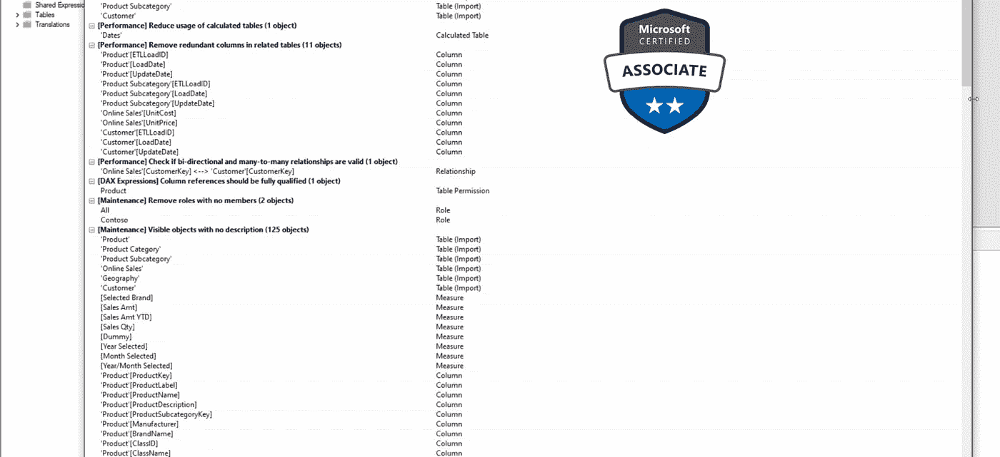
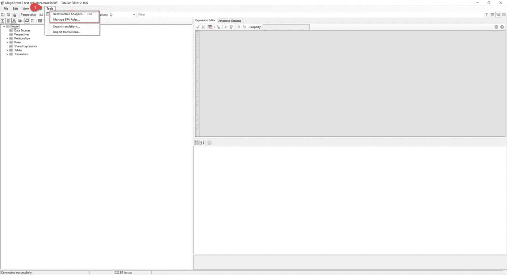
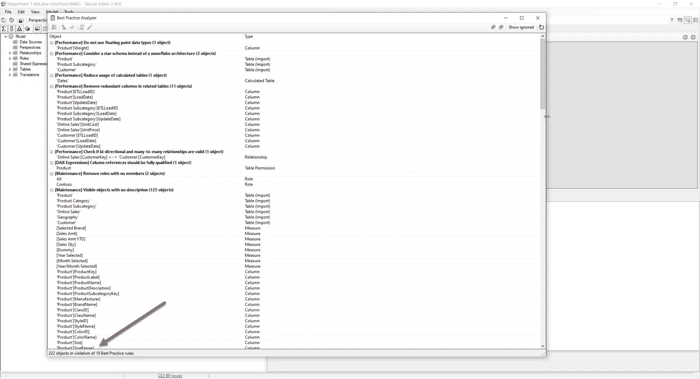
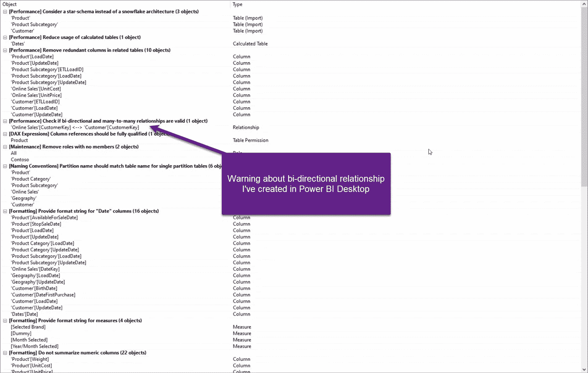
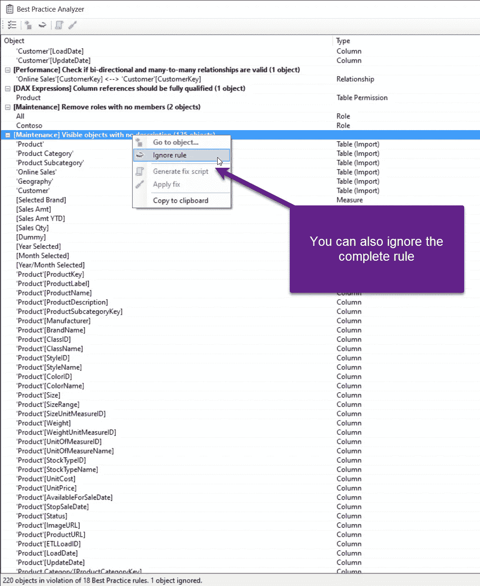
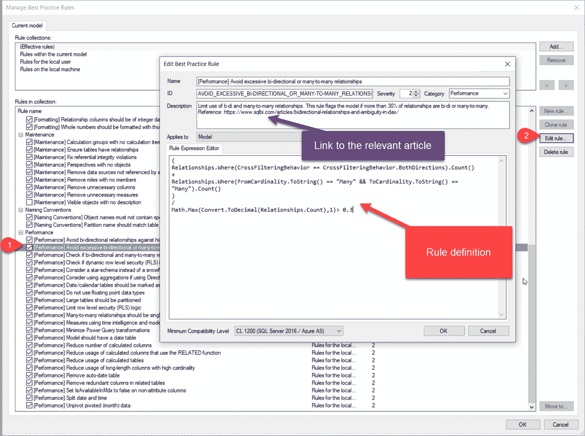

# 使用表格编辑器优化 Power BI 数据模型

> 原文：<https://towardsdatascience.com/optimize-power-bi-data-model-with-tabular-editor-95449aae5af2>

## 表格编辑器是不是一种魔杖，只需点击几下，就能帮你把数据模型“怪物”变成“美女”？差不多！了解如何利用表格编辑器中的最佳实践分析器扩展来快速获得最佳形状的模型



作者图片

在上一篇文章中，我们已经解释了[如何利用 DAX Studio 免费外部工具来对执行不佳的 DAX 查询](https://data-mozart.com/mastering-dp-500-exam-troubleshoot-dax-performance-with-dax-studio/)进行故障排除。现在是时候将我们的焦点转移到另一个非常流行的外部工具——表格编辑器！我已经写了关于表格编辑器和它的一些特性，这些特性可以[极大地促进您的 Power BI 开发](https://data-mozart.com/tabular-editor-3-features-to-boost-your-power-bi-development/)。

表格编辑器是一个全面的工具，可能对各种开发场景都有帮助。然而，由于 DP-500 考试的重点是 ***使用表格编辑器*** 优化数据模型的主题，让我们解释一下该工具如何帮助您实现这一特定目标。

**免责声明:**由于 DP-500 考试明确地为这个主题指定了表格编辑器 2(免费版本)，我们将在本文的剩余部分使用这个版本。当然，您可以在表格编辑器 3 中应用所有相同的步骤，这是该产品的商业版本

但是，现在您可能会问自己:优化数据模型是一个如此广泛的主题，如何用一个工具来帮助我应用跨越多个书籍、视频、白皮书和博客帖子的所有建议呢？表格编辑器是不是一种魔杖，只需点击几下，就能帮你把数据模型“怪物”变成“美女”？！

当然不是！了解数据模型优化的一般最佳实践，例如避免[双向关系](https://medium.com/p/b6b0b9e150f4)，减少[列基数](https://medium.com/p/3add4137753e)，尽可能避免 [DirectQuery](https://medium.com/p/8180825812d2) ，或者移除[自动日期/时间隐藏表](https://data-mozart.com/tiq-part-1-how-to-destroy-your-power-bi-model-with-auto-date-time/)，仍然是关键需求！但是，Tabular Editor 可以帮助您快速、轻松地识别这些实践的潜在违规行为——基于所获得的洞察力，您可以决定是要应用推荐的实践还是保留原始的数据建模逻辑。

在我向您展示如何使用表格编辑器实现这一特定目标之前，我必须承认，我没有对您完全坦诚…单靠表格编辑器无法将您的数据模型从灾难中拯救出来。您必须使用表格编辑器扩展，称为最佳实践分析器。

# 最佳实践分析器简介

当处理有问题的数据模型时，Best Practice Analyzer 将很快成为您最好的朋友。这个工具，或者更好的说法是 extension，是由微软的 Michael Kovalsky 开发的。您可以在本文的[中找到关于工具本身的更多细节。](https://powerbi.microsoft.com/en-us/blog/best-practice-rules-to-improve-your-models-performance/)

简而言之，最佳实践分析器(BPA)扫描您的表格数据模型，并警告您模型中的所有“问题”。有些“问题”就是——带双引号的“问题”。这意味着您可以忍受这些“问题”,而不会牺牲模型性能。

BPA 依赖于规则—每个规则都属于某个类别，比如 DAX 表达式、性能、格式等等。显然，并不是所有的规则对模型性能都有同样的重要性。也就是说，从模型性能的角度来看，如果您将数据模型对象的第一个字母大写，或者隐藏外键，都没有关系。但是，如果您尚未对大型表进行分区，如果您的模型包含许多双向或 M:M 关系，或者如果您的模型中有许多计算列和计算表，这种影响可能会很大。

# 在表格编辑器中使用 BPA

安装表格编辑器时，最佳实践分析器不是现成的。您需要通过在表格编辑器的高级编辑器窗口中运行以下脚本来手动添加它:

```
System.Net.WebClient w = new System.Net.WebClient(); 

string path = System.Environment.GetFolderPath(System.Environment.SpecialFolder.LocalApplicationData);
string url = "https://raw.githubusercontent.com/microsoft/Analysis-Services/master/BestPracticeRules/BPARules.json";
string downloadLoc = path+@"\TabularEditor\BPARules.json";
w.DownloadFile(url, downloadLoc);
```

你也可以从 GitHub 下载 BPARules.json 文件，如[这里](https://powerbi.microsoft.com/en-us/blog/best-practice-rules-to-improve-your-models-performance/)所述。


作者图片

这是我的数据模型，您可能注意到了，我有意对在线销售事实表和客户维度表之间的关系启用了双向过滤。现在，我将切换到表格编辑器，并从表格编辑器工具选项卡中启动最佳实践分析工具:



作者图片

当我运行 Best Practice Analyzer 来扫描我的数据模型时，会弹出一个新窗口，显示所有的发现和警告:



作者图片

我可以看到 222 个对象违反了 19 条 BPA 规则！看来有人没做作业。然而，这个模型是故意这样构建的，事先没有任何优化。此外，您可能会注意到，125 个对象违反了没有描述的规则，这从性能优化的角度来看是完全不相关的。

但是，这里有一个与数据模型性能非常相关的问题，它对我之前在 Power BI Desktop 中创建的双向关系提出了警告:



作者图片

如果我右键单击特定对象，会有一系列可能的选项可供选择:


作者图片

其中一个选项是对该对象应用即时修复，一旦这样做，警告就会消失。您也可以决定忽略整个规则，就像我对那些“无描述”对象所做的那样:



作者图片

但是，还有更多。在我看来，最佳实践分析器最强大的功能是表格编辑器中 Tools 选项卡下的 Manage BPA Rules 选项。一旦您打开它，您将不仅能够更改规则逻辑和定义(假设您熟悉 C#脚本)，而且在描述字段中，您还会找到一篇文章的链接，该文章解释了为什么某个规则是——RULE！



作者图片

这是一个惊人的特性，因为它为您提供了学习和理解表格数据模型优化背后的推荐实践的可能性，而不是盲目地应用所有建议的修改。

表格编辑器还使您能够扩展预建的规则集，并定义自己的规则！关于如何做到这一点的更多信息可以在[这里](https://docs.tabulareditor.com/onboarding/bpa.html#adding-rules)找到。

# 结论

我猜你已经知道表格编辑器有多神奇了！尽管它的功能不仅限于优化表格数据模型，但在本文中，我们解释了表格编辑器如何与最佳实践分析器扩展协同工作，帮助您对数据模型执行快速健康检查。不仅如此，基于这个检查的结果，您可以快速地应用修复和推荐的实践来提高整个模型的效率。

感谢阅读！

[成为会员，阅读媒体上的每一个故事！](https://datamozart.medium.com/membership)