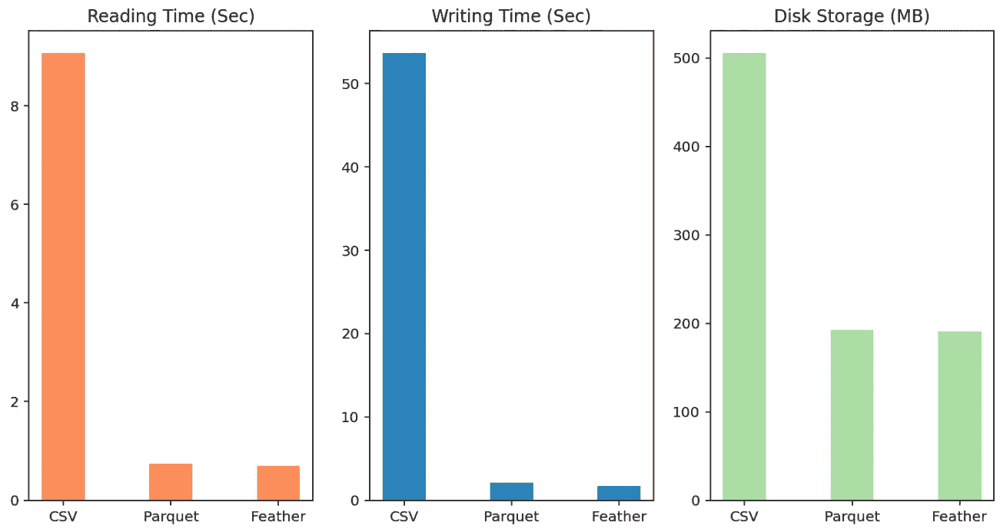
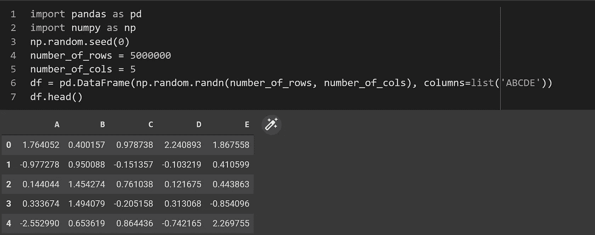
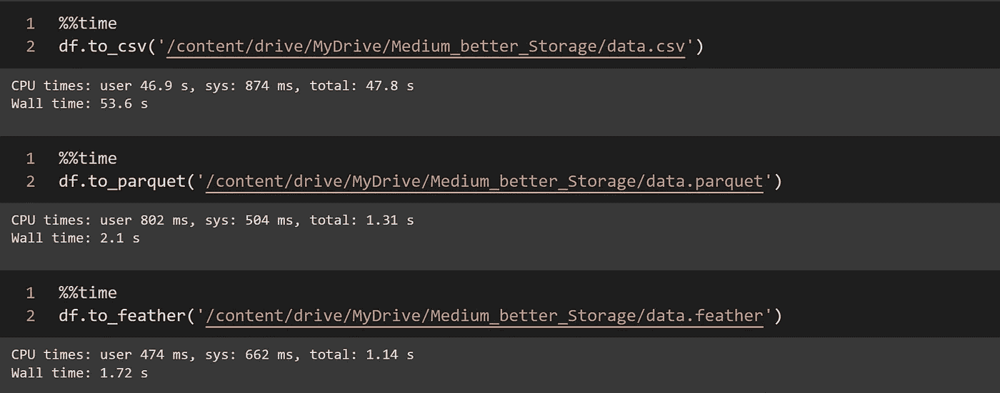
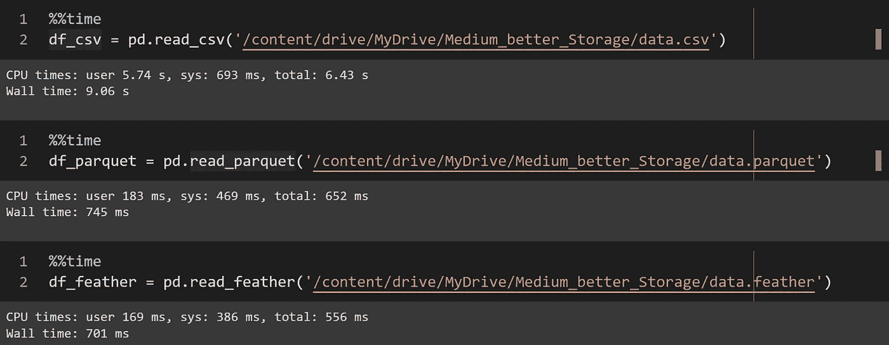
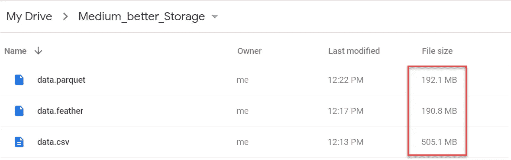

# 通过更好的数据存储优化 Python 性能

> 原文：<https://towardsdatascience.com/optimize-python-performance-with-better-data-storage-d119b43dd25a>

## 使用更快更轻便的数据格式


弗兰克·麦肯纳在 [Unsplash](https://unsplash.com?utm_source=medium&utm_medium=referral) 上拍摄的照片

由于其简单性， **CSV** 文件格式已经在许多 Python 项目中被普遍用作数据存储。不过，是**大**和**慢**！因此，如果您的项目变得更加广泛，那么不再使用 CSV 可能不是一个好主意。

作为文本文件， **CSV** 占用**更大的磁盘空间**和**更长的** **加载时间** = > **性能更低。**在本文中，两种更好的数据格式( **Parquet** 和 **Feather)** 已经被证明在各个方面(读取时间、写入时间、磁盘存储)都优于 CSV，如下图所示。



**CSV |拼花|羽毛性能概述—数据:500 万行& 5 列**(作者)

这是[CSV]和[拼花地板或羽毛]之间的巨大差异。我们稍后将回到这次表演的细节。现在，让我们开始介绍拼花地板/羽毛文件格式。

## 拼花格式

Parquet 是一种面向列的数据文件格式，提供了高效的数据压缩和编码方案，增强了批量处理复杂数据的性能。它最初是在 Apache Hadoop 生态系统中开发和使用的。后来，它被 Apache Spark 采用，并被 Amazon、Google 和 Microsoft 等云供应商广泛用于数据仓库。

在 Python 中，Pandas 模块本来就支持 Parquet，所以您可以直接在项目中集成 Parquet 的使用，如下例所示。

*例如:*

```
# Import module **import** **pandas** **as** **pd**# Read a Parquet file as df
**df = pd.read_parquet('<filename>.parquet')**# do something with df ...# Write df as a Parquet file
**df.to_parquet(‘name.parquet’)**
```

## 羽化格式

它是使用 Apache Arrow 开发的，用于快速、可互操作的帧存储。从 Pandas 1 . 1 . 0 版本开始，它原生支持羽毛格式。您可以像 CSV/Parquet 一样读取/写入羽毛文件格式。

*例如:*

```
# Import module **import pandas as pd**# Read a Feather file as df
**df = pd.read_feather('<filename>.feather')**# do something with df ...# Write df as a Feature file
**df = pd.to_feather('<filename>.feather')**
```

# 特性试验

一个由五列五百万行随机数组成的数据帧被用来做性能测试(大约 500 Mb 大小的 CSV)。它是用 Numpy 模块生成的，如下面的脚本所示。测试是在谷歌实验室进行的。



**为性能测试生成一个随机 df。**(作者)

## 书写时间比较

现在，让我们检查一下将随机生成的 500 万行数据帧写入 CSV |Parquet | Feather 所用的时间。



将 500 万行熊猫的 df 写入 CSV | Parquet | Feather 文件。(作者)

嗯，我们可以看到，编写一个**拼花和羽毛文件**只需要大约 2 秒钟，而编写 CSV 文件需要 50 多秒钟！！
( **~快 25 倍**)

## 阅读时间对比

接下来，我们来对比一下阅读速度。



**读取时间对比— CSV |拼花|羽毛文件。**(作者)

很明显，**拼花和羽毛的** **读**性能**比 CSV**好**(快~12 倍)。**

## **存储比较**

****

****储物对比— CSV |拼花|羽毛**(作者)**

****拼花和羽毛**在磁盘空间上更轻 **(~2.6 倍轻)**。**

# **拼花地板与羽毛**

## **用哪个？**

*   ****羽毛**根据我在 Google Colab 的测试环境，读写性能略好。**
*   ****Parquet** 从网络读取时读取性能更好。**
*   ****羽**搭配固态硬盘(SSD)性能更好。**
*   **Parquet 与 Hadoop 系统有更好的互操作性。**

**所以，如果你的项目主要是在 Python 或者 R 上(没有集成 Hadoop)，并且有 SSD 作为数据存储，那就用 Feather 吧。否则，使用拼花地板。**

# **结论**

**在 Python 中使用 Parquet 或 Feather 格式可以显著提高数据写入、读取和存储性能。**

**我希望你喜欢它，并发现它对你的日常工作或项目有用。如果你有任何问题，请随时联系我。**

**关于我和我所有的博客内容:[链接](https://joets.medium.com/about-me-table-of-content-bc775e4f9dde)**

****平安健康！**
**感谢阅读。👋😄****