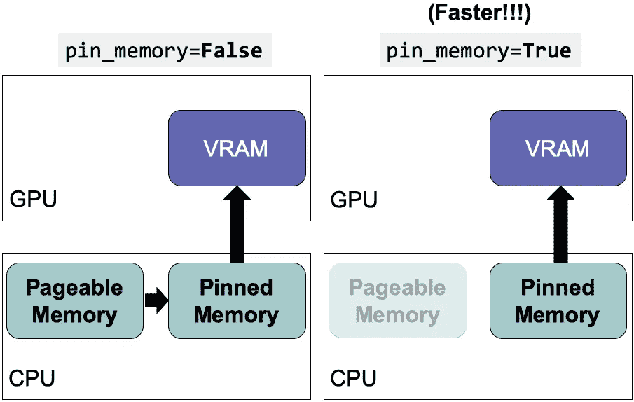
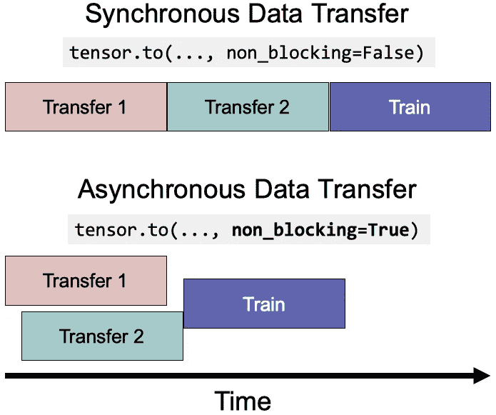
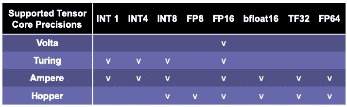
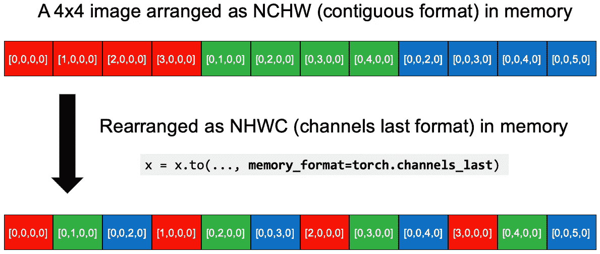

# 优化 PyTorch 性能以提高速度和内存效率(2022)

> 原文：<https://towardsdatascience.com/optimize-pytorch-performance-for-speed-and-memory-efficiency-2022-84f453916ea6>

## 你应该知道的 18 个 PyTorch 技巧:它们是如何工作的以及为什么工作


调整深度学习管道就像找到正确的齿轮组合(图片由 [Tim Mossholder](https://unsplash.com/@timmossholder) 在 [Unsplash](https://unsplash.com/photos/GmvH5v9l3K4) 上提供)

# 你为什么要读这篇文章？

深度学习模型的训练/推理过程涉及许多步骤。在时间和资源有限的情况下，每次实验迭代越快，我们就越能优化整个模型的预测性能。我收集并整理了一些 PyTorch 技巧和提示，以最大化内存使用效率并最小化运行时间。为了更好地利用这些技巧，我们还需要了解它们是如何工作的以及为什么工作。

我首先提供了一个完整的列表和一个组合代码片段，以防您想直接优化您的脚本。随后，我将逐一详细介绍它们。对于每个技巧，我还提供了代码片段，并注释了它是特定于设备类型(CPU/GPU)还是模型类型。

# 清单:

*   **数据加载**
    1。将活动数据移动到 SSD
    2。`Dataloader(dataset, **num_workers**=4*num_GPU)`
    3。`Dataloader(dataset, **pin_memory=True**)`
*   **数据操作** 4。直接创建矢量/矩阵/张量作为`torch.Tensor`，并在设备上运行操作
    5。避免 CPU 与 GPU
    6 之间不必要的数据传输。使用`torch.**from_numpy**(numpy_array)`或`torch.**as_tensor**(others)` 7。当适用于重叠数据传输时使用`tensor.to(**non_blocking=True**)`8。通过 PyTorch JIT 将点态(元素态)操作融合到一个内核中
*   **模型架构**
    9。将所有不同架构设计的尺寸设置为 8 的倍数(对于混合精度的 FP16)
*   **训练**
    10。将批处理大小设置为 8 的倍数，并最大化 GPU 内存使用率
    11。使用混合精度进行正向传递(而不是反向传递)
    12。在优化器更新权重
    13 之前，将梯度设置为`**None**`(例如`model.zero_grad(**set_to_none=True**)`)。梯度累积:每隔一批 *x* 更新重量，以模拟更大的批量
*   **推论/验证**
    14。关闭渐变计算
*   **CNN(卷积神经网络)具体**
    15。`torch.backends.cudnn.benchmark = True`
    16。使用 4D NCHW 张量
    17 的 channels_last 存储器格式。关闭批量规范化之前的卷积图层的偏差
*   **分布式优化**
    18。用`DistributedDataParallel`代替`DataParallel`

# **结合第 7、11、12、13 条提示的代码片段:**

```
*# Combining the tips No.7, 11, 12, 13: nonblocking, AMP, setting 
# gradients as None, and larger effective batch size*model.train()
*# Reset the gradients to None* optimizer.zero_grad(**set_to_none=True**)
scaler = **GradScaler**()
for i, (features, target) in enumerate(dataloader):
 *# these two calls are nonblocking and overlapping*    features = features.to('cuda:0', **non_blocking=True)**
    target = target.to('cuda:0', **non_blocking=True**) *# Forward pass with mixed precision*    with torch.cuda.amp.**autocast**(): *# autocast as a context manager*
        output = model(features)
        loss = criterion(output, target) *# Backward pass without mixed precision
    # It's not recommended to use mixed precision for backward pass
    # Because we need more precise loss*
    scaler.scale(loss).backward() *# Only update weights every other 2 iterations
    # Effective batch size is doubled*    **if (i+1) % 2 == 0 or (i+1) == len(dataloader):
** *# scaler.step() first unscales the gradients .
        # If these gradients contain infs or NaNs, 
        # optimizer.step() is skipped.*        scaler.step(optimizer) *# If optimizer.step() was skipped,
        # scaling factor is reduced by the backoff_factor 
        # in GradScaler()*    scaler.update() *# Reset the gradients to None*        optimizer.zero_grad(**set_to_none=True**)
```

# 高级概念

总体而言，您可以通过 3 个关键点来优化时间和内存使用。首先，尽可能减少 i/o(输入/输出),以便模型管道被*绑定到计算*(数学受限或数学受限)，而不是绑定到 i/o(带宽受限或内存受限)。通过这种方式，我们可以利用 GPU 及其专业化来加速这些计算。第二，尽量重叠流程，节省时间。第三，最大化内存使用效率，节省内存。那么节省内存可以实现更大的批量，从而节省更多的时间。有更多的时间有助于更快的模型开发周期，并带来更好的模型性能。

# 1.将活动数据移动到 SSD

有些机器有不同的硬盘驱动器，如 HHD 和 SSD。建议将活动项目中使用的数据移动到 SSD(或具有更好 i/o 的硬盘)以获得更快的速度。

# CPU # GPU #保存时间

# 2.异步数据加载和扩充

`num_workers=0`只有在训练或之前的过程完成后，才会执行数据加载。设置`**num_workers**` **> 0** 有望加速该过程，尤其是对于 i/o 和大型数据的扩充。具体到 GPU，[本次实验](https://discuss.pytorch.org/t/guidelines-for-assigning-num-workers-to-dataloader/813/73)发现`num_workers = 4*num_GPU`性能最好。话虽如此，你也可以为你的机器测试最好的`num_workers`。需要注意的是，高`num_workers`会产生较大的内存消耗开销( [ref](https://discuss.pytorch.org/t/guidelines-for-assigning-num-workers-to-dataloader/813/2) )，这也是意料之中的，因为内存中同时会处理更多的数据副本。

```
Dataloader(dataset, **num_workers**=4*num_GPU)
```

# CPU # GPU #保存时间

# 3.使用固定内存减少数据传输



设置 **pin_memory=True** 跳过从可分页内存到固定内存的传输(图片由作者提供，灵感来自[该图片](https://developer.nvidia.com/blog/how-optimize-data-transfers-cuda-cc/)

GPU 不能直接从 CPU 的可分页内存中访问数据。设置`pin_memory=True`可以直接为 CPU 主机*上的数据分配暂存内存*，节省从可分页内存向暂存内存(即固定内存，即页锁内存)传输数据的时间。该设置可与`num_workers = 4*num_GPU`结合使用。

```
Dataloader(dataset, **pin_memory=True**)
```

# GPU #保存时间

# 4.直接创建矢量/矩阵/张量作为火炬。张量和它们将运行操作的设备

每当您需要 PyTorch 的`torch.Tensor`数据时，首先尝试在您将使用它们的设备上创建它们。不要用原生 Python 或者 NumPy 创建数据然后转换成`torch.Tensor`。在大多数情况下，如果你打算在 GPU 中使用它们，直接在 GPU 中创建它们。

```
*# Random numbers between 0 and 1
# Same as np.random.rand([10,5])*
tensor = torch.rand([10, 5], **device=torch.device('cuda:0')**)*# Random numbers from normal distribution with mean 0 and variance 1
# Same as np.random.randn([10,5])*
tensor = torch.randn([10, 5], **device=torch.device('cuda:0')**)
```

唯一的语法区别是 NumPy 中的随机数生成需要额外的 **random** ，比如`np.**random**.rand()` vs `torch.rand()`。许多其他函数在 NumPy 中都有相应的函数:

`torch.empty()`、`torch.zeros()`、`torch.full()`、`torch.ones()`、`torch.eye()`、`torch.randint()`、`torch.rand()`、`torch.randn()`

# GPU #保存时间

# 5.避免 CPU 和 GPU 之间不必要的数据传输

正如我在高级概念中提到的，我们希望尽可能减少 i/o。请注意以下这些命令:

```
*# BAD! AVOID THEM IF UNNECESSARY!* print(cuda_tensor)
cuda_tensor.cpu()
cuda_tensor.to_device('cpu')
cpu_tensor.cuda()
cpu_tensor.to_device('cuda')
cuda_tensor.item()
cuda_tensor.numpy()
cuda_tensor.nonzero()
cuda_tensor.tolist()*# Python control flow which depends on operation results of CUDA tensors*
if (cuda_tensor != 0).all():
    run_func()
```

# GPU #保存时间

# 6.使用`torch.from_numpy(numpy_array) and torch.as_tensor(others) instead of torch.tensor`

> `torch.tensor()`总是*复制数据。*

如果源设备和目标设备都是 CPU，`torch.from_numpy`和`torch.as_tensor`可能不会创建数据副本。如果源数据是一个 NumPy 数组，使用`torch.from_numpy(numpy_array)`会更快。如果源数据是具有相同数据类型和设备类型的张量，那么`torch.as_tensor(others)`可以避免复制数据(如果适用)。`others`可以是 Python `list`、`tuple`或者`torch.tensor`。如果源设备和目标设备不同，那么我们可以使用下一个技巧。

```
torch.from_numpy(numpy_array)
torch.as_tensor(others)
```

# CPU #保存时间

# 7.当适用于重叠数据传输和内核执行时，使用`tensor.to(non_blocking=True)`



重叠数据传输以减少运行时间。(图片由作者提供)

本质上，`non_blocking=True`允许异步数据传输以减少执行时间。

```
for features, target in loader:
 *# these two calls are nonblocking and overlapping*    features = features.to('cuda:0', non_blocking=True)
    target = target.to('cuda:0', non_blocking=True) *# This is a synchronization point
    # It will wait for previous two lines*
    output = model(features)
```

# GPU #保存时间

# 8.通过 PyTorch JIT 将点态(元素态)操作融合到一个内核中

逐点运算(见[示例列表](https://pytorch.org/docs/stable/torch.html#pointwise-ops))包括常见的数学运算，通常是内存受限的。PyTorch JIT 会*自动*将相邻的逐点操作融合到一个内核中，以节省多次内存读/写。(挺神奇的吧？)例如，`gelu`函数可以通过将 5 个内核融合成 1 个来对一百万个矢量加速 4 倍( [ref](https://tigress-web.princeton.edu/~jdh4/PyTorchPerformanceTuningGuide_GTC2021.pdf) )。更多 PyTorch JIT 优化的例子可以在[这里](https://pytorch.org/docs/stable/jit.html)和[这里](https://pytorch.org/blog/optimizing-cuda-rnn-with-torchscript/)找到。

```
**@torch.jit.script** *# JIT decorator*
def fused_gelu(x):
    return x * 0.5 * (1.0 + torch.erf(x / 1.41421))
```

# CPU # GPU #保存时间

# 9 & 10.将所有不同建筑设计的尺寸和批量设置为 8 的倍数

为了最大化 GPU 的计算效率，最好确保不同的架构设计(包括神经网络的输入和输出大小/维度/通道数和批量大小)是 8 的倍数甚至更大的 2 的幂(例如 64、128 和高达 256)。这是因为当矩阵维数对齐 2 的倍数时，Nvidia GPUs 的**张量核心可以实现最佳的矩阵乘法性能。**矩阵乘法是最常用的运算，也可能是瓶颈，所以我们最好能确保张量/矩阵/向量的维数能被 2 的幂整除(例如，8、64、128 和 256)。

[这些实验](https://docs.nvidia.com/deeplearning/performance/dl-performance-fully-connected/index.html)表明，将输出维度和批量大小设置为 8 的倍数(即 33712、4088、4096)可以将计算速度提高 1.3 到 4 倍，而输出维度为 33708，批量大小为 4084 和 4095，它们不能被 8 整除。加速幅度取决于过程类型(例如正向传递或梯度计算)和 cuBLAS 版本。特别是，如果你在 NLP 上工作，记得检查你的输出维度，通常是词汇量。

使用大于 256 的倍数不会增加更多的好处，但也没有坏处。这些设置取决于 cuBLAS 和 cuDNN 版本以及 GPU 架构。你可以在这里找到矩阵维数[的具体张量核心要求](https://docs.nvidia.com/deeplearning/performance/dl-performance-matrix-multiplication/index.html#requirements-tc)。由于目前 PyTorch 放大器主要使用 FP16，而 FP16 需要 8 的倍数，因此通常建议使用 8 的倍数。如果你有 A100 这样更高级的 GPU，那么你可能会选择 64 的倍数。如果你使用的是 AMD GPU，你可能需要查看 AMD 的文档。

除了将批处理大小设置为 8 的倍数，我们还最大化批处理大小，直到它达到 GPU 的内存限制。这样，我们可以花更少的时间来完成一个纪元。

# GPU #保存时间

# 11。对正向传递使用混合精度，但不对反向传递使用混合精度

有些操作不需要 float64 或 float32 的精度。因此，将操作设置为较低的精度可以节省内存和执行时间。对于各种应用，Nvidia 报告称，将混合精度与带张量内核的 GPU 结合使用可以将速度提高 3.5 倍至 25 倍( [ref](https://developer.nvidia.com/blog/tensor-cores-mixed-precision-scientific-computing/) )。

值得注意的是，通常矩阵越大，加速度混合精度越高( [ref1](https://developer.nvidia.com/blog/tensor-cores-mixed-precision-scientific-computing/) ， [ref2](http://www.netlib.org/utk/people/JackDongarra/PAPERS/haidar_fp16_sc18.pdf) )。在较大的神经网络(例如 BERT)中，一项实验表明，混合精度可以将训练加速 2.75 倍，并减少 37%的内存使用([参考](https://spell.ml/blog/mixed-precision-training-with-pytorch-Xuk7YBEAACAASJam))。采用 Volta、Turing、Ampere 或 Hopper 架构的新型 GPU 设备(例如，T4、V100、RTX 2060、2070、2080、2080 Ti、A100、RTX 3090、RTX 3080 和 RTX 3070)可以从混合精度中受益更多，因为它们拥有[张量内核](https://developer.nvidia.com/tensor-cores)架构，该架构经过特殊优化，性能优于 CUDA 内核( [ref](https://www.techcenturion.com/tensor-cores/#nbspnbspnbspnbspTensor_Cores_vs_CUDA_Cores) )。



张量核心的 NVIDIA 架构支持不同精度(图片由作者提供；[数据来源](https://www.nvidia.com/en-us/data-center/tensor-cores/)

需要注意的是，采用 Hopper 架构的 H100 预计将于 2022 年第三季度发布，支持 FP8 (float8)。PyTorch AMP 可能也会支持 FP8(当前版本 1.11.0 还不支持 FP8)。

> 在实践中，您需要在模型精度性能和速度性能之间找到一个最佳平衡点。我以前确实发现混合精度可能会降低模型性能，这取决于算法、数据和问题。

利用 PyTorch 中的自动混合精度(AMP)包很容易实现混合精度。PyTorch 中默认的浮点类型是 float32 ( [ref](https://pytorch.org/docs/stable/generated/torch.set_default_dtype.html#torch-set-default-dtype) )。AMP 通过对一组操作使用 float16 来节省内存和时间(如`matmul`、`linear`、`conv2d`等，见[完整列表](https://pytorch.org/docs/stable/amp.html#ops-that-can-autocast-to-float16))。对于某些操作，AMP 会`autocast`到 float32(例如`mse_loss`、`softmax`等，参见[完整列表](https://pytorch.org/docs/stable/amp.html#ops-that-can-autocast-to-float32))。一些操作(如`add`，见[完整列表](https://pytorch.org/docs/stable/amp.html#ops-that-promote-to-the-widest-input-type))将在最宽的输入类型上操作。例如，如果一个变量是 float32，另一个变量是 float16，相加的结果将是 float32。

`autocast`自动将精度应用于不同的操作。因为损耗和梯度是以 float16 精度计算的，所以梯度太小时可能会“下溢”并变成零。`GradScaler`通过将损失乘以一个比例因子，根据缩放后的损失计算梯度，然后在优化器更新权重之前取消梯度的缩放，来防止下溢。如果缩放因子太大或太小，并导致`inf`或`NaN` s，那么缩放器将为下一次迭代更新缩放因子。

```
scaler = **GradScaler**()
for features, target in data:
 *# Forward pass with mixed precision*    with torch.cuda.amp.autocast(): *# autocast as a context manager*
        output = model(features)
        loss = criterion(output, target) *# Backward pass without mixed precision
    # It's not recommended to use mixed precision for backward pass
    # Because we need more precise loss*
    scaler.scale(loss).backward() *# scaler.step() first unscales the gradients .
    # If these gradients contain infs or NaNs, 
    # optimizer.step() is skipped.*    scaler.step(optimizer) *# If optimizer.step() was skipped,
    # scaling factor is reduced by the backoff_factor in GradScaler()*    scaler.update()
```

您也可以使用`autocast`作为正向传递函数的装饰器。

```
class AutocastModel(nn.Module):
    ...
    @autocast() *# autocast as a decorator*
    def forward(self, input):
        x = self.model(input)
        return x
```

# CPU # GPU #保存时间#保存内存

# 12.在优化器更新权重之前，将梯度设置为`None`

通过`model.zero_grad()`或`optimizer.zero_grad()`将梯度设置为零将对所有参数执行`memset`，并通过读写操作更新梯度。然而，将梯度设置为`None`将不会执行`memset`，而只会用*写*操作来更新梯度。因此，将渐变设置为`None`会更快。

```
*# Reset gradients before each step of optimizer* for param in model.parameters():
    param.grad = **None***# or (PyTorch >= 1.7)*
model.zero_grad(**set_to_none=True**)*# or (PyTorch >= 1.7)* optimizer.zero_grad(**set_to_none=True**)
```

# CPU # GPU #保存时间

# 13.梯度累积:每隔一批 *x* 更新重量，以模拟更大的批量

这个技巧是关于从更多的数据样本中积累梯度，以便梯度的估计更准确，并且权重被更新得更接近局部/全局最小值。这在批量较小的情况下更有帮助(由于 GPU 内存限制较小或每个样本的数据量较大)。

```
for i, (features, target) in enumerate(dataloader):
 *# Forward pass*    output = model(features)
    loss = criterion(output, target) *# Backward pass*    loss.backward() *# Only update weights every other 2 iterations
    # Effective batch size is doubled*    **if (i+1) % 2 == 0 or (i+1) == len(dataloader):
**        # Update weights
        optimizer.step() *# Reset the gradients to None*        optimizer.zero_grad(set_to_none=True)
```

# CPU # GPU #保存时间

# 14.关闭推断/验证的梯度计算

本质上，如果您只计算模型的输出，那么推断和验证步骤就不需要梯度计算。PyTorch 使用一个中间内存缓冲区来处理`requires_grad=True`变量中的操作。因此，如果我们知道我们不需要任何涉及梯度的操作，我们可以通过禁用推断/验证的梯度计算来避免使用额外的资源。

```
# torch.no_grad() as a context manager:
    with torch.no_grad():
    output = model(input)# torch.no_grad() as a function decorator:
@torch.no_grad()
def validation(model, input):
    output = model(input)
return output
```

# CPU # GPU #保存时间#保存内存

# 15.`torch.backends.cudnn.benchmark = True`

在训练循环之前设置`torch.backends.cudnn.benchmark = True`可以加速计算。因为 cuDNN 算法计算不同内核大小的卷积的性能各不相同，所以自动调优器可以运行一个基准来找到最佳算法(当前的算法是[这些](https://github.com/pytorch/pytorch/blob/dab5e2a23ed387046d99f825e0d9a45bd58fccaa/aten/src/ATen/native/cudnn/Conv_v7.cpp#L268-L275)、[这些](https://github.com/pytorch/pytorch/blob/dab5e2a23ed387046d99f825e0d9a45bd58fccaa/aten/src/ATen/native/cudnn/Conv_v7.cpp#L341-L346)和[这些](https://github.com/pytorch/pytorch/blob/dab5e2a23ed387046d99f825e0d9a45bd58fccaa/aten/src/ATen/native/cudnn/Conv_v7.cpp#L413-L418))。当您的输入大小不经常改变时，建议使用“打开”设置。*如果输入大小经常变化，自动调谐器需要过于频繁地进行基准测试，这可能会损害性能。*向前和向后传播可以加速 1.27 倍到 1.70 倍([参考](https://tigress-web.princeton.edu/~jdh4/PyTorchPerformanceTuningGuide_GTC2021.pdf))。

```
torch.backends.cudnn.benchmark = True
```

#GPU #CNN #SaveTime

# 16.对 4D NCHW 张量使用通道 _ 最后存储格式



4D NCHW 被重组为 NHWC 格式(图片由作者从[参考](https://pytorch.org/tutorials/intermediate/memory_format_tutorial.html)获得灵感)

使用`**channels_last**`内存格式以逐个像素的方式保存图像，作为内存中最密集的格式。原始 4D NCHW 张量在内存中按每个通道(红/绿/蓝)进行聚类。转换后，`x = x.to(**memory_format=torch.channels_last**)`，数据在内存中被重组为 NHWC ( `channels_last`格式)。你可以看到 RGB 层的每个像素都更近了。据报道，这种 NHWC 格式通过 FP16 的放大器获得了 8%到 35%的加速([参考](https://pytorch.org/tutorials/intermediate/memory_format_tutorial.html))。

目前仍在测试阶段，仅支持 4D NCHW 张量和一组模型(如`alexnet`、`mnasnet`族、`mobilenet_v2`、`resnet`族、`shufflenet_v2`、`squeezenet1`、`vgg`族，见[全列表](https://pytorch.org/tutorials/intermediate/memory_format_tutorial.html#performance-gains))。但我可以肯定地看到这将成为一个标准的优化。

```
N, C, H, W = 10, 3, 32, 32x = torch.rand(N, C, H, W)# Stride is the gap between one element to the next one 
# in a dimension.
print(x.stride()) *# (3072, 1024, 32, 1)****# Convert the tensor to NHWC in memory* x2 = x.to(memory_format=torch.channels_last)**print(x2.shape)  *# (10, 3, 32, 32) as dimensions order preserved*print(x2.stride())  *# (3072, 1, 96, 3), which are smaller*print((x==x2).all()) *# True because the values were not changed*
```

#GPU #CNN #SaveTime

# 17.关闭批量规范化之前的卷积图层的偏差

这是可行的，因为从数学上讲，偏差效应可以通过批量标准化的均值减法来抵消。我们可以保存模型参数、运行时间和内存。

```
nn.Conv2d(..., **bias=False**)
```

# CPU # GPU # CNN #保存时间#保存内存

# 18.用`DistributedDataParallel`代替`DataParallel`

对于多 GPU 来说，即使只有一个节点，也总是首选`[DistributedDataParallel](https://pytorch.org/docs/stable/generated/torch.nn.parallel.DistributedDataParallel.html#torch.nn.parallel.DistributedDataParallel)`而不是`[DataParallel](https://pytorch.org/docs/stable/generated/torch.nn.DataParallel.html#torch.nn.DataParallel)`，因为`[DistributedDataParallel](https://pytorch.org/docs/stable/generated/torch.nn.parallel.DistributedDataParallel.html#torch.nn.parallel.DistributedDataParallel)`应用多处理，并为每个 GPU 创建一个进程来绕过 Python 全局解释器锁(GIL)并加速。

# GPU #分布式优化#保存时间

# 摘要

在这篇文章中，我制作了一个清单，并提供了 18 个 PyTorch 技巧的代码片段。然后，我解释了它们如何以及为什么在各个方面逐一工作，包括数据加载、数据操作、模型架构**、**训练、推理、CNN 特定的优化以及分布式计算。一旦你深刻理解了它们是如何工作的，你也许就能在任何深度学习框架中找到适用于深度学习建模的通用原则。

希望您喜欢更高效的 PyTorch 并学习新的东西！

如果你有任何意见和建议，请在下面留下。谢谢你。

我是 Jack Lin， [C3.ai](https://c3.ai/) 的高级数据科学家，我对深度学习和机器学习充满热情。你可以看看[我在 Medium](https://medium.com/@jacklindsai) 上的其他文章！


希望我们的深度学习管道将是“火箭般快速”的:D(图片由[比尔·杰伦](https://unsplash.com/@billjelen)在 [Unsplash](https://unsplash.com/photos/NVWyN8GamCk) 上拍摄)