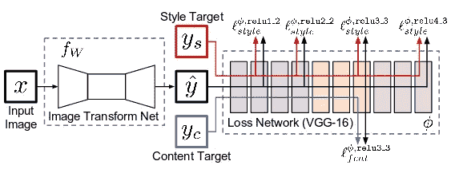
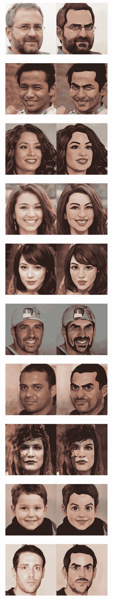

# 优化移动设备上视频的风格转移模型

> 原文：<https://towardsdatascience.com/optimizing-style-transfer-models-for-videos-on-mobile-devices-a924e6f633d6>

# 优化移动设备上视频的风格转移模型

## 尝试 PyTorch 照明和闪光灯的灵活性，以创建一个面部卡通模型

[iOS ToonClip App](https://apps.apple.com/us/app/toonclip/id1536285338) 采用本帖描述的人脸转卡通模型——模型、App、图片均由作者提供。

拥抱面部空间演示在:[https://huggingface.co/spaces/Jacopo/ToonClip](https://huggingface.co/spaces/Jacopo/ToonClip)

免费的 iOS 移动应用位于:【https://apps.apple.com/us/app/toonclip/id1536285338 

源代码可在(WIP)获得:【https://github.com/JacopoMangiavacchi/ToonClip-ComicsHero 

# 介绍

gan 是构建图像风格传输模型的超级流行的架构，但有时需要相当长的时间来训练它们，更重要的是优化生成器模型，以便能够在移动设备上实时运行。

在这次实验中，我主要关注这三个特定领域:

1.  利用 PyTorch 照明和闪光灯的灵活性，轻松试验不同的模型架构和主干
2.  使用定制 Pytorch 感知特征损失在没有 GAN 鉴别器的情况下快速训练
3.  不断转换到 ONNX / CoreML，并在设备上对模型进行基准测试，以找到更好的移动设备优化

# 信用

在开始之前，我真的想感谢多伦阿德勒提供了一个伟大的项目，真正激发了我的实验和这篇文章，U2 网络英雄风格转移:

*   GitHub 代码和数据:[https://github.com/Norod/U-2-Net-StyleTransfer](https://github.com/Norod/U-2-Net-StyleTransfer)
*   拥抱脸空间演示:[https://huggingface.co/spaces/Norod78/ComicsHeroHD](https://huggingface.co/spaces/Norod78/ComicsHeroHD)

该 U2Net 模型特别实现了 muti _ bce _ loss _ fusion 函数的核心思想，以建立感知特征损失来比较 U2Net 编码器-解码器的所有层输出。

在我的实验中，我采用了一种类似但同时更通用且有望更灵活的技术，该技术使用感知特征损失，在分离的图像模型上进行计算，并且能够独立于用于编码器-解码器的特定模型架构捕获不同的层特征。

具体来说，我试图利用 PyTorch 之上的现代高级框架的所有优势来:

*   使用 PyTorch Lighting Flash 提供的预训练权重，支持编码器-解码器架构的任何已知图像模型和编码器上的任何图像特征化器后端
*   使用支持 GPU/TPU 等的 PyTorch 照明实现自定义丢失和快速训练。

# 资料组

在我的实验中，我重复使用了上面提到的 Doron Adler 在他的 U2Net Heros 风格转换项目中提供的相同数据。这是从 FFHQ 数据集中选择的 100 个高分辨率(1024x1024)人脸图像的图像数据集，以及相关的卡通图像。数据集在上面提到的相同 GitHub repo 上提供，并在 Apache License 2.0 下获得许可

在下面的代码中，您可以看到 PyTorch 数据集类加载并转换这些数据:

正如你可能注意到的，在这个小数据集之上，我使用了 Albumentations 库来添加一些图像增强转换，并且能够在从移动相机捕获的真实图像和视频上推断模型时更好地进行概括。

特别是，由于数据包含作为输入(面部)和输出(风格化面部)的图像，我重用了 Albumentation api 的 ReplayCompose 功能，以确保对每一对面部和风格化面部图像应用相同的随机变换。

在下面的代码片段中，您将看到一个示例，说明如何使用不同的增强过滤器将此图像配置到图像数据集:

你会在这篇文章的后面看到，我使用迁移学习技术从之前在 ImageNet 数据集上训练的模型中导入权重，所以我还在上面的白蛋白管道中添加了一个用 ImageNet stats 配置的标准化步骤。

最后，为了能够在同一个分布上多次重复执行训练循环，在随机分割训练和评估数据中的数据集之前，我指定了一个特定的随机手动种子，然后将该种子重置为初始 PyTorch 随机种子。通过这种方式，我能够每次都使用不同的增强管道随机应用程序进行训练，但仍然在相同的训练和验证分布上工作。

# 感知特征损失

在 GAN 中，并且通常在风格转移领域中，基于特征激活和风格损失的损失函数的思想是一种众所周知的技术，例如在诸如超分辨率的场景中经常采用。

在这个实验中，我特别遵循众所周知的技术，即使用外部的、预先训练的 VGG 网络从不同的卷积块获得特征，并使用这些特征来弥补不同特征的损失，而不是简单地计算生成的图像和原始标签/样式图像之间的 MSE 或 L1 距离。

来自论文“实时风格传输和超分辨率的感知损失”([https://arxiv.org/abs/1603.08155](https://arxiv.org/abs/1603.08155))的下图说明了这一思想，并且存在许多文章来全面描述这一过程并提供代码的参考实现(包括 Fast。AI MOOC 培训由杰瑞米·霍华德)。



模型结构提供[论文](https://arxiv.org/abs/1603.08155)

在我的例子中，我重用了 Alper ahmetoluon 在 GitHub Gist 上提供的代码片段([https://Gist . GitHub . com/Alper 111/8233 CDB 0414 B4 CB 5853 F2 f 730 ab 95 a 49](https://gist.github.com/alper111/8233cdb0414b4cb5853f2f730ab95a49))，但是我已经更新了它，添加了对每个块特性进行加权的选项，以便遵循 Fast 的论文和杰瑞米·霍华德建议。人工智能课程在这些层的输出上加电格拉米矩阵产品。

我简单地注释了将输入图像规范化为 ImageNet stats 的调用，因为我已经在数据集转换管道中规范化了所有输入的面部和样式图像。

# 图像到图像建模和分割

图像到图像的风格转换问题最终非常类似于更一般的语义分割问题，并且任何用于该一般图像域的模型架构，如完全卷积编码器-解码器，在风格转换场景中也确实工作良好。

在我的探索中，我希望尽可能灵活地试验不同的特定编码器-解码器模型架构，并能够在以下架构上测试真实的性能结果:' *deeplabv3* '、 *deeplabv3plus* '、 *fpn* '、 *linknet* '、 *manet* '、 *pan* '、 *pspnet* '、

*我发现 *PyTorch Lighting Flash* 库在这个特定的上下文中特别有用，因为它专门提供了一个高级的***semantic segmentation***类，支持上面所有的架构。*

*此外，它为图像特征骨干的不同组合提供权重，以用于这些全卷积网络(FCN)的编码器部分。例如，在 UNet++上，它专门支持主干，例如:*

```
*'densenet121', 'densenet161', 'densenet169', 'densenet201', 'dpn107', 'dpn131', 'dpn68', 'dpn68b', 'dpn92', 'dpn98', 'efficientnet-b0', 'efficientnet-b0', 'efficientnet-b1', 'efficientnet-b1', 'efficientnet-b2', 'efficientnet-b2', 'efficientnet-b3', 'efficientnet-b3', 'efficientnet-b4', 'efficientnet-b4', 'efficientnet-b5', 'efficientnet-b5', 'efficientnet-b6', 'efficientnet-b6', 'efficientnet-b7', 'efficientnet-b7', 'efficientnet-b8', 'efficientnet-l2', 'gernet_l', 'gernet_m', 'gernet_s', 'inceptionresnetv2', 'inceptionv4', 'mobilenet_v2', 'mobilenetv3_large_075', 'mobilenetv3_large_100', 'mobilenetv3_large_minimal_100', 'mobilenetv3_small_075', 'mobilenetv3_small_100', 'mobilenetv3_small_minimal_100', 'regnetx_002', 'regnetx_004', 'regnetx_006', 'regnetx_008', 'regnetx_016', 'regnetx_032', 'regnetx_040', 'regnetx_064', 'regnetx_080', 'regnetx_120', 'regnetx_160', 'regnetx_320', 'regnety_002', 'regnety_004', 'regnety_006', 'regnety_008', 'regnety_016', 'regnety_032', 'regnety_040', 'regnety_064', 'regnety_080', 'regnety_120', 'regnety_160', 'regnety_320', 'res2net101_26w_4s', 'res2net50_14w_8s', 'res2net50_26w_4s', 'res2net50_26w_6s', 'res2net50_26w_8s', 'res2net50_48w_2s', 'res2next50', 'resnest101e', 'resnest14d', 'resnest200e', 'resnest269e', 'resnest26d', 'resnest50d', 'resnest50d_1s4x24d', 'resnest50d_4s2x40d', 'resnet101', 'resnet152', 'resnet18', 'resnet34', 'resnet50', 'resnext101_32x16d', 'resnext101_32x32d', 'resnext101_32x48d', 'resnext101_32x4d', 'resnext101_32x8d', 'resnext50_32x4d', 'se_resnet101', 'se_resnet152', 'se_resnet50', 'se_resnext101_32x4d', 'se_resnext50_32x4d', 'senet154', 'skresnet18', 'skresnet34', 'skresnext50_32x4d', 'tf_efficientnet_lite0', 'tf_efficientnet_lite1', 'tf_efficientnet_lite2', 'tf_efficientnet_lite3', 'tf_efficientnet_lite4', 'vgg11', 'vgg11_bn', 'vgg13', 'vgg13_bn', 'vgg16', 'vgg16_bn', 'vgg19', 'vgg19_bn', 'xception'*
```

*语义分割实际上是在像素级执行分类的任务，这意味着每个像素将与给定的类别相关联。通常，当这些像素分类器 FCN 模型被用于语义分割时，有必要为最终卷积层指定数量等于预期类别数量的通道，并在最后调用 ArgMax 激活来为每个像素选择得分最高的类别。*

*在风格转换(图像到图像)场景中，采用 FCN 甚至更容易，因为只需使用具有 3 个通道的卷积层作为最终输出，就可以让模型预测彩色图像。*

*下面的代码片段显示了如何轻松灵活地获得您想要使用的特定 FCN 模型，提供预期模型架构(unetplusplus)、头部编码器的主干(mobilenetv3_large_100)和迁移学习(imagenet)中重用的特定权重作为参数。*

*正如您在这个具体测试中所看到的，我使用了 mobilenetv3_large_100 主干来实现移动设备上实时视频推理的特定性能，但当然也可以使用其他主干来获得更高质量的图像以进行最终预测。*

# *培养*

*不幸的是 *PyTorch Lighting Flash* 还没有灵活到可以直接用 Flash Trainer 训练上面图像到图像场景的语义分割模型。*

*无论如何，非常幸运的是，我仍然能够使用 *PyTorch Lighting* 并编写我自己的 ImageToImage Lighting 模块类，最终训练并验证具有先前描述的 VGG 感知特征损失的模型。*

*下面的代码片段显示了 ImageToImageModel 类，以及如何实例化该类并将其传递给 PyTorch Lighting Trainer，以便对您拥有的特定 ML 加速启动一个训练和评估循环。*

# *ONNX 导出、结果和 HuggingFace 空间演示*

*从 PyTorch Lighting 甚至 PyTorch 导出模型到 ONNX 格式现在是一个非常简单的过程。*

*具体到 PyTorch 照明，我必须调用以下 api 将模型权重首先移回 CPU(显然 ONNX exporter 需要这样做):*

*还值得一提的是，对于我在该模型实例中使用的 MobileNetV3 主干，我必须指定一个最新的 opset 版本，以便在 ONNX 运行时支持该模型使用的所有新 ops，例如 hardwish 之类的激活函数(有关更多详细信息，请参见下面的 CoreML 段落)。*

*为了快速测试 ONNX 模型，我发现拥抱面部空间环境非常有用，特别是支持易于使用的 Gradio api。*

*下面是使用 Gradio 在用户图像上快速测试 ONNX 模型并从 Hugging Face Hub 缓存模型图像的代码:*

*这款车型的现场 Gradio 演示可以在拥抱脸空间上找到，网址:【https://huggingface.co/spaces/Jacopo/ToonClip*

*为了方便重复使用，我还在 HuggingFace 模型中心——[https://huggingface.co/Jacopo/ToonClip](https://huggingface.co/Jacopo/ToonClip)上直接导出了 ONNX 模型*

*无论如何，以下是由该模型从未经训练的 FFHQ 验证集中生成的一些示例图像:*

**

*FFHQ 数据集提供的样本图像以及作者提供的模型生成的相应预测*

*请在拥抱脸上直接尝试这个演示，并最终使用演示上提供的 UI 功能([https://huggingface.co/spaces/Jacopo/ToonClip](https://huggingface.co/spaces/Jacopo/ToonClip))标记任何问题或异常*

# *CoreML 导出和图像处理*

*苹果提供了一个非常有用的 Python 包，名为*CoreMLTools*(【https://coremltools.readme.io/docs】T2)，可以快速地将 ML 模型从 PyTorch 和 TensforFlow 等不同框架导出到 CoreML 格式，允许模型在苹果生态系统上可用的特定硬件(GPU、神经引擎、CPU 加速器)上得到加速。*

*不幸的是，导出图像模型需要在导出过程中进行更多的编码，特别是如果您想要在视频上实现实时图像处理的最高性能。*

*开发人员特别需要对推理平台中获得的图像进行预处理和后处理，通常使用 Swift 编程语言和本地图像捕获和处理库，并对该图像进行适当的归一化和整形。*

*有不同的技术可以在模型本身上实现这一点，用 python 编码，或者在客户端使用 Swift、iOS/macOS 库和 CoreML 运行时 API。*

*我的建议通常是将模型封装在包装 Python 模块中，并将该包装直接提供给 CoreML exporter api，最后更新 CoreML 生成的规范(实际上是 proto-buffer 格式),以转换图像中的输出张量，从而轻松地将模型集成到客户端应用程序流中。*

*在下面的代码片段中，您可以找到前面讨论的模型的 PyTorch 包装类，以及使用输入和输出参数的图像类型导出和格式化模型所需的代码。*

*最后，本示例中描述的特定 UNet++主干模型使用了 CoreMLTools 转换库尚不支持的 PyTorch 运算符。幸运的是，CoreMLTools 允许 ML 开发人员使用他们的 MIL 框架 api 来定义定制的 Op，以便为缺失的 PyTorch Op 实现快速重新定义和注册正确的转换。*

*具体来说，以下代码重新实现了 UNet++模型使用的 hardwish 和 hardsigmoid PyTorch 激活器:*

# *源代码*

*这个实验的大部分代码已经在本文上面的代码片段中提供了。*

*完整的源代码和完整的端到端笔记本将很快在 https://github.com/JacopoMangiavacchi/ToonClip-ComicsHero提供*

*感谢您阅读本文，测试 iPhone 应用程序或拥抱脸演示，并再次感谢本文中提到的人给了我们巨大的灵感。在玩卡通的时候学习新的东西很有趣！*