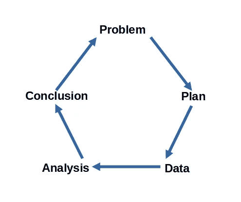
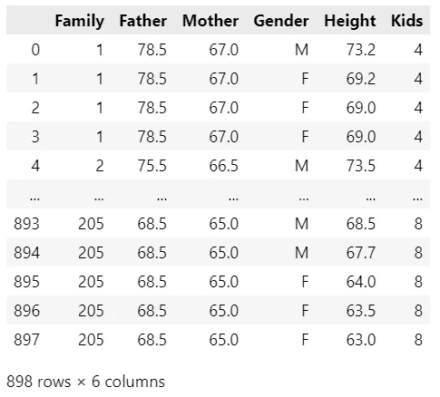
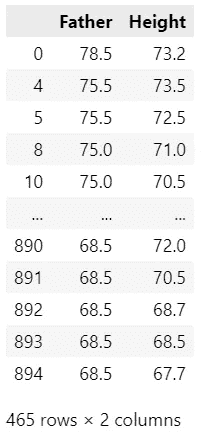
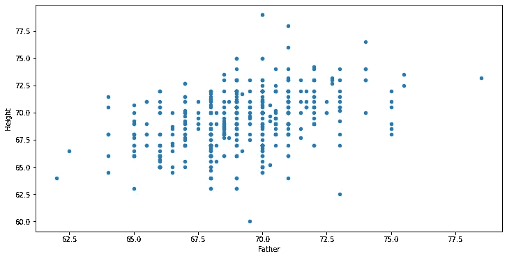
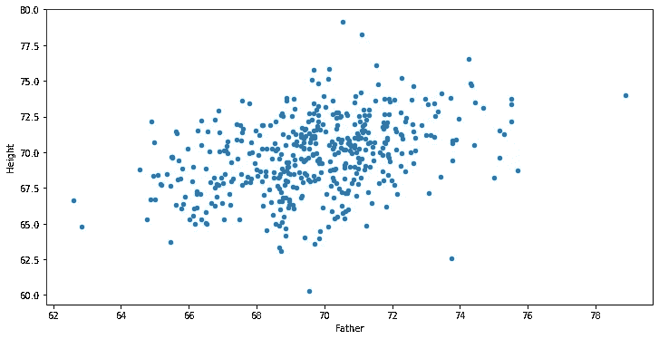
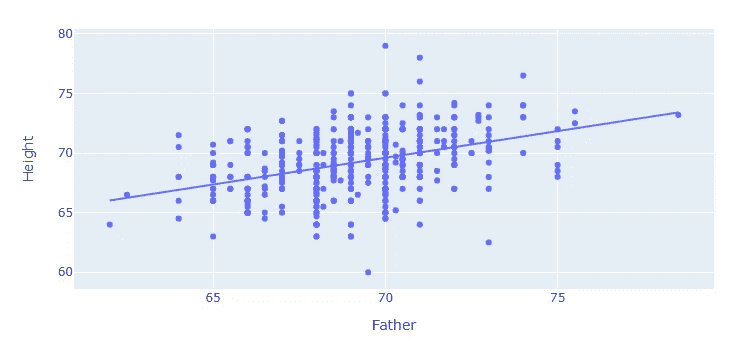
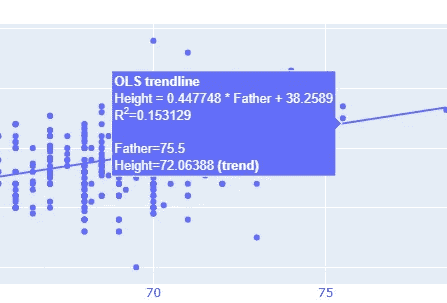
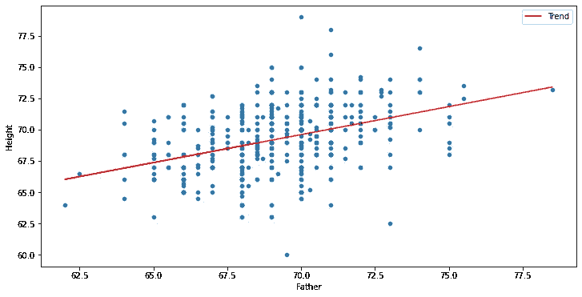
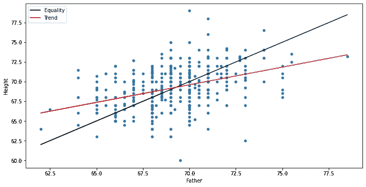
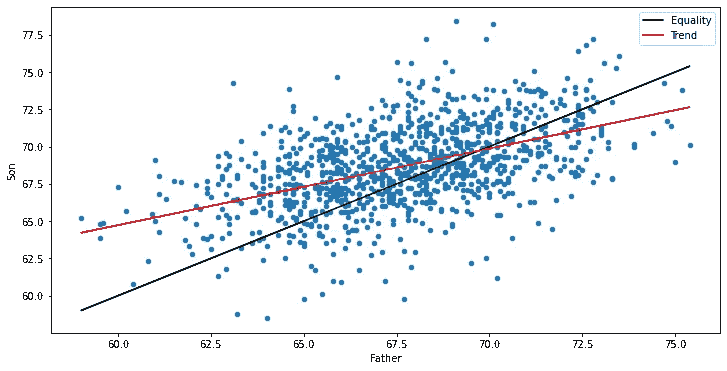

# 使用 PPDAC 组织您的数据科学项目—案例研究

> 原文：<https://towardsdatascience.com/organize-your-data-science-projects-with-ppdac-a-case-study-26badfb28fbf>

## 定义你的问题，制定计划，找到数据，分析数据，然后传达你的结论——这就是 PPDAC


费利佩·费塔多在 [Unsplash](https://unsplash.com?utm_source=medium&utm_medium=referral) 上的照片

方法论到底怎么了？当我刚开始从事软件开发时，它们风靡一时，但似乎已经失去了吸引力。

也许开发人员只是不喜欢被告知该做什么。

我怀疑当方法论是规定性的时候，它们就不受欢迎了。但他们不一定要这样；它们可以成为最佳实践的指南。这就是 PPDAC。这是一种帮助确保你以正确的顺序做事，并且不要忘记可能危及你的项目的事情的方法。

PPDAC 代表项目开发的五个阶段:问题、计划、数据、分析和结论/沟通。记住这些阶段将有助于你的项目成功。



PPDAC 循环—作者图片

让我们更详细地看一下每一个。

*   问题——大多数项目以一个问题开始，例如:吸烟和肺癌之间有关系吗？如果你不清楚你的问题是什么，那就很难回答。
*   计划——一旦你明确了你想解决什么问题，你就需要考虑衡量什么以及如何衡量。你需要记录或收集什么数据，你将采取什么方法来解决你的问题？
*   数据——当然，你需要获取数据，但随后你需要清理、过滤数据，并在必要时合并数据。
*   分析——一旦数据有了合适的形式，你需要构建表格/图表，寻找模式，并形成假设。
*   结论/交流——最后，你应该解释你的结果，得出结论，形成新的想法并交流发现。有时这将提出进一步的问题，然后你可以反馈到周期的开始。

# 案例研究

我们将使用 PPDAC 方法逐步完成一个案例研究。

我们将介绍 PPDAC 的每个阶段，像往常一样，在本文发表后不久，所有代码和数据都可以从我的 Github 网页下载。

# 问题

我们将通过一个简单的案例研究来说明 PPDAC 循环。我们的问题首先由统计学先驱弗朗西斯·高尔顿(1882-1911)在 19 世纪晚期提出。

*利用父母的身高，我们能预测成年子女的身高吗？*

很明显，父母和他们后代的身高之间应该有某种关系。毕竟，其他身体特征也会遗传，比如头发和眼睛的颜色。

那么个子高的父母一般都有个子高的孩子吗？似乎有可能。他们有更高的孩子和更矮的父母吗？可能不会，因为否则，我们将会看到人类身高的范围变得更大，而我认为这不会发生。成年后代最终会和他们的父母一样高吗？

有什么关系？

# 计划

## 收集数据

为了他的实验，高尔顿收集了数百对父母和他们孩子的数据。这些数据属于公共领域，可以从不同的来源以不同的形式获得。因此，我们计划的第一部分必须是确定合适的数据来源。简单的互联网搜索就足够了。

在我搜索数据时，列表中的第一项是网站[](https://www.randomservices.org/random/index.html)*，用他们自己的话说就是“*……一个致力于概率、数理统计和随机过程的网站，面向这些学科的教师和学生。它由位于亨茨维尔的阿拉巴马大学数学科学系的数学家凯尔·西格里斯特经营。西格里斯特根据知识共享许可协议提供他的所有作品，只要给出适当的署名，你就可以出于任何目的使用这些作品。**

*另外，在浏览网站时，我注意到数据集中有另一组来自英国数学家和生物统计学家[卡尔·皮尔逊](https://en.wikipedia.org/wiki/Karl_Pearson)(1857–1936)的身高数据。*

*您可以在此下载数据:*

*   *[https://www.randomservices.org/random/data/Galton.html](https://www.randomservices.org/random/data/Galton.html)*
*   *[https://www.randomservices.org/random/data/Pearson.html](https://www.randomservices.org/random/data/Pearson.html)*

## *我们的方法*

*我们到底要尝试预测什么？根据经验观察，很明显，男性往往比女性高，因此父子之间的身高关系很可能不同于父女之间的身高关系。同样，母亲和女儿的身高关系也不一定和父亲和女儿一样。*

*高尔顿的方法是使用一组母亲、父亲、儿子和女儿的综合数据，为了考虑到性别之间的身高差异，他将女性身高调整为男性身高的 1.08 倍。*

*这是正确的两性身高差异吗？将女性视为和男性一样，只是稍微矮一点，这样做合理吗？从政治上来说，这可能会引起一些人的惊讶，但从数学上来说，这合理吗？*

*也许我们应该把性别分开，做两个预测；一个是父亲和儿子，另一个是母亲和女儿。*

*或者，也许我们应该分别分析儿子和女儿，但用父母双方来预测。*

*在我看来，后者可能是一个更好的方法，因为父母双方似乎都对他们孩子的最终身高有所贡献，但这种关系对儿子和女儿来说是不同的。然而，为了简单起见，我们将采取第一种方法，我们将看看父亲和他们的儿子之间的关系。我们将把另一种方法留给 PPDAC 周期的第二次迭代。*

*目前，我们将局限于高尔顿数据，我们将在 Python 和 Jupyter 笔记本中进行分析。*

## *数据*

*将数据下载到一个名为【T2 数据】的文件夹后，我用下面的 Python 代码将它加载到一个熊猫数据框中。*

```
*import pandas as pd
df = pd.read_csv("data/Galtons Height Data.csv")*
```

*这是高尔顿数据的视图。*

**

*高尔顿数据—作者图片*

*数据已经是干净的，没有丢失的值，但是我们应该过滤它，删除我们不感兴趣的列和行。*

*我们只打算处理父子数据(目前)，所以我们只希望在“性别”列中有“M”的行。*

```
*sons = df[df['Gender'] == 'M']*
```

*这给了我们一个新的数据帧，叫做`sons.`*

*此外，我们将删除不使用的列(不是绝对必要的，但是更简洁)。*

```
*sons = sons.drop(columns=['Family','Mother','Kids','Gender'])*
```

*`sons`数据帧现在看起来像这样。*

**

*“儿子”数据框架——作者图片*

# *分析*

*我们的数据准备好了，接下来呢？一个显而易见的事情是绘制数据的散点图，看看我们是否能看到任何模式。*

```
*sons.plot.scatter(x='Father', y='Height', figsize = (12,6))*
```

*这给了我们下面的图表。*

**

*父亲/儿子身高数据散点图-作者图片*

*这并没有告诉我们太多:你可以看到，在左边，矮的父亲有矮的儿子，在右边，高的父亲有高的儿子。在中间，它是相当不清楚的。*

*一个问题是，你不能清楚地看到所有的数据点，许多数据点是一个接一个绘制的。在图中添加一些抖动可能会提供更好的视图，例如:*

**

*带抖动的父亲/儿子身高数据散点图-作者提供的图片*

*虽然您可以看到有更多的数据点，但我不确定这对分析是否有很大帮助，因此在本练习的剩余部分，我将继续使用原始数据。*

*(我已经在 Jupyter 笔记本中包含了抖动代码，您可以下载，但它目前被注释掉了)。*

*我们可能看到某种模式或趋势的一种方法是在散点图的顶部绘制一条回归线。一个简单的方法是使用 Plotly Express。*

```
*import plotly.express as px
px.scatter(sons, x='Father', y='Height', 
           trendline='ols', width = 800, height = 400)*
```

*Plotly Express 散点图可以采用一个参数，该参数将使用*普通最小二乘法*创建一条趋势线。*

**

*用 ols 趋势线绘制的父亲/儿子身高数据散点图-图片由作者提供*

**普通最小二乘*趋势线穿过散点图的中间，代表父亲和儿子身高的平均值。这清楚地表明，高个子的父亲有高个子的儿子。*

*如果您将鼠标悬停在趋势线上，Plotly 将为您提供回归模型的参数以及与散点相关的数据:*

**

*父亲/儿子身高数据的散点图，显示趋势线数据-作者提供的图片*

*您也可以自己动手，使用 SciPy 计算回归线，并将其绘制在散点图的顶部。完成这项工作的代码在下载中，我将很快在这里复制它，但我不打算详细介绍。如果您想了解更多关于使用 SciPy 创建回归图的信息，请参阅下面的文章。*

*[](/adding-regression-lines-to-pandas-plots-with-scipy-2e23fd524adb) [## 熊猫和 SciPy 的回归图

### 回归可用于预测未来或识别数据中的趋势和关系

towardsdatascience.com](/adding-regression-lines-to-pandas-plots-with-scipy-2e23fd524adb) 

```
from scipy import stats

x = sons['Father']
y = sons['Height']

# create model
m = stats.linregress(x, y)

# create predicted values
t = [m.slope * i + m.intercept for i in x]

# add predicted values as a trend line
sons.insert(len(sons.columns),'Trend',t)

# plot the original data as a scatter diagram
# and add the trend as a line plot 
ax = sons.plot.scatter(x='Father',y='Height')
sons.plot.line(x='Father',y='Trend', color='red', ax=ax, figsize = (12,6))
```

在上面的代码中，我又回到了用熊猫来绘图，因为我发现用这种方式组合绘图更容易。下面是由上面的代码生成的图:



熊猫的父亲/儿子身高数据散点图，带 ols 趋势线-图片由作者提供

我们能了解更多吗？

使用 SciPy calculate 回归模型，我们可以看到两组身高之间关系的细节，但给出了每个父亲身高值的儿子身高值的范围。我不确定它能提供很多信息。

不过，我们可以做一件简单的事情。如果父亲和儿子的身高大致相同，我们可以画一条可以预测儿子身高的等值线。

```
sons['Equality']=sons['Father']
ax = sons.plot.line(x='Father',y='Equality', color = "black")
ax = sons.plot.scatter(x='Father',y='Height',ax= ax)
sons.plot.line(x='Father',y='Trend', color='red', ax=ax, figsize = (12,6))
```

这很容易通过创建一个新列来完成，该列是父亲身高列的副本。我称之为“相等”,并在图表中添加了一个新的点。



带有回归图和一条等号线的身高数据-图片由作者提供

如果图表是正方形的，那么等位线应该与基线成 45 度角。如果儿子倾向于和他们的父亲一样高，那么回归线就会和平等线一样。但事实并非如此。在高的一端，儿子比父亲矮，在矮的一端，儿子往往比父亲高。

# 结论

很明显，正如所料，个子高的父亲有个子高的儿子。但是我们可以从有平等线的图表中看到，高个子父亲的儿子比他们矮，矮个子父亲的儿子比他们高。

我们能预测一下吗？也许我们可以。我们可以使用 SciPy 中的回归模型来预测一般身高，但不能预测特定儿童的身高。然而，这个模型可能并不准确。在最初的实验中，数据的大小可能被认为是很大的，但是现在几百个数据点并不是一个大的数据集。此外，如果你对皮尔森数据做同样的练习，你会得到不同的结果——就像你对母女关系做同样的练习一样。我哪里知道？因为我就是这么做的，你可以在可下载的笔记本中看到代码和结果。

母亲/女儿:


母亲/女儿身高图——作者图片

皮尔森数据公司的父子:



皮尔森数据中的父子身高图——作者图片* 

*感谢阅读，我希望你觉得有用。该案例研究的灵感来自于大卫·斯皮格哈尔特的优秀著作《统计的艺术:如何从数据中学习》中的一个类似练习。*

*正如我上面提到的，在这篇文章发表后不久，代码和数据将会在我的 [Github 网页](http://alanjones2.github.io)上提供。你也可以在那里找到我的其他作品。*

## *参考*

*[1] [统计学的艺术:如何从数据中学习](https://www.amazon.com/Art-Statistics-How-Learn-Data/dp/1541675703/ref=sr_1_1?_encoding=UTF8&amp;camp=1789&amp;creative=9325&amp;crid=1PPXO3JG9UPDR&amp;keywords=the+art+of+statistics&amp;linkCode=ur2&amp;linkId=b71669deca0a471424d5bc6fccbba1b3&amp;qid=1648295722&amp;sprefix=the+art+of+statistics%25252Caps%25252C177&amp;sr=8-1&_encoding=UTF8&tag=alanjones01-20&linkCode=ur2&linkId=fdf08c9a6a07285fa2432673497c25ec&camp=1789&creative=9325)，大卫·斯皮格尔哈特，2021 ( *附属链接*)*

*[](https://medium.com/membership/@alan-jones) [## 通过我的推荐链接-阿兰·琼斯加入媒体

### 阅读阿兰·琼斯的每一个故事(以及媒体上成千上万的其他作家)。你的会员费直接支持艾伦…

medium.com](https://medium.com/membership/@alan-jones)*