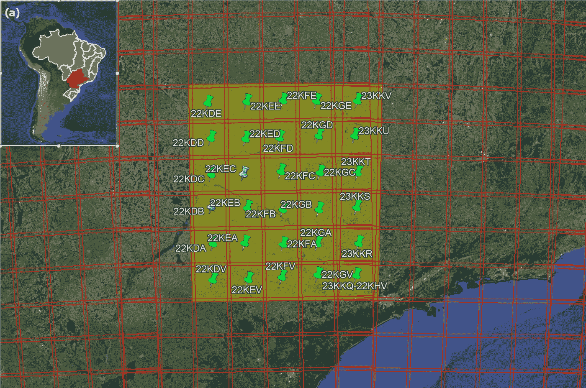
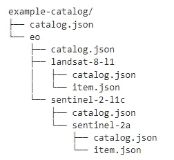
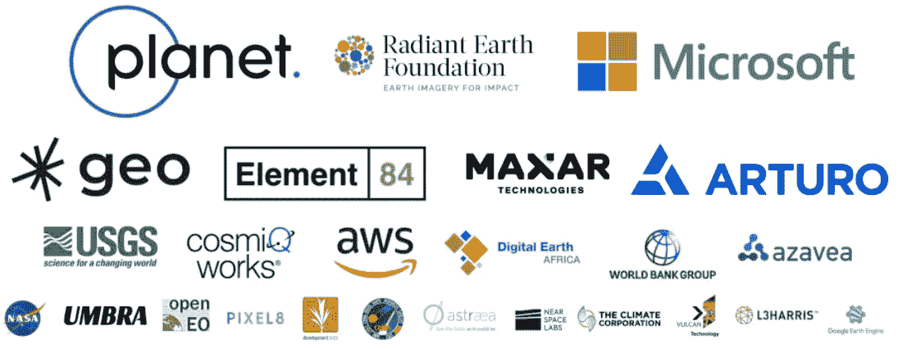
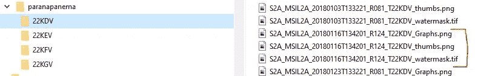
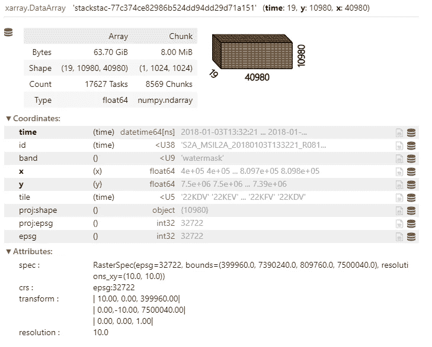
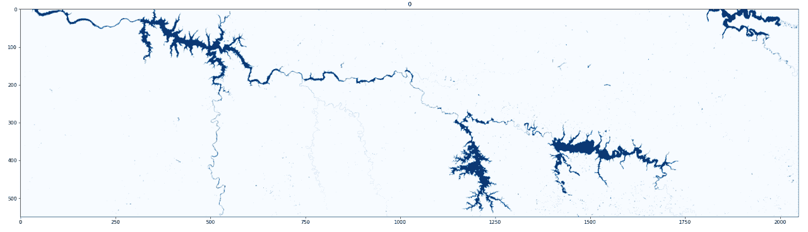

# 使用时空资产目录组织地理空间数据-使用 python 进行 STAC

> 原文：<https://towardsdatascience.com/organizing-geospatial-data-with-spatio-temporal-assets-catalogs-stac-using-python-45f1a64ca082>

## 如何使用 pystac 包在 Python 中创建地理空间数据的 STAC 目录


由[格雷格·罗森克](https://unsplash.com/@greg_rosenke?utm_source=medium&utm_medium=referral)在 [Unsplash](https://unsplash.com?utm_source=medium&utm_medium=referral) 上拍摄的照片

# 介绍

那些处理地理空间数据的人可能习惯于处理大量的文件。通常，为了达到最终目标，需要处理大量带有中间文件的步骤。除此之外，随着空间分辨率更高的免费卫星图像的不断增加和计算能力的提高，更大的感兴趣区域正在成为研究对象，甚至需要更多的文件来涵盖一切。

地理空间云，如谷歌地球引擎和微软行星计算机，是避免处理单个文件的所有麻烦的绝佳选择(关于它们的一些故事[这里](/creating-sentinel-2-truly-cloudless-mosaics-with-microsoft-planetary-computer-7392a2c0d96c)和[这里](https://medium.com/analytics-vidhya/how-to-download-assets-from-google-earth-engine-gee-and-overcome-the-size-limitations-45b7c9ebe389))，但有时不可避免地要在本地处理。

在最近的一个项目中，为了评估巴西东南部从 2018 年到 2021 年的水面范围，我必须使用全空间分辨率(10m)的 Sentinel-2 图像覆盖大约 320，000km 的区域。2000 万个频段已相应升级。每张图像的表面水遮罩都是使用修改版的`waterdetect`包创建的(在故事中了解更多信息:[使用 waterdetect python 包在高分辨率卫星图像中进行水检测](/water-detection-in-high-resolution-satellite-images-using-the-waterdetect-python-package-7c5a031e3d16))。

为了覆盖研究的整个感兴趣区域，总共选择了 36 块瓷砖。考虑到时间限制，大约有 12 000 份档案被单独处理。



图 1: (a)国家背景下的巴拉那水文区。(b)研究的感兴趣区域。红线代表 Sentinel-2 瓷砖的覆盖区。图片作者。

为了组织所有的工作，我在本地使用了 Python 中的 STAC 目录，我将演示如何创建一个 STAC 目录，然后如何使用客户端包(如`stackstac`)快速访问它的一部分(和堆叠资产)。

# 为什么是 STAC 目录

为 12，000 份文件中的每一份文件都制作了中间产品，以及用于质量评估的单独报告和其他散点图。为了处理所有这些文件，人们通常依靠文件名(或文件夹名)来链接中间作品，但这很容易出错。

此外，简单的任务，例如查询覆盖特定区域的图像，仅仅使用文件名是不可行的。除此之外，每个图像可能具有不同的属性，如形状和空间投影，因此在没有更多潜在信息的情况下，不容易对它们进行比较。这正是 STAC 目录适合的地方。根据他们的官方页面【https://stacspec.org/ :

> 时空资产目录(STAC)规范提供了一种通用语言来描述一系列地理空间信息，因此可以更容易地对其进行索引和发现。“时空资产”是表示在特定空间和时间捕获的关于地球的信息的任何文件。

简而言之，它是描述地理空间图像(或任何其他资产，例如 PNG 缩略图)的标准 XML 规范。这些规范被组织在一个目录、子目录和集合的结构中(图 2)。每个 STAC 条目都有一个指向资产位置的引用(链接),它们是在文件系统中还是托管在云中。这样，一旦创建了目录，文件的确切位置就无关紧要了，您可以按地区或日期执行搜索，只需查看目录项目。



图 2: STAC 结构示例。来源:[https://github . com/stac-utils/py stac/blob/d 70 DEA 5c 70 a 243450 AC 64120 E0 EBA 84d 786574 b 4/docs/tutorials/py stac-introduction . ipynb](https://github.com/stac-utils/pystac/blob/d70dea5c70a243450ac64120e0eba84d786574b4/docs/tutorials/pystac-introduction.ipynb)

许多卫星影像提供商都按照 STAC 规范发布数据集(图 2)，但对于本地目录来说，这种情况并不常见，例如，我发现关于这方面以及如何用 python 创建 STAC 目录的信息非常少。



图 2:根据 stacspec.org 的说法，支持使用 STAC 目录的组织。来源:[https://stacspec.org/](https://stacspec.org/)

# 创建 STAC 目录

现在我将向您展示如何使用`pystac` 包在 Python 中创建 STAC 目录。第一件事是有一些图像进行分类。我将选择我的 Sentinel-2 防水面具的一个子集，但代码应该对任何被`xarray`接受的地理空间图像类似地工作。我用瓦片将文件分开，每个日期有 3 个不同的文件，如图 3 所示:

1-水面膜本身(。TIF)；

2-快速查看(thumbnail . png)；和

3-输出散点图(graph.png)。



图 3:选择要编目的文件。图片作者。

需要的软件包有:

```
rasterio
shapely
pystac
stackstac
```

创建基本目录的代码片段相当简单。请注意 stac_extensions 参数。在接下来的步骤中，需要将投影属性添加到资产中(关于**创建资产**部分的更多解释)。

# 创建 STAC 项目

为了创建项目，我们将遍历我们的文件。每个项目将有 3 个相关资产(防水面具，拇指和图表)。

使用地理空间目录的一个优点是，如简介中所述，它允许按日期或位置搜索数据，而无需实际打开每个图像或解析名称字符串。为此，我们的项目将必须有一些属性，如几何，边界框，日期时间等。为了从我们的遮罩中提取地理空间信息(其他两个资产不是“地理空间”)，我们将创建以下函数。它可以处理用`rasterio` 或`xarray` 打开的数据集(只要还安装了`rioxarray` )

现在我们将创建项目。请注意，在将属性写入项目之前，我们会将边界框和封装外形投影到 WGS84 (epsg:4326)。如果你不习惯坐标参考系统(CRS ),我在我的 Python for Geosciences 系列中写了一篇关于它的教程: [Python for Geosciences: Raster 合并、裁剪和使用 Rasterio 重新投影](https://medium.com/analytics-vidhya/python-for-geosciences-raster-merging-clipping-and-reprojection-with-rasterio-9f05f012b88a)

我们还需要给这个项目一个 ID，一个日期时间，可选地，我们将写瓷砖代码。我们将从 Path 对象中获取它们。最后的 describe 函数给出了目录的摘要:

```
2331
* <Catalog id=Paranapanema>   
  * <Item id=S2A_MSIL2A_20180103T133221_R081_T22KDV>   
  * <Item id=S2A_MSIL2A_20180116T134201_R124_T22KDV>   
  * <Item id=S2A_MSIL2A_20180123T133221_R081_T22KDV>   
  * <Item id=S2A_MSIL2A_20180215T134211_R124_T22KDV>   
  * <Item id=S2A_MSIL2A_20180222T133221_R081_T22KDV>   
  * <Item id=S2A_MSIL2A_20180225T134211_R124_T22KDV>
```

就这样。我们在目录中添加了 2331 件商品。但是它仍然缺少每个资产的路径。我们将在下一步添加它们。

# 创建资产

请注意，我们现在有一个包含项目的目录，但是我们不再有实际文件的路径。出于教育目的，我将它分为两步(创建项目和创建资产)，但在“现实生活”中，您应该考虑在同一个循环中编写所有内容。现在，我们将不得不再次遍历这些项目，并从 ID 中获取正确的项目，以便向其中添加资产。

除此之外，我们将再次需要边界框和轮廓，但是我们将把它们留在原来的 CRS 中。这将使将来使用`stackstac`打开这些资产变得更加容易。

为了将投影信息添加到资产中，我们需要使用一个名为[投影扩展](https://github.com/stac-extensions/projection/)的 Stac 扩展。项目扩展提供了一种描述其资源位于地理空间投影中的项目的方法。它将向资产添加一个属性列表(查看其手册以获得完整列表)，但是我们将使用以下内容:

*   项目:epsg，
*   投影:几何图形，
*   项目:bbox，
*   投影:形状，
*   项目:转换。

要在目录中使用 Stac 扩展，必须在创建目录期间定义它。这就是我们将扩展添加到目录和项目中的原因。因此，下面是将 water mask 资产添加到我们的项目中的代码:

# 创建媒体资产

创建媒体资产要简单得多。同样，我们将遍历我们的文件，但是不需要获取地理空间属性。

如果我们想检查资产是否被正确创建，我们可以访问项目属性`assets`，如下所示:

```
item.assets{'watermask': <Asset href=paranapanema/22KGV/S2B_MSIL2A_20210817T132229_R038_T22KGV_watermask.tif>,  'thumbnails': <Asset href=paranapanema/22KGV/S2B_MSIL2A_20210817T132229_R038_T22KGV_thumbs.png>,  'graphs': <Asset href=paranapanema/22KGV/S2B_MSIL2A_20210817T132229_R038_T22KGV_Graphs.png>}
```

# 节约

在保存之前，了解每个项目都将有一个`.json`文件写入磁盘是很重要的。放在哪个文件夹将取决于我们尚未设定的“策略”。默认情况下，每个条目 id 都有一个子文件夹，位于根目录文件夹下。我们将保留默认值。

要创建 hrefs，我们需要使用`.normalize_hrefs`并传递根文件夹。

# 测试

为了测试我们的目录，让我们在一个新变量中打开它，并将一个条目显示为 dictionary 来查看结果。

最后，让我们看看 stackstac 的实际操作。首先，我们将创建一个函数，通过 tile 和 datetime 选择项目，并在一个特定的月份中获取项目。

在我的例子中，它返回了 19 个条目。现在让我们用`stackstac` 将它们组合起来，创建一个漂亮的马赛克来展示。请注意，我们不必为 CRS 和预测费心，因为这些信息已经保存在资产中。



代码输出。图片作者。

正如你所看到的，它用我们的 19 张图片创建了一个“懒惰”的数据立方体，我们现在将执行中值计算来创建一个月层。



代码输出。Paranapanema 盆地的水面镶嵌图。图片作者。

# 结论

我将给你们留下这幅美丽的巴西帕拉纳帕内马盆地的水面镶嵌画。

今天，我们学习了一些关于 STAC 目录以及如何使用它们来组织地理空间数据的知识。正如您在测试部分看到的，一旦我们很好地“组织”了目录，未来的操作和分析就容易多了。考虑到地理空间分析所需的文件数量和处理步骤，这一点非常重要。

我希望你喜欢这个教程。下一个故事再见！

# 保持联系

*如果你喜欢这篇文章，想支持我当作家，可以考虑成为* [*中等会员*](https://cordmaur.medium.com/membership) *。每月只需 5 美元，我会从你的会员费中收取一小笔佣金，不需要你额外付费。或者你可以随时给我买杯咖啡。*

[](https://cordmaur.medium.com/membership) [## 通过我的推荐链接加入媒体-毛里西奥·科代罗

### 作为一个媒体会员，你的会员费的一部分会给你阅读的作家，你可以完全接触到每一个故事…

cordmaur.medium.com](https://cordmaur.medium.com/membership)