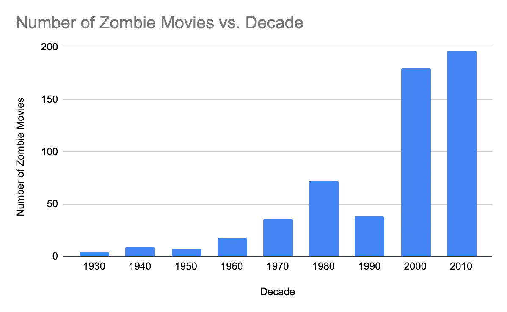
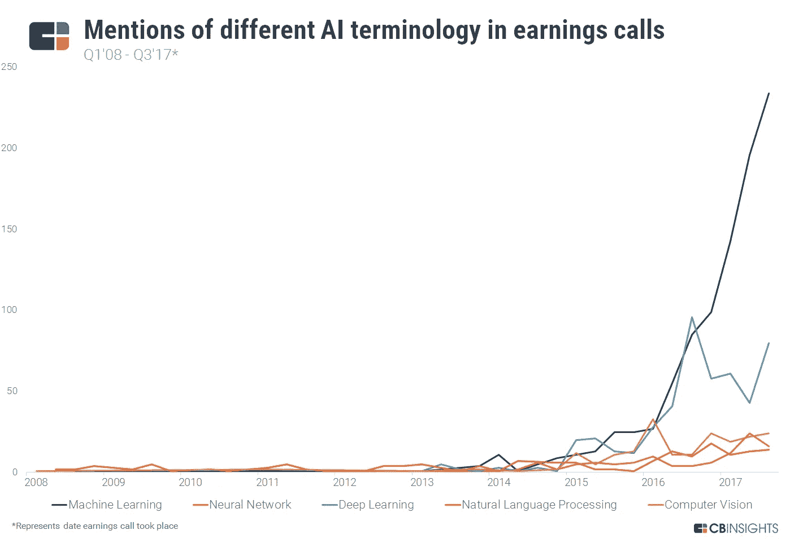
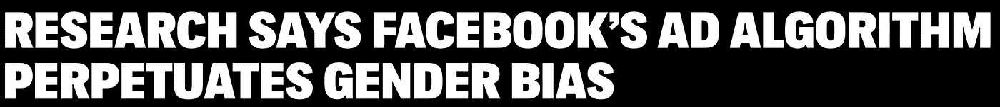
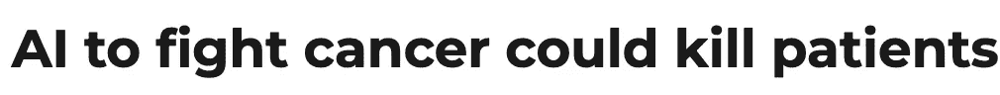
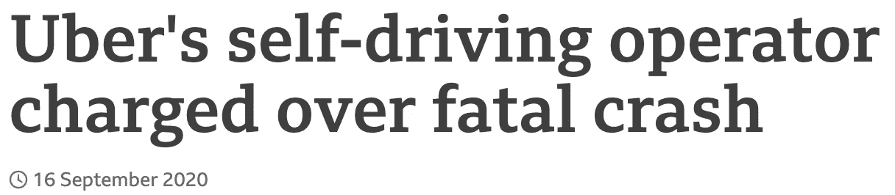
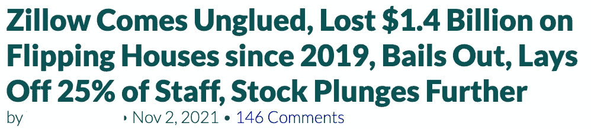
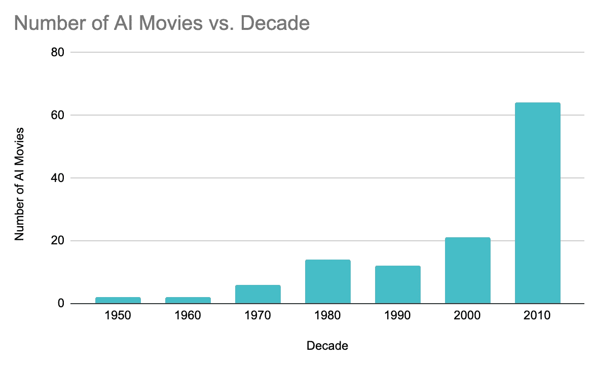
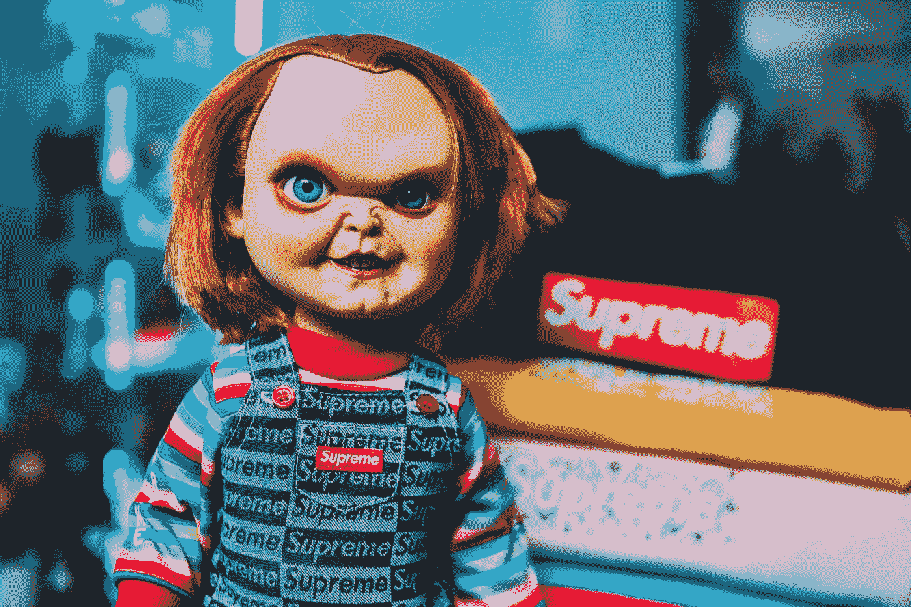
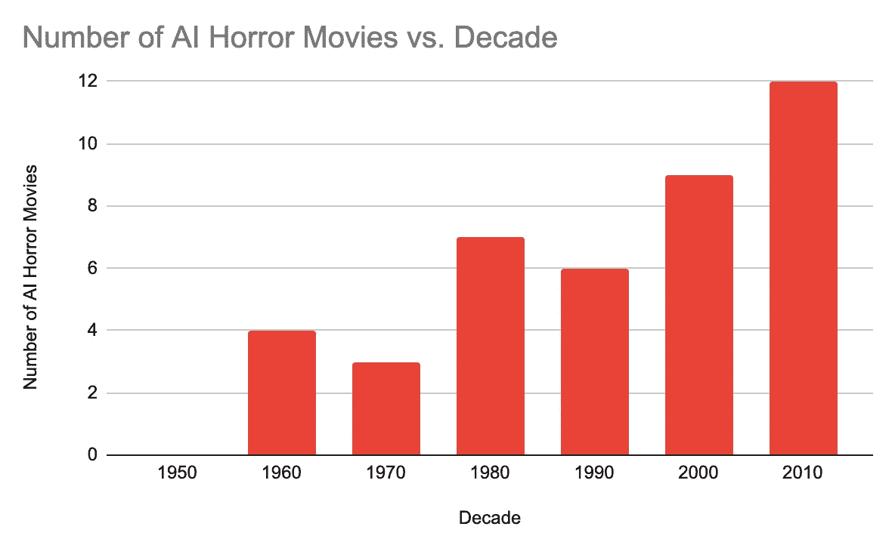

# 我们即将到来的(自己造成的)人工智能恐怖热潮

> 原文：<https://towardsdatascience.com/our-impending-self-inflicted-ai-horror-boom-e764a20af456>

## 世界越来越不信任人工智能，这是人工智能开发者的错

*这是我们关于 ML 公平性系列的第 2 部分(* [*链接*](/3-bad-reasons-ml-teams-avoid-building-fair-models-d8f85a1edc23) *)。*

之前，我们讨论了由于各种(微弱的)原因，ML 团队很少尝试解决模型中的社会偏见。

在本文中，我们将探讨这种忽视的后果。

> **论文:由于高调的人工智能失败和对人工智能安全的日益担忧，公众对坏人工智能的恐惧和对公平人工智能系统的渴望将决定 21 世纪 20 年代的电影和消费者行为**

世界越来越不信任人工智能，这是人工智能开发者的错。由[阿瑟尼·托古列夫](https://unsplash.com/@tetrakiss?utm_source=medium&utm_medium=referral)在 [Unsplash](https://unsplash.com?utm_source=medium&utm_medium=referral) 上拍摄的照片

在本文中，我将涉及 3 点:

## #1.恐怖电影可以用来衡量共同的社会恐惧

## #2.一系列高调的头条新闻和纪录片唤醒了社会对人工智能的恐惧

## #3.人们越来越不信任人工智能系统，这反映在消费者行为和关于“邪恶”人工智能的新电影中

我们开始吧🤖 🚀

# #1.恐怖电影与社会

*我保证这和机器学习有关！*

在疫情之前，我参观了西雅图的流行文化博物馆，那里有一个关于恐怖电影的展览。正是在这里，我第一次了解到社会学理论:

> 恐怖电影经常反映一个时期的恐惧，对抗者象征着共同的社会恐怖

恐怖电影不是关于怪物的。它们是关于我们的。照片由[亚当·弗洛克曼](https://unsplash.com/@gal8xies?utm_source=medium&utm_medium=referral)在 [Unsplash](https://unsplash.com?utm_source=medium&utm_medium=referral) 上拍摄

这个想法已经被比我聪明得多、见多识广的人所涵盖，但这里是 spark notes 版本 w/ citations:

## 电影和社会恐惧的恐怖时间表

请注意，这些恐惧通常是以美国为中心的，因为好莱坞的电影业通常是以美国为中心的

第一次世界大战后，进入大萧条时期，出现了一系列怪物电影——弗兰肯斯坦、德古拉和木乃伊——这些电影捕捉了美国人的无能为力和沮丧感，即当权者让这些可怕的世界事件发生[ [来源](https://medium.com/americanexperiencepbs/the-history-of-american-fear-8e4acf404c41)

第二次世界大战后，随着原子弹的毁灭性进入，出现了恐怖电影，其**(通常是科幻)** **对手造成了绝对的毁灭**——哥斯拉，Blob，来自世界大战的火星人。所有人都谴责科学是不道德的，会导致无法控制的毁灭

随着麦卡锡主义带来的冷战和偏执，出现了恐怖电影，如[《来自另一个世界的东西》](https://ifuckinglovemovies.wordpress.com/2015/09/17/fear-cold-war-paranoia-and-aliens-in-john-carpenters-the-thing/)和[《入侵异形基地》](https://www.youtube.com/watch?v=lUXHB5U-Vl4)。在这些电影中，像美国的红色恐慌，“几乎不可能分清你的朋友和你的敌人。” [ [来源](http://www.trovestudio.net/blog/fear-and-now-how-horror-movies-reflect-societal-unease)

911 事件导致了僵尸电影的激增，这既是美国明显的种族紧张的象征，也是其他日益增长的恐惧，如气候变化

数据来自维基百科。作者制作的图表

尤其是僵尸已经被用来象征各种各样的社会恐惧，大多是存在的和不可避免的威胁，并且在 2010 年继续上升。 [ [来源](https://www.vox.com/policy-and-politics/2016/10/31/13440402/zombie-political-history) ]

以及 2010 年代的恐怖题材:**家族性破裂** ( [世袭](https://www.youtube.com/watch?v=V6wWKNij_1M)，[滚出来](https://www.youtube.com/watch?v=DzfpyUB60YY)，[《巴巴多克》，](https://www.youtube.com/watch?v=k5WQZzDRVtw) [《水到渠成》，](https://www.youtube.com/watch?v=HkZYbOH0ujw))。所有这些电影都反映了现代社会中家庭成员之间，尤其是几代人之间日益扩大的沟通鸿沟。[ [来源](http://www.trovestudio.net/blog/fear-and-now-how-horror-movies-reflect-societal-unease)

2016 年，恐怖电影聚焦于**入室抢劫**，反映了在极具争议的总统选举期间，美国日益高涨的排外情绪

有了这个理论，让我们探索可能反映社会恐惧的新趋势…

# 艾:快速移动，打破(许多)东西

机器学习在 2010 年代的后半期席卷了整个世界，并且从未回头。

来源: [CB Insights](https://www.cbinsights.com/research/artificial-intelligence-earnings-calls/)

虽然我可以很容易地用自那时以来人工智能/人工智能的重大成功的标题来填充这篇文章，但我将选择同样引起公众注意的负面人工智能标题:

这仅仅触及了 AI 在 2010 年和 2020 年造成的公关噩梦的表面。

还有几部广受欢迎的纪录片讲述了人工智能的阴暗面:

*   你信任这台电脑吗？(2018) 一部关于人工智能在关键任务领域的影响的纪录片……称人工智能为“*生死攸关的问题*”和“*一种我们无法控制也无法阻止的力量*”
*   [The Great Hack(2019)](https://www.youtube.com/watch?v=iX8GxLP1FHo)——脸书的故事& Cambridge Analytica，其视频描述以*开头，“首先他们拿走了你的数据。然后他们控制了局面”。* *(* ***作者注*** *:在这部纪录片之后，我交谈过的大多数人也第一次知道了什么是数据科学家…而且不是以一种好的方式…)*
*   [编码偏见(2020)](https://www.codedbias.com/)——一部关于面部识别系统中发现的种族偏见的纪录片
*   [《社交困境》(2020)](https://www.youtube.com/watch?v=uaaC57tcci0) ，以“社交媒体的阴暗面”为标题，讨论了一小群工程师如何跟踪你在网上做的一切，并使用人工智能控制“*我们思考、行动和生活的方式*”

《你信任这台电脑吗》的预告片

你能猜到所有这些关于人工智能的负面报道是如何影响我们的集体心理的吗？

🤖 👎

# 数字弗兰肯斯坦

> 通过允许算法控制我们在网上看到的和做的大量事情，我们已经允许技术成为一种'**数字弗兰肯斯坦**，'操纵数十亿人的态度、信仰和行为'——特里斯坦·哈里斯

从 2010 年后半期到 2020 年，我们对人工智能的公众认知开始发生变化。这种变化表现在电影院和消费者如何决策上

## 1.改变电影院

由于人工智能首先是一种技术(其次是公众的恐惧)，所以大多数涉及人工智能的电影都是科幻小说，而不是恐怖片。

但我希望说明的是，近年来 AI 电影的绝对*量*呈爆发式增长，伴随着 AI 电影的爆发，出现了越来越多的 AI 惊悚/恐怖动作。

人们的假设是，随着这十年的展开，这些趋势将继续下去。

## 2010 年代:成为坏人工智能的好十年

正如[开明数码](https://enlightened-digital.com/90-years-of-ai-in-the-movies-whats-changed-and-what-hasnt/)的莎拉所写的，2010 年是*“真正的人工智能相关电影的黄金时代。无论是次要角色还是节目中的明星，随着这项技术在现实世界中的普及，人工智能已经在娱乐中变得无处不在。”*

电影中的人工智能无处不在。

在 2010 年代，关于人工智能的电影数量增加了两倍，预计这一趋势将在 2020 年代继续上升。

数据来自[维基百科](https://en.wikipedia.org/wiki/List_of_artificial_intelligence_films)，图表由作者提供

2010 年代值得注意的人工智能角色:

*   漫威的电影世界在这十年的 21 部电影中几乎每一部都突出了人工智能的角色，最著名的是在《奥创时代》(2015) 中扮演的对手
*   《Ex 玛奇纳》(2014) 是一部广受好评的电影，围绕着一个神秘的人工智能及其创造者，获得最佳原创剧本提名&赢得最佳视觉效果
*   Maniac (2018)和 Upgrade (2018)都采用了试图接管人类宿主思想的人工智能系统

显然，人工智能已经进入了电影制作人的脑海，进而也进入了普通大众的脑海

## 及时重启

基于对现代科技的恐惧，老的恐怖/惊悚电影被重新制作了很多，这很有趣:

儿童剧在 2019 年重新开机，但这一次杀手娃娃不是附身，而是一个邪恶的 AI。由[埃里克·麦克莱恩](https://unsplash.com/@introspectivedsgn?utm_source=medium&utm_medium=referral)在 [Unsplash](https://unsplash.com?utm_source=medium&utm_medium=referral) 上拍摄的照片

2015 年重拍的《恶作剧之神》是一个明确的警告，告诉我们允许科技进入我们的家的危险。

**儿童游戏(2019)** 是一部恐怖电影翻拍版，用一个着魔的娃娃替换了[一个出现故障的人工智能](https://www.gamespot.com/gallery/14-streaming-scifi-movies-about-evil-ai-on-netflix/2900-3479/#9)。

《西部世界》于 2016 年重新开播，是一部关于流氓人工智能机器人的电视剧，这些机器人与人类难以区分，以残酷的方式实施他们的复仇。

**《银翼杀手 2049》(2017)**是第一部科幻惊悚片 30 年后的续集，主要讲述了与人类融合的杀人机器人的主要对手*(当然，这部电影的信息混淆了好与坏、人与机器之间的界限)。*

[**《普罗米修斯》(2012)**](https://en.wikipedia.org/wiki/Prometheus_(2012_film))[**《异形之约》(2019)**](https://en.wikipedia.org/wiki/Alien:_Covenant) ，一部在 30 多年后重新开机的《异形》原著中，有一个杰出的 AI 机器人为了追求自己的目标不顾一切地伤害/杀死自己的人类同伴。

随着我们进入 21 世纪 20 年代，这些人工智能惊悚/恐怖重启可能会在数量和受欢迎程度上增长。我们已经看到了两部大片——《太空堵塞》 & **《黑客帝国》**——在上一部《AI 恶棍》几十年后重新开机。这种趋势也说明了以艾为主角的恐怖/惊悚片越来越受欢迎。

## **机器来了**

虽然人工智能恐怖片的数量没有像人工智能电影的整体数量那样激增，但它一直在稳步增长:

从[维基百科](https://en.wikipedia.org/wiki/List_of_science_fiction_horror_films)搜集的数据，作者图表

**TODO:拉科幻惊悚招式用邪恶 AI:**

甚至在 2021 年，我们已经看到了一系列探索人工智能坚韧不拔的黑暗面的电影:

*   《人的怪物》( 2021)是一部关于战争的恐怖的电影……被机器残酷地折磨着
*   已公布的电影 [BigBug (2022)](https://www.youtube.com/watch?v=FWUkh23vBhs) 是关于流氓 AI 与他们的人类主人反目成仇的(有着恐怖的[恐怖谷](https://www.verywellmind.com/what-is-the-uncanny-valley-4846247#:~:text=The%20uncanny%20valley%20is%20a,robots%20that%20are%20highly%20realistic.)面孔……)
*   已公布的谋杀惊悚片《KIMI》(2022)将探索智能设备在我们身边的意义

还有… **机器人僵尸**！

*   [活死人军团(2021)](https://screenrant.com/army-dead-movie-robot-zombies-details-zack-snyder/) 有了机器人僵尸
*   米切尔与机器大战(2021) 讲述了一群僵尸般的机器人接管世界的故事
*   母亲/机器人(2021) 讲述的是机器人变成凶残的僵尸般的杀手，消灭了大部分人类

所有这些都是为了说——最近电影院已经看到了越来越多的邪恶人工智能，而且这很可能会持续到 2020 年，因为公众对人工智能的关注越来越多。

## 2.改变消费者行为

对于人工智能专业人士来说，不断变化的电影景观可能看起来是一个古怪的结果。但这表明了一种更阴险的趋势:**产品中对人工智能系统的不信任日益增长。**

正如在[痴迷](https://www.amazon.com/Obsessed-Building-Brand-People-Love)中所讨论的:

> “如今，如果一个品牌带着良好的意愿处理其业务的一个方面，而忽视另一个领域的道德规范，它就会陷入困境。
> 
> 消费者……比以往任何时候都渴望购买他们感觉良好的品牌，这包括**相信不可告人的秘密不会被揭露**——艾米丽·海沃德

而今天，消费者对拥有人工智能解决方案的公司感觉不是很好。

## 公众越来越不信任

[TechCrunch](https://techcrunch.com/2016/11/06/would-you-let-an-algorithm-choose-the-next-u-s-president/) 指出消费者对人工智能越来越有所保留:

> 然而，机器的智能潜力经常引起人们的恐惧。研究显示，34%的人害怕人工智能，而 24%的人认为人工智能对社会有害。GWI 发现 63%的人担心他们的个人数据会被公司利用。

或者关于大肆宣传的 IBM Watson 在大量健康应用中被废弃的文章，因为 [**医生不相信 Watson 的预测/诊断**](https://gizmodo.com/why-everyone-is-hating-on-watson-including-the-people-w-1797510888) 有些人称之为“ [**偏见和未经证实的推荐系统**](https://paulvanderlaken.com/2017/09/12/ibms-watson-for-oncology-a-biased-and-unproven-recommendation-system-in-cancer-treatment/)

**或者一篇关于只有 25%的消费者信任人工智能而不是人类来为他们做出财务决定的文章。**

## **越来越大的民间压力**

**各国政府都注意到了这一点——仅在 2020 年就有 31 个国家出台了新的人工智能法规。**

**即使增加了这一规定，68%的消费者希望公司在负责任的人工智能方面超越法律要求。**

## **越来越多的商业影响**

**企业也开始感受到这种日益增长的不信任。**

**[66%的商业专业人士](https://www.prnewswire.com/news-releases/new-report-from-corinium-and-fico-finds-that-lack-of-urgency-around-responsible-ai-use-is-putting-most-companies-at-risk-301298434.html)认为人工智能道德将在两年内成为组织战略的核心要素， [**80%的商业高管**](https://www.ccsinsight.com/blog/five-highlights-from-our-c-suite-it-investment-survey-2020/) **担心**他们的人工智能系统的道德含义。**

**普华永道指出“随着人工智能变得越来越复杂，信任将成为复杂商业决策的一个基本因素”**

*   **67%的商业领袖认为他们对未来 5 年内即将到来的人工智能模型的信任将会下降**
*   **很快，知道谁对人工智能系统的决策负责将变得至关重要**

*****显然，相当一部分人对在日常生活中采用人工智能存在担忧，这与人工智能应用的兴起不谋而合，最重要的是，高调人工智能失败和纪录片的兴起。*****

**ML 社区对日常生活中不良人工智能的社会影响的忽视是罪魁祸首。**

# **结论**

**流氓人工智能并不是电影的新话题——有史以来最伟大的两个人工智能反派分别出现在 1968 年(HAL 3000)和 1991 年(终结者)。*(不是引用这个，很明显是事实)***

**但就像 2000 年代的僵尸电影一样，随着公众越来越意识到并害怕人工智能系统的缺点和普及，很明显，基于人工智能的恐怖爆炸可能就在眼前。**

**就像反映公众恐惧的僵尸电影一样，人工智能恐怖事件的增加将表明公众对人工智能的普遍恐惧和不信任；一旦失去，就几乎不可能再赢回的信任。**

**这将导致“消费者人工智能冬天”**

**现在注意到这些趋势是 ML 在煤矿中的金丝雀——它可以唤醒像我这样的 ML 开发者改变我们的方式。**

**与这篇文章的基调相反，我绝对不是一个 AI 卢德派。我深信曼梯·里是一股向善的力量。正如[吴恩达的名言](https://www.youtube.com/watch?v=NQK4ZY_gwKI):**

> ****艾是新电****

**就像电一样，它的能量需要被正确利用，否则我们就有可能对周围的人造成严重伤害。**

**除了公平之外，ML 还有很多可靠性问题，但目前，公平是公众最关心的问题。**

**作为快速增长的人工智能社区的成员，我们需要看到墙上的文字，并意识到如果我们打算将人工智能系统深深嵌入我们的社会，**我们需要确保这些系统激发那些建造和使用它们的人的信任和信心。****

**如果做不到这一点，曼梯·里就会变成一个适合搬上银幕的怪物🎥 🤖 🔪**