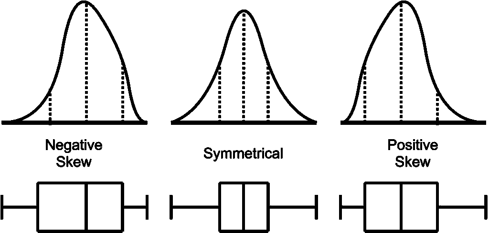
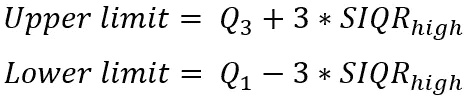
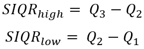
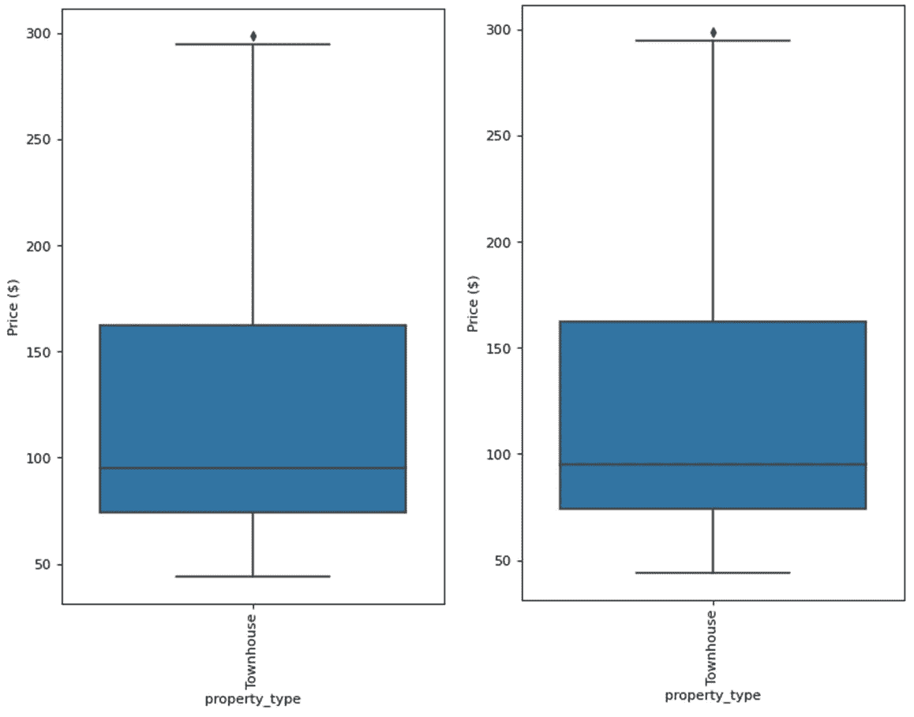
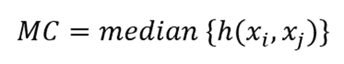
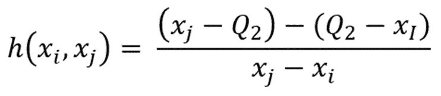
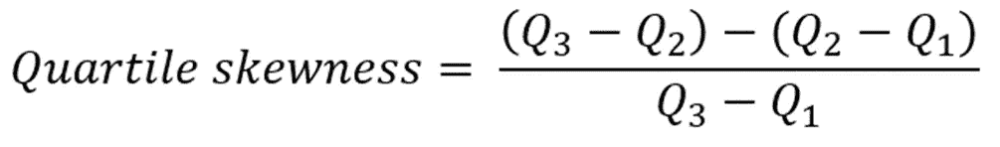
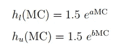

# 离群点检测(第二部分)

> 原文：<https://towardsdatascience.com/outlier-detection-part-2-6839f6199768>

## 偏斜分布的校正箱线图

图片来自 [Unsplash](https://unsplash.com/photos/g95sf8-fEQg)

> **简介**

在[之前的文章](https://medium.com/@mdsohel-mahmood/outlier-detection-part1-821d714524c)中，我已经讨论了大多数正态分布的异常值检测程序。这些程序包括

1.  IQR(四分位数间距)
2.  标准偏差
3.  z 分数
4.  修改的 Z 分数

在实施了上述程序后，我们仔细查看了箱线图，并显示了每种情况下异常值的数量。在真实数据集中，分布并不总是正态的。通常，它们是有偏差的，并且包含不想要的极端值。在本文中，我将详细介绍偏斜分布的异常值检测过程，并相应地调整箱线图。

> **偏态分布**

IQR 方法以及标准差、Z 得分和修正 Z 得分非常适合正态或接近正态的类型分布。然而，大多数真实的工作数据是不正常的，并且经常是有偏差的。这意味着数据可以在分布的低端或高端有尾部。这些类型的偏态分布如下所示。对于偏斜数据，相应的箱线图也会变得不对称。

免费可重复使用的图片来自[维基媒体](https://commons.wikimedia.org/wiki/File:Skew_with_quartiles_and_box_plots.png)

> **半四分位数范围**

Aucremanne L .等人[1]提出使用半四分位间距(SIQR)来调整这些偏斜分布的上限和下限，但后来发现它不支持对长尾分布的箱线图进行适当调整。例如，我们想要比较同一个 [AirBnB 数据](https://www.kaggle.com/datasets/airbnb/boston)的一个倾斜箱线图，并提取联排别墅的价格。使用标准 IQR 方法会产生一个异常值，SIQR 也会产生一个异常值。因此，不幸的是 SIQR 方法在我们的情况下对调整箱线图没有多大帮助[2]。

用于 SIQR 实施的公式为

标准 IQR 和 SIQR 程序产生相同的箱线图。左图来自标准 IQR 方法，右图来自 SIQR 方法。[图片由作者提供]

> **医疗所**

Brys 等人引入了对数偶的概念来度量具有连续单峰分布的单变量样本的偏斜度。这意味着感兴趣的参数应该具有一个清晰的单峰，而没有与另一个可能的峰的任何重叠。它定义了下面的内核函数

其中 xi < Q2 < xj。核函数 h 也由下式定义

这个定义非常类似于 Bowley [4]提出的四分位数偏斜度的测量

[2]中设定了一组新的异常值限值，其中包含了下图所示的热电偶。

> *下限:Q1-h_low (MC) * IQR*
> 
> *上限:Q3+ h_high (MC) * IQR*

显然，该核函数可以被线性或二次或指数模型利用。然而，我们不会详细讨论这些细节，但是我们将用 python 实现 medcouple 计算，如果读者有兴趣了解更多，可以浏览[2]。简而言之，很明显，与固定的 IQR 乘数 1.5 相比，这里我们基本上部署到不同的核函数(h_low 和 h_high)，因此，我们将获得非对称边界，而不像标准的 IQR 过程。

> **python 中的医疗所**

使用 stasmodel 库在 python 中实现 medcouple 的计算非常简单。

对于这个数组，medcouple 值是 0.145，这是上面讨论的所有核函数值的中值。据报道，与二次模型相比，指数模型更加有效和方便，因为它只有一个参数要处理，而二次模型可以根据模型的复杂性确定几个未知变量。

与[2]不同的核函数(指数模型)将导致不对称极限

在[2]中，指数项的乘数取为 1.5，a 和 b 的值可以通过用不同的值拟合数据来计算。我们可以在以后的文章中讨论利用线性、二次和指数模型。但是现在，通过阅读到目前为止，你已经很好地理解了为什么传统的 IQR 方法和箱线图不能用于偏斜分布。

> **结论**

在本文中，我们已经了解了偏态分布的基本概念，并展示了为什么确定异常值的传统方法可能会产生一些后果。常规 IQR 极限之外的数据点不一定是真正的异常值。利用 medcouple 程序，我们可以获得不对称的边界，并更有效地提取异常值，这些异常值有更多的机会表现出与大多数群体不同的行为。

感谢阅读。

> **有用的链接**

[Github 页面](https://mdsohelmahmood.github.io/data-science/2020/05/04/Outlier-detection-part2.html)

[我的网站:从数据中学习](https://www.learningfromdata.net/)

[Youtube](https://www.youtube.com/watch?v=N0YCn3sfUm4)

    

> **参考文献**

1.  Aucremanne，Luc & Brys，Guy & Hubert，Mia & Rousseeuw，Peter & Struyf，Anja。(2004).对比利时通货膨胀、相对价格和名义刚性的研究，使用新的稳健的偏度和尾部权重测量。10.1007/978–3–0348–7958–3_2.
2.  米（meter 的缩写））休伯特和 e .范德维伦，“偏斜
    分布的调整箱线图”，[计算统计&数据分析](https://www.sciencedirect.com/journal/computational-statistics-and-data-analysis)，[第 52 卷，第 12 期](https://www.sciencedirect.com/journal/computational-statistics-and-data-analysis/vol/52/issue/12)，2008 年 8 月 15 日，第 5186–5201 页
3.  Brys，g ,, Hubert，m ,, Struyf，A,“一个稳健的偏度度量”，计算和图形统计杂志，2004 年，第 13 卷，996 -1017
4.  鲍里，洛杉矶，1920 年。统计学原理。查尔斯·斯克里布纳的儿子，纽约