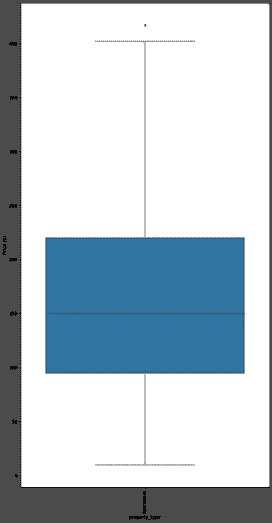
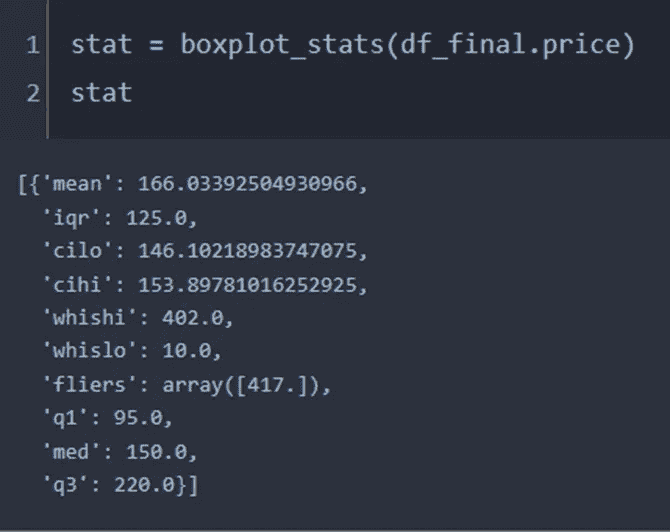
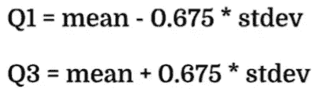
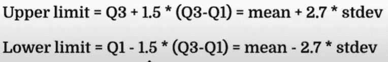
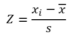
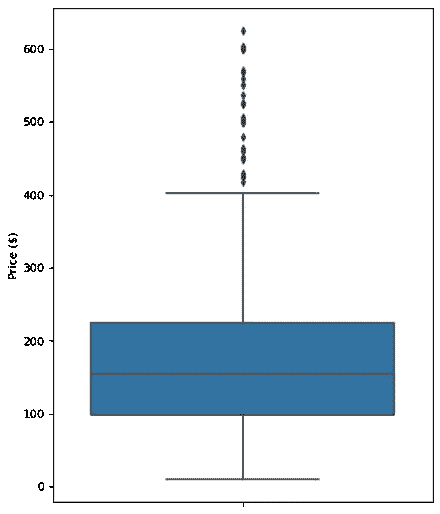
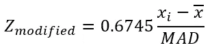
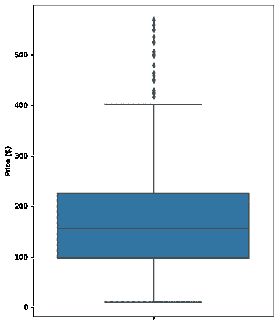

# 离群点检测(第 1 部分)

> 原文：<https://towardsdatascience.com/outlier-detection-part1-821d714524c>

## IQR、标准差、Z 值和修改后的 Z 值

作者图片

> **简介**

在数据驱动模型中包含异常值是有风险的。一个误导值的存在有可能改变模型所暗示的结论。因此，检测并决定是否将其从数据集中移除非常重要。有时数据点可能非常高或非常低，但这并不意味着它是我们想要摆脱的异常值。可能只是一个极端的数据点。这取决于用户决定它是否应该包含在模型中。然而，有时数据点可能只是数据收集或处理过程中的一个打字错误或一些人为因素。

> **离群点检测方法**

在本文中，我将介绍几种统计异常值检测方法，包括四分位间距(IQR)、标准差、Z 得分和修正的 Z 得分。我将使用 python 来实现这些方法，并最终共享数据和笔记本。我将使用[波士顿 AirBnB](https://www.kaggle.com/datasets/airbnb/boston) 数据和 [CC0:公共领域](https://creativecommons.org/publicdomain/zero/1.0/)许可。

> **四分位间距**

四分位数间距(IQR)是最广泛使用的离群点检测和删除程序之一。根据这个程序，我们需要遵循以下步骤:

*   找到第一个四分位数，Q1。
*   求第三个四分位数，Q3。
*   计算 IQR。IQR = Q3-Q1。
*   定义正常数据范围，下限为 Q1-1.5 * IQR，上限为 Q3+1.5*IQR。
*   任何超出此范围的数据点都被认为是异常值，应该删除以便进一步分析。

在箱线图中，实施这种 IQR 方法来检测任何极值数据点，其中最大点(高晶须的末端)是 Q3+1.5*IQR，最小点(低晶须的起点)是 Q1–1.5 * IQR。

> **用 python 实现**

AirBnB 数据有一个价格列，我们将考虑实施。确定 Q1、Q3 和 IQR 后，异常点将从数据框中移除，如下所示。

应用 IQR 方法后检测到一个异常值[图片由作者提供]

异常值与其他箱线图细节一起显示[图片由作者提供]

异常值为 417，高于箱线图所示的最大限值(whishi = 402)。我们没有低于 whislo (10)的 ant 异常值。

> **正态分布说明**

如果我们有一个正常的数据集，四分位数可以根据平均值和中位数来确定。

[图片由作者提供]

[图片由作者提供]

因此，对于正态分布数据，实施乘数为 1.5 的 IQR 方法与使用乘数为 2.7 的标准差方法相同，如上所示。然而，我们经常会将规格限制在 3 个标准差。为此，IQR 乘数应该是~1.7，而不是 1.5(为此，我们只将限制设置为标准差的 2.7 倍)。

> **标准偏差**

标准差法类似于上面讨论的 IQR 程序。根据 2 倍标准偏差或 3 倍标准偏差的设定限制，我们可以从数据集中检测并移除异常值。

> 上限=平均值+ 3 *标准偏差
> 
> 下限=平均值-3 *标准偏差

当平均值+/- 3 倍标准差被设定为极限值时，会发现更多的异常值[图片由作者提供]

这里异常值的总数是 57。当使用 2 倍 stdev 时，传单数量下降到 20。这是因为 2 倍 stdev 意味着更严格的极限集，并且大多数可能的极值点已经被该过程移除。移除后只剩下少数几个，当用更新的数据生成新的箱线图时，这些仍然被认为是异常值。

> **Z 值**

z 分数只是另一种形式的标准差程序。z 得分用于将数据转换为另一个均值为 0 的数据集。

[图片由作者提供]

这里，X-bar 是平均值，s 是标准偏差。转换数据后，中心变为 0，对应于每个数据点的 z 得分以标准差的形式表示与中心的距离。例如，z 值为 2.5 表示数据点距离平均值有 2.5 个标准偏差。通常 z 分数=3 被认为是设置限制的临界值。因此，任何大于+3 或小于-3 的 z 分数都被视为异常值，这与标准差方法非常相似。

我们发现在实施该方法之前异常值的数量是 21，并且在去除这 21 个异常值之后获得了 20。

实施截止值设置为 3 的 Z 分数方法后的异常值[图片由作者提供]

事实上，这 20 个异常值是我们从 3 倍 stdev 方法中获得的相同数据点。因此，用户可以选择任何一种。

> **修改后的 Z 值**

Z-score 易受极端数据点的影响。如果有一个极值，对应于该点的 z 值也将是极值。它有可能使平均值明显偏离其实际值。修改后的 z 得分比标准 z 得分更稳健，因为它是根据中位数绝对偏差(MAD)计算的。修正 Z 值的公式为[1]

[图片由作者提供]

因为它依赖于中间值，所以不容易受到任何异常值的影响。我们可以使用修正的 Z 值的临界值 3.5 [1]。一旦实现了这个过程，我们就获得了与 Z-score 相同的结果，因为数据集可能没有任何有影响的异常值。

实施截断值设置为 3.5 的修正 Z 分数方法后的异常值[图片由作者提供]

> **结论**

在本文中，我们展示了检测数据集中异常值的四个统计过程。对于正常数据集，IQR 乘数 1.7 类似于标准偏差乘数 3，这也类似于将 Z 值的临界值设置为 3 作为检测限。统计学家使用修改的 Z-score 来最小化异常值对 Z-score 的影响。这个修改后的 Z 值表示异常值的相对强度，以及它与它应该具有的 Z 值的偏差程度。所有这些程序都是统计确定异常值的标准程序。

[代码为](https://mdsohelmahmood.github.io/data-science/2020/05/04/Outlier-detection-part1.html)的 Github 页面

[我的网站:从数据中学习](https://www.learningfromdata.net/)

[本文的 Youtube】](https://www.youtube.com/watch?v=xEuuykOff-w&t=3s)

[代码演练](https://www.youtube.com/watch?v=F4s6H_EDwFc)

  

> **参考**

1.  析因实验设计的稳健数据分析:改进的方法和软件，萨马德，马吉德，[http://etheses.dur.ac.uk/2432/1/2432_443.pdf](http://etheses.dur.ac.uk/2432/1/2432_443.pdf)