# 使用自动编码器的异常检测

> 原文：<https://towardsdatascience.com/outlier-detection-with-autoencoders-6c7ac3e2aa90>

## 自动编码器

## 如果你不能压缩它，它可能有问题


兰迪·法特在 [Unsplash](https://unsplash.com?utm_source=medium&utm_medium=referral) 上的照片

你在数据科学和机器学习中遇到的一个经典障碍是*离群值*。离群值的概念对人类来说是直观明了的，然而除了涉及标准偏差或四分位间距的简单统计数据 101 之外，没有一般有意义的数学定义。

我认为原因可能是想出一个异常值是相当棘手的，因为一个异常值对不同的人可能意味着不同的事情。以下面的数据集为例:

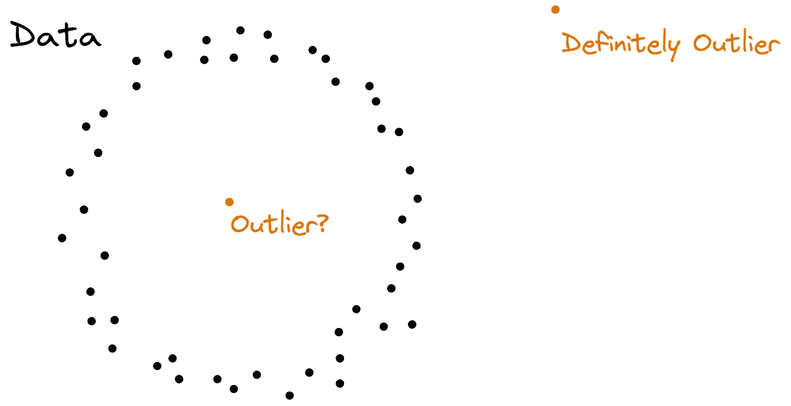

图片由作者提供。

我认为大多数人——包括我——会认为右上角的点是异常值。中间的点更有意思:一方面，它不在你脑子里画的这个假想的圆上，所以它应该是一个离群值。另一方面，与其他点相比，它的 *x* 和 *y* 坐标都不是真正疯狂的——中心点实际上是尽可能平均的。

我仍然认为这个点是一个异常值，因为实际数据点形成一个圆感觉是对的。然而，这不是你可以变成一个实际的算法来寻找离群值。

如果这个小小的二维例子已经引发了一些讨论，想象一下当我们处理更高维的数据时会发生什么，你不能再可视化来看它。

**在本文中，您将学习如何使用 Tensorflow 中的自动编码器用几行代码构建一个离群点检测器。**

## 我们为什么关心？

根据*定义*，异常值不像其他数据点。除其他原因外，异常值可能是:

*   **测量错误或输入错误:**有人输入了 777 公斤，而不是 77 公斤
*   **虚拟值:**有些东西无法测量，数据管道将 999 估算为固定值
*   **稀有数据点/自然离群值:**如果你有一个由二手车组成的数据集，一辆法拉利与其他汽车不同

我们关心异常值，因为它会严重扭曲分析和机器学习模型训练的结果。

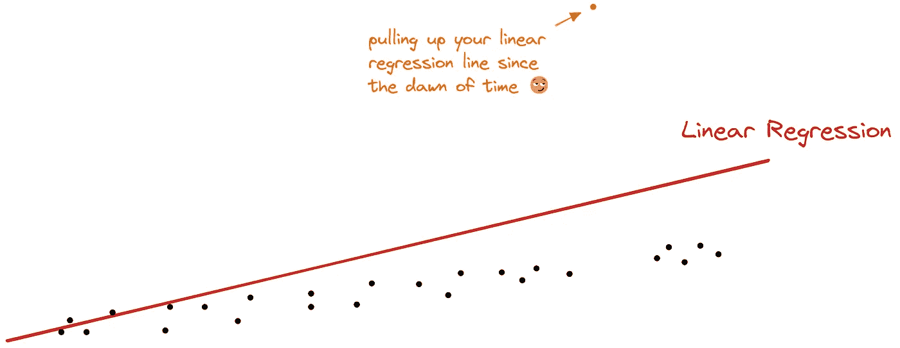

图片由作者提供。

向模型提供源自错误、输入错误和伪值的离群值基本上意味着向模型提供垃圾，这反过来又使模型学习并输出垃圾。

用自然离群值填充模型可能会导致对这些稀有数据点的过度拟合，这是需要记住的一件重要事情。

> ***注:*** *处理离群值的方法有很多，这里就不赘述了。最常用的方法是删除异常值。因此，您会丢失一些数据，但是您的分析或模型的整体质量可能会提高。*

# 寻找异常值

有多种方法可以发现异常值。来自[牛逼的 scikit-learn 网站](https://scikit-learn.org/stable/auto_examples/miscellaneous/plot_anomaly_comparison.html):

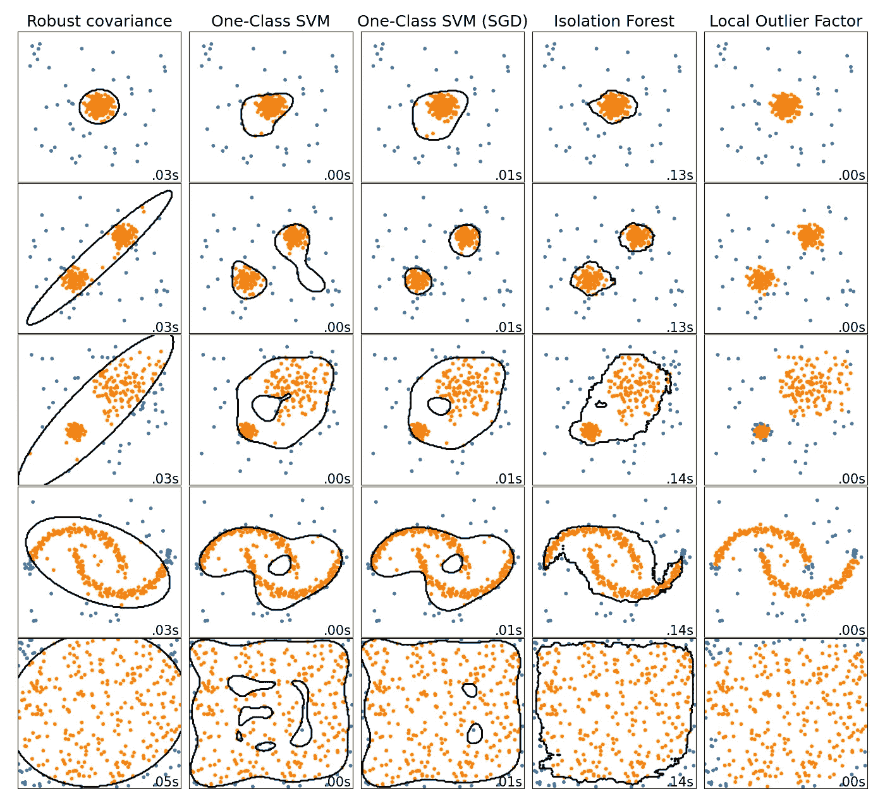

[https://sci kit-learn . org/stable/auto _ examples/miscellaneous/plot _ anomaly _ comparison . html](https://scikit-learn.org/stable/auto_examples/miscellaneous/plot_anomaly_comparison.html)

然而，我们将关注另一种你不知道的方法(还不知道？)在 scikit-learn 中查找。

## 自动编码器

它基于我在另一篇文章中介绍的自动编码器。

[](/introduction-to-autoencoders-b6fc3141f072)  

**提醒:一个好的自动编码器应该能够将数据压缩(编码)成更少的维度，然后再次解压缩(解码)，而不会引入很多错误。**

我们可以利用这种直觉得出以下逻辑，用自动编码器找出异常值:

> 如果自动编码器为某些数据点引入了较大的误差，则该数据点可能是异常值。

更直观地说:自动编码器试图为给定的数据集学习好的编码。由于数据集中的大多数数据点都不是异常值，自动编码器将受*正常*数据点的影响最大，并且应该在这些数据点上表现良好。

离群值是 autoencoder 在训练过程中不常看到的，因此它可能很难为它们找到一个好的编码。很简单，对吧？让我们试试这个主意吧！

# Tensorflow 自动编码器的简单示例

下面，我们将看一个简单的例子，它将帮助您理解和实现上述逻辑。

## 给圆圈编码

让我们将带有圆圈的介绍性示例编写成代码。首先，让我们创建一个数据集。

```
import tensorflow as tf

tf.random.set_seed(1234)

t = tf.expand_dims(tf.linspace(0., 2*3.14, 1000), -1)
noise = tf.random.normal((1000, 2), stddev=0.05)
points = tf.concat([tf.cos(t), tf.sin(t)], axis=1) + noise
```

绘制该图应该如下所示:

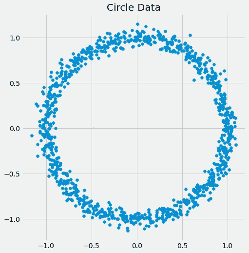

图片由作者提供。

现在让我们添加一些异常值。

```
points_with_outliers = tf.concat(
    [
        points,
        tf.constant([[0., 0.], [2., 2.]]) # the outliers
    ],
    axis=0)
```

结果是:

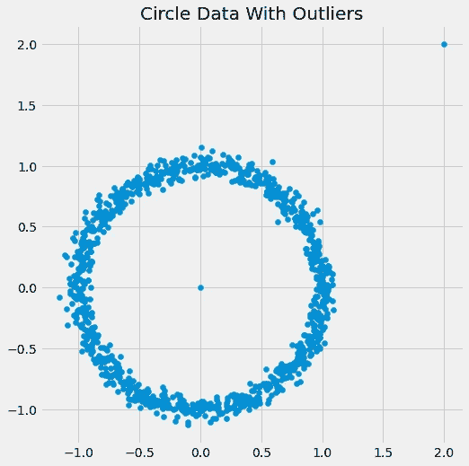

图片由作者提供。

现在，我们准备定义和训练一个简单的自动编码器，将二维数据压缩成一维数据。

```
shuffled_points = tf.random.shuffle(points)

encoder = tf.keras.Sequential([
    tf.keras.layers.Dense(16, activation="relu"),
    tf.keras.layers.Dense(16, activation="relu"),
    tf.keras.layers.Dense(16, activation="relu"),
    tf.keras.layers.Dense(1) # one-dimensional output
])

decoder = tf.keras.Sequential([
    tf.keras.layers.Dense(16, activation="relu"),
    tf.keras.layers.Dense(16, activation="relu"),
    tf.keras.layers.Dense(16, activation="relu"),
    tf.keras.layers.Dense(2) # decode to two dimensions again
])

autoencoder = tf.keras.Sequential([
    encoder,
    decoder
])

autoencoder.compile(loss="mse")

autoencoder.fit(
    x=shuffled_points, # goal is that output is 
    y=shuffled_points, # close to the same input
    validation_split=0.2, # to check if the model is generalizing
    epochs=500
)

# Output:
# [...]
# Epoch 500/500
# 25/25 [==============================] - 0s 2ms/step - loss:       # 0.0037 - val_loss: 0.0096
```

我们现在可以通过以下方式将我们的点放入自动编码器

```
reconstructed_points = autoencoder(points_with_outliers)
```

看看重建是什么样的:

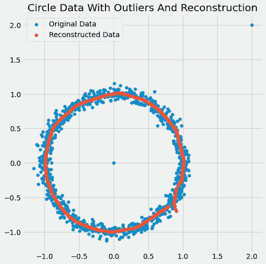

图片由作者提供。

我们可以看到，我们的自动编码器在识别潜在模式方面做得很好。我认为，这不是一个完美的圆，但也足够好了。

顺便提一下，在这里我们可以看到，我们的自动编码器基本上是**学会了** **将圆展开成一维线，然后再卷回来**:

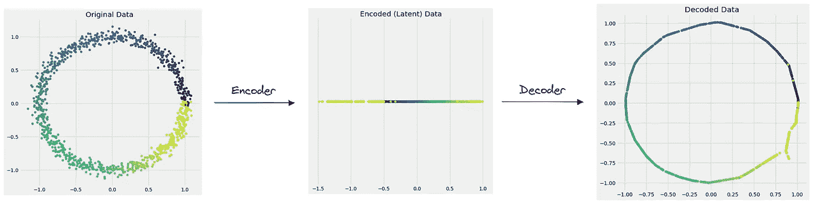

图片由作者提供。

此外，通过观察颜色，我们可以看到重建的点与它们的原始点非常接近。

## 获取异常值

但是离群值会发生什么呢？现在，让我们将所有的点都放到模型中，并突出显示我们添加的两个异常值。

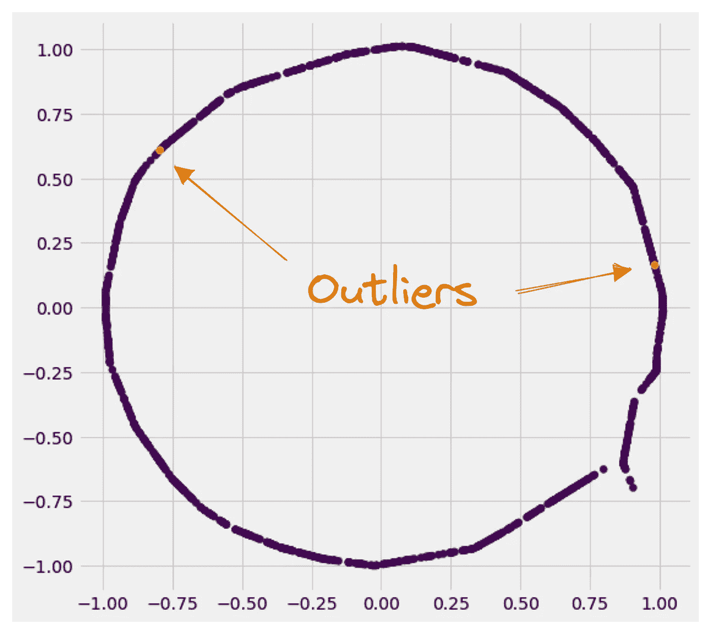

图片由作者提供。

自动编码器也将两个异常值放在其学习的圆近似上，这意味着它们都移动了相当多，因为它们之前都远离该圆。让我们打印一些数字:

```
import pandas as pd

reconstruction_errors = tf.reduce_sum(
    (model(points_with_outliers) - points_with_outliers)**2,
    axis=1
) # MSE

pd.DataFrame({
    "x": points_with_outliers[:, 0],
    "y": points_with_outliers[:, 1],
    "reconstruction_error": reconstruction_errors
})
```

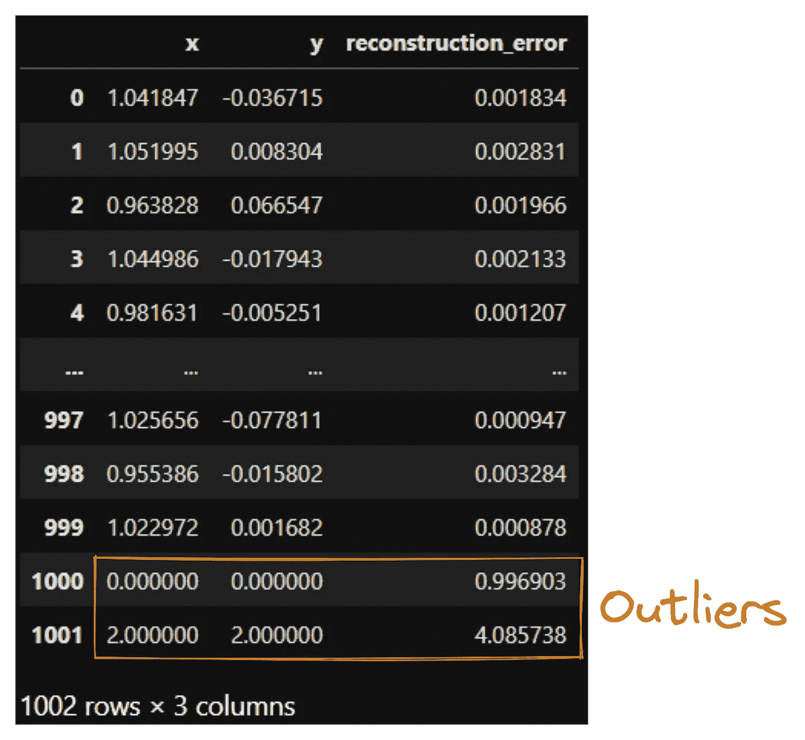

图片由作者提供。

即使没有太多的分析，我们已经可以看到正常的数据点有大约 0.002 的微小重建误差，而我们人工添加的异常值有大约 1 和 4 的误差。不错！

> 但是，等等，我们只是再次查看一个表来找出异常值。我们不能自动化吗？

好问题！是的，我们可以。从这里有几种方法可以处理。例如，我们可以说重建误差>*+3*的所有点都是异常值，其中是所有重建误差的平均值， *σ* 是标准偏差。**

**我们可以做的另一件事是说重建误差最高 x%的数据点是异常值。在这种情况下，我们假设数据集的 x%由异常值组成，也称为*污染因子*，您可以在隔离森林等其他几种异常值检测算法中找到。**

## **与 Scikit-Learn 异常检测器的比较**

**我创建了一个快速和肮脏的 scikit-learn 兼容异常检测器，以便能够将这种方法与其他 scikit-learn 异常检测器进行比较，如这里的[所示](https://scikit-learn.org/stable/auto_examples/miscellaneous/plot_anomaly_comparison.html)。**

```
**from sklearn.base import BaseEstimator, OutlierMixin
import numpy as np

class AutoencoderOutlierDetector(BaseEstimator, OutlierMixin):
    def __init__(self, keras_autoencoder, contamination):
        self.keras_autoencoder = keras_autoencoder
        self.contamination = contamination

    def fit(self, X, y=None):
        self.cloned_model_ = tf.keras.models.clone_model(self.keras_autoencoder)
        self.cloned_model_.compile(loss="mse")

        self.cloned_model_.fit(
            x=X,
            y=X,
            epochs=1000,
            verbose=0,
            validation_split=0.2,
            callbacks=[
                tf.keras.callbacks.EarlyStopping(patience=10)
            ]
        )

        reconstruction_errors = tf.reduce_sum(
            (self.cloned_model_(X) - X) ** 2,
            axis=1
        ).numpy()

        self.threshold_ = np.quantile(reconstruction_errors, 1 - self.contamination)

        return self

    def predict(self, X):
        reconstruction_errors = tf.reduce_sum(
            (self.cloned_model_(X) - X) ** 2,
            axis=1
        ).numpy()

        return 2 * (reconstruction_errors < self.threshold_) - 1**
```

**如果我们使用与圆形相同的自动编码器架构，我们会得到以下结果:**

**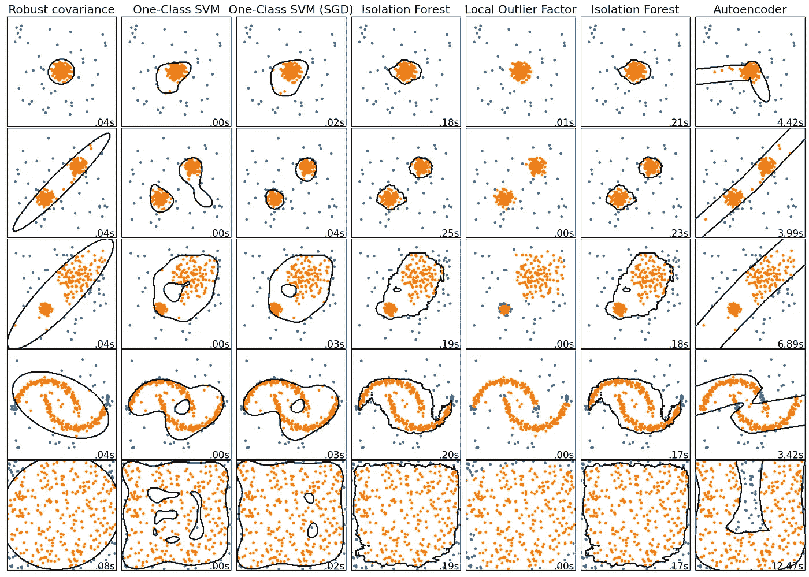**

**图片由作者提供。**

**这里我们看到了整个方法的一个缺点:**如果我们使用错误的神经网络架构，我们可能会以奇怪的形状结束**。如果我们使用一个更简单的自动编码器，每个隐藏层有 **2 个单元，而不是之前的 16 个**，我们得到:**

**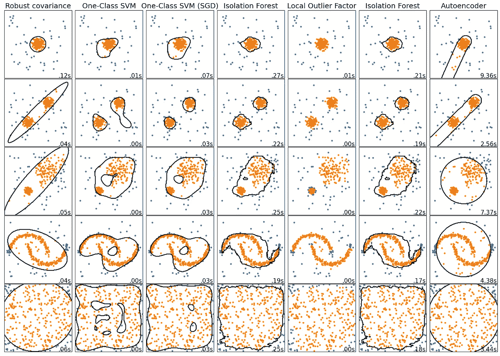**

**图片由作者提供。**

**我认为这稍微好一点，但还远远不够好。**

> **给你的作业:找一个在这些小玩具数据集上表现不错的架构！**

# **结论**

**离群值有可能破坏分析和模型。因此，我们应该能够发现并处理它们。一种方法是使用自动编码器:一种机器学习模型——通常是神经网络——对数据进行编码，然后再次解码。如果编码/解码步骤对于一个数据点效果不好，这个点可能是一个异常值。**

**这个基本的想法很简洁，但是你仍然需要考虑如何设计自动编码器。虽然这可能非常困难，但这是其他异常值检测模型无法做到的。隔离林和公司有一个固定的架构，只允许你调整一些超参数。有了自动编码器，你就自由了——不管有什么优点和缺点。**

**我希望你今天学到了新的、有趣的、有用的东西。感谢阅读！**

****作为最后一点，如果你****

1.  ****想支持我多写点机器学习和****
2.  ****无论如何都要计划获得一个中等订阅，****

****为什么不做** [**通过这个环节**](https://dr-robert-kuebler.medium.com/membership) **？这将对我帮助很大！😊****

***说白了，给你的价格不变，但大约一半的订阅费直接归我。***

**非常感谢，如果你考虑支持我的话！**

> ***如有问题，在*[*LinkedIn*](https://www.linkedin.com/in/dr-robert-k%C3%BCbler-983859150/)*上写我！***