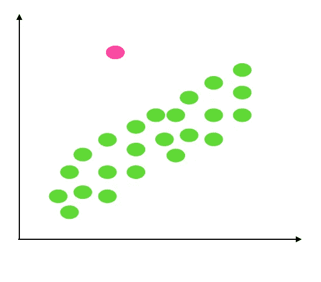
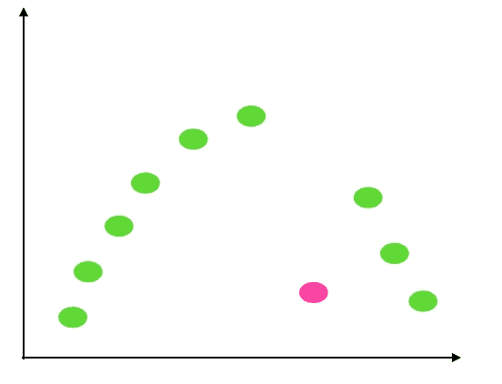
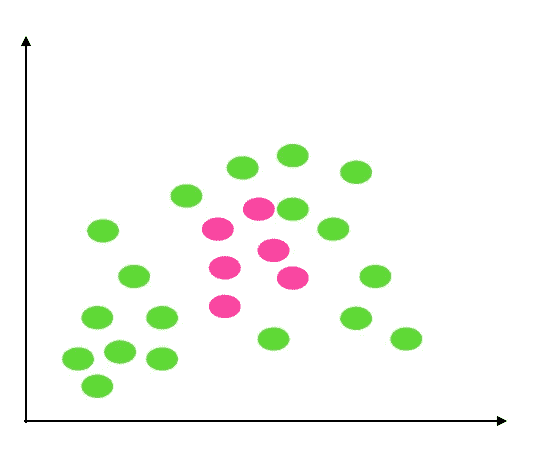

# 离群值以及在哪里找到它们

> 原文：<https://towardsdatascience.com/outliers-and-where-to-find-them-99de703be9ff>

## 通过示例概述不同的异常值类型

来自兰迪·法斯特的《不拉什》

你有没有想过为什么一个基本的分析，比如月平均销售额的比较，会产生一个与通过非常深入的研究得到的结果完全不同的结果？你有没有想过军事监控是如何如此迅速地发现异常行为的，或者如果你意外购物，你的信用卡是如何向你发送通知的？

在当今的环境中，数据非常重要。它们被到处记录和分析，希望能提取重要的数据。每天都有新的和改进的分析方法和仪器被开发出来。分析的缺点之一是数据并不总是准确的。他们可能有威胁整个过程的差异。一种差异是数据中存在异常值。

简单来说，离群值是与现有数据非常不同的数据点。它们可能是一个干扰分析的坏数据点，也可能是一个导致有趣发现的独特数据点，从而产生可操作的见解。

因此，让我们通过一个例子来看看异常值的各种形式:

## 例子

假设我们生活在一个有十户人家的小社区里。这些家庭大多由退休人员组成，他们早上 8 点开始一天的工作，晚上 8 点结束

保罗·卡皮斯卡

***案例一*** *:如果你观察到有人晚上 11 点在这个街区的街上走，那就是个异数，可能是个小偷。*

比方说，一种新的习俗出现了，整个城镇在星期六聚集在一起，举行聚会直到深夜。

***案例二:*** *如果你在这个小区的某个周六晚上 11 点看到有人走在街上，那很正常；然而，在另一天，这是不寻常的。这是一个异常现象，在特定的背景下，它可能是一个小偷。*

这么多老年人住在一起，不时看到有人生病是很自然的。

***案例三:*** *让我们想象一下，我们目睹四个家庭同时患病。这很奇怪，可能是有原因的，比如病毒的传播。*

让我们看看如何使用这三种场景来发现不同类型的异常值。

## 不同的异常值

在一般问题空间的大多数文献中，离群点可以分为三类:全局离群点、上下文离群点和集体离群点。

**第 1 类:全球异常值:**

图 1:全球异常值(作者图片)

这是最基本的异常值，可以被识别为与整个数据集非常不同的值。这也被称为点异常。

我们示例中的案例 1 就是一个例子。所有人都以一种特定的方式行动，他们不会在晚上 8 点后四处走动，但有一个人或一个点会偏离常规，在某天晚上 11 点四处游荡。

这是异常值的最简单形式，相对于其他异常值来说很容易识别。

**类型 2:上下文(条件)异常值:**

图 2:上下文异常值(作者图片)

我们根据上下文或条件来定义这种异常值。在单个上下文或条件下，一个数据点显著偏离相同上下文中的其他数据点将被视为异常值。这意味着相同的数据点在不同的情况下不会是异常值。

上述案例 2 是一个上下文异常值。星期六，一个人在晚上 11 点徘徊是常见的，但在其他日子里不会；因此，在周六，它不是一个异常值，但在其他任何一天，它都是。离群值取决于上下文，这里是一周中的某一天。

如果没有背景信息，背景异常值基本上很难发现。在问题公式化本身，必须定义与目标领域相关的上下文

**第三类:集体异常值:**

图 3:收集异常值(作者图片)

集体离群值是与数据集的其余部分完全不同的数据点的集合。单个数据对象可能不是离群值，但从整体上看，它们可能表现得像离群值。

在前面的场景中，案例 3 是集体异常值的一个例子。当一个地区大量的人同时生病时，这是不寻常的；然而，不时有一两个人生病并不罕见。

我们可能需要关于表现出异常行为的数据对象之间的联系的背景知识，以便发现这些类型的异常。

## 结论

本文的目的是在分析不同类型的异常值之前对它们进行概述，因为理解它们是如何存在的是至关重要的。如果我们只专注于一种类型，我们可能会忽略其他类型。例如，如果我们只是简单地寻找全局异常值，就很容易错过上下文异常值。因此，了解异常值如何以不同的形式存在是很重要的。