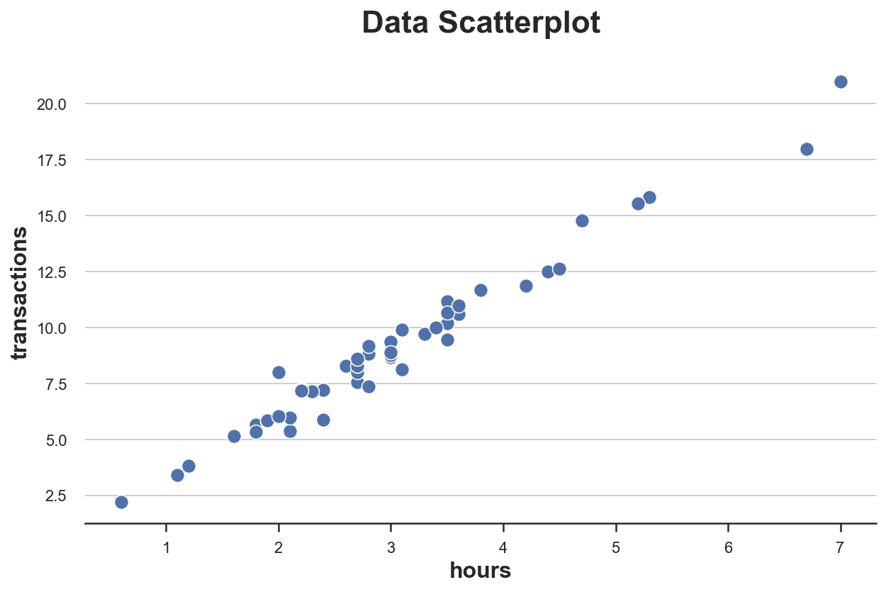
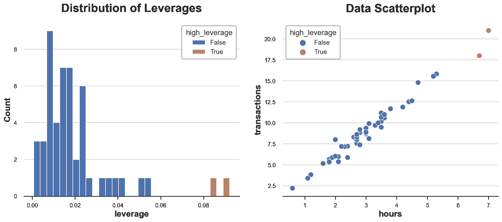
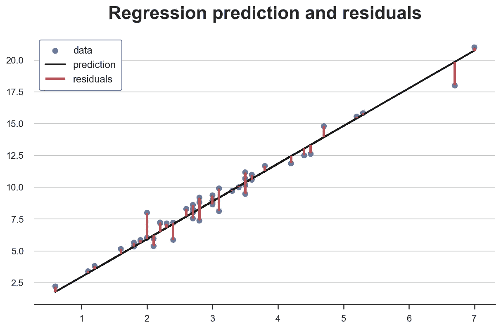
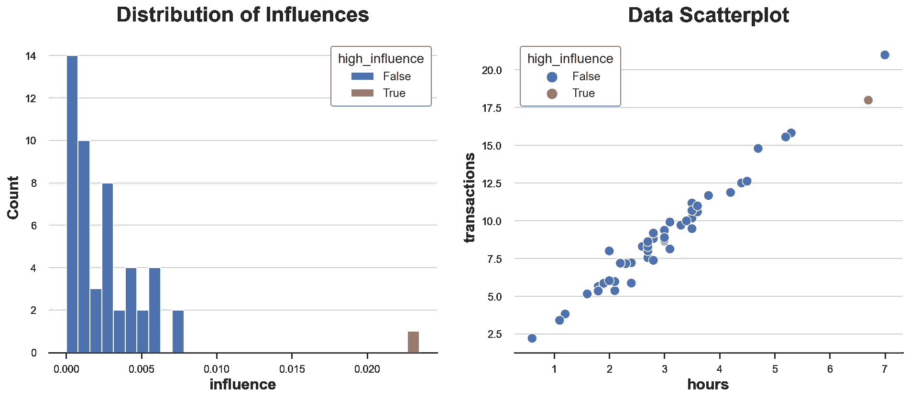
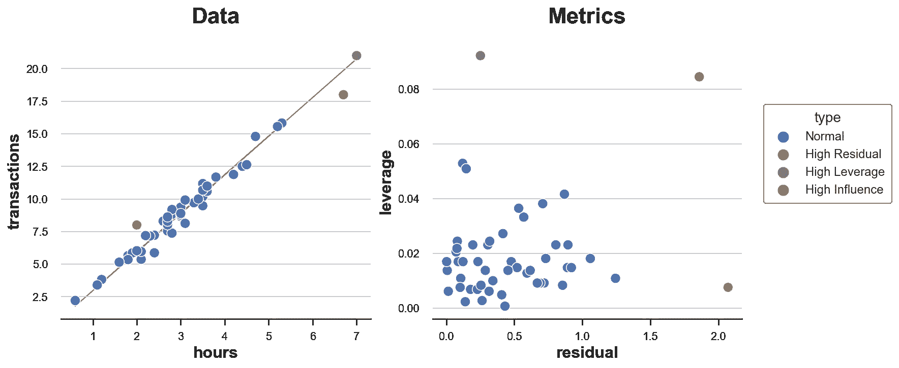

# 异常值、杠杆、残差和有影响的观察值

> 原文：<https://towardsdatascience.com/outliers-leverage-residuals-and-influential-observations-df3065a0388e>

## [因果数据科学](https://towardsdatascience.com/tagged/causal-data-science)

## *是什么让观察变得“不寻常”？*

封面图片，由作者使用[nightcafe](https://creator.nightcafe.studio/)生成

在数据科学中，一个常见的任务是[异常检测](https://en.wikipedia.org/wiki/Anomaly_detection)，即理解一个观察值是否**“异常”**。首先，不寻常是什么意思？在本文中，我们将考察观察值异常的三种不同方式:它可能具有异常特征，它可能不太适合模型，或者它可能对模型的训练特别有影响。我们将会看到，在线性回归中，后一个特征是前两个特征的副产品。

重要的是，与众不同不一定是坏事。具有不同特征的观察结果通常包含更多的信息。我们还预计一些观察结果不会很好地拟合模型，否则，模型很可能是有偏差的(我们过度拟合)。然而，“不寻常”的观察结果也更有可能是由不同的数据生成过程产生的。极端情况包括测量错误或欺诈，但其他情况可能更微妙，如具有罕见特征或行为的正版用户。领域知识永远是王道，仅仅因为统计原因而放弃观察是不明智的。

也就是说，让我们看看观察结果“不寻常”的一些不同方式。

# 简单的例子

假设我们是一个**点对点在线平台**，我们有兴趣了解我们的业务是否有任何可疑之处。我们掌握了用户在平台上花费时间的信息，以及他们交易的总价值。是不是有些用户**可疑**？

首先，我们来看一下数据。我从`[src.dgp](https://github.com/matteocourthoud/Blog-Posts/blob/main/notebooks/src/dgp.py)`导入数据生成过程`dgp_p2p()`，从`[src.utils](https://github.com/matteocourthoud/Blog-Posts/blob/main/notebooks/src/utils.py)`导入一些绘图函数和库。为了不仅包括代码，还包括像数据和表格这样的输出，我使用了 [Deepnote](https://deepnote.com) ，一个类似 Jupyter 的基于网络的协作笔记本环境。

我们有 50 个用户的信息，我们观察他们在平台上花费的`hours`和总`transactions`金额。因为我们只有两个变量，我们可以很容易地用散点图来检查它们。

数据散点图，图片由作者提供

`hours`和`transactions`之间的关系似乎遵循明显的线性关系。如果我们拟合一个[线性模型](https://en.wikipedia.org/wiki/Linear_regression)，我们会观察到一个特别紧密的拟合。

是否有任何数据点看起来可疑地不同于其他数据点？怎么会？

# **杠杆**

我们用来评估“不寻常”观察的第一个指标是**杠杆**。杠杆作用的目标是捕捉单个点相对于其他数据点的不同程度。这些数据点通常被称为**异常值**，有几乎无限数量的算法和经验法则来标记它们。然而，想法是相同的:标记在特征方面不寻常的观察。

观察值 *i* 的杠杆作用定义为

线性回归中的杠杆作用，图片由作者提供

对杠杆的一种解释是作为距离的**度量，其中将单个观察值与所有观察值的平均值进行比较。**

杠杆的另一种解释是观察结果 *i* 、 *yᵢ* 对相应拟合值 *ŷᵢ* 的影响。

利用替代公式，作者图片

从代数上讲，观察的杠杆 *i* 是**设计矩阵** X'(X'X)⁻ X 的 *iₜₕ* 元素。在杠杆的许多属性中，有一个事实是它们是非负的，并且它们的值总和为 *X* 的维数(在我们的例子中为 1)。

让我们计算一下数据集中观察值的杠杆作用。我们还标记了具有不寻常杠杆的观察结果(我们任意定义为偏离平均杠杆超过两个标准差)。

让我们在数据中绘制杠杆值的分布图。

高杠杆点，作者图片

正如我们所看到的，分布是偏斜的，两个观察值具有异常高的杠杆作用。事实上，在散点图中，这两个观察值与分布的其余部分略有不同。

这是坏消息吗？看情况。离群值本身并不是问题。实际上，如果它们是真实的观察，它们可能比其他观察携带更多的信息。另一方面，它们也更有可能*而非*是真实的观察结果(例如欺诈、测量误差……)，或者与其他观察结果有本质上的不同(例如专业用户与业余用户)。在任何情况下，我们可能希望进一步调查，并尽可能多地使用特定于上下文的信息。

> 人们永远不应该仅仅因为统计原因而放弃观察

重要的是，观察具有高杠杆的事实告诉我们关于模型特征的信息，但是没有关于模型本身的信息。这些用户只是不同还是他们的行为也不同？

# 残差

到目前为止，我们只讨论了不寻常的特性，但是**不寻常的行为**呢？这就是回归残差所测量的。

回归残差是预测结果值和观察结果值之间的差值。从某种意义上来说，它们捕捉到了模型无法解释的东西:一个观察值的残差越高，就越不寻常，因为模型无法解释它。

在线性回归的情况下，残差可以写成

线性回归中的残差，作者提供的图像

在我们的例子中，由于 *X* 是一维的(`hours`，我们可以很容易地把它们想象成观测值和预测线之间的距离。

数据、预测值和残差，按作者分类的图像

某些观测值是否有异常高的残差？让我们画出它们的分布图。

高残留点，作者图片

两个观测值具有特别高的残差。这意味着对于这些观察结果，模型不擅长预测观察到的结果。

这是坏消息吗？还是那句话，不一定。太符合观测值的模型很可能 [**有偏**](https://en.wikipedia.org/wiki/Bias_(statistics)) 。但是，理解为什么一些用户在花费的时间和总事务之间有不同的关系可能仍然很重要。像往常一样，领域知识是关键。

到目前为止，我们已经从模型的角度观察了具有“不寻常”特征和“不寻常”行为的观察结果。但是**哪里来的模型**？我们的模型有多少是由少量的观察数据驱动的？哪些？

# 影响

**影响和影响函数**的概念正是为了回答这个问题而开发的:什么是有影响的观察？这个问题在 80 年代非常流行，并且在很长一段时间内失去了吸引力，直到最近，因为解释复杂的机器学习和人工智能模型的需求越来越大。

总的想法是，如果移除它会显著改变估计的模型，则将观察定义为**有影响的**。在线性回归中，我们将观察值 *i* 的影响定义为:

线性回归中的影响，作者提供的图像

其中 *β̂-i* 是省略观测值 *i* 估计的 OLS 系数。

如你所见，杠杆 *hᵢᵢ* 和残差 *eᵢ* 之间有着紧密的**联系**:这两者的影响力都在增加。实际上，在线性回归中，具有高杠杆的观察值是既有异常值又有高残差的观察值。这两个条件中没有一个足以使观察对模型产生影响。

我们可以从数据中最好地看到这一点。

高影响点，作者图片

在我们的数据集中，只有一个具有高影响的观测值，其值不成比例地大于所有其他观测值的影响。单从散点图上你会猜到吗？

我们现在可以在同一个图中标出所有“不寻常”的点。我还在单独的图中报告了每个点的残差和杠杆。

不寻常的观察，作者的图像

正如我们所看到的，我们有一个高剩余和低杠杆的点，一个高杠杆和低剩余的点，只有一个高杠杆和高剩余的点:唯一有影响的点。

从图中还可以清楚地看出，为什么这两个条件中没有一个足以使一个观察结果产生影响并扭曲模型。橙色点具有较高的残差，但它正好位于分布的中间，因此不能倾斜最佳拟合线。相反，绿点具有很高的杠杆作用，并且远离分布的中心，但它与拟合线完全对齐。移除它不会改变任何事情。相反，红点在**特性和行为**方面不同于其他红点，因此使拟合线向自身倾斜。

# 结论

在这篇文章中，我们已经看到了观察“不寻常”的几种不同方式:它们可能有**不寻常的特征**或**不寻常的行为**。在线性回归中，当一个观察同时具有两者时，它也是有影响的:它使模型向自身倾斜。

在本文的例子中，我们集中在一元线性回归上。然而，由于需要让黑盒机器学习算法**可以理解**，影响函数的研究最近成为热门话题。对于拥有数百万个参数、数十亿个观察值和大量非线性的模型，很难确定单个观察值是否有影响以及如何影响。

## 参考

[1] D .库克，[线性回归中有影响的观测值的检测](https://www.jstor.org/stable/1268249) (1980)，*。*

*[2] D. Cook，S. Weisberg，(1980)，*技术计量学*。*

*[2]许佩文，梁，[通过影响函数理解黑箱预测](http://proceedings.mlr.press/v70/koh17a) (2017)，*《ICML 论文集》*。*

## *密码*

*你可以在这里找到 Jupyter 的原始笔记本:*

 ** 

## *感谢您的阅读！*

**真的很感谢！*🤗*如果你喜欢这个帖子并想看更多，可以考虑* [***关注我***](https://medium.com/@matteo.courthoud) *。我每周发布一次与因果推断和数据分析相关的主题。我尽量让我的帖子简单而精确，总是提供代码、例子和模拟。**

**还有，一个小小的* ***免责声明*** *:我写作是为了学习所以错误是家常便饭，尽管我尽力了。当你发现他们的时候，请告诉我。也很欣赏新话题的建议！**