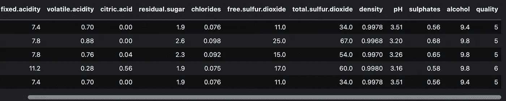
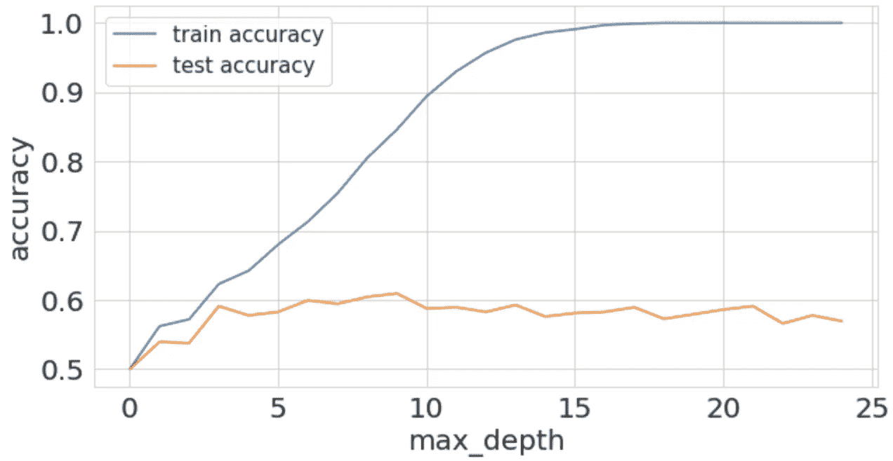
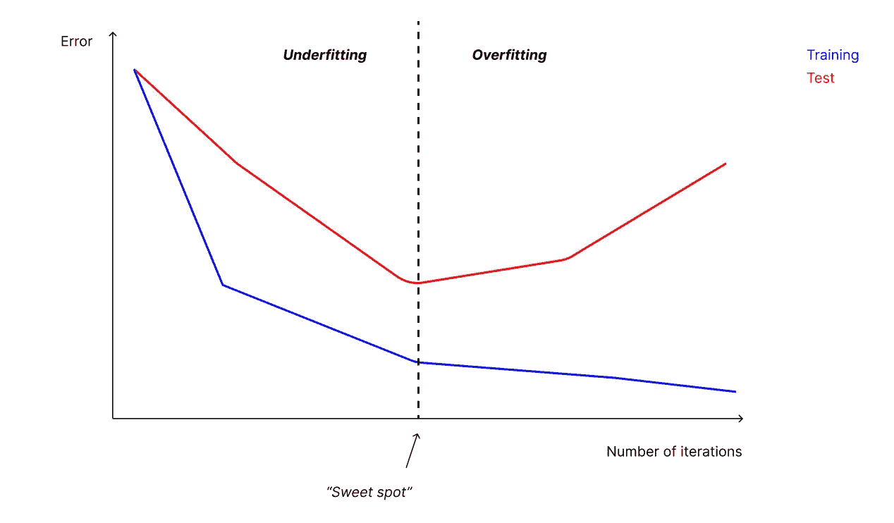

# 克服机器学习中最大的障碍:过拟合

> 原文：<https://towardsdatascience.com/overcome-the-biggest-obstacle-in-machine-learning-overfitting-cca026873970>

## *过度拟合是数据科学中的一个概念，当预测模型学会对训练数据进行很好的概括，而不是对看不见的数据进行概括时，就会出现这种情况*

图片作者。

解释什么是过度拟合的最好方法是通过一个例子。

想象一下这个场景:我们刚刚被一家开发照片处理软件的公司聘为数据科学家。该公司最近决定在他们的流程中实施机器学习，目的是创建可以区分原始照片和编辑照片的软件。

我们的任务是创建一个模型，可以检测以人为主题的照片编辑。

我们对这个机会感到兴奋，作为我们的第一份工作经历，我们非常努力地工作以留下一个好印象。

我们适当地训练了一个模型**，它在训练数据**上表现得非常好。我们对此非常高兴，并向利益相关者传达了我们的结果。下一步是在生产中为一小组用户提供模型服务。在模型上线后不久，我们就和技术团队一起设置好了一切，并将结果输出给测试用户。

第二天早上，我们打开收件箱，看到一系列令人沮丧的消息。用户反馈非常负面！**我们的模型似乎不能正确分类图像**。在培训阶段，我们的模型表现良好，而在生产阶段，我们却观察到如此糟糕的结果，这怎么可能呢？

简单。我们是 ***过度拟合*** 的受害者。

我们失业了。好打击！

# 介绍

上面的例子代表了一种有些夸张的情况。一个新手分析师至少听说过术语*过度拟合*。这可能是你在行业内工作、关注或听在线教程时最先学会的词汇之一。

尽管如此，**过度拟合是一种在训练预测模型时几乎总能观察到的现象**。这导致分析师不断面对由多种原因引起的相同问题。

> 在这篇文章中，我将讨论什么是过度拟合，为什么它是分析师在进行机器学习时面临的最大障碍，以及如何通过一些技术来防止这种情况发生。

虽然这是机器学习中的一个基本概念，但清楚地解释过度拟合的含义并不容易。这是因为你得从*训练一个模型意味着什么开始，评估它的性能*。在这篇文章中，我写了什么是机器学习，以及它对训练一个模型意味着什么。

从提到的文章来看，

> 向模型展示数据并让它从中学习的行为称为*训练*。[…].在训练期间，模型会根据某些假设尝试学习数据中的模式。例如，概率算法的运算基础是在某些数据存在的情况下推断事件发生的概率。

训练模型时，我们使用评估指标来确定模型的预测值与实际观察值的差距。例如，[对于一个分类问题](/the-explanation-you-need-on-binary-classification-metrics-321d280b590f)(就像我们示例中的问题)，我们可以使用 F1 分数来了解模型在训练数据上的表现。

> 初级分析师在介绍性示例中所犯的错误与培训阶段对评估指标的错误解释以及缺乏验证结果的框架有关。

事实上，分析师在训练期间关注了模型的性能，忘记了查看和分析测试数据上的性能。

# 什么是过度拟合？

*当我们的模型能够很好地归纳训练数据而不是测试数据时，就会发生过度拟合。*当这种情况发生时，我们的算法无法很好地处理它从未见过的数据。这完全破坏了它的目的，使它成为一个毫无用处的模型。

> 这就是为什么过度拟合是分析师最大的敌人:它完全违背了我们工作的目的。

当模型被训练时，它使用训练集来学习模式并将特征集映射到目标变量。然而，正如我们已经看到的，**模型可能会开始学习嘈杂甚至无用的信息** —更糟糕的是，这些信息只存在于训练集中。

我们的模型学习它不需要(或实际上不存在)的信息，以在新的、看不见的数据上完成工作，例如在实时生产环境中的用户数据。

# Python 中的一个例子

让我们用 Kaggle 著名的*红酒数据集*来形象化一个过度拟合的案例。这个数据集有 11 个维度来定义红酒的质量。基于这些，我们必须建立一个能够预测红酒质量的模型，它的值在 1 到 10 之间。

我们将使用一个基于决策树的分类器(sk learn . tree . decision tree classifier)来展示一个模型是如何被过度拟合的。

如果我们打印前 5 行，这就是数据集的样子

红酒数据集的前 5 行。图片作者。

我们用这个代码来训练一个决策树。

*训练精度:0.623*

*测试精度:0.591*

我们用超参数 *max_depth* = 3 来初始化我们的决策树。现在让我们尝试使用不同的值—例如 7。

*clf =树。decision tree classifier(max _ depth = 7)#其余代码保持不变*

让我们来看看准确度的新值

*列车精度:0.754*

*‍Test 精度:0.591*

训练集的精度在提高，但测试集的精度没有提高。我们把一切都放在一个循环中，我们将动态地修改 *max_depth* ，并在每次迭代中训练一个模型。

我们实验的结果。图片作者。

看看高 *max_depth* 如何对应于训练中的非常高的准确度(接近 100%的值),但在测试集中这如何在 55–60%左右。

**我们观察到的是过度拟合！**

事实上，测试集中的最高精度值可以在 *max_depth* = 9 处看到。超过该值，精度不会提高。因此，将参数值增加到 9 以上是没有意义的。

max_depth = 9 的值代表“最佳点”，也就是说，没有过度拟合的模型，但仍然能够很好地概括数据的理想值。

事实上，一个模特也可能非常“肤浅”，会经历*合身不足*，与合身过度正好相反。**“甜蜜点”在这两点之间保持平衡**。分析师的任务是尽可能接近这一点。

“甜蜜点”。图片作者。

# 过度拟合的最常见原因

导致模型过量灌装的最常见原因如下:

*   我们的数据包含噪音和其他不相关的信息
*   训练集和测试集太小
*   模型太复杂了

## 数据包含噪声

当我们的训练数据包含噪声时，我们的模型学习这些模式，然后尝试将这些知识应用于测试集，显然没有成功。

## 数据很少，不具有代表性

如果我们只有很少的数据，这些数据可能不足以代表将由使用该模型的用户提供的现实。

## 模型太复杂了

过于复杂的模型会关注与目标变量映射根本不相关的信息。在前面的例子中，max_depth = 9 的决策树既不太简单也不太复杂。增加该值会导致训练中的性能度量增加，但不会导致测试设置中的性能度量增加。

# 如何避免过度拟合

有几种方法可以避免过度拟合。在这里，我们看到了实际上经常使用的最常见和最有效的方法

*   交叉验证
*   向我们的数据集中添加更多数据
*   移除功能
*   使用提前停止机制
*   使模型正规化

这些技术中的每一种都允许分析人员很好地理解模型的性能，并更快地达到上面提到的“最佳点”。

## 交叉验证

交叉验证是一种非常常见和非常强大的技术，它允许您在几个验证“迷你集”上测试模型的性能，而不是像我们以前所做的那样使用单个集。这使我们能够理解模型如何在整个数据集的不同部分上进行归纳，从而对模型的行为有一个更清晰的概念。

## 向我们的数据集中添加更多数据

我们的模型可以简单地通过整合更多的信息来接近甜蜜点。我们应该尽可能地增加数据，以便为我们的模型提供越来越有代表性的“现实”部分。我推荐读者阅读[这篇文章](/building-your-own-dataset-benefits-approach-and-tools-6ab096e37f2)，其中我解释了如何从头构建数据集。

## 移除功能

特征选择技术(如 [Boruta](/feature-selection-with-boruta-in-python-676e3877e596) )可以帮助我们理解哪些特征对于预测目标变量是无用的。移除这些变量有助于减少观察模型时的背景噪音。

## 使用提前停止机制

[提前停止](/control-the-training-of-your-neural-network-in-tensorflow-with-callbacks-ba2cc0c2fbe8)是一种主要用于深度学习的技术，包括在一系列训练周期内性能没有增加时停止模型。这允许您保存模型在最佳时间的状态，并且只使用这个性能最佳的版本。

## 使模型正规化

通过对超参数的调整，我们可以经常并且心甘情愿地控制模型的行为，以降低或增加其复杂性。我们可以在交叉验证期间直接修改这些超参数，以了解模型在不同数据分割上的表现。

# 结论

很高兴你来了。希望您会发现这篇文章很有用，并在您的代码库中实现它的片段。

如果你想支持我的内容创作活动，请随时关注我下面的推荐链接，并加入 Medium 的会员计划。我将收到你投资的一部分，你将能够以无缝的方式访问 Medium 的大量数据科学文章。

<https://medium.com/@theDrewDag/membership>  

祝你愉快。留得安好👋