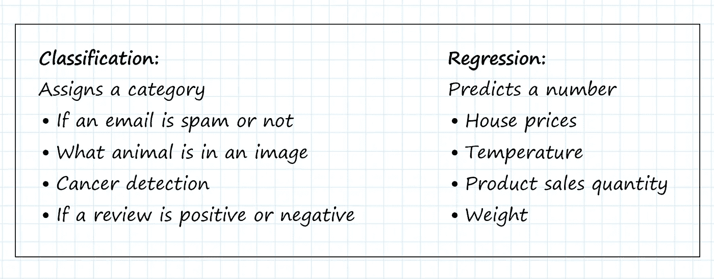
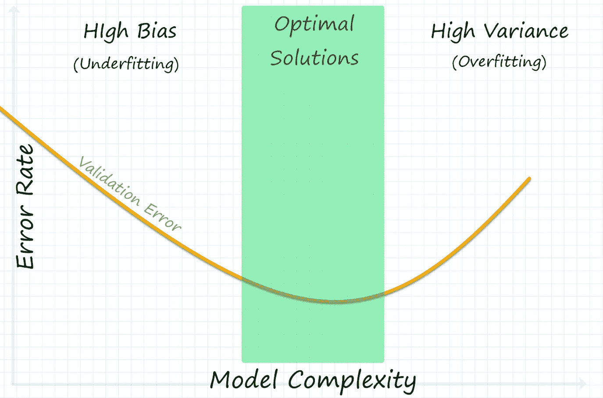
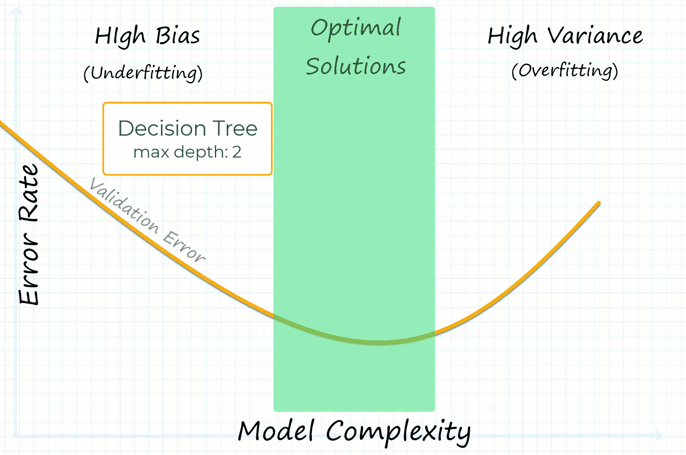

# 克服机器学习中的偏差和差异

> 原文：<https://towardsdatascience.com/overcoming-bias-variance-in-machine-learning-31169dc649ed>

## 关于模型选择和超参数调整的初学者友好指南

当开始一个机器学习项目时，知道选择什么模型并不总是容易的，尤其是如果你是这个领域的新手。在本帖中，我们将解决你在开始一个项目时应该考虑的一些常见问题。

# 选择具有正确预测类型的模型:

选择具有正确输出类型的机器学习模型听起来可能是显而易见的，但这是该过程中必不可少的第一步。分类和回归是两种最流行的监督机器学习预测类型。

## 分类

分类模型预测一段数据应该被分配到什么类别。一些例子可能是弄清楚一张照片是否包含特定的动物，或者一封电子邮件是否属于垃圾邮件。

## 回归

回归模型预测一个连续的数字，如数量或价格。例如，预测房价、物体重量或产品销量。

图片作者[作者](https://www.linkedin.com/in/sageelliott/)

# 偏差和方差为您的数据集选择和调整模型:

偏差和方差是指机器学习模型产生预测误差的原因。一般来说，我们希望有尽可能低的偏差和方差，但在大多数情况下，你不能减少一个而不增加另一个；这被称为偏差-方差权衡。

图片由[作者](https://www.linkedin.com/in/sageelliott/)

## 什么是高偏差？

高偏差，也称为欠拟合，意味着机器学习模型没有从数据集中学习足够的知识。当模型不够复杂时，就会出现欠拟合。

## 什么是高方差？

高方差，也称为过度拟合，意味着模型过于关注训练数据集中的特定模式，而不能很好地概括看不见的数据。当模型过于复杂时，可能会发生过度拟合。

## 偏差和方差的调整模型

模型超参数调整模型从数据集学习的方式。一旦您为您的项目选择了正确的模型类型，您将希望调整超参数以找到数据集的最佳拟合；这是偏差和方差的一个重要因素。

例如，选择深度低的决策树模型可能会不足(高偏差)。但是，我们可以通过增加树深度超参数来增加模型的复杂度，减少偏差误差。

图片由[作者](https://www.linkedin.com/in/sageelliott/)

如果模型在调整后仍然有较高的偏差，您可能需要尝试更复杂的模型类型。例如从线性回归切换到多项式回归。

## **动手决策树代码示例**

决策树，也称为分类和回归树(CART)，是分类和回归问题最流行的机器学习模型之一。

让我们快速看一下如何通过使用 scikit-learn 中的实现来手动调整分类树的复杂性。

*注意:*在调优你的模型之前，你还应该决定是要针对[精度进行优化还是召回](https://scikit-learn.org/stable/auto_examples/model_selection/plot_precision_recall.html)(这个话题不在本文讨论范围之内)。

试着在[谷歌实验室](https://colab.research.google.com/drive/15fX-KxMTG7PVEFT3-49hIZxOIy3uPgws?usp=sharing)自己运行代码

如果您运行上面的代码，我们将在测试数据集上获得大约 31%的准确率。现在尝试增加“最大深度”超参数，使模型预测更加准确。你认为停在什么深度比较好？

开源工具如 [scikit-learn](https://scikit-learn.org/stable/modules/generated/sklearn.model_selection.GridSearchCV.html#sklearn.model_selection.GridSearchCV) 和 [Determined AI](https://docs.determined.ai/latest/training-hyperparameter/index.html#hyperparameter-tuning) (用于深度学习)具有自动估计最佳超参数值的功能，以节省时间并建立更好的模型。

# 线性与非线性模型

线性模型倾向于具有高偏差，而非线性模型具有高方差。如果相对简单的线条可以表示数据模式，您可以从线性模型开始；否则，您将需要一个更复杂的模型来获得更低的偏差。

## 几种常用的线性模型:

*   逻辑回归(用于二元分类)
*   线性回归(用于简单回归)
*   多项式回归(用于回归)

## 几种常用的非线性模型:

*   决策树(用于分类和回归)
*   k-最近邻(用于分类和回归)
*   神经网络(用于分类和回归)

我们将在以后的文章中实现这些功能！

# 尝试从简单开始，建立一个基线，并获得快速胜利！

当有疑问时，从你认为可能有效的最简单的模型开始。即使它可能达不到最终项目所需的精度，但在选择和调整新模型时，您将有一个比较基准。另外，得到一个已经在你的数据集上训练过的模型感觉很棒！

# 关键要点:

随着经验的增长，选择模型变得更容易，但如果你是机器学习的新手，在开始项目时请记住这些步骤。

*   知道你想从你的模型中得到什么结果。
*   如果模型拟合不足，请调整超参数以增加复杂性，或者尝试更复杂的模型以更好地拟合数据集。如果模型过度拟合，尝试相反的方法来降低复杂度。
*   与任何模型建立基线，并对此感到满意！