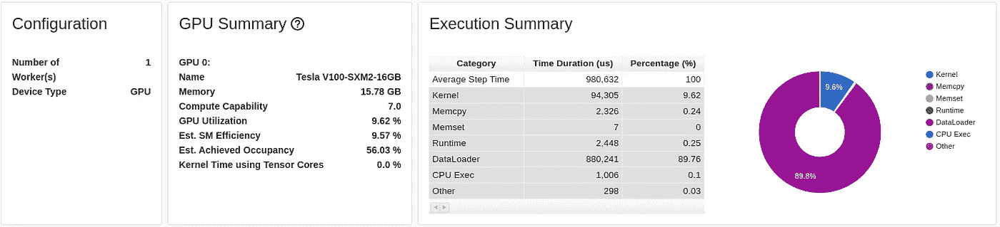
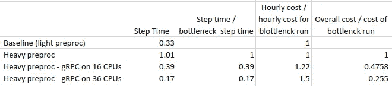
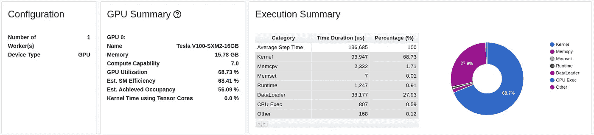

# 用 gRPC 克服 ML 数据预处理瓶颈

> 原文：<https://towardsdatascience.com/overcoming-ml-data-preprocessing-bottlenecks-with-grpc-ca30fdc01bee>

## 提高资源利用率和加速培训的简单解决方案


安德斯·诺贝克·博恩霍尔姆在 [Unsplash](https://unsplash.com?utm_source=medium&utm_medium=referral) 拍摄的照片

深度学习项目的健康程度的一个衡量标准是它利用分配给它的训练资源的程度。无论您是在云中还是在您自己的私有基础架构上进行培训，培训资源都是要花钱的，任何一段时间的闲置都代表着增加培训吞吐量和整体生产力的潜在机会。对于培训加速器来说尤其如此——通常是最昂贵的培训资源——无论是 GPU、谷歌 TPU 还是哈瓦那高迪。

这篇博客是上一篇主题为[克服数据预处理瓶颈](/overcoming-data-preprocessing-bottlenecks-with-tensorflow-data-service-nvidia-dali-and-other-d6321917f851)的文章的续篇，在这篇文章中，我们解决了一个不希望出现的场景，在这个场景中，您的训练加速器(此后假设为 GPU)发现自己处于空闲状态，同时等待来自任务过重的 CPU 的数据输入。这篇文章介绍了解决这种瓶颈的几种不同方法，并通过一个玩具示例展示了它们，同时强调最佳选择在很大程度上取决于手头的模型和项目的具体情况。讨论的一些解决方案有:

1.  选择 CPU 与 GPU 计算比率更适合您的工作负载的训练实例，
2.  通过将一些 CPU 操作转移到 GPU 来改善 CPU 和 GPU 之间的工作负载平衡，以及
3.  将一些 CPU 计算卸载到辅助 CPU 工作设备。

第三个选项是使用 [TensorFlow 数据服务 API](https://www.tensorflow.org/api_docs/python/tf/data/experimental/service)演示的，只需一行代码，您就可以对部分预处理管道进行编程，使其在一个或多个预配置的远程设备上运行。我们展示了如何通过将 tf.data 服务应用于我们的玩具示例，我们能够完全消除 CPU 瓶颈并最大化 GPU 利用率。听起来很棒，对吧？遗憾的是，这一引人注目的解决方案有两个明显的局限性:

1.  它仅限于张量流框架，并且
2.  即使在 TensorFlow 框架内，tf.data 服务也仅限于仅使用本机 TensorFlow 操作编程的管道。这可能是一个限制性的约束，因为许多预处理管线需要没有内置张量流等价物的操作。

本文的目标是展示一种更通用的方法，使用 gRPC 将预处理卸载到辅助设备，gRPC 是 TensorFlow 数据服务的基础协议。

尽管本文中的例子将基于 PyTorch 1.10 和 Amazon EC2，但是我们将描述的技术也可以应用于其他培训框架和基础设施。请记住，当你读到这篇文章时，我们使用的一些库可能已经发生了变化，可能需要对我们共享的代码样本进行一些调整。

# 运行中的 CPU 瓶颈

作为一个玩具示例，我们将使用下面的 PyTorch 模型，它大致基于[这个 MNIST 官方示例](https://github.com/pytorch/examples/tree/main/mnist)。

```
import torch
import torch.nn as nn
import torch.nn.functional as F
import torch.optim as optim
from torchvision import datasets, transforms
import timeclass Net(nn.Module):
    def __init__(self):
        super(Net, self).__init__()
        self.conv1 = nn.Conv2d(1, 32, 3, 1)
        self.conv2 = nn.Conv2d(32, 64, 3, 1)
        self.dropout1 = nn.Dropout(0.25)
        self.dropout2 = nn.Dropout(0.5)
        self.fc1 = nn.Linear(9216, 128)
        self.fc2 = nn.Linear(128, 10) def forward(self, x):
        x = self.conv1(x)
        x = F.relu(x)
        x = self.conv2(x)
        x = F.relu(x)
        x = F.max_pool2d(x, 2)
        x = self.dropout1(x)
        x = torch.flatten(x, 1)
        x = self.fc1(x)
        x = F.relu(x)
        x = self.fc2(x)
        output = F.log_softmax(x, dim=1)
        return output**class MyMNIST(datasets.MNIST):
    '''
    A personalized extension of the MNIST class in which we
    modify the __len__ operation to return the maximum value
    of int32 so that we do not run out of data. 
    '''
    def __len__(self) -> int:
        import numpy as np
        return np.iinfo(np.int32).max** **def __getitem__(self, index: int):
        return super(MyMNIST,self).__getitem__(index%len(self.data))**def main():
    from torch.profiler import profile, schedule, \
        ProfilerActivity, tensorboard_trace_handler
    profiler = profile(activities=[ProfilerActivity.CPU,  
                                   ProfilerActivity.CUDA],
                       schedule=schedule(wait=120, warmup=5,
                                         active=20, repeat=0),
                       on_trace_ready=tensorboard_trace_handler(
                                 dir_name='profile'),
                       profile_memory=True) use_cuda = torch.cuda.is_available()
    device = torch.device("cuda" if use_cuda else "cpu")
    train_kwargs = {'batch_size': 8192,
                    'num_workers': 8,
                    'pin_memory': True
                   }
    transform=transforms.Compose([
        transforms.ToTensor(),
        transforms.Normalize((0.1307,), (0.3081,))
        ])
    dataset = **MyMNIST**('/tmp/data', train=True, download=True,
                   transform=transform)
    train_loader = torch.utils.data.DataLoader(dataset,
                                               **train_kwargs)
    model = Net().to(device)
    optimizer = optim.Adadelta(model.parameters())
    model.train()
    t = time.perf_counter() for idx, (data, target) in enumerate(train_loader, start=1):
        data, target = data.to(device), target.to(device)
        optimizer.zero_grad()
        output = model(data)
        loss = F.nll_loss(output, target)
        loss.backward()
        optimizer.step()
        profiler.step()
        if idx % 100 == 0:
            print(
             f'{idx}: avg step time: {(time.perf_counter()-t)/idx}')if __name__ == '__main__':
    main()
```

我们在以下部分的目标是比较不同场景下的*培训吞吐量*。我们将*而不是*关心模型是否收敛。作为对*训练吞吐量*的度量，我们将使用每秒输入模型的样本的平均数量。因为我们的目标是最大化吞吐量，所以我们增加批量大小，直到*步进时间/批量大小*的值达到最小值或者耗尽内存。我们进一步覆盖内置的 PyTorch *MNIST* 数据集，这样我们就不会用完数据样本。

当在一个 [Amazon EC2 p3.2xlarge](https://aws.amazon.com/ec2/instance-types/p3/) 实例上运行上述脚本时(使用[深度学习 AMI (Ubuntu 18.04)版本 60.1](https://aws.amazon.com/machine-learning/amis/) 和内置 pytorch_p38 conda 环境)，我们记录的平均步进时间为 0.33 秒，或平均每秒约 2.6 万个样本的吞吐量。

作为常见深度学习训练作业的典型，模型训练(包括正向传递和梯度计算)在 GPU 上计算，而训练数据在传递到 GPU 之前在 CPU 核心上加载和预处理。在我们希望研究的用例中，预处理流水线无法跟上 GPU 的速度。因此，在等待来自 CPU 的数据输入时，GPU 将间歇地空闲。我们通过向预处理流水线添加相对较重的模糊操作来演示这一现象。

```
transform=transforms.Compose([
    transforms.ToTensor(),
    transforms.Normalize((0.1307,), (0.3081,)),
    **transforms.GaussianBlur(11)**
    ])
```

当我们使用上面的更改重新运行脚本时，步长时间跳到 1.01 秒，吞吐量下降到大约每秒 8000 个样本。我们强调，在 GPU 上运行的训练图没有任何变化；训练速度的显著降低是 CPU 上运行的计算繁重的预处理流水线的结果。

在上面的训练循环中，我们启用了内置的 [PyTorch 分析器](https://pytorch.org/tutorials/recipes/recipes/profiler_recipe.html)。在我们的输入瓶颈的情况下，可以在 [TensorBoard](https://pytorch.org/tutorials/intermediate/tensorboard_profiler_tutorial.html) 中查看收集的概要。



TensorBoard Profiler 报告(按作者)

分析报告显示，GPU 利用率低于 10%，近 90%的训练步骤时间集中在加载和处理训练数据上。

应该注意的是，进一步的分析表明，即使在基线运行中，如果没有大量的模糊操作，也会出现数据输入瓶颈，尽管不太严重。稍后，当我们能够演示低至 0.17 秒的步进时间时，我们将看到这方面的证据。

克服数据输入流水线中瓶颈的方法之一是将一部分数据预处理工作卸载给一个或多个辅助 CPU 设备。在下一节中，我们将探索如何使用 [gRPC](https://grpc.io/docs/what-is-grpc/introduction/) 协议来实现这一点。

# 使用 gRPC 卸载数据处理

在[远程过程调用](https://en.wikipedia.org/wiki/Remote_procedure_call) (RPC)系统中，客户端-服务器接口由服务器定义，服务器实现客户端可以远程调用的指定方法。在下文中，我们将定义一个专用的 gRPC 服务，用于使用[协议缓冲区](https://developers.google.com/protocol-buffers/docs/overview)提取已处理的训练批次。服务器和客户端将在本入门教程之后用 Python 实现。

## GRPC 接口

我们创建一个名为 *data_feed.proto* 的 protobuf 文件，它用一个 *get_samples* 方法定义了一个 *DataFeed* 服务:

```
syntax = "proto3";service DataFeed {
    rpc get_samples(Config) returns (stream Sample) {}
}message Config {
}message Sample {
   bytes image = 1;
   bytes label = 2;
}
```

该方法被定义为返回类型为*的样本*的流，其中每个样本代表一个由 *batch_size* 图像及其关联标签组成的训练批次。

如[教程](https://grpc.io/docs/languages/python/basics/)中所述，下面的命令将生成相应的 gRPC Python 文件， *data_feed_pb2.py* 和 *data_feed_pb2_grpc.py* ，我们将使用它们来实现服务器和客户端。

```
python -m grpc_tools.protoc -I<protos folder> --python_out=<out_path> --grpc_python_out=<out_path> <path to proto file>
```

## GRPC 服务器

下一步是实现我们的数据馈送 gRPC 服务器。

```
import multiprocessing as mp
from concurrent import futures
import grpc
**import data_feed_pb2
import data_feed_pb2_grpc** import torch
from torchvision import datasets, transforms
import numpy as np**# The following class implements the data feeding servie
class DataFeedService(data_feed_pb2_grpc.DataFeedServicer):
    def __init__(self, q):
        '''
        param q: A shared queue containing data batches
        '''
        self.q = q
    def get_samples(self, request, context):
        while True:
            sample = self.q.get()
            yield data_feed_pb2.Sample(image=sample[0], 
                                       label=sample[1])****# The data loading and preprocessing logic.
# We chose to keep the existing logic unchanged, just instead
# of feeding the model, the dataloader feeds a shared queue**class MyMNIST(datasets.MNIST):
    def __len__(self) -> int:
        return np.iinfo(np.int32).max def __getitem__(self, index: int):
        return super(MyMNIST,self).__getitem__(index%len(self.data))**def fill_queue(q,kill):
**    **train_kwargs = {'batch_size': 8192, 'num_workers': 16}**
    transform=transforms.Compose([
            transforms.ToTensor(),
            transforms.Normalize((0.1307,), (0.3081,)),
            transforms.GaussianBlur(11)
            ])
    dataset = MyMNIST('/tmp/data', train=True,
                           transform=transform, download=True)
    loader = torch.utils.data.DataLoader(dataset, **train_kwargs)
    for batch_idx, (data, target) in enumerate(loader):
        added = False
        while not added and not kill.is_set():
            try:
 **# convert the data to bytestrings and add to queue**               
 **q.put((data.numpy().tobytes(),
                       target.type(torch.int8).numpy().tobytes()),
                       timeout=1)**                added = True
            except:
                continuedef serve():
 **'''
    Initialize the data batch queue and start up the service.
    '''** q = mp.Queue(**maxsize=32**)
    kill = mp.Event() # an mp.Event for graceful shutdown
    p = mp.Process(target=fill_queue, args=(q,kill))
    p.start()
 **server = grpc.server(futures.ThreadPoolExecutor(max_workers=8))
    data_feed_pb2_grpc.add_DataFeedServicer_to_server(
        DataFeedService(q), server)
    server.add_insecure_port('[::]:50051')
    server.start()
    server.wait_for_termination()**    kill.set()
    p.join()if __name__ == '__main__':
    serve()
```

正如代码文档中所描述的，我们选择了一个保持数据加载逻辑完整的实现，并且数据批次被输入到一个共享队列中。 *DataFeedService* 的 *get_samples* 函数从同一队列中取出批次，并以连续数据流的形式发送给客户端。

该脚本包括一些常量值，应该根据基于 gRPC 的解决方案的部署方式进行调整(或自动配置):

*   gRPC 服务器的 *ThreadPoolExecutor* 的 *max_workers* 设置应该根据您想要创建的 gRPC 客户端的数量进行配置。因为我们计划为培训设备上的每个 CPU 内核创建一个客户端，并且我们的 ec2p 3.2 x 大型实例有 8 个 vcpu，所以我们将其设置为 8。
*   输入到数据加载器的 *train_kwargs* 结构的 *num_workers* 设置应该配置为我们的服务器实例上的 vCPUs 数量。我们打算使用的实例是由 16 个 vCPUs 组成的 [EC2 c5.4xlarge](https://aws.amazon.com/ec2/instance-types/c5/) ，我们已经相应地设置了 *num_workers* 。
*   对于共享队列的 *maxsize* 值，我们简单地选择了两倍于 *num_workers* 的值。

我们应该强调，实现数据馈送服务器有许多不同的方式。我们在这里展示的实现对于像我们的玩具问题这样的用例来说不一定是最佳的。以下是更多相关信息。

## GRPC 客户

最后，我们修改我们的训练脚本，以便使用来自 gRPC 服务器的经过处理的训练数据。下面的块包括修改:

```
**class RemoteDataset(torch.utils.data.IterableDataset):
    '''
    An iterable PyTorch dataset that opens a connection to the
    gRPC server and reads from a stream of data batches 
    '''
    def __iter__(self):
        import grpc
        import data_feed_pb2_grpc
        import data_feed_pb2
        import numpy as np
        host = '<ip of host>'
        channel = grpc.insecure_channel(f'{host}:50051',
                    # overwrite the default max message length
                    options=[('grpc.max_receive_message_length',
                               200 * 1024 * 1024)])
        stub = data_feed_pb2_grpc.DataFeedStub(channel)
        samples = stub.get_samples(data_feed_pb2.Config())
        for s in samples:
            image = torch.tensor(np.frombuffer(s.image, 
                              dtype=np.float32)).reshape(
                                       [8192, 1, 28, 28])
            label = torch.tensor(np.frombuffer(s.label, 
                              dtype=np.int8)).reshape(
                                       [8192]).type(torch.int64)
            yield image, label**def main():
    device = torch.device("cuda")
    train_kwargs = {**'batch_size': None, #the data is already batched**
                    **'num_workers': 8,**
                    'pin_memory': True
                   }
    **dataset = RemoteDataset()** train_loader = torch.utils.data.DataLoader(dataset,
                                               **train_kwargs)
    model = Net().to(device)
    optimizer = optim.Adadelta(model.parameters())
    model.train()
    t = time.perf_counter() for idx, (data, target) in enumerate(train_loader, start=1):
        data, target = data.to(device), target.to(device)
        optimizer.zero_grad()
        output = model(data)
        loss = F.nll_loss(output, target)
        loss.backward()
        optimizer.step()
        profiler.step()
        if idx % 100 == 0:
            print(
             f'{idx}: avg step time: {(time.perf_counter()-t)/idx}')
if __name__ == '__main__':
    main()
```

我们已经定义了一个可迭代的 PyTorch 数据集， *RemoteDataset* ，它打开一个到 gRPC 服务器的连接，并从一个数据批次流中读取数据。 *DataLoader* workers 的数量设置为 8，即训练实例上 vCPUs 的数量。因此，总共将创建 8 个 gRPC 客户端。

我们再次强调，选择 gRPC 客户端实现主要是因为它的简单性，并且很可能存在更优的实现。

## 结果

是时候衡量我们的 gRPC 解决方案在多大程度上成功缓解了我们的 CPU 瓶颈了。下表总结了我们在 EC2 c5.4xlarge 和 EC2.9xlarge 实例上运行数据服务器时获得的吞吐量结果。对于 EC2.9xlarge 实验，我们更新了常量参数以反映 36 个 vCPUs 的存在。



实验结果(作者)

使用 16 位 vCPU 工作人员使我们的培训速度提高了约 60%,使用 36 位 vCPU 工作人员提高了 80%以上。考虑到 EC2 实例的[小时成本(在撰写本文时，p3.2xlarge 的成本为 3.06 美元，c5.4xlarge 的成本为 0.68 美元，c5.9xlarge 的成本为 1.53 美元)，我们发现将数据处理卸载到 16 个 vCPU 工作线程可以节省超过 50%的成本，36 个 vCPU 工作线程可以节省大约 75%的成本。我们应该注意，我们的成本计算没有考虑到加速开发时间的潜在收益(例如，为其他任务释放人力和计算资源)。](https://aws.amazon.com/ec2/pricing/on-demand/)

我们应该注意到，c5.9xlarge 实验产生了比基线实验更低的步进时间。这表明，即使是基线实验也没有最大限度地利用 GPU，并且它也遇到了数据输入管道上的瓶颈。

下面的 TensorBoard 截图总结了 c5.9xlarge 案例的培训表现:



TensorBoard Profiler 报告(按作者)

虽然瓶颈的严重程度已经显著降低，但很明显仍有进一步优化的空间，因为 GPU 仍有大约 30%的空闲时间。

## 实施说明

我们用一些关于基于 gRPC 的解决方案和我们已经演示的具体实现的一般说明来结束这一部分。

**探索所有选项**:虽然以我们所描述的方式根除 CPU 瓶颈的想法可能非常有说服力，但我们建议您在采用基于 gRPC 的解决方案之前考虑其他替代方案。您可能会发现，在没有太大困难的情况下，您可以优化您的数据处理以更有效地利用 CPU，或者不同类型的训练实例包含更适合您的工作负载的 CPU 计算与 GPU 计算的比率。

**优化负载平衡**:在我们展示的解决方案中，我们选择将整个预处理管道卸载到 gRPC 服务器。但是，这可能会导致训练实例上的 CPU 核心利用率严重不足。更有效的解决方案是使用保持 GPU 完全活动所需的最少数量的总 CPU，并平衡训练实例上的 CPU 和辅助 CPU 之间的负载，使它们都得到充分利用。这可以通过在 gRPC 服务器上运行预处理流水线的开始部分并将部分处理的数据发送到训练实例以完成流水线来实现。

**小心网络 IO 瓶颈**:需要注意的一件事是从服务器传递到客户端的数据量。否则，我们最终可能会用网络瓶颈取代 CPU 瓶颈。网络 IO 带宽限制由服务器和客户端实例的属性决定。为了减少带宽，可以考虑利用 gRPC 协议中内置的[压缩支持](https://github.com/grpc/grpc/blob/master/src/python/grpcio_tests/tests/unit/_compression_test.py)。

**扩展到多 GPU** :虽然我们提出的解决方案可以扩展到支持多 GPU——数据分布式设置，没有太大的困难，但如何做到这一点的细节可能会有所不同。根据您的项目，您可以选择单个 gRPC 服务器实例和为所有 GPU 核心提供服务的单个服务、单个实例上的多个服务、多个服务器实例或其他组合。

**Python GRPC 的多重处理问题**:要知道 GRPC 的 Python 实现在处理分叉时有局限性。这可能会干扰 PyTorch 数据加载器，py torch 数据加载器依赖多处理来支持多工作。gRPC 服务器和客户机的任何实现都需要协商这种潜在的冲突。参见[此处](https://github.com/grpc/grpc/blob/master/doc/fork_support.md)了解更多关于此限制的详细信息。

**与**[**tf.data service**](https://www.tensorflow.org/api_docs/python/tf/data/experimental/service)的对比:与我们提出的解决方案类似，TF . data service 也依赖于 gRPC 协议。然而，与我们的解决方案相反，它是基于 C++ gRPC 的，具有更少的限制，可能更优。此外，tf.data 服务对用户隐藏了 gRPC 实现的许多细节，在某种程度上，将操作卸载到数据服务被简化为仅向输入管道添加一行代码。这使得找到管道中执行卸载的最佳点变得特别容易。相比之下，我们的解决方案需要更多的努力。如果您的工作负载与 tf.data 服务兼容，很可能会带来更好的性能，并且可能是更好的选择。然而，正如我们已经提到的，在撰写本文时，tf.data 服务仅限于只包含本机 TensorFlow 操作的管道。我们描述的基于 gRPC 的解决方案要灵活得多——它不仅在构建输入管道时提供了更大的自由度，而且还允许对如何在 CPU 工作者之间分配任务进行更大的控制。

# 摘要

过去几年人工智能的进步，部分归功于强大的训练加速器的可用性。我们认为，作为开发者，我们有责任关注我们如何使用这种专门的机器，以便最大限度地提高效率，增加成本节约，并减少碳排放。本文重点介绍了我们可以用来提高资源利用率的一个选项——将数据预处理卸载到一个或多个辅助 CPU 实例。

像往常一样，请随时提出意见、问题和纠正。