# 深度学习中的过度拟合

> 原文：<https://towardsdatascience.com/overfitting-in-deep-learning-what-is-it-and-how-to-combat-it-9760d25ad05b>

## 关于过度拟合问题和预防方法的简单指南。

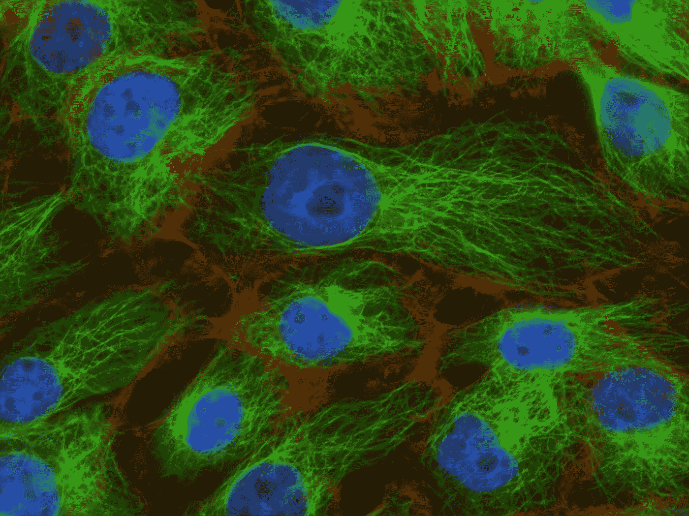

[国家癌症研究所](https://unsplash.com/@nci?utm_source=medium&utm_medium=referral)在 [Unsplash](https://unsplash.com?utm_source=medium&utm_medium=referral) 上拍摄的照片

# 介绍

深度学习最近的成功是基于拥有数百万参数和大数据的巨大网络。这个简单的配方在许多领域，如图像分类或自然语言处理，给行业带来了革命性的变化。事实证明，这是一把双刃剑。太多的参数可能会导致过度拟合和对看不见的数据泛化能力差。因此，为什么在这篇文章中，我们将仔细看看这个问题，以及我们如何才能防止它。

# **什么是过度拟合？**

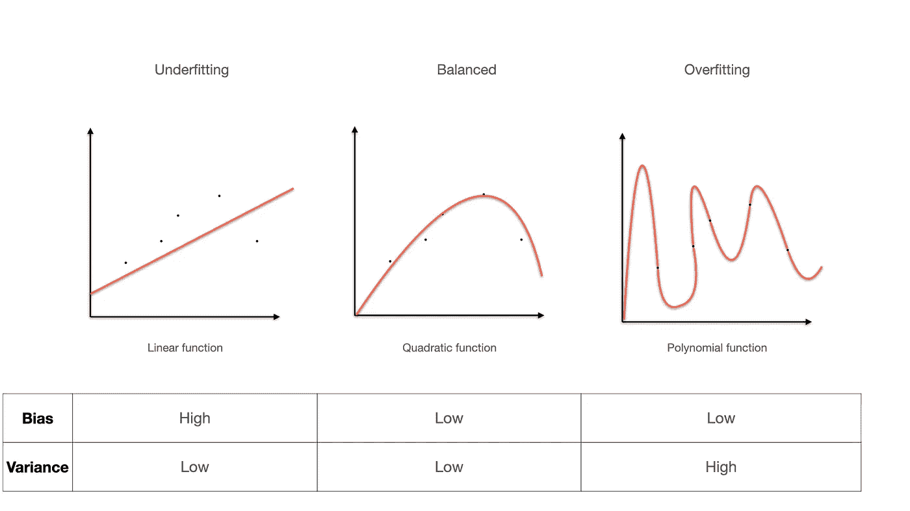

图一。图片作者。

当网络具有太多参数并且夸大了数据中的潜在模式时，会发生过度拟合。尽管该模型完全符合数据点，但它不能很好地概括看不见的数据。

另一方面，线性函数产生了过于简化的假设，导致**对数据集**的拟合不足。

二次方程最适合我们的数据点。它捕捉点的一般形状，从而在测试集上产生良好的泛化。

描述模型性能的常用方法是使用偏差和方差项。**偏差**代表输出和目标之间的距离，**方差**定义结果的分布。

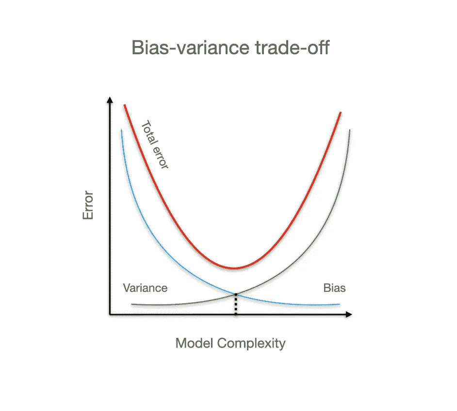

图二。图片作者。

使用上面的例子，很明显欠拟合和过拟合取决于网络的容量。在这些统计玩具示例中，模型复杂性和性能之间的最佳平衡点相对容易建立，而深度学习则不是这样。

在下一部分，我们将戴上深度学习的帽子，看看如何在大型网络中发现这些问题。

# 深度学习方法

到目前为止，我所描述的是一种老式的机器学习方法，目标是找到模型复杂性和性能之间的最佳平衡点。

当深度学习出现时，这种范式发生了转变。事实证明，当模型处于**过度拟合状态**时，性能会更好。在这种情况下，我们需要应用强大的**规则**并在训练期间监控模型的行为。

为了检查模型的性能，我们需要首先将数据分成 3 个子集:

*   训练集-模型训练所依据的数据(65–98)%
*   验证集-帮助评估模型在训练期间的性能(1–10)%
*   测试集—帮助评估模型在训练后的性能(1–25)%

分割比例取决于数据集的大小。例如，ImageNet 包含 1000 个类和 120 万个图像。当我们以 98:1:1 的方式分割它们时，我们仍然有 24 万个未见过的测试示例。这应该足以正确评估性能。

就较小的数据集而言，最好保留较大块的不可见数据，以确保模型性能良好。此外，记住每个集合中的类的数量要平衡，这样评估就涵盖了所有的例子。

## 性能图

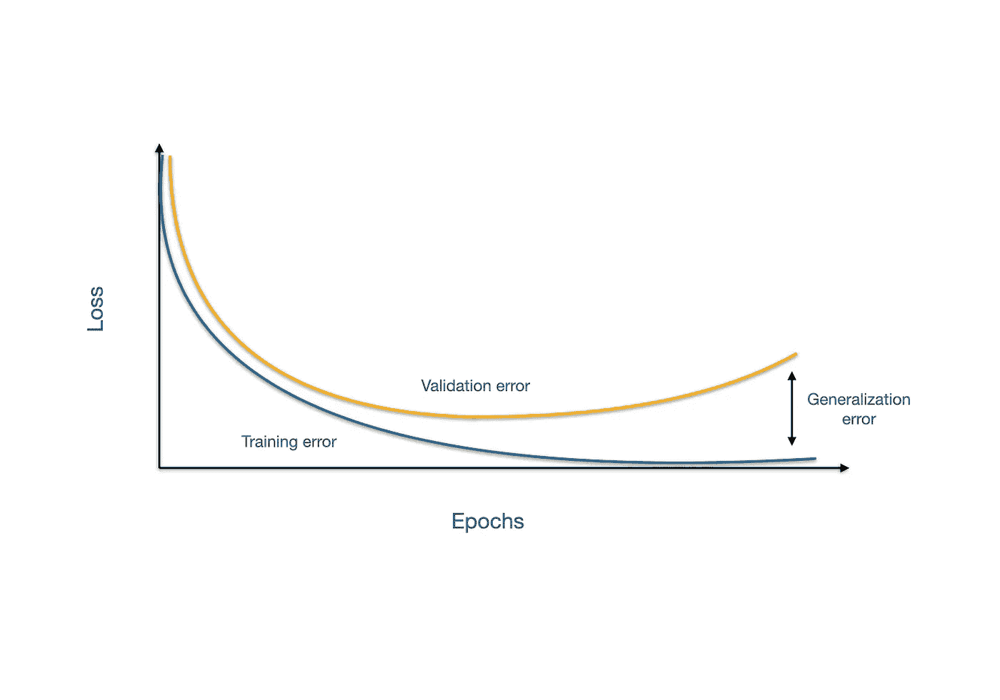

图 3。图片作者。

泛化误差是训练误差和验证误差之间的差异。我们模型的最终目标是**同时最小化训练和泛化错误**。当泛化差距增大时，会发生过度拟合。

监控两条曲线有助于发现任何问题，然后采取措施防止问题发生。在下一节中，我们将介绍用于对抗过度拟合的最流行的正则化技术。

# **正规化**

> *正则化是我们对学习算法进行的任何修改，旨在减少其泛化误差，而不是训练误差。*<https://www.deeplearningbook.org/contents/regularization.html>

## ***重量衰减***

*明确地修改网络的复杂性不是一个容易的过程。幸运的是，我们可以通过惩罚大的权重来控制参数的大小。*

*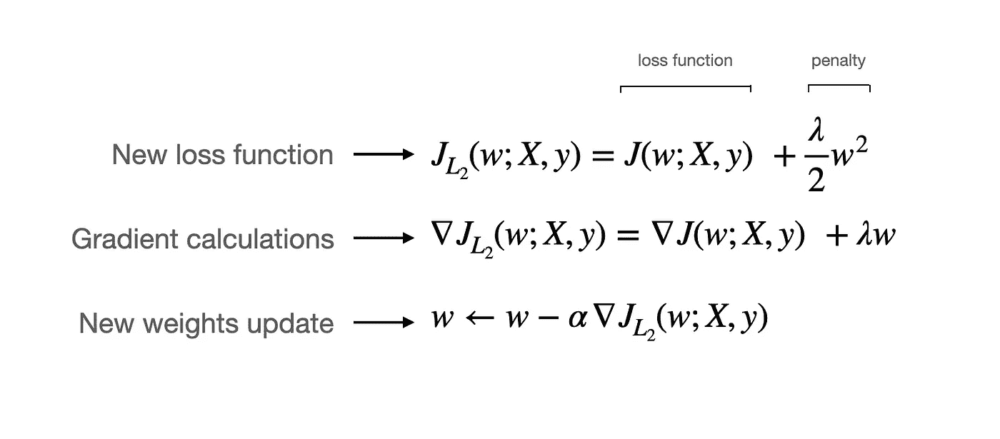*

*图 4。图片作者。*

*这个简单的过程是基于在损失函数中加入惩罚项。现在，新模型的目标是最小化训练误差，并使权重更小。*

*L2 项是参数的平方和(点积),它严重影响了异常值。因此，权重分布更加均匀(图 5)。*

*`lambda`参数定义了模型对重量的敏感度。该值越大，权重变化受到的惩罚就越小(图 5)。在学术论文中，初始值通常被设置为`0.0005`。*

*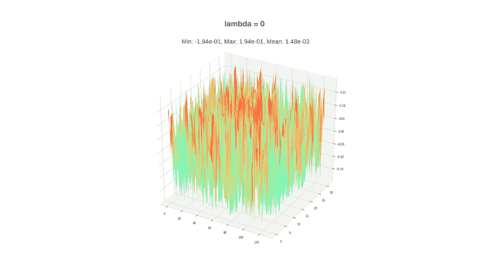*

*图 5。图片作者。多亏了 Piotr 的 Skalski 可视化技术。*

## ***辍学***

*此技术在图层上应用随机采样零值的遮罩。该方案在模型中创建了多个子网组合(图 6)。*

**

*图 6。图片作者。*

*如你所见，单个节点不能再依赖来自其他神经元的信息。它迫使每个节点学习如何自己提取特征。当每个神经元变得更加自治时，整个网络就可以更好地泛化。*

## *更多数据*

*扩大数据集是使网络更加稳定的最简单方法。模型接触到更多的例子，可以更好的泛化。尽管如此，在大多数情况下，现实生活中的样本数量是有限的。*数据扩充*基于添加已有数据的略微修改的副本。*

*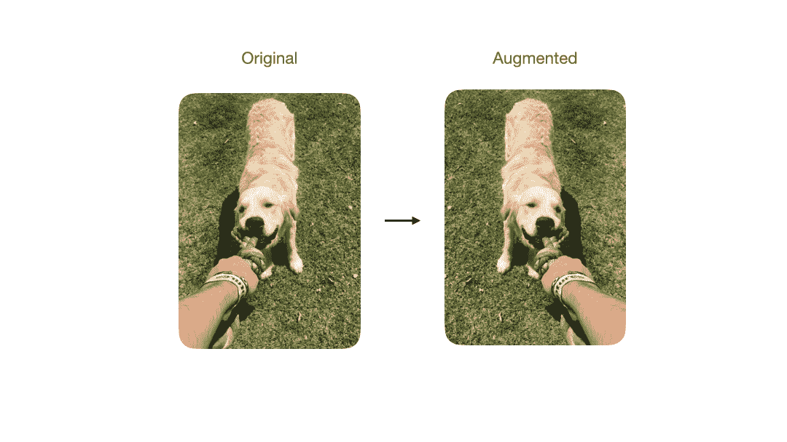*

*图 7。图片作者。*

*这个方案是许多计算机视觉和 NLP 任务的核心部分。我已经在我的[上一篇文章](/data-augmentations-in-torchvision-5d56d70c372e)中深入讨论了这个话题，所以我强烈推荐你去看看。*

## ***随机深度***

*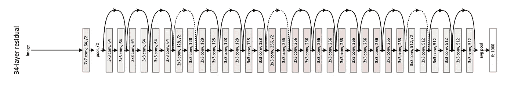*

*图 8。图片来自[用于图像识别的深度残差学习。](https://arxiv.org/abs/1512.03385)*

*这种方法仅适用于计算机视觉架构。2015 年，ResNet 论文介绍了剩余连接，它允许我们堆叠越来越多的层🍰相互叠加**无信息丢失** *(* 图 8 *)* 。将多个卷积组合成一个块成为了计算机视觉任务中的一个新范例(图 9)。我们获得了构建任意深度网络的能力，但过度拟合的主要问题仍然是一个障碍。随机深度通过随机丢弃块来解决这个问题。*

*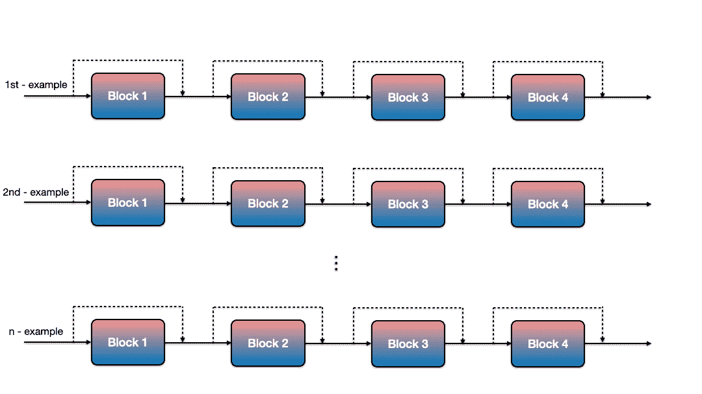*

*图 9。图片作者。*

*SD 使网络更短而不是更薄。丢弃随机输出会给每个模块带来更多的自主权。除了正则化能力，与原始配置相比，它减少了 25%的训练时间。*

*SD 仅在训练期间使用。在干涉期间，模型使用所有块。*

## ***标签平滑***

*在分类任务中，我们的模型正在优化权重以映射期望的独热编码概率分布`[0, 0, 1]`。实际上，网络不能精确地预测值 0 或 1，所以它开始*无休止的劳动*产生越来越大的权重以得到想要的结果。这个过程被称为*过度自信。这是过度合身的一个很好的指标。**

*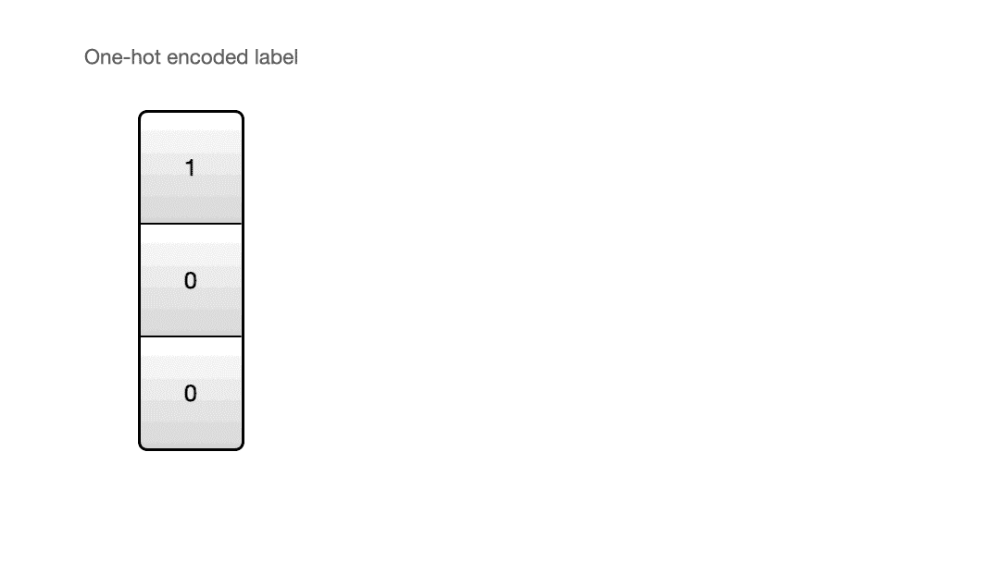*

***K** —例数。图 10。图片作者。*

*给标签添加噪声会阻止网络搜索理想的分布。参数`alpha`控制噪音量。通常，`0.1`值是一个很好的起点。*

## *批量标准化*

*BN 的主要目的是加速收敛并减少网络中的不稳定性。这个附加层位于卷积层之后，以优化输出分布(图 11)。除了计算上的提升，BN 也可以作为一种正则化技术。*

*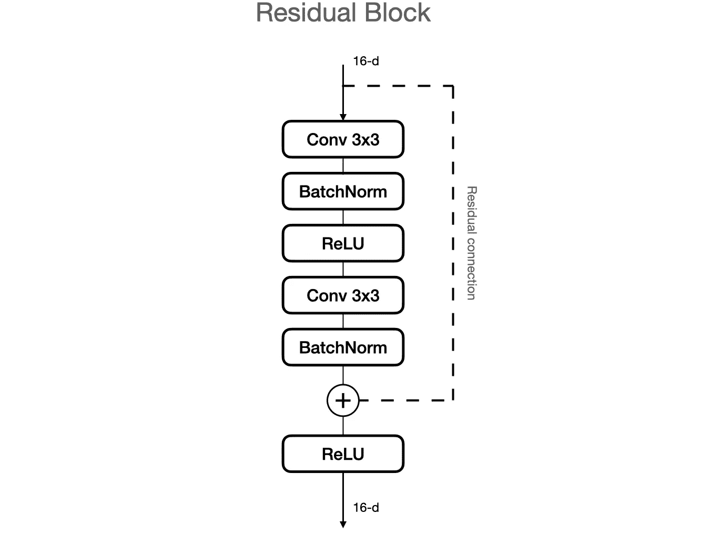*

*图 11。图片作者。*

*数据集统计数据的近似值会给网络增加一些噪声。请记住，这些估计仅适用于较大的批次，对于较小的批次，性能会急剧下降。*

## *提前停止*

*我们之前讨论过，监控损失函数有助于发现网络中的问题。手动照看模型是一项单调乏味的任务，可以自动完成。每当泛化差距增大时，提前停止算法就终止训练。*

*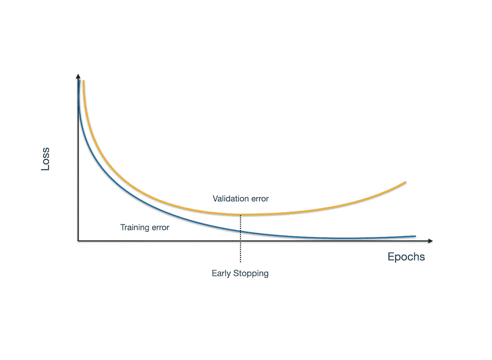*

*图 12。图片作者。*

*在这种情况下，离开模型进行通宵训练，早上回来，并加载重量是安全的。有许多方法可以选择保存检查点，但最安全的选择是在每次错误比前一个时期更好时进行选择。*

## *学习率计划*

*在模型开始过度拟合之前，验证损失达到平稳阶段(图 13)。与其停模型，不如降低学习率，让它训练更久。*

*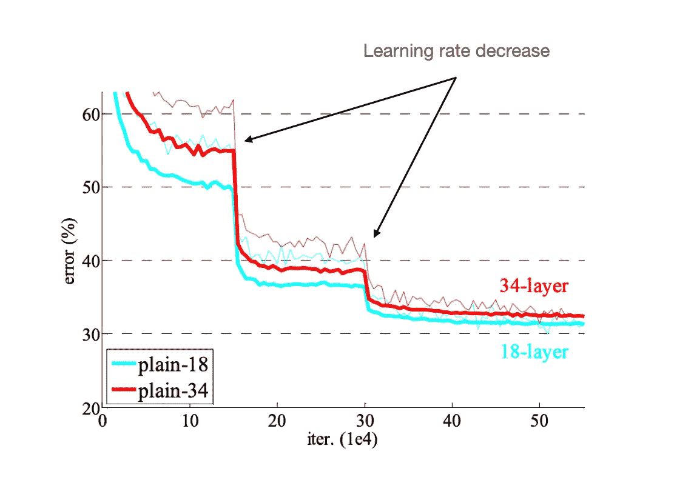*

*图 13。图片来自[用于图像识别的深度残差学习。](https://arxiv.org/abs/1512.03385)*

*在这种情况下，我们可以使用更高的学习率，大大加快训练速度。要选择学习率下降的触发因素，最好先观察模型的行为。*

# ***结论***

*祝贺你成功到达终点！在这篇文章中，我解释了过度拟合现象及其从网络的不想要的属性到深度学习的核心组件的进展。我还会给你大量的正规化工具，帮助你成功地训练你的模型。欢迎在评论中提问。*

*查看我的 [**中**](https://maciejbalawejder.medium.com/) 和[**Github**](https://github.com/maciejbalawejder)**简介如果你想看我的其他项目。***