# 机器学习算法概述:回归

> 原文：<https://towardsdatascience.com/overview-of-machine-learning-algorithms-regression-e0f5510e84c>

## *最基本的机器学习算法之一概述:回归算法*

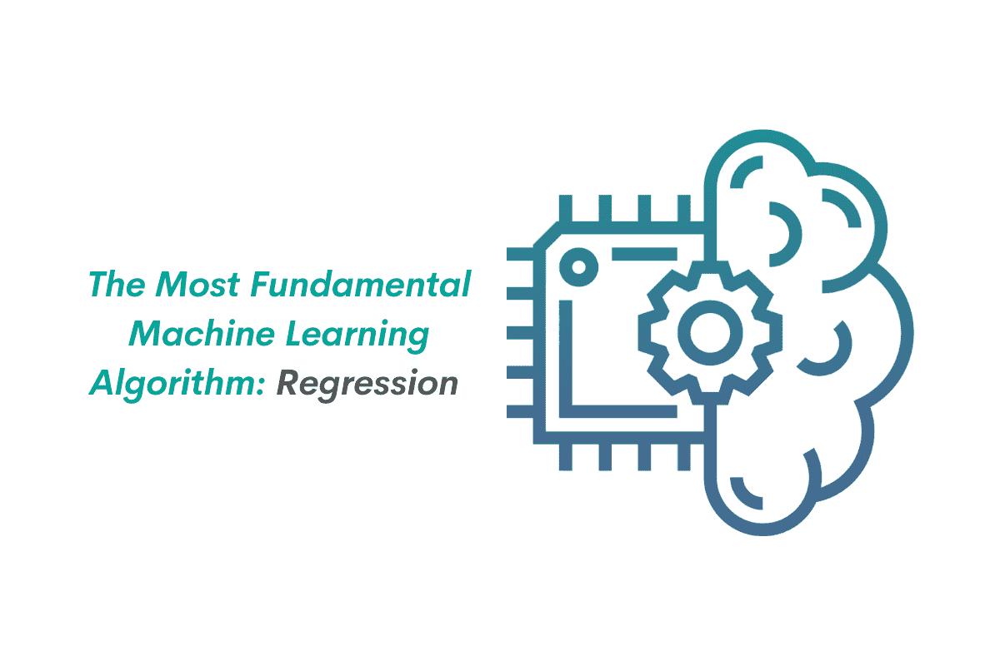

作者在 [Canva](https://canva.com/) 上创建的图片

回归算法是最基本的机器学习算法之一。不管我们是否注意到，我们在生活的某个阶段都会遇到回归问题。你想坐出租车去机场吗？你给自己找了个回归问题。你想买新房子吗？你又有回归问题了。

回归是一种监督学习，我们在训练过程中为算法提供每个数据的真实值。之后，我们可以使用训练好的模型来预测一个数值，无论是你买新房子应该支付的价格，人们的体重和身高，出生率等。

有几种常见的回归模型，我们将在本文中逐一介绍。具体来说，下面是您将在本文中学到的内容的概要:

*   线性回归
*   回归度量和成本函数
*   正规方程
*   线性回归的梯度下降
*   多项式回归
*   偏差-方差权衡
*   正则化线性模型(岭回归、套索回归、弹性网)
*   支持向量回归
*   决策树回归

所以事不宜迟，让我们从最简单的模型开始，线性回归。

# 用于回归问题的常见机器学习算法综述

## 1.线性回归

顾名思义，线性回归试图捕捉预测值(一组输入变量)和我们想要预测的变量之间的线性关系。为了理解这个概念，让我们来看看回归问题的常见例子:

*   你想乘出租车去机场。你家离机场越远，出租车费就越贵。换句话说，出租车费用与距离成线性相关。
*   你想买一栋新房子。你想买的房子越大，你需要支付的房款就越多。换句话说，房价和房子大小线性相关。

下面是最简单形式的线性回归方程:

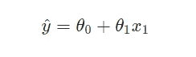

其中:

*:预测值
*:截距
***θ₁*** :第一个预测值的权重
***x₁*** :第一个预测值**

**为了使上面的等式更直观，让我们使用上面的出租车例子。假设我们想要预测我们需要花费多少钱来乘坐出租车到达机场。如果我们把这个问题代入如上的线性回归方程，那么我们有:**

*   **出租车费为预测值***【ŷ】*****
*   **你家到机场的距离作为预测值***【x₁】*****
*   **你可以把截距想象成你一上出租车就需要支付的初始价格。如果你注意到，无论你什么时候上出租车，出租车费都不会从 0 开始，而是某个价格，比如说 5 美元。这 5 美元就是截取的***【θ₀】***。**
*   **你可以把预测器的权重想象成出租车行驶的距离每增加 1 公里你需要支付的钱数***【θ₁】***。**

**现在，假设我们已经收集了与距离相关的出租车费用数据，您的数据如下所示。**

**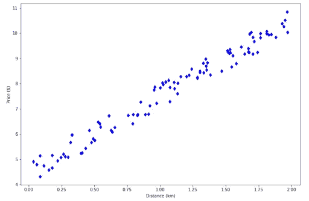**

**作者图片**

**为了预测你需要花在出租车上的钱，你需要在下面画一条红线:**

**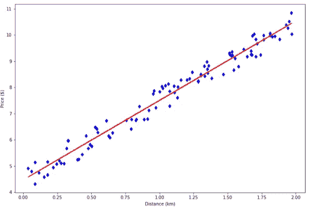**

**作者图片**

**上面的红线叫做回归线。多亏了这条回归线，现在你可以根据你的房子和机场之间的距离来估计你需要花的钱。**

**随之而来的自然问题是:我们如何得到如上的回归线？
这就是我们需要了解回归问题的不同度量和成本函数的地方。**

## **2.回归度量和成本函数**

**考虑到我们所拥有的数据点，您从上面的可视化中看到的回归线应该是给出最佳拟合的线。**

**为了得到最佳拟合的线，我们应该有一些东西来衡量。在回归问题中，我们使用指标和成本函数来衡量回归线的好坏，以捕捉数据点的模式。**

**尽管它们可能是相似的，但是度量和成本函数之间是有区别的。**

*   **指标是我们用来评估回归线性能的一个值(即模型生成的拟合线在捕捉数据模式方面有多好)。**
*   **成本函数是我们的回归模型在训练过程中试图最小化的一个值(即使用梯度下降算法)**

**就回归问题而言，我们通常对度量和成本函数使用相同的值，而在分类问题中，度量和成本函数可以不同。**

**那么，我们通常用于回归问题的这些度量和成本函数是什么呢？让我们从均方差开始。**

## **均方误差**

**均方差(MSE)是回归分析中最常用的指标。它通过测量我们的回归线预测误差的平方和来测量我们的回归线的拟合优度，如下式所示。**

**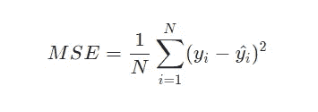**

**其中:**

****N** :数据点总数
**:每个数据点的实际值
**:回归线预测的每个数据点的值******

******从上面的等式中，我们可以看到，实际值和预测值之间的差异越大，MSE 就越大。小 MSE 意味着我们的回归线在预测数据点的价值方面做得很好，反之亦然。******

******我们需要根据上面的等式计算每个数据点的实际值和预测值之差的平方有两个原因:******

1.  ******为了确保我们有一个正的误差值******
2.  ******当误差较大时“惩罚”回归模型******

## ******均方根误差(RMSE)******

******顾名思义，均方根误差(RMSE)是 MSE 的扩展。基本上就是 MSE 的平方根，从下面的等式可以看出。******

******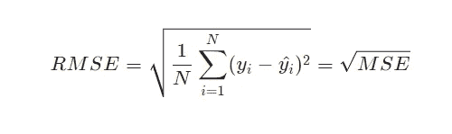******

******你可能想知道为什么我们要计算 MSE 的平方根。原因很简单:只是为了方便。它确保误差的单位与我们想要预测的值的单位相同。******

******使用上面的例子，假设我们想要预测出租车费用，我们的单位是“美元”。平方根运算确保我们的 RMSE 也是“美元”，而不是“美元的平方”。******

## ******平均绝对误差******

******平均绝对误差(MAE)也是回归问题最常见的度量之一，因为它与我们想要预测的值具有相同的单位，就像 RMSE 一样。******

******MAE 与上面另外两个度量标准的区别在于它如何累积误差。与 MSE 和 RMSE 不同，MAE 不会通过平方每个数据点的实际值和预测值之间的差异来放大预测误差。******

******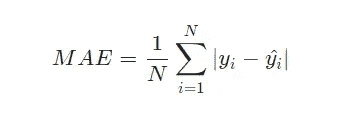******

******从上面的等式可以看出，MAE 的等式和其他两个指标没有太大的区别。它使用 abs 操作符来确保我们有一个正的误差值。******

******对于回归问题，您可以使用上面提到的三个指标中的任何一个。然而，在本文中，我们将使用 MSE 作为我们的回归指标和成本函数。******

******现在，一个自然的问题应该出现了:我们知道如何衡量我们的回归线的好，但我们如何改善它？换句话说，我们的模型如何创建最小化 MSE 值的回归线？******

******为了最小化 MSE 值，我们需要在可用数据点上训练我们的回归模型。有两种最小化 MSE 值和训练回归模型的方法:使用正态方程和使用梯度下降算法。******

******我们将涵盖这两种方法，让我们从法线方程开始。******

## ******3.正态方程******

******正规方程是封闭形式的解决方案，仅在回归问题中可用。有了这个方程，你可以在一瞬间得到一条最佳拟合的回归线。******

******计算正规方程需要线性代数知识，因为它广泛地处理矩阵乘法和矩阵求逆。法线方程的一般方程如下:******

******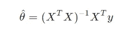******

******其中:******

*******:截距和最小化代价函数的每个预测器的权值
***X*** :预测器矩阵
***y*** :每个数据点真值的向量*******

******随着预测器数量的增加，计算将更加复杂。然而，我们可以用 Python 很容易地计算出来，如下图所示。******

```
******import numpy as np
import matplotlib.pyplot as plt
%matplotlib inline

# Generate data
np.random.seed(42)
x = 2 * np.random.rand(100,1)
y = 4 + 3 * x + np.random.rand(100,1)

x_b = np.c_[np.ones((100,1)), x] #for intercept

# Compute normal equation
theta_hat = np.linalg.inv(x_b.T.dot(x_b)).dot(x_b.T).dot(y)
print(theta_hat)

# Output: array([[4.51359766],
       [2.98323418]])******
```

******正如您在上面的代码片段中看到的，我们得到了一个有两个值的输出:一个是截距，另一个是预测器的权重。这些值是两个参数的最佳值，这样我们就可以得到最佳拟合的回归线。******

******最后，我们可以用下面的代码来可视化回归线:******

```
******# Create regression line
x_new = np.array([[0], [2]])
x_new_b = np.c_[np.ones((2,1)), x_new]
y_new = x_new_b.dot(theta_hat)

# Plot regression line
plt.figure(figsize=(12, 8))
plt.plot(x_new, y_new, 'r-')
plt.plot(x,y,'bd')
plt.xlabel('Distance (km)')
plt.ylabel('Price ($)')******
```

******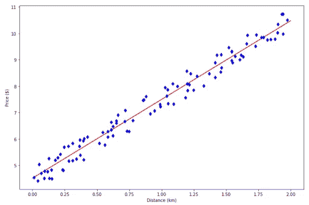******

******作者图片******

******有了上面看到的回归线，现在我们可以根据距离预测出租车费用。假设我们知道我们的房子距离机场 1.5 公里，我们可以使用此回归模型预测出租车费用如下:******

```
******x_new = np.array([[1.5]]) # Our distance
x_new_b = np.c_[np.ones((1,1)), x_new]
y_new = x_new_b.dot(theta_hat)

print(y_new)

# Output: array([[8.98844892]])******
```

******如您所见，回归模型预测，如果我们想乘出租车去机场，我们必须支付大约 9 美元。******

******使用正态方程来寻找最佳拟合的回归线有两个优点:******

*   ******实现起来非常简单******
*   ******如果我们有很多数据点(训练数据),这是非常可扩展的******

******然而，正规方程的一个缺点是，我们的预测因子越多，计算就越慢。这是因为随着预测器数量的增加，矩阵求逆操作将变得越来越复杂。******

******如果我们使用第二种方法来找到我们的回归线的最佳拟合，即使用梯度下降，这个缺点就不会出现。******

## ******4.线性回归的梯度下降******

******梯度下降是一种优化的机器学习算法，其目标是最小化成本函数，在我们的情况下是 MSE 值。******

******如果你想了解梯度下降是如何工作的，就想象你在山顶上，你想下山。快速做到这一点的最佳方法是选择最陡斜坡的方向。******

******这就是梯度下降的作用。它试图通过在每次迭代中选择下降梯度的方向来最小化成本函数，直到它收敛。如果它收敛，这意味着我们已经达到了成本函数的最低可能值。******

******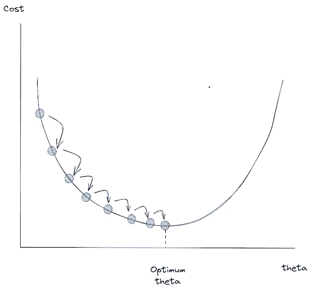******

******作者图片******

******为了实现梯度下降，我们需要在每个迭代或时期中实现两个步骤:******

1.  ******计算成本函数相对于每个预测值权重的梯度。******

******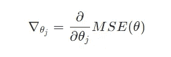******

******或者，我们可以将上面针对所有预测值的等式归纳为以下等式:******

******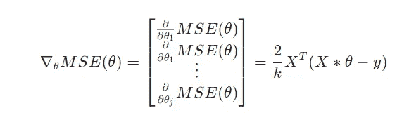******

******其中:******

*********j*** :预测值总数
***k*** :数据点总数******

******当我们稍后尝试用 Python 实现梯度下降时，上面等式右边的最后一个等式会派上用场。******

******2.通过用梯度减去预测值来更新每个预测值的权重。******

******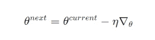******

## ******梯度下降的学习率******

******从上面的图像中，我们可以看到梯度下降算法试图通过一次一步地向梯度下降的方向移动来最小化我们的成本函数。现在我们可能会问的问题是:我们可以调整梯度下降算法在每次迭代中所采取的步长吗？******

******是的，我们可以。在这个算法中有一个超参数叫做学习率，或者上式中的 ***η*** ，我们可以在每次迭代中调整梯度下降的步骤。******

******然而，我们需要理解这种学习率调整的好处和缺点:******

*   ******如果学习率太小，那么回归模型将收敛得非常慢，并且您需要更多的训练迭代来使梯度下降达到全局最小值。******

******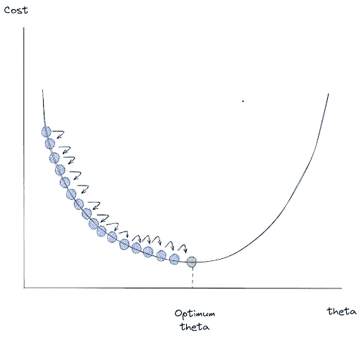******

******作者图片******

*   ******如果学习率太高，那么算法将从山谷的一边无序地跳到另一边，这是我们的结果出现分歧的主要原因。成本函数可能会变得比我们的初始值更大，我们将永远得不到最优解。******

************

******作者图片******

******现在我们知道了梯度下降是如何工作的，让我们看看我们可以使用的不同类型的梯度下降实现。******

## ******批量梯度下降******

******批量梯度下降是梯度下降机器学习算法的默认实现。
它在每次迭代中都考虑了我们所有的训练数据，以最小化我们的成本函数。******

******为了进行批量梯度下降，我们需要计算成本函数相对于每个迭代或时期中每个预测器的权重的梯度。换句话说，我们想知道如果我们稍微调整一下每个预测器的权重，成本函数会发生多大的变化。******

******下面是批量梯度下降的实现******

```
******# Set hyperparameters
lr = 0.01
epochs = 3000
train_data = len(x)

# For intercept
X_b = np.c_[np.ones((100,1)), x] 

# Initialize weight
theta = np.random.randn(2,1)

# Gradient descent over whole data
for i in range(epochs):

      # Compute the gradient of each predictor
	grad = 2 / train_data * X_b.T.dot(X_b.dot(theta)-y)

      # Update the weight of each predictor 
	theta = theta - lr*grad

print(theta)
# Output: array([[4.51354059], [2.98328456]])

# Visualize result

plt.figure(figsize=(12, 8))
plt.plot(x, theta[0][0] + x * theta[1][0], 'r-')
plt.plot(x, y,'bd')
plt.xlabel('Distance (km)')
plt.ylabel('Price ($)')****** 
```

************

******作者图片******

******最后我们得到了完美拟合的回归线！******

******然而，您可能已经猜到，实现批量梯度下降的一个缺点是速度和效率。如果您有大量的训练数据集，实现批量梯度下降可能不是最好的方法，因为它会变得更慢。因此，让我们看看其他选项。******

## ******随机梯度下降******

******顾名思义，随机梯度下降通过在每次迭代中在我们的训练数据上随机选取数据点来执行成本函数的最小化。由于我们没有使用全部的训练数据，如果我们有大量的训练数据，那么训练过程会快得多。******

******下面是随机梯度下降的实现:******

```
******epochs = 3000
lr = 0.01

theta = np.random.randn(2,1)

for i in range(epochs):

  for j in range(train_data):

    	# Choose random training data
    	idx = np.random.randint(train_data)
    	x_i = X_b[idx:idx+1]
    	y_i = y[idx:idx+1]

    	# Compute gradients based on randomly selected training data
    	grad = 2 * x_i.T.dot(x_i.dot(theta) - y_i)
    	theta = theta - lr * grad

print(theta)
# Output: array([[4.4920683 ],[2.98692425]])If you want to have a simpler implementation than the code snippet above, then you can also utilize SGDRegressor method from scikit-learn library.from sklearn.linear_model import SGDRegressor sgd = SGDRegressor(max_iter=3000, eta0=0.01) sgd.fit(x, y.ravel()) print(sgd.intercept_, sgd.coef_) # Output: [4.1762039] [3.28159362] # Visualize result plt.figure(figsize=(12, 8)) plt.plot(x, sgd.predict(x), 'r-') plt.plot(x, y,'bd') plt.xlabel('Distance (km)') plt.ylabel('Price ($)')******
```

******如果您想要比上面的代码片段更简单的实现，那么您也可以利用 scikit-learn 库中的 SGDRegressor 方法。******

```
******from sklearn.linear_model import SGDRegressor

sgd = SGDRegressor(max_iter=3000, eta0=0.01)
sgd.fit(x, y.ravel())

print(sgd.intercept_, sgd.coef_)
# Output: [4.1762039] [3.28159362]

# Visualize result
plt.figure(figsize=(12, 8))
plt.plot(x, sgd.predict(x), 'r-')
plt.plot(x, y,'bd')
plt.xlabel('Distance (km)')
plt.ylabel('Price ($)')******
```

******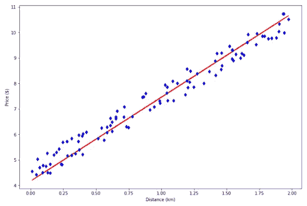******

******作者图片******

******由于这种机器学习算法在每次迭代中都会选取我们训练数据的随机实例，因此您会注意到成本函数会在每次迭代中上下跳动，而不是像您在批量梯度下降中看到的那样持续下降。******

******这有时会导致最终成本函数值不是 100%最优，正如您在上面的回归线可视化中看到的那样。******

## ******小批量梯度下降******

******与批量梯度下降和随机梯度下降相比，小批量梯度下降的实现略有不同，但是一旦我们知道前面的两个实现，它的概念就很容易理解了。******

******迷你批量梯度下降不是像批量梯度下降那样在每次迭代中获取整个训练数据，也不是像随机梯度下降那样在每次迭代中选取我们训练数据的随机实例，而是在两种实现之间采取中间立场。它将整个训练数据分成几个小的批次，每个批次由从我们的训练数据中随机抽样的实例组成。******

******如果我们用 GPU 训练我们的数据，这个想法允许我们获得合理的性能增加。此外，我们从这个实现中得到的结果比随机梯度下降更少“混乱”,但不如批量梯度下降平滑。******

******然而，重要的是要注意，与批量梯度下降相比，用小批量梯度下降训练我们的数据要快得多。******

******如果您想交互式地了解如何根据我们的数据点生成回归线，请查看这个[资源](https://setosa.io/ev/ordinary-least-squares-regression/)。******

# ******5.多项式回归******

******到目前为止，我们已经看到了线性回归模型如何通过最小化成本函数来产生符合我们数据的直线回归线。但是模型能产生比直线更多的东西吗？******

******虽然该模型被称为线性回归，但它实际上可以产生不仅仅是一条直线。它还可以生成一条曲线，以防您希望模型拟合非线性数据，例如:******

```
******np.random.seed(42)
x = 6 * np.random.rand(100, 1)-3
y = 2 * x**2 + np.random.randn(100,1)

plt.figure(figsize=(12, 8))
plt.plot(x, y,'bd')
plt.xlabel('x1')
plt.ylabel('y')******
```

******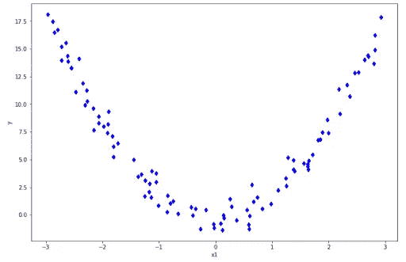******

******作者图片******

******如果你有像上面这样的数据点，当然常规的线性回归不会削减它，因为它总是产生一条直线。当我们的拟合线是一条直线，但我们有如上的非线性数据点时，我们最终得到如下结果:******

******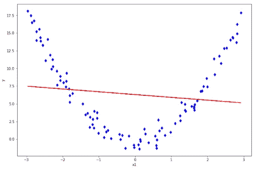******

******作者图片******

******正如你所看到的，我们的拟合线表现不佳，代表我们的数据点。如果我们提供一个看不见的数据点，这条拟合线的表现也会很差。这种现象被称为欠拟合，这意味着我们的模型过于简单，无法捕捉我们的数据点的模式。******

******那么，我们应该做些什么来解决欠拟合呢？我们需要对我们的线性回归方程进行一些变换，在回归方程中加入更高次的预测因子，如下所示。******

******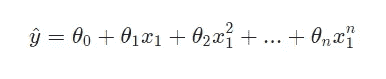******

******其中 ***n*** 是我们可以预先设定的多项式次数。经过这个变换，我们基本上有一个多项式回归。******

******要将我们的正常线性回归函数转换成上述的多项式回归函数，我们可以使用 scikit-learn 中的 ***多项式特性*** 类。这个类将创建每个预测因子的功效，作为我们回归函数中的附加预测因子。******

```
******from sklearn.preprocessing import PolynomialFeatures
import operator

poly_features = PolynomialFeatures(degree=2, include_bias=False)
x_poly = poly_features.fit_transform(x)******
```

******现在如果你想增加每个预测器的次数，那么你需要做的就是在初始化上面的 ***多项式特征*** 实例时调整次数参数。******

******在此特征变换之后，我们可以在此变换的特征上拟合线性回归模型，如下所示:******

```
******import operator

lin = LinearRegression()
lin.fit(x_poly, y)

# Sort value before plotting
sort_axis = operator.itemgetter(0)
sorted_zip = sorted(zip(x,lin.predict(x_poly)), key=sort_axis)
x_pred, y_pred = zip(*sorted_zip)

# Visualize the result
plt.figure(figsize=(12, 8))
plt.plot(x_pred, y_pred, 'r-')
plt.plot(x, y,'bd')
plt.xlabel('x1')
plt.ylabel('y')******
```

******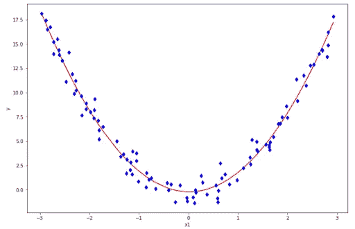******

******作者图片******

******现在我们有了一条回归线，可以很好地捕捉我们的数据模式！******

******如果你想了解更多关于多项式回归的知识，请查看这个[资源](https://www.youtube.com/watch?v=QptI-vDle8Y)。******

## ******6.偏差-方差权衡******

******现在我们知道，我们实际上可以用多项式回归来拟合非线性数据。我们可能想到的下一个问题是:如果我们进一步增加每个预测器的次数，会发生什么？******

******如果我们不断增加每个预测因子的次数，那么我们将得到一条严格遵循每个数据点的拟合线。下面是这种现象的一个例子。******

******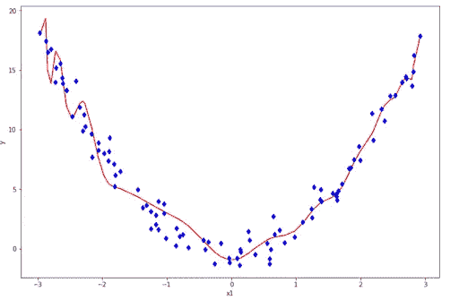******

******作者图片******

******这不是我们想要从拟合线中得到的，原因很明显:它不能很好地概括。如果我们向模型提供一个看不见的数据点，我们会预期一个糟糕的性能。这就是我们所说的过度拟合。******

******到目前为止，我们已经听说了描述回归模型性能的两个重要术语:欠拟合和过拟合。******

*   ******拟合不足意味着模型无法捕获训练数据点的模式。******
*   ******过度拟合意味着模型试图拟合每个训练数据点，这样它就不会对看不见的数据点进行很好的概括。******

******如果你理解了这两个术语，那么你也会理解像偏差和方差这样的术语。******

*   ********偏差**衡量我们的机器学习模型的平均预测与我们试图预测的数据点的实际值之间的差异。如果我们的模型产生高偏差，这意味着我们的模型过于简单，无法捕捉我们数据的模式。这意味着我们有一个**欠拟合**的情况。******
*   ********方差**测量给定数据点的模型预测范围。如果我们的模型在一个看不见的数据点上产生了很高的方差，这意味着我们的模型对训练数据的微小变化非常敏感，因为它太努力地遵循我们的训练数据的模式。这意味着我们有一个**过度装配**的案例。******

******为了更清楚地理解偏差和方差，下面是当我们的模型具有高/低偏差和方差时，这意味着什么的可视化。******

******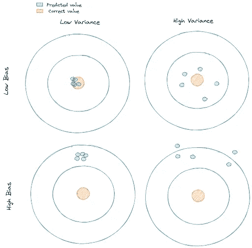******

******作者图片******

******当然，通过看上面的图片，你可能已经知道一个理想的模型应该是低偏差和低方差的。******

******控制偏差和方差通常可以通过调整模型的复杂性来完成(即是否使用线性回归、二阶多项式回归、三阶多项式回归等等)。******

******增加模型的复杂性也会增加其方差，减少其偏差。另一方面，降低模型的复杂性也会降低其方差，但会增加其偏差。******

******这就是偏差-方差权衡的意义所在。我们应该做的是找到最佳点，即偏差和方差误差相交的地方，如下图所示:******

******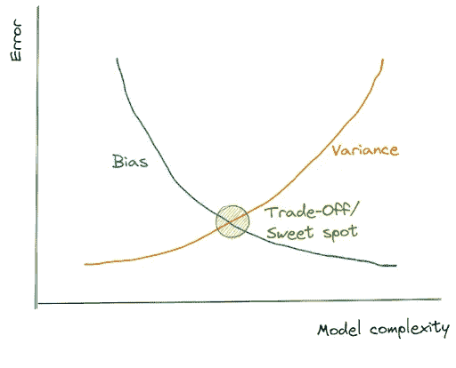******

******作者图片******

******从上面的可视化，现在我们知道我们应该做什么来建立我们的回归模型，这将在训练数据和看不见的数据上表现良好。******

*   ******如果我们的模型产生高偏差，增加其复杂性(即，我们使用多项式回归代替线性回归)******
*   ******如果我们的模型产生了很高的方差，降低其复杂性，添加更多的训练数据，或者应用正则化技术，这将在下一节中介绍。******

## ******7.正则化线性模型******

******如上所述，正则化是一种我们可以用来对抗过度拟合的技术。这种技术的作用是给每个预测器的权重增加一个额外的约束。******

******实践中常用的正则化线性模型有三种类型:岭回归、套索回归和弹性网。先说岭回归。******

## ******里脊回归******

******与常规线性回归相比，岭回归在其成本函数中增加了一项，如下式所示:******

******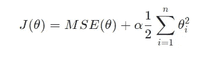******

******其中:******

*   *********α*** :一个超参数，控制你想要正则化你的线性回归模型的程度。******
*   *********θi*** :每个预测值的权重******

******这个附加项的主要目标是在训练过程中保持模型的权重较小。******

******如果你设置 **α** 为 0，那么这个岭回归就变成了正规的线性回归。同时，如果我们将 **α** 设置为一个大的数字，那么所有的权重变得非常接近于零。这将通过数据点的平均值将拟合线变成一条平坦的线。******

******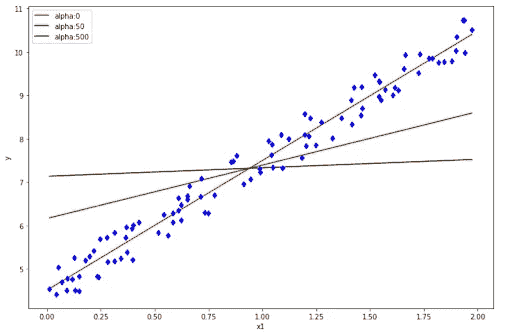******

******作者图片******

******用 scikit-learn 库实现岭回归非常简单，如下所示:******

```
******from sklearn.linear_model import Ridge

ridge = Ridge(alpha=1)
ridge.fit(x,y)******
```

## ******套索回归******

******Lasso 实际上是代表最小绝对和选择运算符的缩写。好的一面是，Lasso 回归的实现与岭回归非常相似，从下面的成本函数中可以看出:******

******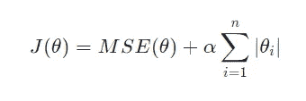******

******我们在套索回归中添加的附加项类似于岭回归。不同之处在于，我们没有平方每个预测器的权重(l2 范数)，而是使用了 ***abs*** 运算符(I *₁* 范数)。******

******直觉还是和岭回归一样。如果你将 **α** 设置为零，那么我们最终会得到常规的线性回归。同时，如果我们将 **α** 设置为一个较大的数字，那么我们最终会得到一条穿过数据平均值的平线。******

******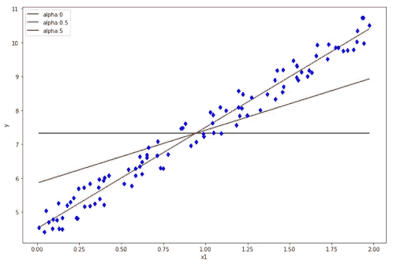******

******作者图片******

******要使用 scikit-learn 实现 Lasso 回归，我们可以执行以下操作:******

```
******from sklearn.linear_model import Lasso

lasso = Lasso(alpha=0.1)
lasso.fit(x,y)******
```

******如果您想了解更多关于岭回归和套索回归的知识，请查看此[资源](https://www.youtube.com/watch?v=Xm2C_gTAl8c)！******

## ******弹性网******

******弹性网可以被视为岭回归和套索回归的组合，正如您在下面的成本函数方程中看到的那样。******

******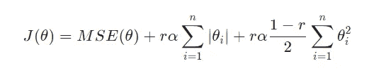******

******从上面的等式中，我们有一个额外的术语叫做 I *₁* 比率。如果你设置 I *₁* 比率为 1，那么我们有一个纯套索回归。同时，如果你将 I *₁* 比率设置为 0，那么我们就有一个纯岭回归。******

******用 scikit learn 实现 Elastic Net 也和其他两个正则化线性模型一样简单，如下所示。******

```
******from sklearn.linear_model import ElasticNet

elastic_net = ElasticNet(alpha=1, l1_ratio=0.5)
elastic_net.fit(x, y)****** 
```

# ******8.支持向量机回归(SVM 回归)******

******支持向量机(SVM)是一种更常用于分类任务的机器学习算法。SVM 算法的基本原理是创建一个超平面来分隔具有最大余量的数据点。例如，让我们考虑以下数据点:******

************

******作者图片******

******我们有许多不同的选项来绘制一个区分两个数据点的超平面，最佳选项如下所示:******

******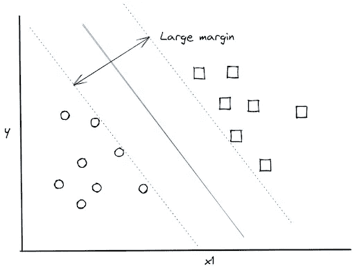******

******作者图片******

******原来我们可以用上面的概念来解决一个回归问题。不同的是:******

*   ******在分类问题中，我们要求 SVM 算法创建一个具有最大可能余量的超平面，以分离不同类别的数据点。******
*   ******在回归问题中，我们要求 SVM 算法创建一个超平面，该超平面具有适合尽可能多的数据点的边缘。******

******SVM 回归本身的概念也不同于典型的基于梯度下降的回归算法，如上面的岭回归、套索回归和弹性网。******

******对于 SVM 回归，我们的主要目标不是最小化成本函数，而是创建一条误差在某个可接受范围内的回归线。为此，首先我们设置最大误差， ***ε*** ，然后 SVM 回归试图找到一个超平面(或回归线)来拟合我们的数据点，同时满足我们预先指定的最大误差。******

******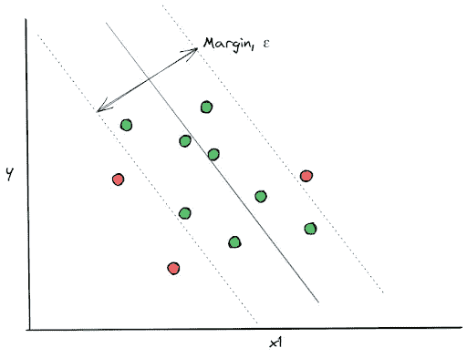******

******作者图片******

******要使用 SVM 回归实现线性回归，可以使用 scikit-learn 库，如下所示:******

```
******from sklearn.svm import SVR

np.random.seed(42)
x = 2 * np.random.rand(100,1)
y = 4 + 3 * x + np.random.rand(100,1)

svr = SVR(kernel = 'linear', epsilon = 0.1)
svr.fit(x,y.ravel())

# Plot result
plt.figure(figsize=(12, 8))
plt.plot(x, svr.predict(x), 'r-')
plt.plot(x,y,'bd')
plt.xlabel('x1')
plt.ylabel('y')******
```

******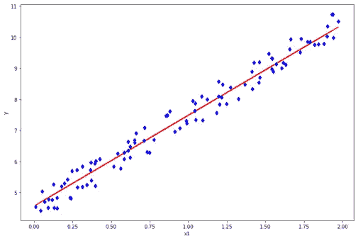******

******作者图片******

******不仅对于线性数据点，SVM 回归也可以用于非线性数据点。您需要做的只是更改 SVM 的核，并选择所需的多项式次数，如下所示:******

```
******svr = SVR(kernel = 'poly', degree= 2)
svr.fit(x,y.ravel())******
```

******如果你想了解更多关于支持向量回归背后的理论，请查看这个[资源](/an-introduction-to-support-vector-regression-svr-a3ebc1672c2)。******

# ******9.决策树回归******

******决策树也是常用于分类的机器学习算法之一，但它也可以用于回归任务。******

******一棵决策树由三部分组成: ***根节点*** 、 ***内部节点*** 、 ***叶节点*** ，如下图所示。******

******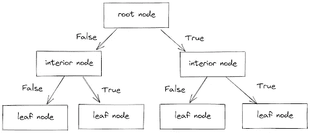******

******作者图片******

******对于我们的每个数据点，它通过回答内部节点中的一系列真或假条件，从根节点一直运行到叶节点。最后，叶节点将给出我们每个数据点的结果。******

******用于分类和回归的决策树之间的概念是相似的。唯一的区别是:******

*   ******在分类任务中，决策树预测每个节点中的类。******
*   ******在回归任务中，决策树预测每个节点中的连续值。******

******用 scikit-learn 实现决策树回归非常简单，如下图所示。******

```
******from sklearn.tree import DecisionTreeRegressor

np.random.seed(42)
x = 2 * np.random.rand(100,1)
y = 4 + 3 * x + np.random.rand(100,1)

tree = DecisionTreeRegressor()
tree.fit(x, y)

# Visualize regression line
x_grid = np.arange(min(x), max(x), 0.01)
x_grid = x_grid.reshape((len(x_grid), 1))
plt.figure(figsize=(12, 8))
plt.plot(x_grid, tree.predict(x_grid), 'r-')
plt.plot(x,y,'bd')
plt.xlabel('x1')
plt.ylabel('y')******
```

******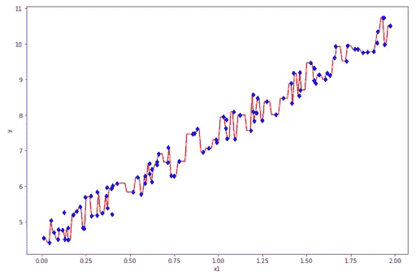******

******作者图片******

******然而，上面的结果不是我们想要的，因为它过度拟合了数据。这是决策树回归的常见问题，容易过度拟合。******

******当我们将所有的超参数设置为默认值时(即我们没有指定树的最大深度)，通常会发生这种过度拟合。为了避免这种情况，当我们用 scikit-learn 初始化模型时，我们可以使用 ***max_depth*** 参数。******

```
******from sklearn.tree import DecisionTreeRegressor

tree = DecisionTreeRegressor(max_depth=3)******
```

******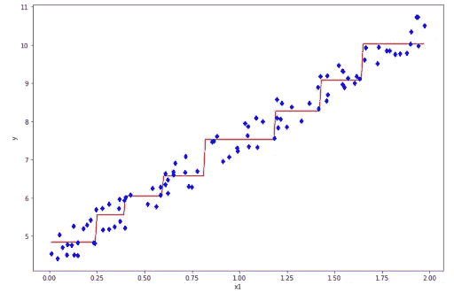******

******作者图片******

******而且看起来比我们以前的型号要好！解决决策树回归中过度拟合问题的一个主要思路是在构建模型时创建一个额外的约束，即通过限制树的深度或限制叶节点的数量。******

******如果您想了解决策树回归算法背后的可视化，请查看这个[资源](https://www.youtube.com/watch?v=UhY5vPfQIrA)。******

## ******结论******

******在本文中，我们讨论了用于回归问题的常见机器学习算法的概述:如线性回归、岭回归、套索回归、弹性网、SVM 回归和决策树回归。******

******这些机器学习算法的主要目标是创建一条回归直线，使我们的成本函数或指标(如 MSE、RMSE 或 MAE)最小化。******

******你准备好创建你自己的回归项目了吗？以下资源可能对您有所帮助:******

*   ******如果你想开始你自己的回归项目，你可以查看这个[资源](https://hackernoon.com/top-10-regression-datasets-for-machine-learning-projects-ce4i3wuu)来启发你从哪里得到你的数据集。******
*   ******如果你想学习如何使用 Python 进行线性回归，可以查看这个[资源](https://www.kdnuggets.com/2019/03/beginners-guide-linear-regression-python-scikit-learn.html)或者这个[资源](https://www.youtube.com/watch?v=R15LjD8aCzc&t=387s)。******

*******原载于*[*https://www.stratascratch.com*](https://www.stratascratch.com/blog/overview-of-machine-learning-algorithms-regression/?utm_source=blog&utm_medium=click&utm_campaign=medium)*。*******