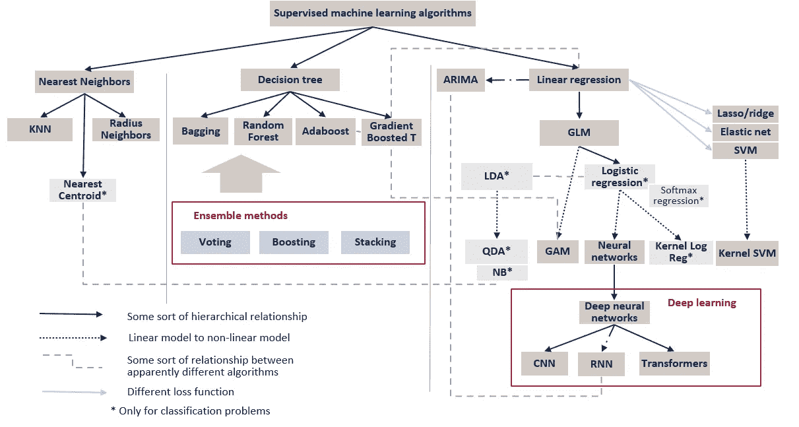
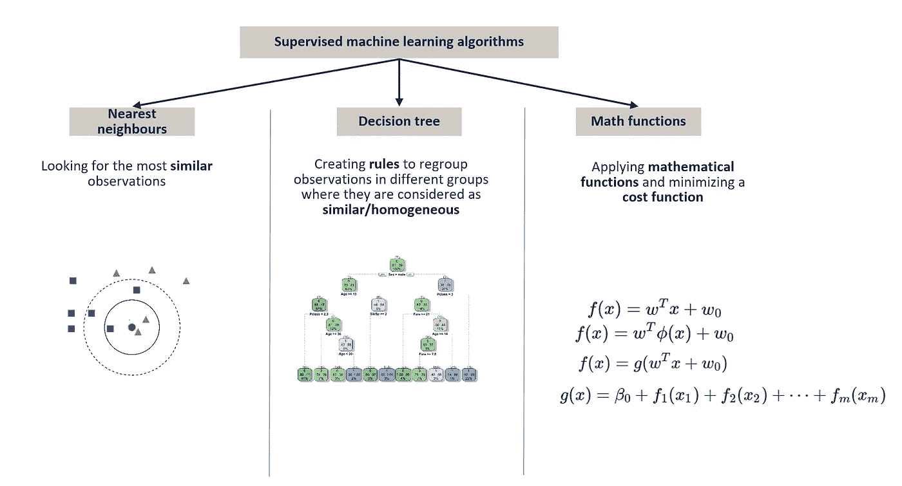
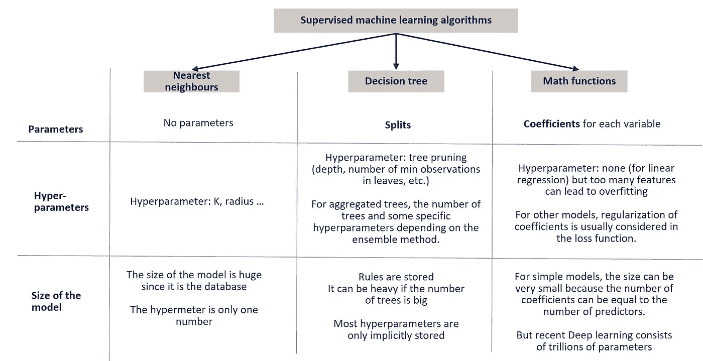
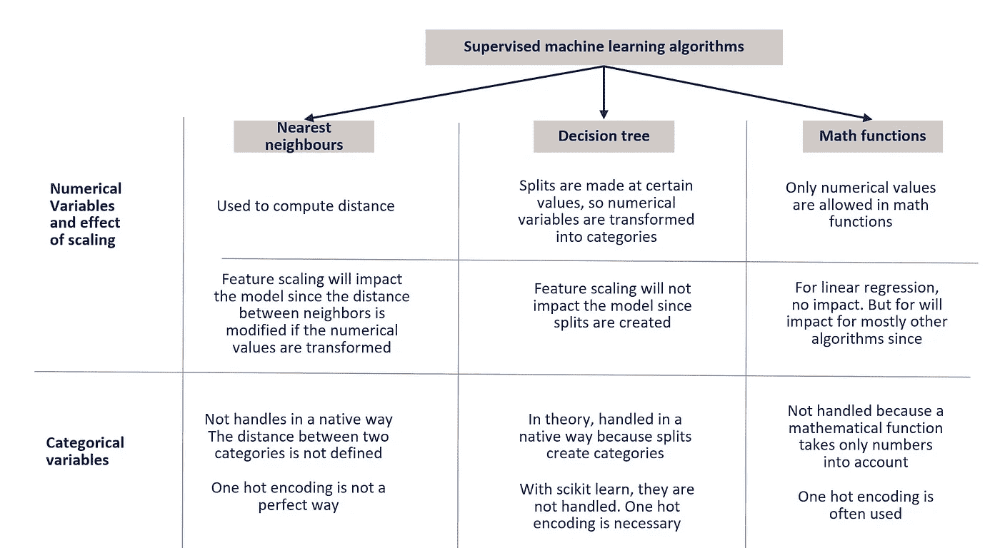
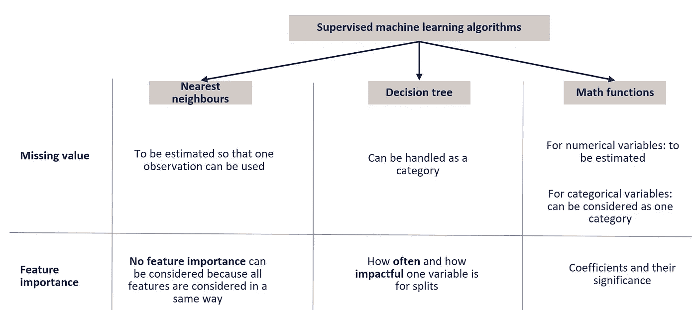
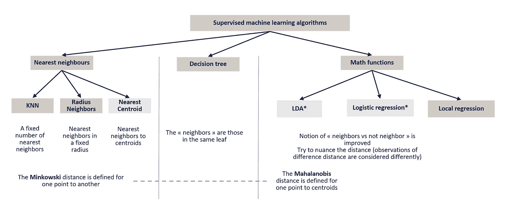
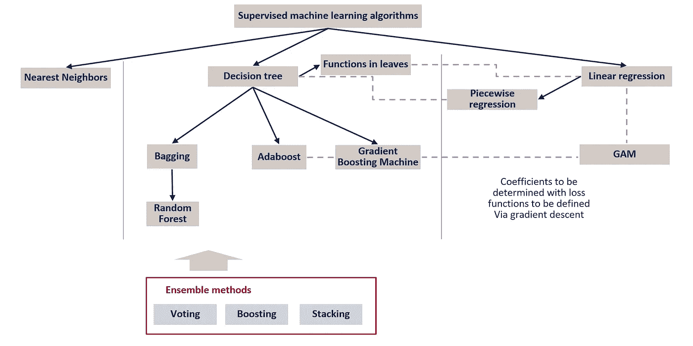
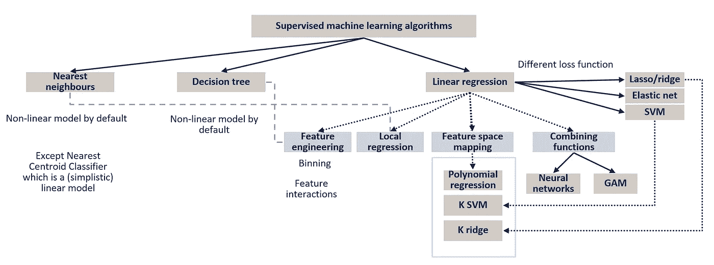
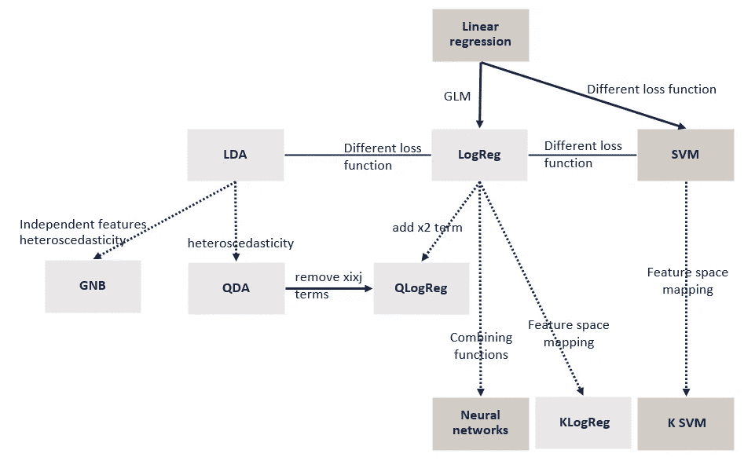

# 监督机器学习算法综述

> 原文：<https://towardsdatascience.com/overview-of-supervised-machine-learning-algorithms-a5107d036296>

## 大图如何通过连接点给我们洞察力和对 ML 的更好理解

有这么多的机器学习算法，我们可以找到不同种类的概述和备忘单。为什么是另一个概述？

我试图从以下三个主要方面来构建这个不同的概述:

*   所有算法的完整层次关系
*   明显不同的算法之间的关系——比如 **LDA** vs **Logistic 回归**、**梯度推进机** vs **线性回归**、 **SVM** vs **线性回归**等。
*   更好地回答常见的 ML 问题的结构—例如，数值缩放的效果、特征重要性、线性模型与非线性模型。

当试图连接众多机器学习算法的点时，我发现通常有几种方法来构建/理解算法。例如:

*   标准线性回归可被视为 **OLS** (普通最小二乘)回归，并等同于 **MLE** (最大似然估计)找到的残差正态分布的解决方案。
*   **逻辑回归**可定义为奇数比率，但也可视为线性回归的平滑版本。
*   **SVM** 几乎总是被定义为(软)边际最大化器，这给我们的印象是该方法与其他算法非常不同。而它具有与具有另一损失函数的线性回归相同的方程。

没有更好的方法，每种方法都让我们了解一个方面。一种方法可能比另一种容易，这取决于你已经知道了什么。我在这篇文章中的目的是找到一种有意义的方法来连接它们。这也给了我许多有趣的见解，帮助我更好地理解它们。这种概述也成为一种工具，一种深入研究每种算法的框架。

与其他数据科学家的每次讨论都让我发现了更多。我会继续改进，非常欢迎大家的评论。

# 1.大局

这第一个概述的想法是映射最常见的算法。在全球范围内，它们被组织在一个等级结构中，有三个主要类别。不同类别的算法之间也有联系，我们将在后面讨论。

*   第一类包含**最近邻**算法。其思想是通过为一个新的观测值定义一个距离来进行预测，从而找到最相似的观测值。寻找邻居主要有两种方法:我们固定邻居的数量(这是最常见的方法，它被称为 **K-Nearest-Neighbors** 算法)，或者我们可以定义一个固定的半径(**半径邻居**算法使用较少，但可以认为它更直观，我们可以在互联网上找到说明 KNN 半径邻居的图片)。
*   第二类包含基于**决策树**的算法。简单的决策树通常性能不够，集成方法(理论上，它们也可以应用于其他类别的算法，但实际上，它经常用于决策树)可以用于聚合更多的树。**装袋**包括用自举样本构建树，并汇总它们(通过计算所有树的平均值)。 **RandomForest** 引入了另一个随机性:当选择变量来创建分裂时，随机选择的预测值更少。**助推**技术包括添加弱学习器，常见的例子有 **AdaBoost** 和**梯度助推机**。
*   第三类包含由**数学函数**做出的算法。而**线性回归**可以认为是基础算法。从那里我们可以修改损失函数得到**套索**、**脊**、**弹性网**、 **SVIM、**等等。线性回归的一个缺点是它是…线性的。因此，为了处理非线性数据，必须对其进行增强。我们将讨论**特征空间映射、GAM、**和**神经网络。**

监督机器学习概述(图片由作者提供)

为了更好地解释这一大背景，我们将一步一步地讨论以下主题:

*   算法的三个主要类别背后的**直觉**:为什么是这三个类别，为什么是这个顺序
*   模型如何被**训练**并用于**回归**和**分类**(二元和多类)
*   这些算法如何处理**分类变量**和**数值变量缩放比例**
*   **模型之间的关系及其增强**:基本算法不是可执行的，可以使用不同的方法来增强它们以克服缺点。而且我还发现，增强一类算法的方式可以来自另一类。

# 2.算法背后的直觉

如何定义有监督的机器学习？为了具体地回答这个问题，人们通常会提出一种机器学习算法。但是你会选择哪一个呢？对于初学者来说，哪个最直观易懂？

当我试图决定三个主要类别的顺序时，我想反映出有一种强烈的人类直觉。对此，我们来提一些经典的机器学习问题:房价预测和泰坦尼克号幸存者预测。当问一些没有机器学习知识的人时(因为这个想法是将机器智能与人类智能联系起来)，邻居的想法最容易用于房屋定价预测，决策树最直观用于泰坦尼克号幸存者预测。

碰巧应用数学函数是最不直观的方法。我们还会看到简单的数学函数不是可执行的，复杂的函数也不是那么直观…

## 2.1.最近的邻居

对于房价预测，答案往往是:我们看看**小区**卖的**类似**的房源吧！

距离的概念非常直观，因为为了预测一个新观测值，我们可以搜索相似的观测值。而且数学上，相似度和邻域会被认为是一回事。我们直观感知的距离是几何距离(在这种情况下，是两栋房子之间的距离)。这个距离也可以推广到两个向量。

这个算法直观的另一个原因是不需要训练。

尽管基于最近邻的算法由于几个原因在现实中不经常使用，但这个想法很有趣，我们将能够涉及到其他算法。

## 2.2.规则组合

当涉及到泰坦尼克号生存预测时，由规则组合而成的决策树(if-else)是解释机器学习的一种非常直观的方式。而且我们常说，对于某些商业问题，在创建复杂算法之前，可以先应用商业规则。

我们经常问人们，在预测泰坦尼克号乘客的存活率时，应该首先应用哪条规则。许多人认为性是最重要的变量。如果我们试图建立一个决策树，这是真的。我们可以看到，当人们拥有领域专业知识时(女士优先！)，他们的直觉对于算法所预测的通常是足够的。

## 2.3.数学函数

实际上，最不直观的方法是应用数学函数。除非你是线性回归的狂热爱好者。

这一类别中的所有不同算法都是不同的数学函数(因此输入必须是数字，我们稍后将回到这一点)，然后必须定义一个损失函数。

在这种情况下，区分模型的作用和损失函数就显得尤为重要。例如，公式 y=ax+b 对于以下算法是相同的:线性回归、岭、套索、弹性网和 SVM。区别在于用于优化的损失函数。

监督机器学习算法背后的直觉(图片由作者提供)

# 3.模型培训和使用

我们先来定义一些关键词:

*   **模型**:每个算法产生一个用于预测的模型(带有新的观察值)
*   **训练算法**:对于一些固定的超参数，如何获得模型
*   **超参数调整**:寻找最佳超参数以避免过拟合或欠拟合的过程。

## 3.1.参数和超参数

*   **最近邻**:没有训练过程，所以不计算参数。也叫**实例学习**。虽然没有涉及到训练算法，但仍然有趣的是，可以有不同的方法来找到邻居([球树或 kd 树](https://scikit-learn.org/stable/modules/neighbors.html#kdtree-and-balltree-classes))。在实践中，我们可以说所有的数据集就是模型。因此，要使用该模型，我们必须存储所有可能非常庞大的数据集。有一些超参数需要优化:KNN 的数量 k 和半径邻居的半径。
*   **决策树**:训练过程包括寻找分裂来构建树。所以参数是创建分割的规则。针对一棵树的超参数调整是标准(Gini 或熵)和修剪(树的深度、叶子中的观察值的数量、创建分裂的可用观察值的数量等)。).对于聚集树，树的数量是一个超参数。根据系综方法，有特定的超参数。例如[梯度增强树的学习率。](https://scikit-learn.org/stable/modules/generated/sklearn.ensemble.GradientBoostingClassifier.html)
*   **数学函数**:模型由两个主要元素组成，数学函数(在深度学习模型的情况下通常称为**架构**)和每个预测器的系数。**训练算法**包括寻找系数。在实践中，通过最小化成本函数来使用**梯度下降**。**可用的超参数**通常用于**调整系数**并指定特征空间映射的**特征(我们将在后面讨论)。我们可以为内核 SVM 选择不同的内核)。超参数的确切定义可能是模糊的。套索回归、岭回归或弹性网回归与线性回归是不同的模型吗？或者它们只是带有用于参数正则化的超参数的线性回归？答案可能不是很重要。有趣的是，通过 sci-kit learn，[逻辑回归](https://scikit-learn.org/stable/modules/generated/sklearn.linear_model.LogisticRegression.html)直接具有这些参数(惩罚和 C)。模型[SGD 分类器](https://scikit-learn.org/stable/modules/generated/sklearn.linear_model.SGDClassifier.html)或 [SGD 回归器](https://scikit-learn.org/stable/modules/generated/sklearn.linear_model.SGDRegressor.html)非常值得考虑，因为所有这些参数都是集中的(损失函数、惩罚和 alpha、l1 比率)。我们可以更进一步:具有特定核的 SVM 模型可以被认为是不同的模型，或者它可以被认为是具有所选核作为超参数的一般 SVM)？在深度学习的情况下，我们可以再提到一些:层数、辍学率、激活函数等。就模型的大小而言，它通常非常小，因为只存储了几个系数。除了深度学习，最近的模型可以包含数万亿个系数。**

监督机器学习算法的参数与超参数(图片由作者提供)

为了彻底理解模型训练过程，我创建了一系列文章(工作进展)来演示使用 Excel 的所有步骤。你可以在这里查看这些文章并支持我:[https://ko-fi.com/s/ea8faebbb5](https://ko-fi.com/s/4ddca6dff1)

[在 ko-fi 上支持我](https://ko-fi.com/s/ea8faebbb5) —作者图片

## 3.2.模型实现

在创建模型时，我们关注的是培训过程，但了解模型将如何实现也很重要。为了更好地理解，我们可以想象您必须在 Excel 中实现它们。

*   最近邻居:我们必须存储所有的数据集。对于一个观测值，我们可以计算所有观测值的距离，并通过按距离排序来寻找最近的邻居。
*   **决策树**:我们要存储所有的规则，在 Excel 中通常很难手工做到，哪怕是一棵树，更别说是很多棵树的时候了。
*   **数学函数**:除了大型深度学习模型，模型可以很容易地存储在 Excel 中:有系数要存储在单元格中，我们也可以编写函数，它会将新的观察值作为输入来计算预测。

## 3.3.回归和分类

当谈到监督学习时，在许多概述中，我们经常会看到两个子类:回归和分类。提醒一下，回归问题是当目标变量是连续的，而分类任务是当目标变量是分类的。

我没有选择将它们作为监督学习算法的两个子类别，因为一种算法可以为一种或另一种算法工作。让我们也提一下在训练过程中如何使用目标变量。

对于**最近邻居**算法，目标变量不用于训练过程，因为只有预测器用于寻找邻居。所以目标值的性质对训练过程没有影响。找到邻居时:如果目标变量是数值型的，则使用邻居的**平均值**进行预测；如果目标变量是分类变量(有两个或更多类别)，则使用类别的**比例进行预测。而比例可以认为是概率。对于二元分类或多类分类，没有区别。**

对于**基于决策树的模型**，目标变量用于创建分裂或规则，使其在叶子中同质。模型的结构是一样的。为了进行预测，我们首先确定新的观察值在哪个叶子上。然后:对于回归，我们用叶子中观察值的平均值**预测；为了分类，我们计算所有类别**的**比例。对于二元分类或者多类分类，我们可以看到没有区别。**

对于**数学函数**模型，目标变量用于**成本函数**中，该成本函数应最小化以找到每个预测器的系数。对于分类变量，使用一种热编码。由于数学函数只考虑输入数值(我们将在后面看到)，也只输出数值，我们应该先验地说它们只对回归任务起作用。所以对于一个回归问题，没有问题。分类任务会发生什么？有三种主要的解决方案，并且它们可以从二元分类到多类分类进行不同的概括。

*   **通过在中间切割预测目标值的超平面**:对于二元分类，目标值是 0 或 1，我们仍然可以用线性回归来拟合。然后，如果输出高于 0.5，则预测为 1，如果输出低于 0.5，则预测为 0。这对 SVM(支持向量机)也是一样的。有时，目标值被选择为-1 和 1，但它不会改变结果。然后最后一个方程叫做**超平面**，它把空间分成两部分。对于**多类分类**(让 m 是类的数量)，这种方法不能很好地推广，因为我们试图将问题带回二进制分类。我们可以使用 one-vs-rest 方法，通过将一个类视为 1，而将所有其他类视为 0，来创建(m-1)个模型。我们还有一对一的方法，这将创建 m*(m-1)/2 个模型，因为我们试图为每对 m 个类创建一个模型。
*   **Logistic/softmax 回归**:解决二元分类任务的另一种方法是使用 GLM(广义线性模型)方法，通过使用链接函数将函数的输出值限制在 0 和 1 之间，具有单调平滑的过渡。一般来说，可以有不同的函数具有这种特性，我们可以提到逻辑函数( [logit](https://en.wikipedia.org/wiki/Logit) 的反函数)和 [probit](https://en.wikipedia.org/wiki/Probit) 的反函数。实际上，最常见的函数是逻辑函数，它在求导方面也有很好的数学特性。而且值得一提的是得到类的最终预测，我们也是中间切的。所以 Logistic 回归也是一个**线性分类器**。不同的是，输出的是一个可以直接使用的概率。对于用线性回归或 SVM 构建的超平面，我们不可能天生就有概率。一种方法是使用逻辑函数来获得概率。(一个有趣的讨论[这里](https://stats.stackexchange.com/questions/302567/why-is-it-wrong-to-interpret-svm-as-classification-probabilities)和[这里](https://mmuratarat.github.io/2019-10-12/probabilistic-output-of-svm))。对于多类分类，使用 softmax 函数可以很好地完成概化。对于神经网络，最后一层通常是用于多类分类的 softmax 回归/分类。
*   **GDA(高斯判别分析)**:在这个算法家族中，我们可以找到 LDA(线性判别分析)、QDA(二次判别分析)、朴素贝叶斯分类等。它们也被称为**生成模型**。vs 判别式模型(即使这些生成式模型中有关键字判别式！[这里的](https://en.wikipedia.org/wiki/Generative_model)是维基百科的文章)。并且它们仅用于先验的回归任务。

回归和分类(图片由作者提供)

# 4.特征变量处理

在我们考虑了如何在这些算法中使用目标变量之后，我们现在可以考虑特征变量。

## 4.1.数字变量和分类变量

*   **最近邻**:在计算两次观测之间的距离时，只能考虑数值。不处理分类变量。人们可以想到 one-hot 编码，但它们意义不大。标签编码将是一种错误的方式。
*   **决策树**:由于树是按照将观察结果连续分成两组的规则构建的，变量总是以某种方式分类。当然，数字变量是可以处理的，但是它们被转换成带有拆分的类别。值得一提的是，在 sci-kit learn 中只处理数字变量，因此它们通常是一位热编码的。
*   **数学函数**:只能考虑数值。所以分类变量通常是一次性编码的。

## 4.2.数值变量缩放的效果

*   **最近邻**:所有数值变量都以同样的方式考虑(除非为不同的变量分配权重)，数值的改变(无论是缩放还是其他变换)都会改变计算的距离，因此结果会有所不同。
*   **决策树**:数值变量将被(相继)切割成两部分，因此缩放将**而不是**改变模型的结果。
*   **数学函数**:对于线性回归，缩放没有影响。你可以用数学方法证明。但对于其他型号，缩放会有影响(**如有反例，请分享**)。线性回归的正则化版本(Lasso、Ridge、Elastic net)考虑了系数的二次误差和(L1、L2 或两者)范数，因此系数将受到数值变量缩放的影响。

**特征变量处理**(图片由作者提供)

## 4.3.缺失值处理

*   **最近邻**:由于只考虑数值变量，无法处理缺失值，可以使用各种插补方法。
*   **决策树**:缺失值可以作为一个类别处理，不需要一些特殊的插补。
*   **数学函数**:对于数值变量和最近邻变量，必须进行插补，并以有意义的方式对缺失值进行估计。例如，将它们设置为 0 并不是一个合适的解决方案，因为这会造成不连续和异常。例如，通常使用平均值估算法。对于分类变量，可以使用“最频繁类别”方法，但有时这可能不是最合适的方法。例如，如果我们能发现由于某种特殊原因而丢失的值，就会创建一个特殊的类别。因为它们是一次性编码的，所以不存在不连续的问题。

## 4.4.特征重要性

特征重要性可以是模型不可知的，这里我们只考虑算法如何能够直接给出一些关于特征如何被使用以及它们在预测过程中的重要性的见解。

*   **最近邻居**:由于所有变量都以相同的方式用于距离计算，因此特征重要性的概念在这里并不相关。然而，值得注意的是，如果我们知道某些特性应该更重要(根据业务考虑)，我们可以使用权重作为预测值。
*   **决策树**:可以有不同的方法来估计特性的重要性。可以使用的指标有:一个变量在分割中使用的频率，分割的影响程度(根据基尼系数或熵值变化)。连续变量和分类变量之间是有区别的。由于连续变量被分成不同的类别来创建分割，因此它们可以被多次分割，从而有更多的机会被使用。对于一个分类变量，我们可以考虑它对每个分类或所有分类的重要性。
*   **数学函数**:对于每个预测器，通常有一个系数(对于神经网络有更多)。它们可用于考虑特征的重要性。这并不意味着系数越高，特征重要性越高。我们还必须考虑特性的规模([本文](https://scikit-learn.org/stable/auto_examples/inspection/plot_linear_model_coefficient_interpretation.html)解释了其解释的一些缺陷)。在传统的线性回归建模中，我们通常将 p 值(对系数进行零假设检验)作为系数的显著性。(我还没查:特征标准化时考虑 p 值和系数是否等价？)

缺失值和特征重要性(图片由作者提供)

# 5.模型增强以及与其他算法的关系

经过前面的分析，我们现在对三类算法中的三种基本算法的优缺点有了一些了解。由于缺点不同，改进模型的方式也不同。这就是我们可以把三个不同类别的不同算法联系起来的地方。

## 5.1.最近邻模型

我们可以通过以下方式改善最近邻:

*   一个主要的缺点是它不是一个模型，因为它使用所有的数据集。一个极端的简化是计算每个类的质心。然后使用质心而不是所有的数据点来计算距离。考虑这种方法很有趣，因为它可以与 k-means(是的，它是一种无监督的学习算法)和 GDA 相关。
*   另一种增强最近邻的方法是改进距离的概念。通常使用欧氏距离，我们可以使用它的广义版本( **Minkowski** distance)不同的幂参数。但是我们也可以使用其他类型的数学距离:例如， **Mahalanobis** 距离将引导它到达 LDA。想法是考虑不同距离的不同数据点可以被不同地考虑。对于最近邻，数据点要么是“邻居”，要么是“不是邻居”，而对于 GDA 或逻辑回归，距离是以数据点的参数方式建模的。

还有什么？最近邻和决策树有关系吗？我们可以说决策树的叶子包含邻居。没有用距离，而是用另一种方式找邻居，有规则。因此，您不必存储真实的邻居来进行预测，您只需存储帮助您找到邻居的规则。一旦发现它们，你就不需要它们了，因为只需要预测，而且它可以被存储。

**最近邻模型增强以及与其他算法的关系**(图片由作者提供)

## 5.2.基于决策树的模型

对于决策树，改进模型的方法主要是聚集树。聚合/加法是一个数学函数。所以我们可以把 Boosting 和 GAM(广义可加模型)联系起来。这是一个非常强大的想法，因为为了优化梯度增强机器中的树聚集，使用了梯度下降。([这里](https://datascience.stackexchange.com/questions/61501/what-is-the-difference-between-gradient-descent-and-gradient-boosting-are-they)是一个有趣的讨论)针对不同的任务，各种优化也考虑了损失函数。

值得注意的是，Boosting 可以用于各种基础算法，但是对于线性回归，添加线性回归仍然会是线性的([这里](https://stats.stackexchange.com/questions/230388/how-does-linear-base-learner-works-in-boosting-and-how-does-it-works-in-the-xgb)和[这里](https://stats.stackexchange.com/questions/186966/gradient-boosting-for-linear-regression-why-does-it-not-work)我们可以找到一些有趣的讨论)。然而决策树的一个有趣的特征是它在默认情况下是非线性的(这里的)。

另一个想法是为树叶中的观察值引入一些函数。例如，默认情况下，平均值是为回归任务计算的。现在的想法是引入更复杂的关系，例如，线性关系。我们可以在这里找到一些参考资料。

该方法可以以相反的方式用于线性回归，而不是为所有预测值范围创建单一的线性关系，可以考虑将特征变量分成不同的区域并创建线性回归。

基于决策树的模型增强(图片来自作者)

## 5.3.线性模型增强

下面举几个线性回归失败的案例，以及如何改进:

*   当使用线性回归做分类时，它对异常值非常敏感，这就是为什么逻辑回归或 SVM 更适合。逻辑回归使异常值(远离两类边界的异常值)造成的误差最小化。SVM 完全忽略了异常值。
*   当目标变量具有某些特定属性:只有正值、计数数据或二进制值时，如果我们能通过考虑具有 GLM 的链接函数或损失函数来反映这些属性，那就更好了。
*   线性回归的一个主要缺点是它是线性的，而现实世界充满了非线性

要创建非线性模型，有不同的方法:

*   **特征工程**:有人会说特征工程不是算法，它应该在预处理阶段完成。我在这里提到它有两个原因:1)特征工程和预测建模之间的界限可能是模糊的。尤其是深度学习模型。关于线性回归是否可以过度拟合，还有一个有趣的考虑。我们通常以[多项式回归](/polynomial-regression-with-scikit-learn-what-you-should-know-bed9d3296f2)为例来说明线性回归的过拟合。有些人可能会认为多项式回归不是简单的线性回归，而是另一种更复杂的回归算法，其超参数是多项式的次数。但是我也可以认为多项式特征可以存在于现实世界中。然后应用线性回归([这里](https://stats.stackexchange.com/questions/31459/what-is-the-relationship-between-regression-and-linear-discriminant-analysis-ld)是一个有趣的讨论)。2)特征工程技术可以与其他算法相关联。例如，宁滨正在使用决策树(它们是基于专家的)将连续变量分类。特征交互类似于特征空间映射。日志转换就像应用一个链接函数。
*   **局部回归**:我们已经讨论过它与最近邻模型的关系。
*   **特征空间映射**:想法是将非线性数据投影到一个特征空间，在那里数据变成线性。一个简单的例子是**多项式回归**，即使它通常不以这种方式呈现。这里有一个[的课堂笔记](https://cs229.stanford.edu/notes2020fall/notes2020fall/cs229-notes3.pdf)对统一方法很有帮助。有了正则化，就变成了**内核脊**。由于其计算性能，它主要用于 SVM。值得注意的是特征空间映射和内核技巧之间的区别。([这里](https://stats.stackexchange.com/questions/463255/kernels-in-svm-primal-form/)是一个有趣的讨论)。
*   **函数组合** : [GAM](https://en.wikipedia.org/wiki/Generalized_additive_model) 使用加法方法组合函数，而[神经网络](/visualize-how-a-neural-network-works-from-scratch-3c04918a278)在全局线性函数(或 softmax 回归)中使用多层激活函数。中间层包括将非线性数据转换到最终空间，在最终空间中，数据可以以线性方式建模。你可以在下面找到我写的一篇文章，用一个神经网络来可视化数据的转换。

</animations-of-neural-networks-transforming-data-42005e8fffd9>  

线性模型增强(图片由作者提供)

特别是对于分类算法，我们可以提到更多的特异性。

带有数学函数的分类算法(图片由作者提供)

对于**线性回归**和 **LDA** 的关系，这里有个有趣的讨论。

对于 **LDA** 和 **logistic 回归**，我写了一篇文章来说明它们其实非常相似。它们是同一个模型(数学函数相同，只是变量前的系数不同)。

</intuitively-how-can-we-better-understand-logistic-regression-97af9e77e136>  

要了解更多的细节，你可以写我写的这篇关于线性分类器到非线性分类器的转换的文章，附带一些可视化。

</intuitively-how-can-we-build-non-linear-classifiers-10c381ed633e>  

# 6.结论

当问所有机器学习算法一个一般性问题时，我认为重要的是要记住，答案可能因算法而异。希望这个概述能对彻底解答有用。如果你有任何问题，请让我知道，每个讨论都有助于我更好地理解这些算法。

有些人可能会注意到，在第一个概述中提到了一些我在文章中没有提到的算法:ARIMA、RNN、CNN、注意力机制等。我正在写关于**无监督学习算法**、**计算机视觉技术**、 **NLP 技术**、**深度学习算法**的类似文章。