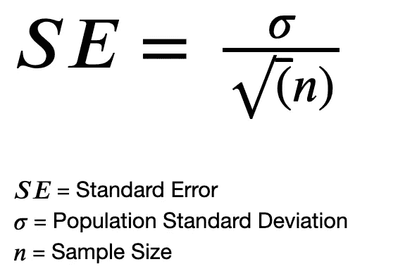
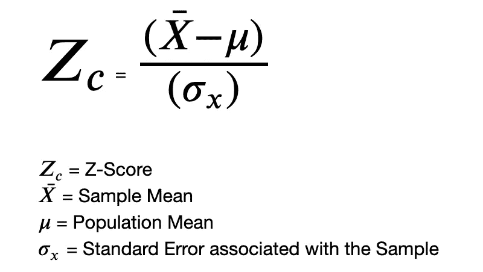
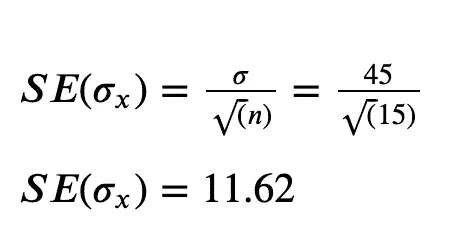
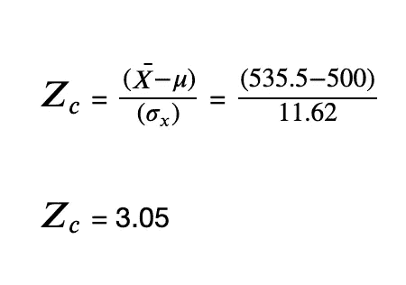
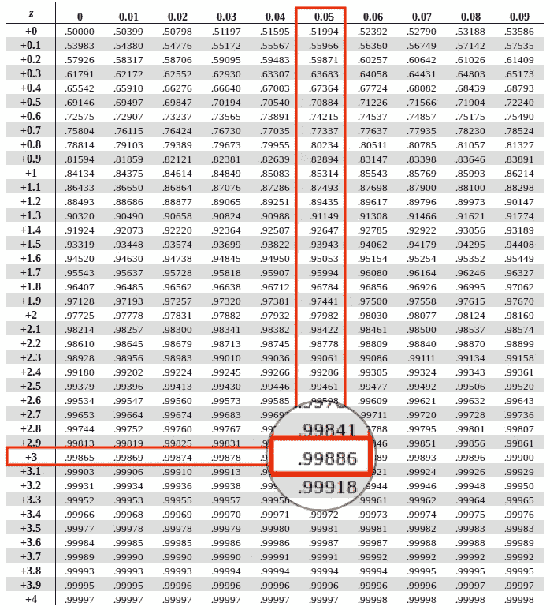

# 假设检验的 p 值法

> 原文：<https://towardsdatascience.com/p-value-method-for-hypothesis-testing-c967c0f78d74>

## P 值法是一种常用于假设检验以验证假设的方法。在本文中，我将用一个解决的例子来解释这种方法。


克里斯·利维拉尼在 [Unsplash](https://unsplash.com?utm_source=medium&utm_medium=referral) 上的照片

## 为什么要进行假设检验

通常，我们获取样本数据集进行工作，并执行数据分析和可视化，找到见解。通过这种分析，我们可以对整个人口做出推断。群体是整个数据集，而样本数据集是来自群体数据集的组块。与总体相似，这些样本数据集也有一些相关的均值和标准差。

这些样本的平均值通常与总体平均值相差不同的范围。这些范围可以从非常接近到非常远离总体平均值。为了做出正确的推断，我们的样本数据集需要类似于总体数据集的属性。因此，这些样本和样本均值通过各种假设检验方法进行验证，如 P 值法、临界值法、T 检验、ANOVA 检验等。

> 例如，考虑一家销售电子设备的商店。不久前，他们推出了一款新的笔记本电脑，并举行了一场营销活动来推广该产品。这场运动持续了 100 天。他们声称，在活动期间，所有分支机构平均每天售出 500 台笔记本电脑。该索赔值(500)是总体平均值，表示在 100 天的活动中每天售出的笔记本电脑数量。现在，我们取出多个样本，每个样本有 20 天的数据，并检查每个样本的平均笔记本电脑销量。我们知道每个样本的平均值可能与其他样本的平均值不同。这些样本平均值可以不同于总体平均值(500)。如果样本均值接近 500，比如我们得到的笔记本电脑销售的样本均值为 490 或 498 或 505，我们更有可能相信商店的说法。但如果样本均值是极值，比如 200 或 150 或 710，我们就不太可能相信这种说法。在这种情况下，p 值方法有助于在统计上验证假设。

**假设检验中的 P 值法是什么？** P 值法用于假设检验，检查给定零假设的显著性。然后，基于指定的显著性水平或阈值来决定拒绝或支持它。

**用这种方法计算 P 值，这是一种检验统计。这个统计可以给我们找到一个值(样本均值)的概率，这个值和总体均值一样远。**

P 值中的 P 代表**概率**。

基于该概率和显著性水平，我们拒绝或未能拒绝零假设。

一般来说，p 值越低，拒绝零假设的机会就越大，反之亦然。

此外，我们利用 Z 表来执行这个过程。

## 如何通过 p 值法进行假设检验？

为了执行这种方法，我们首先制定零假设和替代假设。

然后，我们有以下给定的输入:

```
Population Mean (X)
Population Standard Deviation (SD)
Alpha or the Significance Level
Sample Size (n)
Sample Mean (x)
```

α或显著性水平是当零假设为真时，在假设检验中出错的概率。它还指定了分布中零假设的临界区域或拒绝区域。如果样本均值位于临界区域，我们拒绝零假设，接受替代假设。

通常使用的 alpha 是 0.05 (5 %)，但是它可以根据业务需求而变化。如果检验是双尾检验，我们将α除以 2，以平均分配下限和上限的显著性水平。在单尾检验的情况下，我们保持α不变。

你可以在这里阅读更多关于这两种考试[的内容。](https://www.statisticshowto.com/probability-and-statistics/hypothesis-testing/one-tailed-test-or-two/)

然后，我们计算样本的[标准差](https://en.wikipedia.org/wiki/Standard_error)，即总体标准差除以样本大小(n)的平方根。



计算标准误差的公式

找到标准误差后，我们取一个样本和该样本的平均值，然后找到与该平均值相关的 Z 得分。

```
Z = (Sample Mean - Population Mean)/ (Standard Error)
```



计算 Z 分数的公式

现在，我们找到与我们计算的 Z 得分相关联的 p 值。
然后我们参考 Z 表，找出计算出的 Z 得分的概率。然后，为了找到 p 值，我们从 1 中减去这个概率。

```
P-Value = 1 - Probability(Z-score)
```

最后，我们检查计算的 p 值是否大于显著性水平。

> 如果 **P 值>显著性水平**，那么我们**无法拒绝零假设**。
> 否则，如果 **P 值<显著性水平**，我们**拒绝零假设**。

## 让我们通过一个例子来更好地理解这个方法

让我们以前面的电子商店为例。不久前，商店推出了一款新的笔记本电脑。他们已经进行了 100 天的营销活动来推广该产品。该商店声称，在 100 天的营销活动中，平均每天售出 500 台笔记本电脑。这意味着，在活动期间，所有商店平均每天售出 500 台笔记本电脑。所以，人口平均数是 500。

因此，无效假设和替代假设是:

```
**Null Hypothesis (H0)** : The Average laptop units sold during the campaign were 500 (**Average Laptop units sold = 500**)**Alternate Hypothesis (H1)** : The Average laptop units sold during the campaign were not 500 (**Average Laptop units sold != 500**)
```

所以，看看零假设和备择假设，我们注意到这是一个双尾检验。

现在，我们从整个活动数据集中抽取了大约 5 个样本数据集。每个样本都有 15 天的数据(而且，这些样本中的数据可能会重叠)。

我们观察了每个样本中售出的笔记本电脑数量的平均值。我们获得 5 个样本的平均值如下:

```
Sample_1 : 535.5
Sample_2 : 495.2
Sample_3 : 510.5
Sample_4 : 497.7
Sample_5 : 504.3
```

现在，让我们使用 p 值方法验证样本 1。我们将采用 0.05 (5%)的阈值或显著性水平来验证这一假设。由于这是一个双尾检验，我们将显著性水平除以 2，以使其平均分布在上下临界点上。

我们假设总体的标准差是 45。但是总体的标准差通常是已知的。

我们知道，如果任何样本的计算 p 值高于显著性水平，我们无法拒绝零假设。否则，我们拒绝零假设。

在这里，我们正在验证第一个样品(**样品 _1** )。

因此，我们的给定输入如下:

```
Population Mean               : 500
Population Standard Deviation : 45
Sample Mean (**Sample_1**)        : 535.5
Sample Size (**Sample_1**)        : 15
Alpha (Significance Level)    : 0.05 (2-tailed Test) 
```

我们现在计算标准误差



计算标准误差

第二步是计算 Z 值



计算 Z 分数

我们得到的 Z 值为 **3.05** 。
现在，我们将参考 Z 表来查找所获得的 Z 得分的概率。



[Z 工作台](https://www.ztable.net/)

我们得到的 Z 值是 3.05。现在，在 Z 表中，我们需要垂直查找第一列中的值(+3)。之后，我们需要横向寻找下一个小数值(0.05)。因此，我们通过垂直方向上的+3 和水平方向上的 0.05 找到 Z 得分的概率。
Z 得分的概率为 **0.99886**

现在，为了计算 p 值:

```
P-value = 1 - Prob(Z-score)
P-value = 1 - 0.99886
P-value = 0.001
```

由于这是一个双尾检验，我们将 p 值乘以 2

```
P-value = 0.001 * 2
P-value = 0.002
```

我们得到了 **P 值= 0.002**

最后，我们现在将它与显著性水平进行比较

```
P-value = 0.002
Alpha (Significance Level) = 0.05
```

我们注意到，
***P 值<显著性水平***

**这意味着，在这个问题陈述和假设中，找到一个样本均值 535.5 有 0.002 或 0.2%的概率，这个概率极小于显著性水平(0.05 或 5%)，被认为离总体均值(500)太远。**

因此，我们拒绝零假设。

这也意味着我们的样本平均值 535.5 位于接受区域之外，我们无法预计商店索赔的价值会有这样的差异(平均每天售出 500 台笔记本电脑)。

因此，样本平均值 535.5 不是该假设的可接受平均值，因此需要验证和改变现状(零假设)。

类似地，对所有样本及其样本均值重复相同的过程，计算它们的 p 值并与显著性水平进行比较。

通过这种方式，使用 P 值方法验证假设。

## 结论

在本文中，我通过解决一个实际的例子，解释了如何使用一种最常见的方法 P 值法来进行假设检验。
我将非常乐意在评论中听到你对这篇文章的评论和评论。另外，请随时在 LinkedIn 上给我发消息。