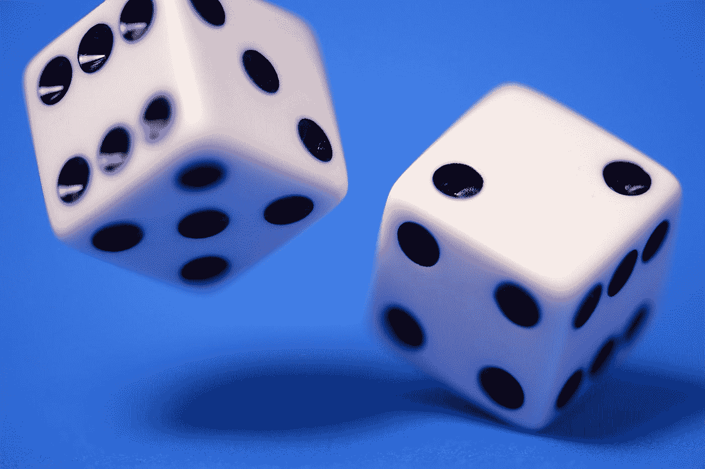
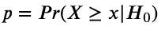
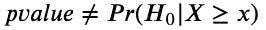
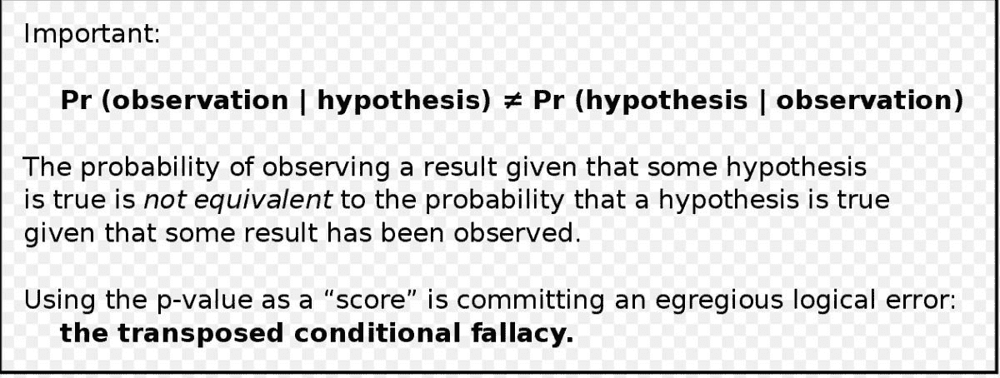
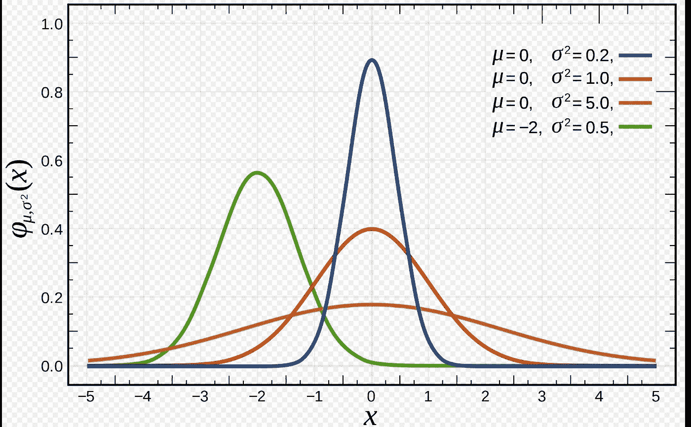
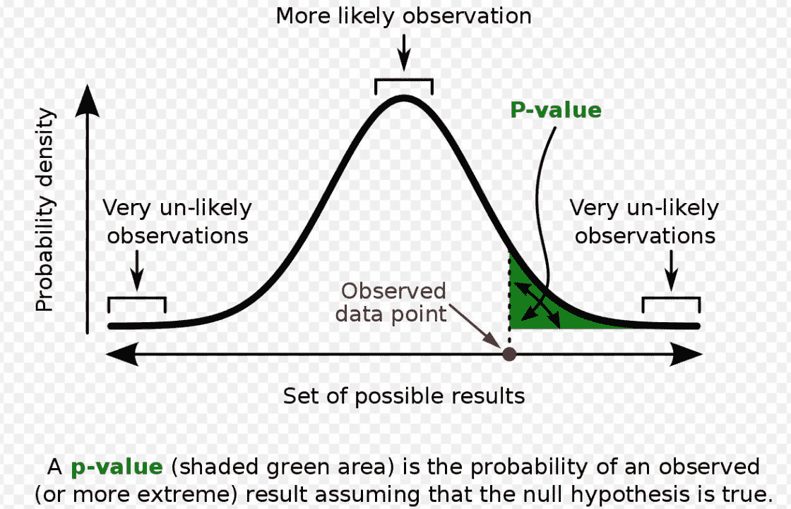
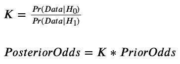

# p-价值观:“科学种族主义”的遗产

> 原文：<https://towardsdatascience.com/p-values-a-legacy-of-scientific-racism-d906f6349fc7>

## 统计学和人工智能的遗产

## 深入了解 p-values 的不为人知的历史及其遗产

免责声明:我会给某些词加上引号，比如种族、种族测量等等。因为这些术语不仅带有历史歧视，而且“种族”也是不科学的。一个“种族”的人是一个 ***非科学的*** *名词。此外，读者应该对 p 值、假设检验和贝叶斯定理有一点熟悉。*

照片由 [Edge2Edge Media](https://unsplash.com/@edge2edgemedia?utm_source=medium&utm_medium=referral) 在 [Unsplash](https://unsplash.com?utm_source=medium&utm_medium=referral) 上拍摄

很容易认为科学是客观的。毕竟，科学是研究和记录自然界发生的事情，对吗？自然世界“超越”了人类的领域，超越了我们的想象和思维，就像科学课会教的那样。

但是我们不应该忘记是谁在进行科学研究:当然，显微镜会帮助你更近距离地观察更小的物体和有机体，是的，使用 X 射线望远镜可以显示星系的某些特征，这些特征在可见光下可能不明显——但是最终，我们人类在进行观察。并且*我们*正在做数据的*解释*。

在我们深入研究 p 值的历史，以及该值可能的替代解决方案(以及它们的缺点)之前，让我们简要回顾一下它的定义。

统计学中的定义是:假设检验的 p 值是你的检验统计量取观察值或更极端值的概率，*假设*你的零假设为真。在数学符号中，这将是

垂直线表示“给定 H0”，这意味着“假设零假设为真”。值 *x* 可能是，比如说“z 得分”，或者“t 统计”，或者“卡方统计”——如果这些是你统计学课上熟悉的词的话。

一个最常见的错误是假设 p 值告诉你给定数据证据的零假设的概率。这是 ***错了*** 。这种情况的数学符号是:

这两个公式是不同的 *—* 但是很容易混淆。通常，在做了实验后，科学家们想要第二个公式，但经常被第一个公式卡住。稍后，我们将看到如何从一个到另一个，以及如何连接到测量实验统计结果的替代方法。

维基百科对这种常见错误有一个很好的解释:

图片来源:[https://en . Wikipedia . org/wiki/P-value #/media/File:P-value _ in _ statistical _ significance _ testing . SVG](https://en.wikipedia.org/wiki/P-value#/media/File:P-value_in_statistical_significance_testing.svg)

统计学家对 p 值有一种又爱又恨的关系，最近他们一直批评 p 值是统计测试中“重要性”的衡量标准，并警告科学家注意常见的陷阱。不相信我？[阅读美国国立卫生研究院【2015 年的这篇文章。我们稍后会重温这种又恨又爱的关系，所以把它放在你的脑海深处。](https://www.ncbi.nlm.nih.gov/pmc/articles/PMC4394578/#:~:text=The%20smaller%20the%20%E2%80%9CP%E2%80%9D%20value,for%20a%20given%20sample%20size.)

**什么是科学种族主义？**

在我讨论 p 值背后的历史之前，我需要简要提及“科学种族主义”一词的背景，因为它不仅包含了政府支持的多年种族政策，而且是与 p 值和统计学中的显著性测试交织在一起的历史之一。“科学的种族主义”，或者更准确地说*伪科学的种族主义*(因为种族主义不是科学的)，是欧洲殖民政府——以及他们雇佣来进行政府调查和数据收集的统计学家*通过使用统计测量来证明其种族主义政策的一种方式，这种方式通常是以一种极其偏见和不正确的方式进行的。例如，如果你听说过殖民时代欧洲伪科学家使用的臭名昭著的“头骨测量”来试图证明头骨大小和智力之间的(虚假)相关性，他们这样做是为了给诸如“非洲人、美洲原住民和亚洲人因为体型较小而不如欧洲人聪明”的说法提供科学支持当然，这些说法是完全不科学和毫无根据的——但是使用科学术语和测量作为支持是一种安抚他们负罪感的方法。*

现在，我已经简要介绍了什么是科学种族主义，我们将在后面与显著性测试和 p 值相关的文章中看到更具体的例子。但是首先，我们来了解一下 p 值的历史和背景。

我将引用数学家奥布里·克莱顿的[精彩文章，《优生学如何塑造统计学》](https://nautil.us/how-eugenics-shaped-statistics-9365/)在*鹦鹉螺，*关于统计学的历史。

# P 值的历史

p 值不是突然出现的。它们是对 18 世纪和 19 世纪数学家的回应，他们试图理解概率和随机性的理论概念，以及如何将其与计算物理实验的统计结果联系起来，如掷骰子、掷硬币或更复杂的物理实验。

如果你上过统计学课(或者是统计学家，或者大学主修)，我肯定你听说过高尔顿、皮尔逊和费希尔这样的名字。我们会提醒自己，他们是人(有时在课堂上听了这么多次[插入姓名]的公式后，我很难记住这一点！).尽管这些人支持统计学是从数据中得出结论的可靠、客观的方法，甚至在他们自己的工作中，这些统计学家“揭示了客观性的*神话*一直是如何*思考*的”，正如 Clayton 所写。

高尔顿来自维多利亚时代的一个上流社会家庭，他经常发表关于如何通过人类选择性繁殖来“精炼”人类智力的观点——通过繁殖最富有的，“有学问的”男人，而不是英国社会的其他阶层。很正常…我知道。他还生活在 19 世纪 50 年代，当时欧洲在亚洲和非洲的殖民主义不断扩张，而美国仍深陷于种族主义奴隶制和种族隔离之中。因此，高尔顿将他的“繁殖”思想应用于不同“种族”(种族主义科学家使用这个术语)的人也就不足为奇了。

但是这和*种族主义*有什么关系呢？嗯——当殖民时期的欧洲“科学家”开始测量世界上“种族”的身高、体重和外貌时，他们依靠像高尔顿这样的欧洲统计学家根据数据得出结论。他和他同时代的人相信每个“种族”的人的测量值会遵循一个钟形曲线——正态分布。

图片来源:[https://en . Wikipedia . org/wiki/Normal _ Distribution #/media/File:Normal _ Distribution _ pdf . SVG](https://en.wikipedia.org/wiki/Normal_distribution#/media/File:Normal_Distribution_PDF.svg)

如果这些“种族测量”遵循正态分布——嗯，因为每个正态曲线都有特定的均值和标准差——它“遵循”每个“种族”的人都有“平均长相”。如果这种逻辑听起来已经让你毛骨悚然——那是因为它确实如此——坦率地说，这些统计学家如何说服自己他们的研究完全是“科学的”,这令人震惊

*Raveena，那么 p 值和这个有什么关系呢？！*

后来，到了 19 世纪，科学家们研究了各种各样的(非人类)生物，注意到有相当多的“不寻常的测量”，正如 Clayton 所指出的，19 世纪 70 年代的一位统计学家——卡尔·皮尔逊——是的，是心爱的皮尔逊相关性的统计学家——想知道如何确定数据点是否呈正态分布。理论上，如果你能搞清楚这一点，这将告诉你一船的信息，特别是在检测科学家们所渴望的异常值(“不寻常”)数据方面。

正如克莱顿所指出的，在皮尔森之前，统计学家只是简单地画出结果的直方图，然后基本上玩点连接(或连接条？？)来看看它是否像一条钟形曲线。但是皮尔森在他的方法中加入了更多的数学知识，并创造了一个 3 步流程:

1.  假设数据符合您最初设想的某种类型的分布。这就是我在文章开头提到的“零假设”。也写下你的“另类”假设。
2.  将数据与您从零假设假设的数据分布中预期的数据进行比较，并计算所谓的皮尔逊“卡方检验统计量”
3.  计算该检验统计量的 p 值，并确定结果是否“显著”。并评估这是否提供了支持替代假说的证据。

克莱顿指出，皮尔森实际上并不认为统计学意义一定意味着“值得科学发现”——他只是用这个词来表示，“哦，数据表明了一个不同的假设。"

所以在这里，我们可以看到“异常值”，或“不寻常的观察值”是不太可能被检验统计量标记出来的。而 p 值就是那个区域的总面积(概率)。

用统计数据为种族主义辩护的大罪

但是皮尔森和他同时代的统计学家犯的主要错误不是像克莱顿指出的那样将这些测试应用于螃蟹——而是应用于人类。人类在我们的生活经历和文化中差异太大，但这并没有阻止皮尔森试图将他的统计方法应用于对不同“种族”的人类进行的“生物学测量”，正如他所认为的那样。20 世纪 10 年代初，皮尔森对英国的 4000 对兄弟姐妹进行了一项统计研究，并“确定”眼睛颜色和其他身体部位的统计测量与他们的性格有“强烈的相关性”——根据 p 值显著性测试——如“自信和内省”(克莱顿)。根据今天的科学标准，我们会立即驳回这种说法，但仅仅十年后，当犹太难民逃离东欧逃到英国时，皮尔逊将*相同的*有缺陷的 p 值相关性分析应用于*犹太儿童——*，他从他的显著性测试中得出结论，他们是“劣等血统”，他们的“智力几乎与环境因素和歧视无关”(Clayton)如果你认为你会因为这个判断而嘲笑他——你并不孤单——但是不要忘记，Pearson 相关性仍然存在于 Python 和 R 库中。很难将这些统计学家用数学支持优生学判断的事实，与他们对该领域非常有效的令人印象深刻的贡献分开。

像皮尔逊、高尔顿这样的统计学家，以及后来像达文波特这样的教授，都相信优生学、种族主义，并且会用统计学上的论据来支持关于“种族间混合的危险”、“种族内繁殖以保存智力”以及各种其他论据的可怕理论(克莱顿)。皮尔逊甚至参与了美国大学内外的“优生学系”和社团——这些组织坚决反对美国白人和有色人种(亚洲人、非洲人、土著人等)的种族混合

现在是什么情况？

快进 100 年后——2019 年，近千名统计学家和科学家呼吁对显著性测试进行深刻的批判，他们要求改变的呼吁得到了美国统计协会的回应。事实上，统计学家 Ron Wasserstein 在同年的美国统计学教学会议上做了一个令人惊讶的演讲，解释了为什么 p 值，尤其是 p 值为 0.05 的低显著性标准，应该重新评估。

他们有效的论点指出，基于两个假设(看起来像是一个任意的数字)做出显著性决定不是一项有意义的统计任务，如果你的数据中有足够多的变量，那么“伪相关性”——正如他们所称的那样——可能经常发生，并且仅仅由于概率的乘法和互补性质，按照“p < 0.01” criteria will happen — even if that measurement is *的标准，至少一个“显著性测量”的机会对观察者来说是没有意义的。*

因此，如果 p 值和所谓的“经典假设检验”需要批判和回顾，有哪些替代方案，它们是“最佳”选择吗？

# 可能的替代方案

因此，如果 p 值和显著性测试有缺陷，需要深入的批判性分析，有什么替代方法呢？它们是好的替代品吗？他们是否访问了与 p 值意义类似的模糊且有风险的领域。嗯，答案是，一如既往:这很复杂，但有一些途径。

**统计数据的先验知识**

在文章的开头，我提到人们很容易认为统计和科学数据测量是客观的，但事实并非如此——关键是数据本身不会说话——它必须在*更大的背景下*被*解读*才能得出实际的结论。

例如:假设我在人行道上捡到一枚硬币，并做了一个实验:我将它抛 10 次，结果是 9 个头，1 条尾巴。现在，假设 A，Jason，以前从未见过硬币——也许他们是来自 2100 年的时间旅行者，那里没有硬币存在，他们的社会没有硬币的历史记忆，他们只使用电子支付——跟我来！杰森会如何解读这些数据？好吧，数据表明，既然 10 次翻转中有 9 次是正面，那么正面的概率“应该”是 9/10。至少，证据是*与 p = 9/10 的假设*一致。因为杰森从未见过硬币，所以他相信证据是有道理的。

人 B，Verity——来自 2022 年，他肯定见过硬币并持有过硬币，对硬币有一定的了解。数据再次表明，因为 10 次翻转中有 9 次是正面，所以证据与 p = 9/10 的假设一致。但是，对维蒂来说，这里有一个陷阱:从维蒂的经验(和社会)来看，在人行道上随机发现的硬币通常是对半公平的，所以她有关于硬币如何工作的**先验背景**。她会在他们的头脑中非常重视“公平硬币”(p = 1/2)假设，并得出结论，在他们的假设背景下，9 个头的数据是一个统计上的侥幸。

(顺便说一句，对不起，杰森——我知道你来自一个比我和 Verity 科技发达得多的时代，但是……这一次，我掷了一枚公平的硬币。缺乏关于硬币的上下文歪曲了你的结论！)

如果我将硬币抛 100 次，得到 90 个正面，那么这可能足以让 Verity 改变她对硬币公平的假设，换句话说，她认为硬币有偏见的几率会增加。麻省理工学院的认知科学家 Joshua Tenenbaum [在 Youtube 上有一个很棒的视频](https://www.youtube.com/watch?v=icEdI0AIOlU)详细介绍了这个实验，大约在 37:20 的时候。

**解读数据得出结论**

注意之前我提到 Verity 的时候——她在她假设的不同背景下解释了同样的数据*。“语境”这个词很重要。事实证明，“贝叶斯统计”领域非常关注假设的背景——它称之为“先验背景”，或“先验假设”——杰森和维里蒂做出的先验假设极大地扭曲了他们对相同数据*做出的结论*。事实证明，贝叶斯主义者正试图为通常的显著性检验提供替代方案。*

其中一个选择叫做“贝叶斯因子”。在某种意义上，贝叶斯因子有助于比较在零假设下的数据是否比另一个更有可能。它基本上告诉我们有多少数据(证据)支持零的选择，这是非常有用的。数学上是这样写的:

图片鸣谢:作者。等式 1 是贝叶斯因子，写为“K”。情商。2 是贝叶斯推断，写成赔率。

如果你曾经见过下注者把他们的赌博赔率写为“2 比 1”，或者“这样赢的几率是千分之一”，那就是我们在这里使用的相同类型的赔率。“二比一”和“千分之一”的赔率将分别写成 2:1 和 1:1000。

斯坦福大学医学教授 Steven Goodman，[在这里有一篇很棒的文章](http://www.statlit.org/pdf/2001-Goodman-Epidemiology.pdf)比较了贝叶斯因子和 P 值，并指出 200 左右的贝叶斯因子——这意味着替代假设为真的可能性比空值高 200 倍——通常具有 0.001 左右的“相应”P 值，这表明“经典显著性”可能需要更强的 P 值条件。德克萨斯大学奥斯汀分校[的统计学家 Brendan Kline 在他的研究论文](http://www.brendankline.com/papers/Kline-Bayes-Sept2020.pdf)中指出，在*大数据*的背景下，0.1 左右的贝叶斯因子表示反对零假设的“强有力”证据，对于这些类型的数据集的假设检验，对应的“显著性”p 值应小于 0.0025(Kline)。回到 2018 年，[Springer Nature Psychiatry](https://bmcpsychiatry.biomedcentral.com/articles/10.1186/s12888-018-1761-4#Sec9)的这篇文章提到，在假设检验方面，贝叶斯因素的优势是补充 p 值和效应大小。然而，贝叶斯因子的强度确实取决于“先验分布的宽度*”*，这是由研究人员设定的——所以，如果你在寻找一些“客观”的衡量标准，你就不走运了。最后，贝叶斯因子*本身*并不能决定你，研究者，应该选择哪一个假设——在看到任何数据之前，你必须将它与完全由研究者决定的先前优势比结合起来。

# 最后的想法

我希望通过阅读这篇文章，你已经了解了 p 值的历史，p 值和经典假设检验的有问题的应用，这揭示了它的局限性，以及研究人员正在采取的补救这些挑战的尝试。不希望读者看完这篇文章后觉得 p 值没用。p 值在 R 等统计软件或 Python 的*scikit-learn*&*scipy . stats*库中更为常见——贝叶斯技术对 Python 的数据库来说是非常新的。但是重要的是理解*为什么*对经典测试的批评存在，统计学的一个潜在主题是主观性无处不在，在这个领域中贯穿始终。数据几乎不能说明问题。它必须在周围的环境中被解释。