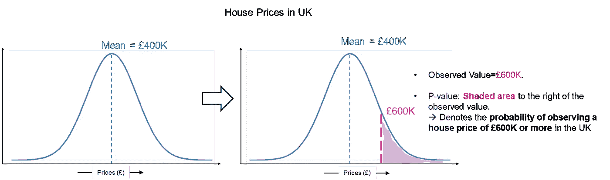
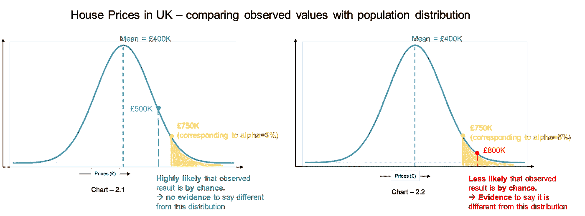

# p 值——正确解释的介绍

> 原文：<https://towardsdatascience.com/p-values-an-introduction-to-correct-interpretation-14417771dd0f>

## *在 5 分钟内理解一个非常广泛使用(和滥用)的统计概念*

由 [Edge2Edge 媒体](https://unsplash.com/@edge2edgemedia?utm_source=medium&utm_medium=referral)在 [Unsplash](https://unsplash.com?utm_source=medium&utm_medium=referral) 上拍摄

如果你和我一样，很早就接触了数据科学，那么你很有可能会听到“p 值”。他们无处不在；假设检验、线性/逻辑回归、Anova / Ancova 表等。— **没有逃逸的‘p 值’**。与此同时，有许多分析师/数据科学家**不理解它的含义，并盲目地使用它来得出他们分析中的结论**。下面的帖子旨在理解 P 值背后的直觉，它意味着什么，更重要的是它不意味着什么。下面的帖子还涉及到**显著性水平、阿尔法值和零假设**，这是正确理解 P 值所必须的。

# 这是什么意思？

p 值是对观察到的数据随机出现的可能性的度量。

> 它传达了，**在零假设的前提下，得到观测数据值**的可能性有多大。
> 
> →如果这个**可能性低，那么零假设可能不成立**；然而，如果这种**可能性很高**，那么就没有**理由质疑**零假设。

我们稍后会谈到零假设。让我们从一个基本的例子开始，然后在此基础上建立理解的层次。

考虑一个场景，你收集英国的房价数据，并绘制它们。请看图-1(下图)，其中左图表示伦敦房价分布。平均房价 40 万。显然，房价以平均值为中心(由峰值表示)，这意味着如果我们随机选择一所房子，其价格接近 400，000 的可能性很高，随着我们从平均值向极端值移动，找到价格高于(或低于)平均值的房子的可能性迅速降低。

让我们在这个分布中选择一个随机值，比如 600K。你找到 60 万以上房价的机会*(或概率)**(即至少 60 万)*可以用这个点右边的阴影区域来表示。这就是' **P 值**所代表的。

图片-1 |英国房价分布(虚拟数据)(图片由作者提供)

**P 值是从总体分布中随机选取值时，获得至少与观察值一样“极端”的值的总概率。**

上面的定义是有用的，但是没有给出它如何决定你的分析结果的味道。为了理解 P 值的用途，让我们深入研究重要性和 Alpha 级别。

# 显著性水平和 Alpha

统计测试的全部思想是了解我们观察到的是否有意义，或者换句话说，我们观察到的数据是否与标准(或总体)有显著差异。

这意味着我们总是在比较两件事情，并试图确定这种差异是否具有统计学意义。**显著性水平是一个预先确定的临界值，基于这个临界值，我们可以判断我们的观察或发现(或假设)是真是假**。作为一名数据科学家，这是一个预先确定的置信度。

Alpha 级别直接来自您决定的显著性级别，就像作为数据科学家您乐于在分析中拥有的阈值错误率。 **alpha 值是一个阈值 p 值，超过该值，您会高兴地认为观察到的样本值与总体显著不同，甚至属于某个新的样本分布。**

> Alpha 值= 1 —显著性

*请注意，显著性水平和 Alpha 水平由您决定。*最常见的显著性选择值是 95%。对于显著性=95%，alpha 变为 5%。

在下面的图片-2 中，橙色点表示这个阈值 alpha 截止值为 5%，相应的房价为 750K。也就是说，基于该分布，该点右侧的面积(橙色阴影区域)为 5%。

图片-2 |观察值与人口分布的比较(虚拟数据)(图片由作者提供)

假设**绿点和红点代表我们对房价的一些额外样本观察**(可能来自也可能不来自英国)。绿色代表房价 50 万*(图-2 图-2.1)*，红色代表房价 80 万*(图-2 图-2.2)*。我们将检查它们是否来自英国房价的原始人口分布。

*   让我们从对应于 500K 的**绿点**开始，与之相关的 **p 值大于阈值α***(即绿点右侧的区域大于橙色的‘p 值’阴影区域)*。也就是观察到房价至少极端到 500K 的概率大于 5%(我们的阈值α)。这意味着**在人口分布**中很有可能观察到这个值(与我们的阈值 5%相比)。因为这些很有可能从这个群体中观察到，所以没有理由认为它们来自不同的分布。
    →这意味着，**绿点与该群体的分布没有显著差异**。

*(请注意* ***如果作为一名数据科学家，你需要更放松地对待你想要拥有的置信度*** *，即将置信度降低到 95%以下，导致 alpha 水平高于 5%，* ***这个绿点可以变成显著的*** *。)*

*   现在我们来看 800K 对应的**红点**；显然，红点对应的 **p 值小于我们设置的** *阈值α(即红点右侧的区域小于橙色的‘p 值’阴影区域)*。基于我们**预先决定的显著性水平**(以及预先决定的 alpha 水平)，我们可以说**不太可能从这个人口分布中观察到 80 万的房价。**
    因此，红点**与人口****明显不同，很可能来自不同的分布**(即该房屋可能不在英国)。

*(请注意* ***如果作为一名数据科学家，你要对置信度*** *更加严格，即把置信度提高到 95%以上，反过来把 alpha 从 5%降低，* ***这个红点观察可以变成不重要的*** *。)*

## 迷茫！！..让我们详细检查一下我们在上面做了什么:

我们有一个分布(即在这种情况下英国房价的人口分布)，我们有两个额外的样本观察值，由一个绿色和一个红色的点表示(分别对应于 50 万和 800 英镑的房价)。对于绿点和红点，观察值(500K 和 800)不同于总体平均值(400K)。

**任务:**证明或反证观察到的房价是否属于人口分布。
—这反过来意味着检查绿点和红点的观察值是否与该人群有显著差异。

注意**只能是两种场景**中的一种:

1.  房子属于英国，我们随机选择了一个以观察值(500 和 800k)定价的房子，不同于英国平均房价 400K(即人口平均值)。
2.  房子不属于英国，因此我们观察到的价格(500 和 800k)不同于英国平均房价 400K(即人口平均值)

我们从假设基线开始，中性假设，也称为零假设。我们从一开始就假设零假设是正确的，并寻找证据来证明它是错误的。在这种情况下，

***零假设:*** *绿色和红色分属于总体分布。*

> 请注意，我们从假设中性零假设为真开始，并试图收集证据来拒绝它

我们在上述框架中隐含遵循的步骤:

*   我们**预先选择了我们的置信度/显著性水平**，这意味着我们预先决定了我们的 alpha 水平(即 5%是最普遍接受的水平)。
    *注意，我们希望根据我们预先确定的置信度检查观察值(500K 和 800K)是否属于总体分布。*
*   基于**观察值(500K 和 800K)，我们找出了相应的 p 值**，即在总体分布中得到该观察值的可能性。
*   我们**将**的 **p 值**与我们**预先确定的 Alpha** 水平进行比较。

只有两种可能…

## **1。观察 P 值≤α:**

这意味着，**(与我们预先确定的α水平相比)从总体分布中获得观察值的可能性非常小**。

→观察值**与总体分布**显著不同。
→它可能来自一个**完全不同的分布**。

基于这些证据，我们可以**拒绝零假设**。

## **2。**观察到的 **P 值>α:**

这意味着**(与我们预先决定的阿尔法水平相比)很有可能从人口分布**中获得观察值。

→观察值**与人口分布**没有显著差异。
→一定是来自**相同的人口分布**。

基于这些证据，我们**不能拒绝零假设**。

对于α= 5%，

> p 值≤ 0.05:拒绝零假设
> 
> p 值> 0.05:不能拒绝零假设
> 
> p 值可以被认为是反对零假设的**证据** b **为真**

> ***你知道吗？***
> 
> p 值仅说明观察到的数据是否与我们的零假设中陈述的数据有显著差异。通过**得到的 p 值并不意味着观察到的数据和所述的零假设之间的差异**的大小。

# 摘要

p 值是对应于获得数据值(‘检验统计’)的**可能性的概率值，在假设零假设正确的情况下，该值至少与实际观察到的数据值(观察到的‘检验统计’)**一样“极端”。

p 值对应于**您的数据在零假设**下出现的可能性。

> ***P 值提供了一个答案:*** 假设无差异(即零假设)，在数据中看到我们正在观察的差异的可能性有多大。

记住:零假设——中性、基线、不变假设

*   p 值≤α值→拒绝零假设
*   p 值≤α值→拒绝零假设

P 值玩得开心！！

## 保持联系..

如果你喜欢这篇文章并且对类似的文章感兴趣的话 [***在 Medium 上关注我***](https://medium.com/@deepakchopra2911)[***加入我的邮件列表***](https://medium.com/subscribe/@deepakchopra2911) 和*(..如果你已经不是了..)*跳上成为 [***中型家族的一员***](https://medium.com/@deepakchopra2911/membership)*获取数以千计的有用文章。*(如果你使用以上链接，我将获得你 50%的会员费)**

***..不断学习，不断成长！***