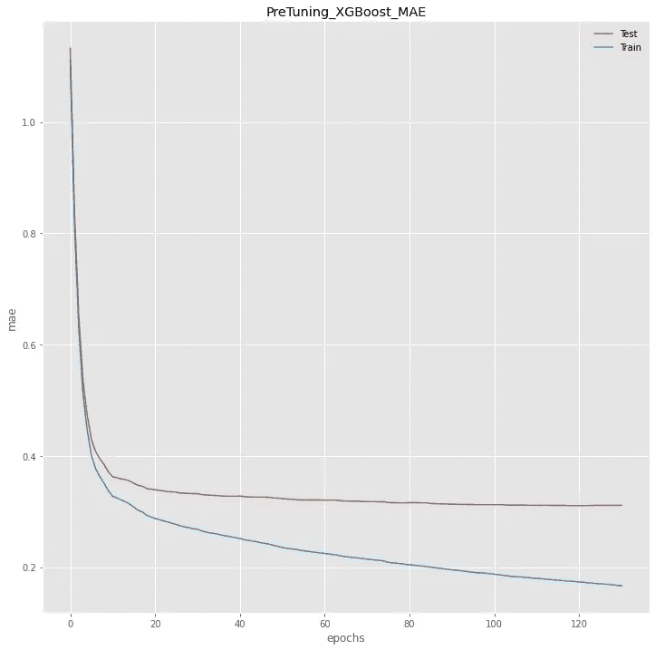
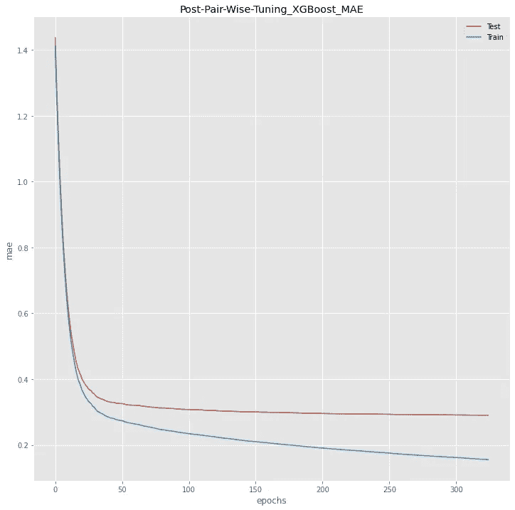
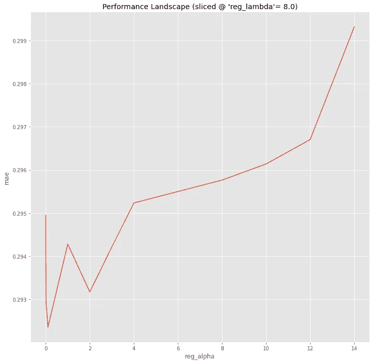
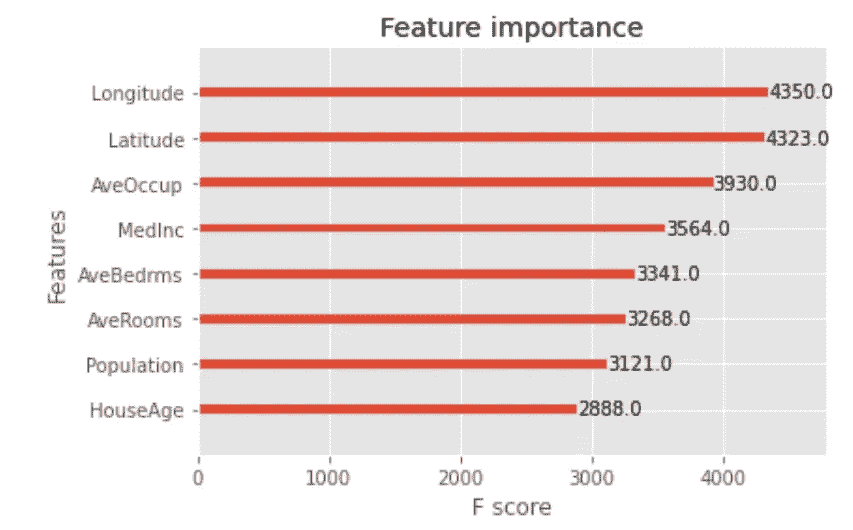

# 使用原生 XGBoost API 进行成对超参数调优

> 原文：<https://towardsdatascience.com/pair-wise-hyperparameter-tuning-with-the-native-xgboost-api-2f40a2e382fa>

## 在解决偏差-方差权衡时搜索全局最小值


马库斯·斯皮斯克在 [Unsplash](https://unsplash.com?utm_source=medium&utm_medium=referral) 上的照片

由于 Boosting Machine 有过拟合的倾向，XGBoost 非常关注解决 [***偏差-方差权衡***](https://en.wikipedia.org/wiki/Bias%E2%80%93variance_tradeoff#:~:text=In%20statistics%20and%20machine%20learning,bias%20in%20the%20estimated%20parameters.) 并通过超参数调整方便用户应用各种正则化技术。

这篇文章将带您浏览使用原生 XGBoost API 的超参数调优的代码实现，以解决偏差-方差权衡问题。该项目的全部代码发布在[我的 Github 库](https://github.com/deeporigami/Portfolio/blob/main/XGBoost/Version%201%20XGBoost%20Hyperparameter%20Tuning%20and%20Performance%20Landscape.ipynb)中。

读完这篇文章后，您可以复制或修改我在下面演示的过程，用本机 XGBoost API 为您自己的回归项目进行超参数调优。

# 介绍

我们的目标是对原生 XGBoost API 执行超参数调优，以提高其回归性能，同时解决偏差-方差权衡问题，特别是减轻 Boosting 机器的过度拟合倾向。

为了进行超参数调谐，本次分析采用 ***网格搜索*** 的方法。换句话说，我们选择超参数的搜索网格，并计算搜索网格上所有超参数数据点的模型性能。然后，我们确定 ***性能的全局局部最小值—*** 或产生最佳性能的超参数数据点(目标函数的最小值)—作为调整模型的最佳超参数值。

## 计算约束

超参数调整在计算上可能非常昂贵，这取决于您如何设置搜索网格。因为它需要在搜索网格中设置的所有数据点上迭代性能计算。数据点越多，计算成本就越高。很简单。

不幸的是，我的笔记本电脑计算能力非常有限。但是，一个好消息是，Google Colab 为其免费帐户的每个用户提供一个 GPU。并且原生的 XGBoost API 具有 GPU 支持特性。总之，我可以通过使用 Google Colab 的 GPU 运行原生 XGBoost API 来加快调优过程。

尽管如此，当选择的搜索网格有大量的数据点要覆盖时，一个 GPU 仍然不够。因此，我仍然需要解决计算资源的限制。

理想情况下，对所有选定的超参数进行单个联合调整将准确捕捉它们之间所有可能的相互作用。然而，联合调谐具有巨大的搜索网格数据点，因此在计算上将是昂贵的。在这种情况下，我将执行多个 ***成对超参数调整*** ，而不是 ***单个联合同时调整所有超参数*** 。这不仅会减少用于调整的超参数数据点的数量，还允许我们为每个成对调整呈现性能前景的 3D 可视化。当然，这种方法有一个问题。我们将在以后讨论这个问题。

现在，让我们开始编码。首先，我们需要下载数据进行分析。

# 分析

# A.数据

对于回归分析，我们使用 sklearn API 的内置加州住房数据集。数据集的来源是 StatLib 的数据集存档中的 [houses.zip。数据集的许可证“License: BSD 3 clause”可以在这里的代码](http://lib.stat.cmu.edu/datasets/)的[的第 22 行找到。关于数据集的解释，请阅读](https://github.com/scikit-learn/scikit-learn/blob/36958fb24/sklearn/datasets/_california_housing.py)[此链接](https://github.com/scikit-learn/scikit-learn/blob/36958fb24/sklearn/datasets/_california_housing.py)。

我们可以使用[***fetch _ California _ Housing***函数](https://scikit-learn.org/stable/modules/generated/sklearn.datasets.fetch_california_housing.html)从***sk learn . datasets***下载加州房屋数据集。

我们可以将数据集存储到变量 ***housing_data*** 中。

```
from sklearn.datasets import fetch_california_housing
housing_data = fetch_california_housing()
```

现在，我们需要将导入的数据集转换成熊猫数据帧。我们将特征和目标变量分别分离成 df1 和 df2。

```
descr = housing_data['DESCR']
feature_names = housing_data['feature_names']
data = housing_data['data']
target = housing_data['target']
df1 = pd.DataFrame(data=data)
df1.rename(columns={0: feature_names[0], 1: feature_names[1], 2: feature_names[2], 3: feature_names[3],
 4: feature_names[4], 5: feature_names[5], 6: feature_names[6], 7: feature_names[7]}, inplace=True)
df2 = pd.DataFrame(data=target)
df2.rename(columns={0: 'Target'}, inplace=True)
housing = pd.concat([df1, df2], axis=1)
print(housing.columns)
```

现在，让我们看看数据帧功能的摘要信息。

```
df1.info()
```

以下是输出:

```
<class 'pandas.core.frame.DataFrame'>
RangeIndex: 20640 entries, 0 to 20639
Data columns (total 8 columns):
 #   Column      Non-Null Count  Dtype  
---  ------      --------------  -----  
 0   MedInc      20640 non-null  float64
 1   HouseAge    20640 non-null  float64
 2   AveRooms    20640 non-null  float64
 3   AveBedrms   20640 non-null  float64
 4   Population  20640 non-null  float64
 5   AveOccup    20640 non-null  float64
 6   Latitude    20640 non-null  float64
 7   Longitude   20640 non-null  float64
dtypes: float64(8)
memory usage: 1.3 MB
```

# ***B .库导入***

接下来，让我们看一下我们将要使用的库。

*   首先，我们需要原生的 XGBoost API 来运行它和它的 ***plot_importance*** 来显示调优后所选模型的特性重要性。

```
import xgboost as xgb
from xgboost import plot_importance
```

*   我们还使用来自***sk learn . metrics***的***mean _ squared _ error***进行度量。

```
from sklearn.metrics import mean_squared_error
```

*   对于训练测试数据集的拆分，从***sk learn . model _ selection***中的***train _ test _ split***可以方便我们拆分数据帧。

```
from sklearn.model_selection import train_test_split
```

*   为了可视化，我们使用 Matplotlib 中的以下项目来呈现 3D 图像。

```
from matplotlib import pyplot
import matplotlib.pyplot as plt

from mpl_toolkits.mplot3d import Axes3D
```

# ***C .超参数&成对调谐***

## 1.选择用于调谐的超参数

原生 XGBoost API 内置了这么多超参数。由于给定的有限计算资源可用性，我们必须做一些挑选。

[*Jason Brownlee*](https://machinelearningmastery.com/about)*概述了正则化有 [5 类超参数](https://machinelearningmastery.com/gentle-introduction-gradient-boosting-algorithm-machine-learning/):迭代控制、收缩、树约束、随机采样、L1 & L2 正则化。根据他的框架，该分析选择了以下 9 个超参数来解决偏差-方差权衡问题。有关每个超参数的详细信息，请访问下面每个超参数中设置的超链接。*

*a)迭代控制:以下两个超参数操作迭代控制。*

*   *[**num _ boost _ round**](https://xgboost.readthedocs.io/en/latest/python/python_api.html?highlight=cv()#xgboost.train)*
*   *[**【早 _ 停 _ 轮**](https://xgboost.readthedocs.io/en/latest/python/python_api.html?highlight=cv()#xgboost.train)*

*其余的超参数需要设置在一个字典中， ***pram_dict*** 。当我们在搜索网格上的数据点上迭代 k 倍交叉验证时，我们可以使用这个参数字典来操纵超参数的值。*

*b)收缩率:*

*   *[**eta**](https://xgboost.readthedocs.io/en/stable/parameter.html#parameters-for-tree-booster)*

*c)采油树助推器约束:*

*   *[**最大 _ 深度**](https://xgboost.readthedocs.io/en/stable/parameter.html#parameters-for-tree-booster)*
*   *[**min_child_weight**](https://xgboost.readthedocs.io/en/stable/parameter.html#parameters-for-tree-booster)*
*   *[**伽玛**](https://xgboost.readthedocs.io/en/stable/parameter.html#parameters-for-tree-booster)*

*d)随机子采样:*

*   *[**子样本**](https://xgboost.readthedocs.io/en/stable/parameter.html#parameters-for-tree-booster)*
*   *[col sample _ bytree](https://xgboost.readthedocs.io/en/stable/parameter.html#parameters-for-tree-booster)*

*e) L1 和 L2 的正规化*

*   *[**阿尔法**](https://xgboost.readthedocs.io/en/stable/parameter.html#parameters-for-tree-booster)*
*   *[**λ**](https://xgboost.readthedocs.io/en/stable/parameter.html#parameters-for-tree-booster)*

*f)不用于调谐的附加条目:*

*此外，我们需要在参数字典中指定以下 4 个额外的超参数。作为一项预防措施，这些超参数将是固定的，但不会被调整。*

*   ****目标*** :选择回归的目标函数。*
*   ****eval_metric*** :选择回归的绩效评估指标*
*   ****gpu_id*** : 0 由 Google Colab 早先指定*
*   ****tree _ method***:***gpu _ hist***选择 GPU 设置*

*到目前为止，我们已经讨论了 3 件事情:选择用于调整的超参数、参数字典的初始设置以及用于评估初始偏差-方差权衡的初始(预调整)性能曲线。我们发现了实质性的差异，或者说过度拟合。*

## *3.成对超参数调谐*

*理想地，对所有这些超参数的单个联合调谐将准确地捕捉参数字典中这些所选超参数之间的所有可能的相互作用。然而，联合调谐具有巨大的搜索网格数据点，因此在计算上将是昂贵的。*

*为了节约分析的计算成本，我从 8 个参数对中选择了 4 个:即*

*   *(最大深度，eta)*
*   *(子样本，列样本 _ 字节树)*
*   *(最小 _ 孩子 _ 体重，伽玛)，以及*
*   *(寄存器α，寄存器λ)*

*然后，我对这 4 个超参数对中的每一个进行了成对调整。每次调整后，最佳调整结果用于替换超参数对的初始值。*

*通过这种方式，每一次成对调优都会逐步提高调优模型的性能。这总体上减少了搜索网格数据点的数量，从而以网格搜索的公正性为代价节省了调整过程的计算成本。当然，这里的基本假设是，通过 4 次成对调节获得的结果不会与通过理想的单一联合调节所有 8 个超参数获得的结果有实质性的偏离。*

# ****D .预调优回归:训练和测试数据集上的性能曲线****

*在调优之前，我们首先需要初始化参数字典的值，以便对训练数据集和测试数据集执行第一次回归。它是沿着训练迭代比较那些数据集上的初始性能曲线。这很重要，原因有二。*

*   *首先，我们想要比较训练性能和测试性能，以评估初始状态下的偏差-方差权衡，即欠拟合-过拟合权衡的问题。*
*   *第二，在调整结束时，我们希望比较调整前的性能曲线(包括训练和测试)和调整后的性能曲线，以评估调整的正则化影响。我们希望评估调优是否有效地对模型执行正则化，以解决偏差-方差权衡问题。*

*这里是我们的参数字典的初始化。*

```
*param_dict={'objective': 'reg:squarederror', # fixed. pick an objective function for Regression. 
 'max_depth': 6,
 'subsample': 1,
 'eta': 0.3,
 'min_child_weight': 1,
 'colsample_bytree': 1,
 'gamma': 0,
 'reg_alpha': 0.1,
 'reg_lambda': 1,
 'eval_metric': 'mae', # fixed. picked a evaluation metric for Regression.
 'gpu_id': 0, 
 'tree_method': 'gpu_hist' # XGBoost's built-in GPU support to use Google Colab's GPU
}*
```

*此处分配的值仅用于初始化目的。这些值(除了 objective、eval_metric、gpu_id 和 tree_method)将在超参数调整期间发生变化。*

*除了 pram_dict 中指定的那些超参数，我们还需要在 pram_dict 之外初始化另外两个超参数 num_boost_round 和 early_stopping_rounds。*

```
*num_boost_round = 1000
early_stopping_rounds = 10*
```

*现在，利用初始化后的参数字典 param_dict，我们可以使用内置的原生训练函数 xgb.train()，定义一个自定义函数，称之为***bias _ variance _ performance()***。其目的是通过比较训练数据集和测试数据集之间的初始模型性能曲线，评估沿着训练迭代的偏差-方差权衡。*

```
*def bias_variance_performance(params):

    evals_result = {}
    model = xgb.train(
        params,
        dtrain=DM_train,
        num_boost_round=num_boost_round,
        evals=[(DM_train, "Train"), (DM_test, "Test")],
        early_stopping_rounds=early_stopping_rounds,
        evals_result=evals_result
    )
    train_error = evals_result["Train"]["mae"]
    test_error = evals_result["Test"]["mae"]

   print("Best MAE before the Tuning: {:.4f} with {} rounds".format(model.best_score, model.best_iteration+1))return model, evals_result*
```

*关于内置训练函数 xgb.train()的详细信息，请参考[文档](https://xgboost.readthedocs.io/en/latest/python/python_api.html?highlight=train()#xgboost.train)。*

*以下是输出:*

```
*Best MAE before the Tuning: 0.3103 with 121 rounds*
```

*输出显示测试性能的最佳值，而不是训练性能的最佳值。在第 121 轮迭代中检测到了最佳的测试性能。换句话说，初始(预调整)模型(具有初始超参数设置)是在 121 轮迭代时确定的。*

*让我们比较第 121 次迭代时训练数据集和测试数据集之间的初始(预调优)模型性能。*

```
*[120]	Train-mae:0.17322	Test-mae:0.31031*
```

*在 121 轮迭代中确定的初始(预调整)模型(具有初始超参数设置)的训练性能为 0.17322，测试性能为 0.3103。巨大的差距表明差异，或过度拟合。*

*下面的图表有两条初始的(预调优的)性能曲线以及迭代循环:一条是蓝色的用于训练性能，另一条是红色的用于测试性能。*

**

*制作人:杉尾道夫*

*随着迭代的进行，初始的(预调优的)训练性能继续提高，而初始的(预调优的)测试性能在某个点上停滞不前。这表明在初始(预调整)模型中有一个显著的 ***方差*** ，或 ***过拟合*** 。*

*现在，为了解决偏差-方差的权衡，我们通过调整原生 XGBoost API 的超参数来对模型进行正则化。*

# ****E .调法:****

*在调优方法方面，我想强调几个重要的脚注。*

*   *我为每个超参数对设置了 ***搜索网格*** ，并使用 ***网格搜索方法*** 进行成对参数调整。*
*   *我迭代了 ***k 重交叉验证*** 来计算预定搜索网格上所有数据点的训练数据集的性能度量。*
*   *可视化使用了[三角插值技术](https://en.wikipedia.org/wiki/Surface_triangulation)来填充搜索网格数据点之间的间隙，并渲染出一个平滑的表演场景表面。*

## ****a) k 倍交叉验证****

*为了运行 [k 重交叉验证](https://en.wikipedia.org/wiki/Cross-validation_(statistics)#k-fold_cross-validation)，我们使用了内置的交叉验证函数， [xgb.cv()](https://xgboost.readthedocs.io/en/latest/python/python_api.html#xgboost.cv) 。作为一项预防措施，k-fold 交叉验证[只在训练数据集](https://stats.stackexchange.com/questions/436894/should-a-training-set-be-used-for-grid-search-with-cross-validation)(验证数据集从该数据集分配)上执行:不要将测试数据集传递到交叉验证函数:xgb.cv()。*

*我们可以对每个超参数对的预定搜索网格上的所有数据点重复 k 重交叉验证，以搜索回归性能度量的全局最小值，即平均绝对误差。*

***自定义 k 重交叉验证函数:(可选)***

*为了方便调优迭代，我们可以通过使用原生 XGBoost API 的内置交叉验证函数 xgb.cv()来定制一个 k 重交叉验证函数。对于我们的例子，我们为我们的分析设置了 5 个折叠。或者，可以探索其他值，例如 10。*

*下面是我的自定义交叉验证函数 cross_validation()的代码。这种定制是个人偏好的问题，因此是可选的步骤。关于要传递的超参数，[请查看文档](https://xgboost.readthedocs.io/en/stable/python/python_api.html?highlight=cv#xgboost.cv)。*

```
*def cross_validation(param_dict, DM_train, metrics, num_boost_round, early_stopping_rounds): 

    cv_results = xgb.cv(
        params=param_dict,
        dtrain=DM_train, 
        num_boost_round=num_boost_round,
        seed=42, # seed for randomization
        nfold=5, # k of k-fold cross-validation
        metrics=metrics,
        early_stopping_rounds=early_stopping_rounds   
    )

    return cv_results*
```

***成对网格搜索:pair_wise_gridsearch_CV***

*现在，为了定义成对网格搜索，我们可以定义一个函数，在超参数对的搜索网格的所有数据点上迭代 k 重交叉验证自定义函数 cross_validation()。下一个函数，***pair _ wise _ grid search _ CV*，**采用 3 个变量:*

*   *param1_name 和 param1_name:要优化的超参数对的名称。*
*   *gridsearch_params:要调整的超参数对的搜索网格。*

```
*def pair_wise_gridsearch_CV(param1_name, param2_name, gridsearch_params):min_mae = float("Inf")
    best_params = Nonex = []
    y = []
    z = []
    for param1, param2 in gridsearch_params:
        # Update our parameter dictionary for the tuning
        param_dict[param1_name] = param1
        param_dict[param2_name] = param2
        print("CV with {}={}, {}={}".format(param1_name, param1,
                             param2_name,
                             param2))
        # calculate cross_validation
        cv_results = cross_validation(param_dict, DM_train, metrics={'mae'}, num_boost_round=1000, early_stopping_rounds=10)
        mean_mae = cv_results['test-mae-mean'].min()
        boost_rounds = cv_results['test-mae-mean'].argmin()

        x.append(param1)
        y.append(param2)
        z.append(mean_mae)

        print("\tMAE {} for {} rounds".format(mean_mae, boost_rounds))

        if mean_mae < min_mae:
            min_mae = mean_mae
            best_params = (param1, param2)

return x, y, z, min_mae, best_params*
```

*函数 pair_wise_gridsearch_CV 在 gridsearch_params 中定义的超参数对的搜索网格上的所有数据点上迭代自定义交叉验证函数 cross_validation，以搜索性能前景的全局最小值。*

*gridsearch_params 需要在每次成对超参数调整之前预先确定。这是后面要展示的。*

## ****b)超参数对的性能景观的 3D 可视化****

*现在，我们可以定义一个可视化实用函数 ***Trisurf()*** 来呈现超参数的性能景观的 3D 可视化。我们将使用 matplotlib 的[***plot _ tris URF()***](https://matplotlib.org/3.1.0/tutorials/toolkits/mplot3d.html#tri-surface-plots)***。****

*plot _ tri surf()*使用三角插值技术[填充搜索网格上的数据点之间的间隙，以渲染性能景观的平滑表面。](https://en.wikipedia.org/wiki/Surface_triangulation)**

```
**import matplotlib.pyplot as plt
from mpl_toolkits.mplot3d import Axes3Ddef Trisurf(xname, yname, x, y, z, min_mae, best_params):
    # (xname, yname): the name of variables to be displayed for visualization
    # (`x`,`y`): all the hyperparamters' datapoints on the search grid 
    # (`z`): the results of the evaluation metric the results of the evaluation metric over the datapoints
    # (`min_mae`, `best_params`): the Native XGBoost API's `k-fold cross-validation` function's outputs the minimum mae result and the corresponding datapoint of the hyperparameters
    fig = plt.figure(figsize=(12, 12))
    ax = fig.add_subplot(111, projection="3d")
    # Creating color map
    my_cmap = plt.get_cmap('RdPu')

    # Creating dot plot of the minimum
    ## min_mae*1.01 to float it for the visualization purpose.
    ax.scatter(best_params[0], best_params[1], min_mae, color='red')
    # Tri-Surface Plot
    ax.plot_trisurf(x,y,z,cmap = my_cmap,
                         linewidth = 0.2,
                         antialiased = True,
                         edgecolor = 'grey')
    ax.set_xlabel(xname)
    ax.set_ylabel(yname)
    ax.set_zlabel('mae')

    # Write the Title
    ax.set_title("Hyperparameters Performance Landscape ("+str(xname) + ' & '+str(yname)+")") 

    # Download the figure as jpeg file.
    figname = str(xname) + '_'+str(yname)
    fig.savefig(str(figname) + '.jpg')**
```

**关于代码的更多细节，请访问[我的 Github repo](https://github.com/deeporigami/Portfolio/blob/main/XGBoost/Version%201%20XGBoost%20Hyperparameter%20Tuning%20and%20Performance%20Landscape.ipynb) 。**

# **F.调整实现**

**到目前为止，我们已经准备好了调优所需的所有定制实用函数。**

**现在，我们准备实施调优过程。**

**我们将一次对每一对进行成对的超参数调整。每次成对调整后，我们将使用最佳结果(产生损失函数的最低值)更新每个超参数对的值。我们继续下一对超参数来重复这个过程。通过这种方式，我们可以逐步提高模型的性能。**

**现在，我们将对 4 对超参数进行这一过程。**

## **a)第一对: ***max_depth*** 和 eta**

**现在，为了调整第一个超参数对 max_depth 和 eta，我们为它们设置搜索网格如下。**

```
**pair_wise_gridsearch_params1 = [
    (max_depth, eta)
    for max_depth in range(5,15)
    for eta in [i/10\. for i in range(1, 10)]
]**
```

**现在，让我们将这个搜索网格传递到定制函数 pair_wise_gridsearch_CV()中，以便在超参数对上调优模型。这是代码。**

```
**x1, y1, z1, min_mae1, best_params1 = pair_wise_gridsearch_CV('max_depth', 'eta', pair_wise_gridsearch_params1)**
```

**这是等式左侧输出变量的描述。**

*   *****x1*** 和 ***y1*** 存储搜索网格中超参数对的所有数据点；**
*   *****z1*** 存储每个搜索网格数据点的性能值( ***x1，y1***)；**
*   *****min_mae1*** 存储最佳性能值，损失函数的最小值。**
*   *****best_params1*** 存储产生最佳性能的超参数对的搜索网格数据点。**

*****min_mae1*** 和 ***best_params1*** 是成对调优的结果。**

**所有这些变量都将被传递到我们刚才定义的自定义可视化实用程序函数中，以呈现性能场景的 3D 可视化。**

**这是结果。**

```
**Best params: 7, 0.1, MAE: 0.2988302932498683**
```

**输出表明，在 max_depth = 7 和 eta = 0.1 的搜索网格中，在 0.2988 处产生了最佳性能。**

**现在，出于可视化的目的，我们将把所有调整输出——x1、y1、z1、min_mae1 和 best _ params 1——连同超参数对的名称一起传递到自定义可视化函数中。**

```
**Trisurf("max_depth", 'eta',x1,y1,z1, min_mae1, best_params1)**
```

**这是搜索网格中超参数对的所有数据点的性能前景的可视化。**

****

**使用 Matplotlib 的 plot_trisurf 进行 3D 可视化:由 Michio Suginoo 制作**

**第一对的表演景观 max_depth 和 ***eta*** 展示了表演景观形状的合理一致性，而没有多个凹陷和凸起。这似乎表明，在这两个超参数的最佳值附近，模型性能具有合理的可预测性。**

**现在，让我们用成对调整的最佳结果来更新超参数对的值，即 max_depth = 7，eta = 0.1。由于这些值存储在变量 best_params1 中，我们可以更新关于 max_depth 和 eta 的超参数对的参数字典，如下所示。**

```
**param_dict["max_depth"] = best_params1[0]
param_dict["eta"]= best_params1[1]**
```

**这逐渐提高了模型的性能。**

**现在，我们可以对其他 3 个超参数对重复相同的过程来调整模型。作为预防措施，自定义函数的输出将具有不同的数字后缀，以区分不同的超参数对。然而，该过程将经历与我们刚刚经历的完全相同的步骤。**

**对于接下来的 3 个超参数对，我将跳过过程的细节，只显示相关的过程。**

## ****b)第二对:** `subsample` 和`colsample_bytree`**

**接下来，我们有两个与子采样相关的超参数，subsample 和 colsample_bytree ***。*** 因为两者都处理子采样，所以它们可能会展示彼此之间的一些交互。出于这个原因，我们将这一对放在一起调谐，以观察相互作用。**

**首先，让我们按如下方式设置搜索网格。**

```
**pair_wise_gridsearch_params2 = [
    (subsample, colsample_bytree)
    for subsample in [i/10\. for i in range(1, 10)]
    for colsample_bytree in [i/10\. for i in range(1, 10)]
]**
```

**现在，让我们将这个搜索网格传递到自定义函数 pair_wise_gridsearch_CV()中，以便在第二个超参数对上调整模型。**

```
**x2, y2, z2, min_mae2, best_params2= pair_wise_gridsearch_CV('subsample', 'colsample_bytree', pair_wise_gridsearch_params2)**
```

**这是结果。**

```
**Best params: 0.9, 0.8, MAE: 0.2960672089507568**
```

**输出表明，0.296 处的最佳性能是在 subsample =0.9 和 colsample_bytree =0.8 的搜索网格中产生的。正如预期的那样，性能从最后一次调优开始逐步提高，最后一次调优的性能为 0.2988。**

**这是超参数对的搜索网格的所有数据点上的性能前景的可视化。**

****

**使用 Matplotlib 的 plot_trisurf 进行 3D 可视化:由 Michio Suginoo 制作**

**第二对 subsample 和 colsample_bytree 的性能状况显示了性能状况的合理一致性，没有多次下降和起伏。这似乎表明，在这两个超参数的最佳值附近，模型性能具有合理的可预测性。**

**现在，让我们用成对优化的最佳结果来更新超参数对的值，即 subsample = 0.9 和 colsample_bytree = 0.8。**

```
**param_dict["subsample"] = best_params2[0]
param_dict["colsample_bytree"]= best_params2[1]**
```

**这再次逐步提高了模型的性能。**

## **c)第三对:`min_child_weight` & `gamma`**

**接下来，第三个超参数对 min_child_weight 和 gamma 都与树的划分相关联。所以，让我们一起调一下，看看它们之间的相互作用。**

**首先，让我们按如下方式设置搜索网格。**

```
**pair_wise_gridsearch_params3 = [
    (min_child_weight, gamma)
    for min_child_weight in range(0, 10)
    for gamma in range(0, 10)
]**
```

**现在，让我们将这个搜索网格传递到定制函数 pair_wise_gridsearch_CV()中，以便在超参数对的搜索网格上的所有数据点上调整模型。**

```
**x3, y3, z3, min_mae3, best_params3 = pair_wise_gridsearch_CV('min_child_weight', 'gamma', pair_wise_gridsearch_params3)**
```

**这是结果。**

```
**Best params: 3, 0, MAE: 0.29524631108655486**
```

**输出显示，0.2952 处的最佳性能是在 min_child_weight = 3 且 gamma =0 的搜索网格处生成的。正如预期的那样，性能从最后一次调优开始逐步提高，最后一次调优的性能为 0.296。**

**这是超参数对的不同值的性能情况的可视化。**

****

**使用 Matplotlib 的 plot_trisurf 进行 3D 可视化:由 Michio Suginoo 制作**

**这两个与分区相关的超参数 min_child_weight 和 gamma 的性能状况显示了性能状况的合理一致性，没有多次下降和上升。这似乎表明，在这两个超参数的最佳值附近，模型性能具有合理的可预测性。**

**现在，让我们用成对调整的最佳结果来更新超参数对的值，即 min_child_weight = 3，gamma =0。**

```
**param_dict["min_child_weight"] = best_params3[0]
param_dict["gamma"]= best_params3[1]**
```

## **d)第四对:`reg_alpha`和`reg_lambda`**

**最后，我们将对以下两个正则化超参数 reg_alpha 和 reg_lambda 进行最后的成对超参数调整。**

**首先，让我们按如下方式设置搜索网格。**

```
**pair_wise_gridsearch_params4 = [
    (reg_alpha, reg_lambda)
    for reg_alpha in [0, 1e-2, 0.1, 1, 2, 3, 4, 8, 10, 12, 14]
    for reg_lambda in [0, 1e-2, 0.1, 1, 2, 3, 4, 8, 10, 12, 14]
]**
```

**现在，让我们将这个搜索网格传递到定制函数 pair_wise_gridsearch_CV()中，以便在超参数对上调优模型。**

```
**x4, y4, z4, min_mae4, best_params4 = pair_wise_gridsearch_CV('reg_alpha', 'reg_lambda', pair_wise_gridsearch_params4)**
```

**这是结果。**

```
**Best params: 0.1000, 8.0000, MAE: 0.2923583947526392**
```

**输出表明，在 reg_alpha = 0.1 和 reg_lambda = 8.0 的搜索网格中，在 0.292358 处产生了最佳性能。正如预期的那样，性能从最后一次调优开始逐步提高，最后一次调优的性能为 0.2952。**

**这是超参数对的不同值的性能情况的可视化。**

****

**使用 Matplotlib 的 plot_trisurf 进行 3D 可视化:由 Michio Suginoo 制作**

**与其他 3 个早期的性能环境不同，reg_alpha 和 reg_lambda 的成对性能环境呈现了多个局部最小值，如图所示。它展示了一个崎岖不平的性能景观，有各种各样的下降和颠簸。有证据表明，在调整期间，模型的性能对这两个正则化超参数 reg_alpha 和 reg_lambda 的值的微小变化非常敏感。**

**换句话说，他们价值观的微小变化会极大地影响他们的表现结果。当我们将新类型的数据集传递到部署域中的优化模型时，这很可能会转化为模型的不稳定性。**

**这需要仔细研究后才能下定论。**

**现在，我们用 reg_alpha 和 reg_lambda 的当前最佳值更新参数字典，并在测试数据集上计算调优模型的性能。**

```
**param_dict["reg_alpha"] = best_params4[0]
param_dict["reg_lambda"]= best_params4[1]**
```

# **G.第一次成对调整后的测试结果**

**因为我们已经逐段更新了参数字典 param_dict，所以它的当前值已经在所有 8 个超参数上更新了。让我们打印出来，以确认优化后超参数的更新值。**

```
**print("Parameters after the Pair Wise Tuning:", param_dict)**
```

**这是输出。**

```
**Parameters after the Pair Wise Tuning: {'objective': 'reg:squarederror', 'max_depth': 7, 'subsample': 0.9, 'eta': 0.1, 'min_child_weight': 3, 'colsample_bytree': 0.8, 'gamma': 0, 'reg_alpha': 0.1, 'reg_lambda': 8, 'eval_metric': 'mae', 'gpu_id': 0, 'tree_method': 'gpu_hist'}**
```

**现在，我们可以在测试数据集上拟合带有这些超参数的更新值的优化模型，以评估测试性能的改进。让我们将更新后的参数字典 param_dict 传递到 bias_variance_performance()的自定义函数中。**

```
**pw_model_1, pw_evals_result_1=bias_variance_performance(param_dict)**
```

**这是结果。**

```
**Best MAE after the Pair-Wise Tuning: 0.2903 with 315 rounds**
```

**第 315 轮看结果吧。**

```
**[314]	Train-mae:0.15790	Test-mae:0.29034**
```

**在 315 轮迭代时确定调整后的模型(具有调整后的超参数设置)。它在训练数据集上的性能为 0.1579，而在测试数据集上的性能为 0.29034。**

**与预调优的模型性能(在训练数据集上为 0.17322，而在测试数据集上为 0.3103)相比，有所提高。**

**这是训练数据集和测试数据集上的性能曲线的可视化。**

****

**制作人:杉尾道夫**

**结果在 ***偏差-方差权衡*** 中产生了轻微的改进。**

# **H. ***多个局部最小值和模型不稳定性:*** 关于`reg_alpha`和`reg_lambda`的高度敏感的模型性能**

**重复地，这两个正则化参数 reg_alpha 和 reg_lambda 的调整过程产生了具有各种下降和上升以及多个局部最小值的粗糙性能状况。有证据表明，在调整过程中，性能对这两个正则化超参数值的微小变化非常敏感。它们值的微小变化会显著影响它们性能的结果，即目标函数(损失函数)的值。**

**现在，我们至少可以更仔细地观察当前的性能状况，并评估模型对超参数对值的微小变化的敏感性。**

*   **首先，我们可以根据性能指标对前 10 个调优结果进行排名，并确定前 10 个数据点。**
*   **第二，根据对前 10 个调优结果的观察，我们可以对性能状况进行切片，以便更仔细地了解其一致性或性能稳定性。**

## **a)检查前 10 个最低性能值，`mae`**

**下一个排序的数据帧按照 mae 评估度量值的升序排列前 10 个性能数据点。**

****

**现在，当我们看到 reg_alpha 时，前 10 个调整结果数据点沿着 reg_alpha 分布在(0.1，4.0)范围内。**

**对于 [reg_lambda](https://xgboost.readthedocs.io/en/latest/parameter.html#parameters-for-tree-booster) ，它的前 10 个排名值分散在一个很大的范围内(0.00 到 12)。**

**为了更好地了解 3D 性能，我们可以从以下几个方面进行分析:**

*   **reg_alpha = 0.1**
*   **reg_alpha = 3.0**
*   **[reg_lambda](https://xgboost.readthedocs.io/en/latest/parameter.html#parameters-for-tree-booster) = 8.0**

**所有这些值都出现在列表中的前 2 个性能数据点中。这是他们的分段性能曲线:**

****

**制作人:杉尾道夫**

****

**制作人:杉尾道夫**

****

**制作人:杉尾道夫**

**例如，在(reg_alpha = 3.0)处的性能状况的第二部分确定了在(reg_lambda =0.01)和(reg_lambda =1.0)之间形成的严重深渊。**

**与搜索网格的任何其他部分相比，沿(reg_lambda =0.01)、(reg_lambda =0.1)和(reg_lambda = 1)设置的更精细的局部搜索网格捕捉到了深渊形状的强烈凹凸纹。换句话说，如果我们在搜索网格中错过了(reg_lambda =0.1)的单个数据点，我们将无法捕捉到(reg_lambda =0.01)和(reg_lambda =1.0)之间的局部最小值的存在。**

**搜索网格设置中更精细的粒度可能会揭示更粗糙的性能环境。也就是说，通过更精细的搜索网格设置，我们可能会发现更多的凹陷和凸起。它可能会发现许多其他隐藏的局部最小值的存在，这些最小值在当前的性能环境中是不可见的。甚至它可以在当前搜索网格无法捕捉到的地方发现最佳性能数据点。**

## **b)第二轮成对调谐`reg_alpha`和`reg_lambda`**

**现在，让我们定义一个新的更细粒度的搜索网格。这是新的搜索网格设置。**

```
**pair_wise_gridsearch_params4 = [
    (reg_alpha, reg_lambda)
    for reg_alpha in [0, 1e-2, 2e-2, 3e-2, 0.1, 0.5, 1, 1.5, 1.8, 1.9, 2, 2.1, 2.2, 2.5, 3, 3.5, 4]
    for reg_lambda in [0, 1e-2, 2e-2, 3e-2, 0.1, 0.5, 1, 1.5, 1.8, 1.9, 2, 2.1, 2.2, 2.5, 3, 4, 5, 6, 
                       7, 7.5, 8, 8.5, 9, 9.5, 10, 10.5, 11, 11.5, 12, 12.5, 13, 13.5, 14, 14.5, 15, 15.5]
]**
```

**我们可以使用上面的新搜索网格设置，在 reg_alpha 和 reg_lambda 对上再次运行成对调整。**

**下面是第二次调优的结果:**

```
**Best params: 0.5000, 13.5000, MAE: 0.29122008437950175**
```

**输出表明，在 reg_alpha = 0.5 和 reg_lambda =13.5 的搜索网格中，在 0.29122 处产生了最佳性能。正如所推测的，更精细的搜索网格粒度在与第一个结果完全不同的位置识别出了更好的最佳性能数据点，其 reg_alpha = 0.1 和 reg_lambda = 8.0，这产生了 0.292358 的性能。**

**这是使用新的搜索网格设置的性能前景的可视化。**

****

**使用 Matplotlib 的 plot_trisurf 进行 3D 可视化:由 Michio Suginoo 制作**

**正如推测的那样，第二次调优捕捉到了一个更崎岖的性能景观，有更多的下降和颠簸。正如所推测的，更精细的搜索网格粒度确定了更好的最佳性能数据点，reg_alpha = 0.5 和 reg_lambda =13.5，位于与第一个结果完全不同的位置，第一个结果是 reg_alpha = 0.1 和 reg_lambda =8.0，这产生了 0.292358 的性能。第二次调整也在 0.29122 处产生了更好的最佳性能。**

# *****一、型号选择*****

**现在，我们能说第二次调整的模型比第一次调整的模型更好吗？**

**我们仍然不知道。**

**请记住，我们是基于训练数据集来比较结果的，训练数据集包括验证数据集。我们需要用测试数据集来测试这些调整后的模型，以评估偏差-方差权衡，即欠拟合-过拟合权衡的问题。**

## **a)偏差-方差权衡，过度拟合的风险**

**现在，让我们在测试数据集上运行新调整的模型。我们可以将参数字典 param_dict 的最新更新传递给自定义函数 bias_variance_performance()。**

```
**pw_model_2, pw_evals_result_2=bias_variance_performance(param_dict)**
```

**这是结果。**

```
**Best MAE after the Pair-Wise Tuning: 0.2922 with 319 rounds**
```

**上面说最好的测试成绩，0.2922，出现在第 319 轮。**

```
**[318]	Train-mae:0.17208	Test-mae:0.29225**
```

**现在，让我们比较第二次调整后模型与调整前模型和第一次调整后模型的结果。**

****

**上面的比较表显示，就测试性能而言，第一次调优在三次调优中产生了最佳性能。这意味着第二次调整的更好的训练性能是在训练数据集(包括验证数据集)上过度拟合模型的结果。这是一个典型的偏差-方差权衡。**

**由于模型开发期间调优的总体目标是追求部署领域中的模型稳定性，因此我们需要在选择调优模型时解决偏差-方差权衡问题。**

**因此，我们最好选择第一次调整的结果，而不是第二次调整的结果。**

## **b)绘制特征重要性**

**现在，我们想知道每个特性在定义优化模型中的贡献有多大。我们可以使用第一次调整的模型来绘制 ***特征重要性*** 。**

```
**from xgboost import plot_importance
plot_importance(pw_model_1)
pyplot.show()**
```

**这是输出。**

****

**制作人:杉尾道夫**

# **结论**

**这篇文章向您介绍了本机 XGBoost API 的超参数调优的代码实现步骤。**

**原生 XGBoost API 使用户能够调整超参数，以应用各种正则化技术来解决偏差-方差权衡问题。这个分析迭代了内置的交叉验证函数来调整超参数。**

**现在，您可以为自己的项目复制或修改流程。**

**我将在下面的帖子中单独分享我对这个特殊案例结果的进一步观察:[超参数调优期间过多多个局部最小值的风险含义](/risk-implications-of-excessive-multiple-local-minima-during-hyperparameter-tuning-fe6f517e57e8)。**

**另外，如果你对 XGBoost 的快速概述感兴趣，欢迎阅读我的另一篇文章: [XGBoost:它的系谱、它的架构特性和它的创新](/xgboost-its-genealogy-its-architectural-features-and-its-innovation-bf32b15b45d2)**

**感谢阅读这篇长文。**

# **确认**

**我要感谢 TDS 的编辑团队，特别是[凯瑟琳·普雷里](https://www.linkedin.com/in/ACoAAArEpWwBHvFKeyTA3JKk6gApzplqwM2hjKY)，感谢他们在编辑阶段提供的宝贵意见。**

# **参考**

**Brownlee，J. [*对机器学习的梯度推进算法的温和介绍*](https://machinelearningmastery.com/gentle-introduction-gradient-boosting-algorithm-machine-learning/) *。* (2016)。检索自机器学习掌握:[https://Machine Learning Mastery . com/gentle-introduction-gradient-boosting-algorithm-Machine-Learning/](https://machinelearningmastery.com/gentle-introduction-gradient-boosting-algorithm-machine-learning/)**

**数据砖。[xgboost-Linux 64](https://github.com/databricks/xgboost-linux64/blob/master/doc/model.md)。 (2017)。*。*从 github 检索:[https://github . com/databricks/xgboost-Linux 64/blob/master/doc/model . MD](https://github.com/databricks/xgboost-linux64/blob/master/doc/model.md)**

**Hunter，j .，Dale，d .，Firing，e .，Droettboom，m .，Matplotlib 开发团队。[*mplot3d 工具包*](https://matplotlib.org/3.1.0/tutorials/toolkits/mplot3d.html#mpl_toolkits.mplot3d.Axes3D.plot_trisurf) *。* (2019)。从 matplotlib.org 检索:[https://matplotlib . org/3 . 1 . 0/tutorials/toolkits/mplot3d . html # mpl _ toolkits . mplot3d . axes3d . plot _ tris URF](https://matplotlib.org/3.1.0/tutorials/toolkits/mplot3d.html#mpl_toolkits.mplot3d.Axes3D.plot_trisurf)**

**jeeteshgavande30、singghakshay 和 anikakapoor。[*Python 中的三面绘图使用 Matplotlib*](https://www.geeksforgeeks.org/tri-surface-plot-in-python-using-matplotlib/) *。* (2021)。检索自 geeks forgeeks:[https://www . geeks forgeeks . org/tri-surface-plot-in-python-using-matplotlib/](https://www.geeksforgeeks.org/tri-surface-plot-in-python-using-matplotlib/)**

**莱昂 d . m .[*_ California _ housing . py*](https://github.com: https://github.com/scikit-learn/scikit-learn/blob/36958fb24/sklearn/datasets/_california_housing.py#L53)*。* (2022) *。*检索自[https://github . com:](https://github.com:)[https://github . com/scikit-learn/scikit-learn/blob/36958 fb24/sk learn/datasets/_ California _ housing . py # L53](https://github.com/scikit-learn/scikit-learn/blob/36958fb24/sklearn/datasets/_california_housing.py#L53)**

**佩斯，R. K .和罗纳德·b .(1997 年)。稀疏空间自回归，统计和概率字母，33291–297。StatLib 数据集存档:[http://lib.stat.cmu.edu/datasets/](http://lib.stat.cmu.edu/datasets/)**

**sci kit-学习开发者。[*sk learn . datasets . fetch _ California _ housing*](https://scikit-learn.org/stable/modules/generated/sklearn.datasets.fetch_california_housing.html)*。*(未注明)检索自[https://sci kit-learn . org/stable/modules/generated/sk learn . datasets . fetch _ California _ housing . htm](https://scikit-learn.org/stable/modules/generated/sklearn.datasets.fetch_california_housing.htm)l**

**维基百科。 [*偏差-方差权衡*](https://en.wikipedia.org/wiki/Bias%E2%80%93variance_tradeoff#:~:text=In%20statistics%20and%20machine%20learning,bias%20in%20the%20estimated%20parameters.) *。* (2022) *。*从维基百科检索:[https://en . Wikipedia . org/wiki/Bias % E2 % 80% 93 variance _ trade off #:~:text = In % 20 statistics % 20 and % 20 machine % 20 learning，Bias % 20 In % 20 估计% 20 参数。](https://en.wikipedia.org/wiki/Bias%E2%80%93variance_tradeoff#:~:text=In%20statistics%20and%20machine%20learning,bias%20in%20the%20estimated%20parameters.)**

**维基百科。 [*【交叉验证(统计)*](https://en.wikipedia.org/wiki/Cross-validation_%28statistics%29#k-fold_cross-validation) *。* (2022) *。*从维基百科检索:[https://en . Wikipedia . org/wiki/Cross-validation _ % 28 statistics % 29 # k-fold _ Cross-validation](https://en.wikipedia.org/wiki/Cross-validation_%28statistics%29#k-fold_cross-validation)**

**维基百科。 [*曲面三角剖分*](https://en.wikipedia.org/wiki/Surface_triangulation) *。* (2022) *。*从维基百科检索:[https://en.wikipedia.org/wiki/Surface_triangulation](https://en.wikipedia.org/wiki/Surface_triangulation)**

**xgboost 开发人员。 [*XGBoost 文档*](https://xgboost.readthedocs.io/: https://xgboost.readthedocs.io/en/stable/) *。*(未注明)。检索自[https://xgboost.readthedocs.io/:](https://xgboost.readthedocs.io/:)https://xgboost.readthedocs.io/en/stable/**