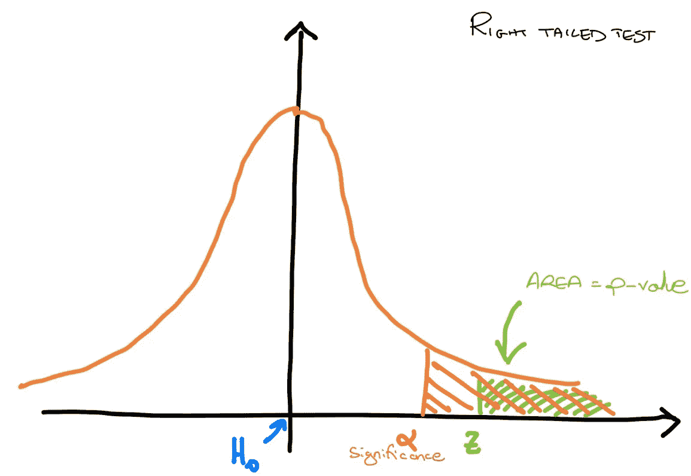
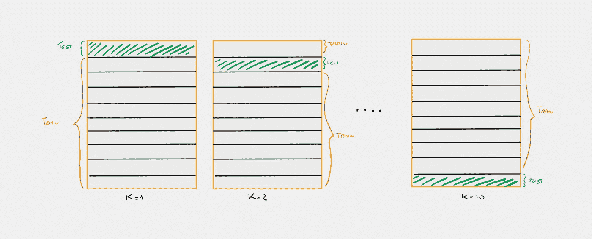
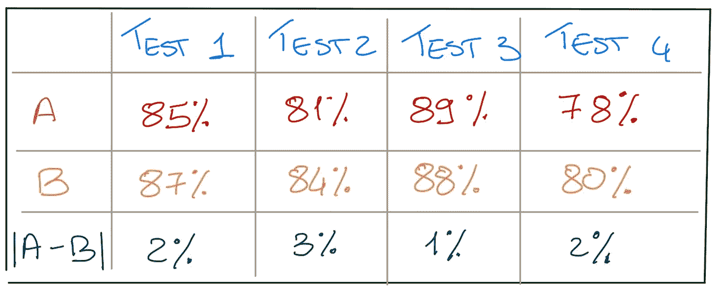
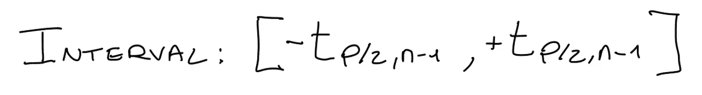
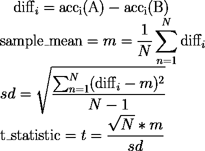
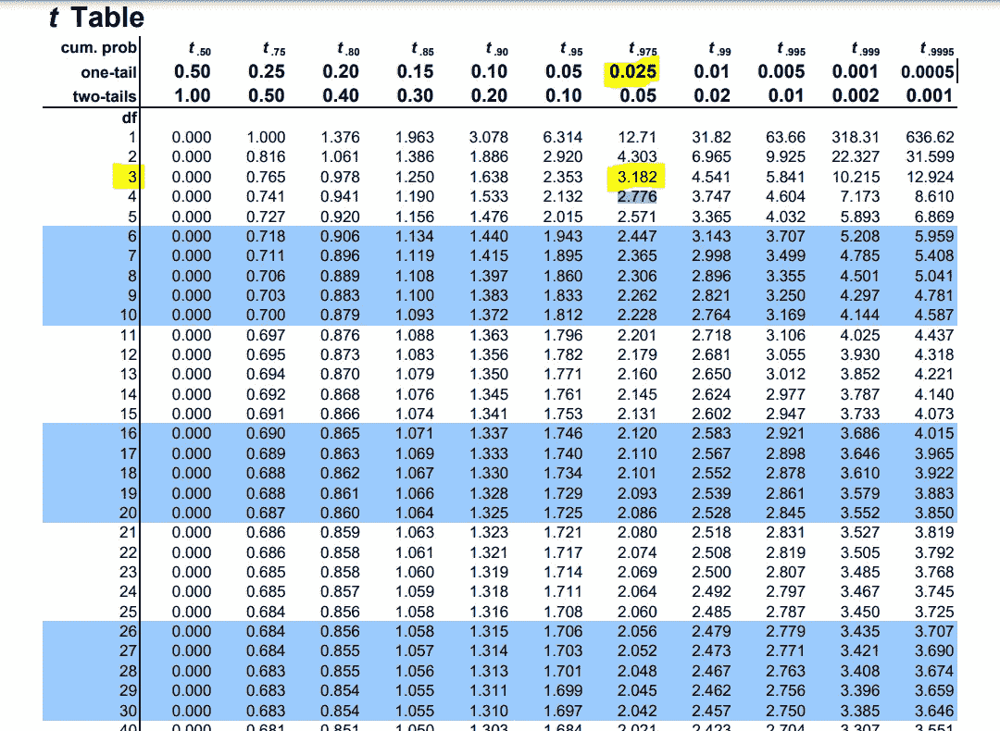

# 使用 Python 评估机器学习分类器的配对 t 检验

> 原文：<https://towardsdatascience.com/paired-t-test-to-evaluate-machine-learning-classifiers-1f395a6c93fa>



作者图片

## 了解如何使用假设检验比较分类器

## 介绍

在我的[上一篇文章](https://medium.com/@marcellopoliti/hypotesis-testing-and-climate-change-7ef750ce149e)中，我谈到了使用统计工具正确比较不同模型的重要性，以便在选择阶段选择最佳模型。

在这篇文章中，我想特别关注一个统计测试，作为一名数据科学家或机器学习工程师，你需要知道这个测试。您可以使用此测试来确定两个分类器之间是否存在统计上的显著差异，以便您实际上可以只使用最好的一个。

## k 倍交叉验证

假设你有两个分类模型 A 和 B(逻辑回归，决策树等…)。
这种成对 t 检验需要使用 N 个不同的测试集来评估每个分类器。幸运的是，我们**并不真的需要 N 个测试集，而是可以使用 k 倍交叉验证**。
这种方法允许您在几个测试集上测试一个模型，以获得更可靠的结果，即使您的数据有限。它是如何工作的？



10 倍简历(图片由作者提供)

把你的数据集分成 k 等份，例如 k = 10。现在，您可以将第一个拆分用作测试集，将另外 9 个拆分用作训练集。接下来，您将使用第二个拆分作为测试集，使用另外 9 个拆分作为训练集，依此类推。这样，您将得到 10 个结果，比如说 10 个精度，您通常可以对这些结果取平均值以得到更可靠的结果。

## 计算差异

成对 t 检验想要找出两个分类器之间是否存在真正的差异，所以假设我们对准确性感兴趣，我们从计算两个模型之间的准确性差异开始。

测试装置 *i* 上 A 的精度与测试装置 *i* 上 B 的精度配对。



Diff(A，B)(图片由作者提供)

*   **假设**:精度来自正态分布(方差未知)
*   **零假设**:A 和 B 的精度来自同一个分布。因此，精度差的期望值等于 0 (E[diff]=0)。基本上两个型号没什么区别。
*   **替代假设**:精度来自两种不同的分布，E[diff] ≠ 0。基本上，模型实际上是不同的，所以一个比另一个好。

## 配对 t 检验

*   取一个 **N 次观察的样本**(从 k 倍 cv 中给出)。假设这些结果来自具有固定均值和方差的正态分布。
*   计算这些观察值的**样本均值和样本方差**。
*   计算 t 统计量。
*   使用具有 N-1 个自由度的 **t 分布**来估计真实平均值在给定范围内的可能性。
*   **如果 t 统计不在以下区间内，则在显著性水平 p 拒绝零假设**:



间隔(图片由作者提供)

## 你需要的配方

现在只需使用下面的简单公式按照上述步骤。



公式(作者的图像)

## 让我们完成我们的案子


Diff(A，B)(图片由作者提供)

*   **m** = ( 2 + 3 + 1 + 2)/4 = 2
*   **SD**=[(0+1+1+0)/(4–1)]^(1/2)= = 0.471
*   **t**=(^(1/2 北部)* m)/sd = 0.816

如果我们设置一个 **p 值= 0.05** 和一个**自由度 n-1 = 3** ，我们可以在 t 表上检查分数，你可以在这里找到。



t 表(来源:[https://www . sjsu . edu/faculty/gerst man/stat primer/t-table . pdf](https://www.sjsu.edu/faculty/gerstman/StatPrimer/t-table.pdf))

t = 0.816 是否在范围[-3.182，+3.182]内？是的，所以我们**不能拒绝零假设，我们的两个分类器**之间没有显著差异。

## 5x2 成本验证

当你在真实数据上运行这个测试时，你应该有**至少 20 到 30 个测试集** (k 倍)，**否则你可以使用一个 5x2 coss 验证**。这篇文章很好地解释了这个方法。但是三言两语:

> 在本测试中，我们进行了 5 次 2 重交叉验证。在每次复制中，可用数据被随机划分为两个大小相等的集合 S1 和 S2。每个学习算法(A 或 B)在每一组上训练，并在另一组上测试。

## 我们来编码吧！

让我们导入 iris 数据并定义两个分类器，一个逻辑回归(LR)和一个 max_depth = 1 的决策树分类器(DT)。我们想证明 LR 的性能明显优于 DT。让我们从训练这两个模型开始，看看它们的准确性。

训练两个模型

```
output:
Model A accuracy: 95.56% 
Model B accuracy: 64.44%
```

我想将显著性水平(alpha)设置为 0.05。我想非常确定这些模型在统计学上是不同的。如果函数返回的 p 值小于α，我们可以成功地拒绝零假设。

运行配对 t 检验

```
output:t statistic: 7.936 
aplha  0.05 
p value: 0.001 Reject null hypotesis
```

# 最后的想法

> *假设检验为做出关于感兴趣人群的数据决策提供了一个可靠的框架。它有助于研究人员成功地将数据从样本外推至更大的人群。*

比较一次在不同模型上得到的结果来选择哪一个是最好的，从来都不是一个好方法。统计测试允许我们客观地陈述一个模型是否表现得更好。每次你运行实验时，统计测试被用来表明你所做的比以前存在的更好，只要去阅读任何机器学习论文。这显然不是存在于下一篇文章中的唯一测试，我将继续更详细地研究 McNemar 测试！

# 结束了

*马赛洛·波利蒂*

[Linkedin](https://www.linkedin.com/in/marcello-politi/) ， [Twitter](https://twitter.com/_March08_) ， [CV](https://march-08.github.io/digital-cv/)