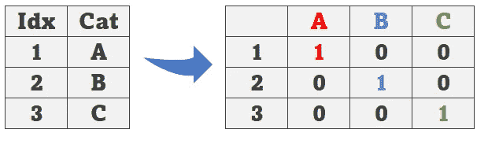
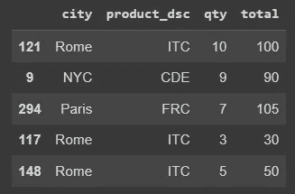
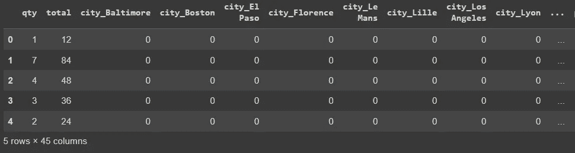
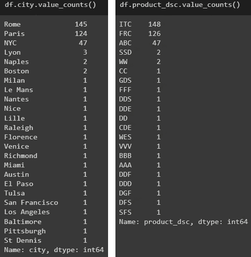
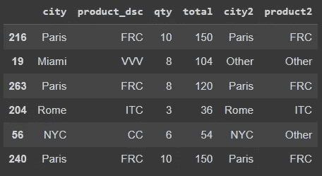
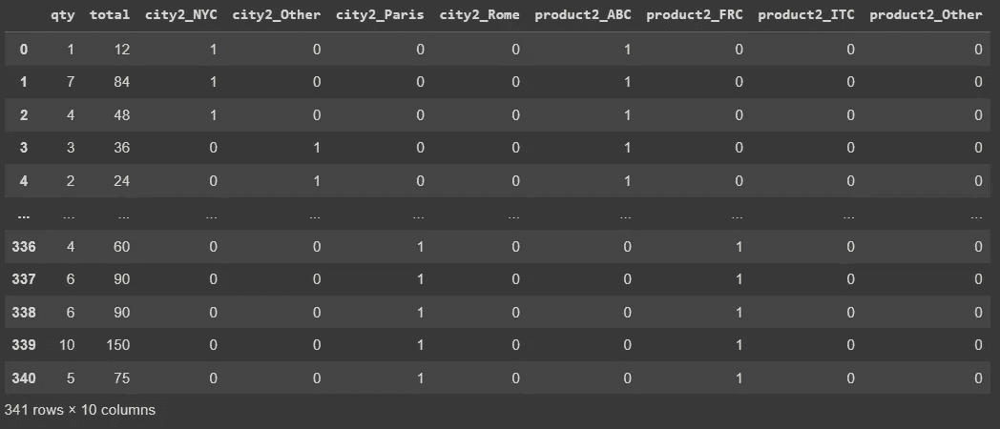

# Pandas for One-Hot 编码数据防止高基数

> 原文：<https://towardsdatascience.com/pandas-for-one-hot-encoding-data-preventing-high-cardinality-16148a0ca399>

## 使用 Pandas 一键编码变量的简单技术


[尤金尼奥·马佐尼](https://unsplash.com/@eugi1492?utm_source=unsplash&utm_medium=referral&utm_content=creditCopyText)在 [Unsplash](https://unsplash.com/s/photos/options?utm_source=unsplash&utm_medium=referral&utm_content=creditCopyText) 上的照片

# 介绍

数据清理是必要的。我相信我们大多数人都同意这一点。在我们进入建模部分之前，一个项目通常会从一些探索和清理开始。

> 实际上，我会说数据科学家的大部分工作是在清理和转换数据集之间完成的。

这个快速教程要解决的问题是我们处理变量编码。大多数机器学习算法期望数字而不是文本来估计一些东西。毕竟，计算机是依赖数字作为主要语言的逻辑机器。

也就是说，当我们得到一个包含分类变量的数据集时，我们可能需要将其转换为数字，这样我们就可以为算法提供转换后的数据。

一种常用的转换是热编码[OHE]，它将类别转换成二进制值。看下一张图。第一行是类别 A，所以在 OHE 之后，它变成三列，其中 A 是正的(1)，B/C 是负的。下一个是类别 B 的行。因为 B 现在是正数，所以它得到 1，其他的得到 0。它适用于我们拥有的所有类别



一个热点编码图。图片由作者提供。

在某些情况下，转换非常简单，但在其他一些时候，当我们有太多的类别时，它会使我们的数据集非常宽，在一次热编码后会有太多的变量。这就是我们接下来要讨论的。

# 高基数

看看这个随机创建的数据集。



本练习的数据集。图片由作者提供。

让我们看看分类变量`city`和`product_dsc`的唯一值的数量。

```
# Unique values for city
df.city.nunique()
[OUT]: 24

# unique values for product
df.product_dsc.nunique()
[OUT]: 21
```

请注意大量不同的城市和产品。如果我们对这个数据集使用 OHE，我们将得到一个非常大的数据集。观察。

```
# One Hot Encoding
pd.get_dummies(df, drop_first=True).head()
```



45 个变量太多，可能会影响 ML 模型。图片由作者提供。

即使使用参数`drop_first =True`来丢弃每个变量的第一个类别，我们仍然得到 45 个变量，这可能太多了，并可能影响模型的性能。

> (**旁注:**删除编码类别的第一列是可以的。考虑一下之前 ABC 的例子。如果我们删除编码列 A，当我们看到一个 B=0，C=0 的观测值时，只能说明这个观测值是 A=1。)

具有高基数(太多变量)的数据集可能会受到 [*维数灾难*](https://en.wikipedia.org/wiki/Curse_of_dimensionality) 的影响，这表明当我们有一个高维数据集时，它会变得稀疏(太多的零)，因此对更多数据的需求会以指数形式增长，达到我们无法再实现理想观察数的程度。

那么，我们如何解决这个问题呢？

这就是我们接下来将看到的，一个简单的解决方案在许多情况下都是有效的。

# 简单溶体

让我们回到数据集，看看城市和产品的计数。

```
# Counting by city
df.city.value_counts()

# Counting by product
df.product_dsc.value_counts()
```

这产生了结果…



不同城市和产品的计数。图片由作者提供。

我们可以看到只有 3 个**城市**和 3 个**产品**制造了大约。90%的数据。因此，*在这种*情况下，这里提出的**简单解决方案**是使用 Pandas 来**减少类别的数量**，只保留那些最高值，并将其他所有内容收集在“其他”桶下。

```
# List top 3
city_top3 = df.groupby('city').city.count().nlargest(3).index
prod_top3 = df.groupby('product_dsc').product_dsc.count().nlargest(3).index

# Keep top 3 as is and the rest as "Other"
df['city2'] = df.city.where(df.city.isin(city_top3), other='Other')
df['product2'] = df.product_dsc.where(df.product_dsc.isin(prod_top3), other='Other')
```

让我们来看一个到目前为止得到的数据样本。



转换后的结果数据。图片由作者提供。

接下来，我们可以丢弃旧变量`city`和`product_dsc`，我们准备再次使用 OHE。

```
# Drop old city and product
df2 = df.drop(['city', 'product_dsc'],axis=1)

# One Hot Encoding
pd.get_dummies(df2)
```



减少类别数量后的 OHE。图片由作者提供。

请注意，我们将 OHE 之后的变量数量从 45 列减少到只有 10 列！我们仍然可以使用参数`drop_first=True`,或者，也许使用一个更好的解决方案，即删除“其他”列，因为无论如何这些列都是零。毕竟，我们知道，如果城市不是纽约、罗马或巴黎，它只能是“其他”。同样的逻辑也适用于产品。

# 在你走之前

下面是我们所学内容的总结:

*   一种热编码有助于将分类数据转换成数字。
*   在包含太多变量的数据集中使用 OHE 会创建一个很大的数据集。
*   太宽的数据可能会遭遇维数灾难，从而危及模型的性能。
*   一个简单的解决方案是使用熊猫`.groupby()`、`.nlargest()`和`.where()`来减少 OHE 之前的类别数量。

这篇文章的代码在 GitHub 中:

[](https://github.com/gurezende/Studying/blob/master/Python/Pandas/OHE_Dimensionality.ipynb)  

如果你喜欢这些内容，请关注我的博客或在 LinkedIn 上找到我，在那里我也分享了一些数据科学技巧。如果你正在考虑中等会员，[这是我给你的推荐代码](https://gustavorsantos.medium.com/membership)。

[](http://gustavorsantos.medium.com/)  

# 参考

     