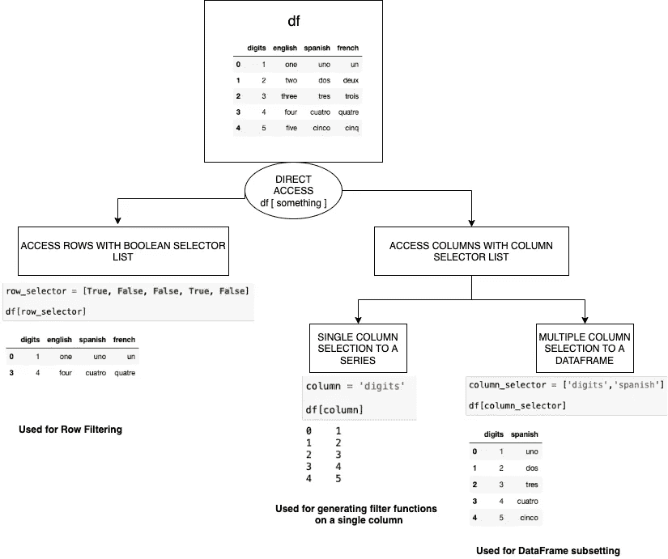
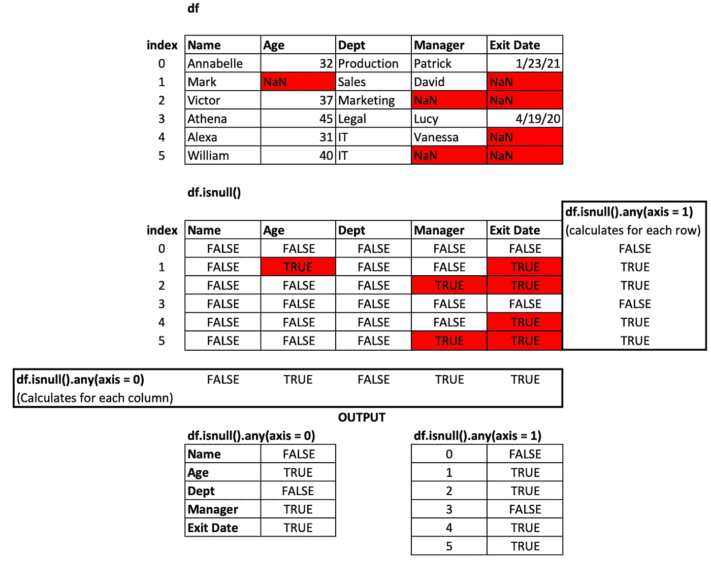

# 熊猫归零地——选择与投影

> 原文：<https://towardsdatascience.com/pandas-ground-zero-selection-and-projection-3827f74ae6c5>

## Python 熊猫数据框架和系列的数据索引、选择和投影的核心概念


由 [Unsplash](https://unsplash.com/s/photos/slicing-and-dicing?utm_source=unsplash&utm_medium=referral&utm_content=creditCopyText) 上的 [Max Delsid](https://unsplash.com/@maxdelsid?utm_source=unsplash&utm_medium=referral&utm_content=creditCopyText) 拍摄的照片

*朋友们，有抱负的数据分析师、崭露头角的数据科学家和 Python 新秀们，请听我说……*

# 动机

本章的目的是描述熊猫数据框架的一些核心概念，这些概念是数据选择和预测的基础。我们将在此尝试回答的典型问题有:

*   *如何索引数据帧以支持访问？*
*   *数据帧的基本组成部分是什么？*
*   *如何从数据帧中访问数据:切片和切块？*
*   *如何编写更新数据帧中特定行或列的函数？*

我们在某个时候会用到这些概念，了解这些基础知识对我们打下坚实的基础确实有所帮助。

# 首先是踏脚石—索引和轴

让我们从定义开始:

***系列*** *是一个* ***一维*** *标签数组，能够存放任何类型的数据(整数、字符串、浮点、python 对象等)。).将* ***轴*** *标签* *统称为* ***索引*** *。*

*一个* ***数据帧*** *是一个* ***二维数据结构*** *，即数据以表格方式按行和列对齐，因此有两个******轴*** *— row***

**毫无疑问，这对读者来说并不新鲜！！但是让我们后退一步，看看上面的一些具体的单词:**

*   **轴:系列轴是行指针，数据框轴是行和列指针。**
*   **索引:一种特殊类型的列表，存储指向每一行的指针。**

**让我们探索这些概念，以便理解如何访问这些数据结构。**

## **指数——核心概念:**

**数据结构 Series 和 DataFrame 都被索引为*。Pandas 使用一种称为索引的特殊序列来指向这些数据结构中的一组特定数据。让我们看一些索引创建的例子，以及为什么它是特殊的。***

*****关于指数的重要提示**:***

*   ***根据索引中包含的元素的数据类型，索引可以有多种类型。代码片段显示了三种类型的索引，但是可以有许多其他类型的索引，如在[文档](https://pandas.pydata.org/docs/reference/api/pandas.Index.html)中提到的。***
*   ***这些指数有什么特别之处？我们可以通过为我们想要的元素的位置(索引)指定布尔值来从索引中选择元素。这就是上面代码片段中“选择器”的作用——如果选择器在位置 I 有一个 True 值，那么在索引中位置 I 的元素被选中。***
*   ***选择器数组必须是与索引大小相同的布尔数组。它可以是硬编码的，或者由如上所示的布尔函数来确定。***

## ***轴和索引:***

***显然，系列有一个引用其行的轴，而数据帧有两个轴——一个用于行，一个用于列。所有这些轴都是不同类型的索引。让我们看看它们是什么，以及它们与索引的关系。***

*****关于轴和索引的重要提示**:***

*   ***序列的(行)轴由 RangeIndex 表示(参见它是一个包含开始、停止和步进值的范围)。***
*   ***DataFrame 有两个轴——行轴由 RangeIndex 表示，就像 Series 一样，还有一个附加索引——Columns——它是一个基本索引类型，具有列名。***
*   ***可以根据需要修改、设置或重置索引。***

# ***访问数据帧中的行和列***

***很好地理解了索引和轴的概念后，我们现在可以继续探索如何访问数据帧的元素。***

## ***使用本机索引支持***

***下图显示了如何使用`df[ <something> ]`形式的选择器访问数据帧***

***如果<something>是一个选择器的布尔列表，其大小与数据帧的索引大小相同，那么 Pandas 理解使用前面部分描述的索引选择技术来请求行选择。</something>***

***如果<something>只是一个列名，Pandas 只是创建一个序列，该列的索引与 DataFrame 的索引相同。</something>***

***如果<something>是一个列名列表，Pandas 认为它是数据帧中请求的列的子集，没有对行进行任何过滤。</something>***

******

***作者创建的图像***

## ***使用带标签的索引定位器:loc 和 iloc***

***Pandas 在其 DataFrame 对象中使用两个强大的索引定位器——loc 和 iloc——来选择行或项目列。***

## *****定位**:通过标签定位***

***语法是:`df.loc [<row_labels>,<column_labels>]`***

***row_labels 可以是下列之一:***

*   ***与数据帧索引长度相同的布尔选择器:这可用于行选择。布尔选择器通常由一些过滤函数生成***
*   ***要检索的单个索引值或实际索引值列表。这些应该是实际的索引标签。***
*   ***形式为 start:end 的行索引值范围(slice 对象)***

***column_labels 是可选的。如果未指定任何内容，它将列出所有列。否则，如果指定了某个内容，它可以是以下内容之一:***

*   ***长度小于用于列选择的数据帧列索引(列计数)长度的布尔选择器。***
*   ***要检索的单个列名或列名列表。这些应该是实际的列名。***
*   ***格式为 start:end 的列索引值范围(slice 对象)***

## ***iloc:按位置定位(基于整数的位置)***

***语法是:`df.iloc [<row_locations>,<column_locations>]`***

***通常，使用行的默认 RangeIndex，loc 可以做得很好，如上所示。***

***但是，如果数据帧的索引不是默认的 RangeIndex，而是数据帧中的某个其他列，如时间戳索引或某个唯一的 ID，则很难记住行标签。因此，有时索引数据帧就像编程语言中的数组一样变得很重要:`df[i , j]`这有助于基于位置的检索。iloc 前来救援。iloc 的一个很好的用途是基于行子集上的过滤器更新数据帧——我们稍后会检查它。***

# ***数据框架“工具包”***

## *****基本操作*****

***下面是对数据帧及其数据类型进行的一些关键操作***

*****关于基本操作的重要提示**:***

*   ***数据帧的一列可以被投影为一个系列(具有相同的索引)或一个具有单列的数据帧(具有相同的索引)。***
*   ***当投影为类似`df['RecruitmentSource'],`的系列时，可以应用不同的函数来生成新的系列(如 value_counts)或一些标量(nunique)。***
*   ***可以使用参数更改函数的默认行为，比如包含 NaN 和排序顺序。***

## *****字符串操作*****

***对 Object(String)类型的列的操作有时需要一个称为 String 访问器的特殊对象，它允许 Python 对一系列元素进行字符串操作。***

*****管柱作业重要注意事项**:***

*   ***当一个字符串列像`df['RecruitmentSource'],`一样被投影为一个序列时，常规的 Python 字符串函数不能直接应用于每个元素；相反，需要一个字符串访问器来将序列中的每个元素转换成字符串，并使它们适合字符串操作。***

## ***两个强大的函数— any()和 all()***

***数据帧有两个非常强大的过滤/检查数据的功能:***

*****any()** —返回任何元素是否为真，**潜在地在一个轴上**。返回 False，除非在一个序列中或沿着 DataFrame 轴至少有一个元素为真或等效(例如非零或非空)***

*****all()** —返回所有元素是否为真，**潜在地在一个轴上**。返回 True，除非序列中或 DataFrame 轴上至少有一个元素为 False 或等效(例如零或空)。***

***这里重要的一点是:“**潜在轴上”*****

***any()和 all()都有一个名为 axis 的参数。根据文件:***

```
*****axis***{0 or ‘index’, 1 or ‘columns’, None},* ***default 0*** Indicate which axis or axes should be reduced.**0** / **‘index’** : reduce the index, return a Series whose index is the original column labels.
**1 / ‘columns’** : reduce the columns, return a Series whose index is the original index.
**None** : reduce all axes, return a scalar.***
```

**这一点解释如下。**

****

**让我们看一些例子:**

****关于 any()和 all()** 的重要提示:**

*   **any()和 all()验证某个轴上的真值。要扫描的轴(行或列)可以指定为参数。**
*   **any()遵循 OR 逻辑，而 all()遵循轴的真值的 AND 逻辑。**
*   **any()和 all()都返回一个序列。对于轴=0，系列的索引有列名，而对于轴= 1，系列的索引是行索引。**
*   **在上面的例子中，`df.isnull()`用于生成真值，但是它可以扩展到任何行/列子集上的任何函数，只要该函数测试某些条件并生成真值。**

## **对元素应用函数—使用 lambda 应用()**

**`apply()`是 Series 和 DataFrame 的另一个强大方法，用于对其元素应用函数。最简单的形式是这样的:**

```
***# Define a function* 
def my_function(x):
    do something with x*#* ***Apply to DataFrame*** *- apply this function to all elements of df*
df.apply(my_function)   
df.apply(my_function , axis = 0)   --this is default
df.apply(my_function , axis = 1)*#* ***Apply to Series*** *- apply function to only one column or one row*
df[<column>].apply(my_function)
df.loc[<row index>].apply(my_function)**
```

**值得注意的是，`apply()` — **在与 DataFrame 一起使用时，只有** —可以接受一个“轴”作为参数来控制函数的应用方式——沿着行还是沿着列。这不适用于系列。**

```
****axis***{0 or ‘index’, 1 or ‘columns’}, default 0* 0 or ‘index’: apply function to each column.
1 or ‘columns’: apply function to each row.**
```

**我们现在看到了`apply()`的一些典型用法**

****关于** `**apply()**`的重要观点**

*   **它可以使用 Python 的`lambda`构造处理未命名函数——我们可能不总是需要像上面所示的“printme”这样的命名函数，除非该函数太复杂。这是最常见的用法。**

**`df.apply(lambda x: <do something with x>, axis = <some axis>)`**

*   **apply 还可以使用数据类型的本地转换函数:比如它也可以使用 len、np.log 等函数。**
*   **当应用于 DataFrame 时，它将“逐行”/“逐列”作为一个序列读取，并将该序列传递给函数。**
*   **它返回一个系列，其索引取决于坐标轴规格。如果我们想要基于现有的列插入或更新行或列，这是很有帮助的。**

****注意**:*“primt me”函数不“返回”任何东西，它只是为了演示数据是如何处理的。这就是为什么我们看到返回序列的结果在值和索引中均为“None”。但在现实世界中，我们会使用* `*apply()*` *实际返回序列中的一些值，并使用返回的序列向数据帧添加新内容或过滤数据帧。***

# **经常被谷歌搜索的话题**

**好了，我们准备起飞了！！让我们将这些概念应用于一些最常见的感兴趣的话题。**

**让我们使用一个非常简单的数据集—人力资源数据—您可以在这里找到。**

**如果读者试图根据上面说明的基本概念来证明或解释每个结果，那将是最好的。**

# **结束想法…**

**虽然有大量的书籍、博客和知识库承载着大量关于熊猫的知识及其官方文档，但有时合并关于核心概念的笔记是值得的。我试图传达我自己学习基础知识的方式，这可能对某个地方的人有益，在他们陷入更深更黑的水域之前。**

**所以快乐学习。万事如意。**

***如果有任何改进/错误需要添加/纠正，您可以随时通过我的链接个人资料联系我，或者在本页的这里写下您的意见。***

*****感谢您的耐心阅读。*****