# 实践中的熊猫

> 原文：<https://towardsdatascience.com/pandas-in-practice-64be9228062a>

## 这是一个实践教程，演示了如何利用 Pandas 包来清理、操作和分析数据。


图像取自 [Unsplash](https://unsplash.com/photos/LqKhnDzSF-8)

# **1。简介**

您是否曾经在 Excel 中难以分析大数据集？那么，您应该考虑 Pandas，它是一个强大的编程和数据分析工具箱，允许您在毫秒内处理百万行数据点，具有很高的处理能力和用户生产率。事实上，Pandas 是一个开源的 python 库，由软件开发人员 Wes McKinney 在 2008 年推出，它包括高级数据结构和编程工具，可以对不同的数据类型(无论是数字、文本还是日期等)进行数据分析和操作。本教程为你开始在你的项目中应用熊猫提供了必要的知识。

# 2.目标

让我们假设你刚加入一家初创公司，担任数据分析师，你被分配到支持团队，推动对客户群的深入了解。您的经理共享了数据集，现在您有机会展示您的 python 技能并使用 Pandas 包来执行分析。

本教程将帮助你发展和使用熊猫知识:

1-导入和读取 CSV 文件

2-生成对给定数据的基本理解

3-根据条件选择和过滤数据

4-应用各种数据操作工具，如创建新变量或更改数据类型

5-使用分组依据和数据透视表方法执行数据聚合

6-将分析见解转化为商业建议。

```
#load the needed packages and modules 
import pandas as pd
import numpy as np
from datetime import date
import datetime as dt
```

# 3.数据分析

## 3.1 加载数据

第一步是使用 pd_read_csv 加载数据，它读取 csv 文件的数据，加载并返回数据帧中的内容。您可能会问自己，什么是数据框？**数据帧**是 pandas 包中的主要数据结构，它以不同属性的表格显示数据，如下所示。有关 pd.read_csv 的更多信息，请访问[链接](https://pandas.pydata.org/docs/reference/api/pandas.read_csv.html)。

本教程中使用的数据集是为本文创建的虚拟数据集。在此[链接](https://github.com/sa312-art/MLmodel_AirlinesSatisfaction/files/7834047/project_data.csv)中可以找到它，它包含了关于客户的有趣数据，可用于有针对性的营销活动。

```
#load the data and make sure to change the path for your local
directory 
data = pd.read_csv('C:/Users/Smart PC/Desktop/project_data.csv')
```

## 3.2 获得基本了解

加载数据后，我们可以使用不同的方法来查看和理解变量。例如，data.head()使我们能够查看 dataframe 的前 5 行，而 data.tail()返回最后 5 行。如果想获得前 10 行，需要在方法中将其指定为 data.head(10)。

```
#first 5 rows
data.head()
```

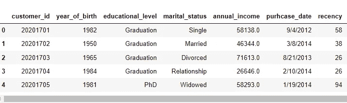

```
#last 5 rows 
data.tail()
```

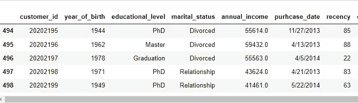

另一个有趣的方法是 data.info()，它给出了数据集的数据点和变量的数量。它还显示数据类型。我们可以看到，我们的数据集有 499 个数据点和 12 个变量，从客户的个人信息到购买、通话、对讲机和投诉。

```
#check the basic information of the data
data.info()
```

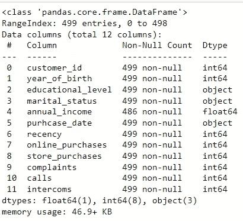

我们可以使用 data.shape 检查数据集的形状；它表明我们的数据集有 449 行和 12 列。

```
#extract the shape of the data
data.shape
```

假设我们想知道婚姻状况字段的唯一值，那么我们应该选择列并应用唯一方法。如下所示，可变婚姻状况有 5 个独特的类别。但是，我们注意到寡妇和鳏夫是同一类别的两个不同的命名，因此我们可以通过对列值使用 replace 方法来使其保持一致，如下所示。

```
data['marital_status'].unique()
```

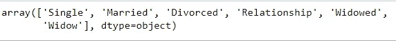

```
data[‘marital_status’] = data[‘marital_status’].replace(‘Widow’, ‘Widowed’)
```

了解唯一值及其各自计数的另一个有趣方法是对列应用 value_count 方法。例如，教育属性有 5 个类别，其中毕业和博士构成了最大的比例。

```
round(data['educational_level'].value_counts(normalize=True),2)
```

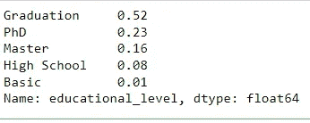

我们可以使用。复制和。isnull 方法。此外，我们可以在数据集中选择一个感兴趣的变量，以检测其缺失值或重复值，如下所示。

```
data.isnull()
data.duplicated().sum()
data['educational_level'].isnull().sum() #specifying Education as a variable where we should look for the sum of missing values
```

## 3.3 选择和过滤数据:loc 和 iloc

我们可以简单地从数据框中选择数据点的子集。让我们考虑我们想要选择每个客户的生日、教育和收入；这可以通过选择带有双括号的列名来实现，如下所示。

```
subset_data = data[['year_of_birth ', 'educational_level', 'annual_income']]
subset_data
```

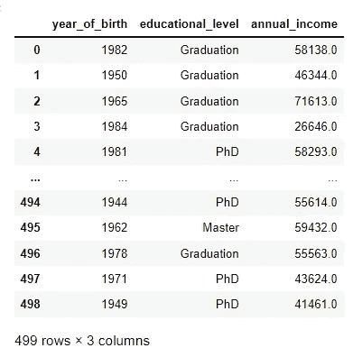

我们可以通过指定只从数据框中返回“Master”来选择教育的唯一类别。

```
data[data["educational_level"] == "Master"]
```

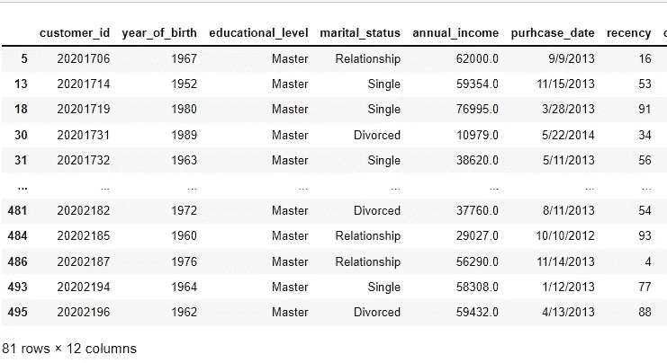

从数据框中选择数据的另外两种流行方法是:loc 和 iloc。这两种方法的主要区别在于:loc 是基于标签的，这意味着我们必须根据标题指定行和列。然而，iloc 是基于整数位置的，因此我们必须按照整数位置值选择行和列，即:0，1，2。要了解更多关于使用这些方法选择数据的信息，请访问此[链接](https://pandas.pydata.org/pandas-docs/stable/user_guide/indexing.html)。

正如我们在下面注意到的，我们使用 loc 方法选择前七个数据点，但是变量“educational_level”和“recency”。我们也可以使用 iloc 实现相同的结果，但是将行和列指定为整数值。

```
data.loc[:6, ['educational_level', 'recency']] #specify the rows and columns as labels
```


```
data.iloc[:6, [2,6]] #speciy rows and columns as integer based values
```

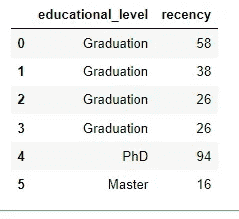

另一个强大的工具是使用 loc 和 isin()方法过滤数据，我们可以选择感兴趣的变量和我们想要的类别。例如，下面我们选择婚姻状况描述为单身或离婚的所有客户。

```
data.loc[data[‘marital_status’].isin([‘Single’, ‘Divorced’])]
```

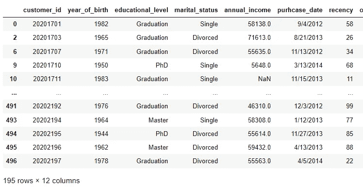

我们可以将 iloc 与 python 操作符结合使用，以选择满足两个条件的数据，例如选择收入高于 75，000 英镑且拥有硕士学位的客户。

```
data.iloc[list((data.annual_income > 75000) & (data.educational_level == 'Master')),  :,]
```

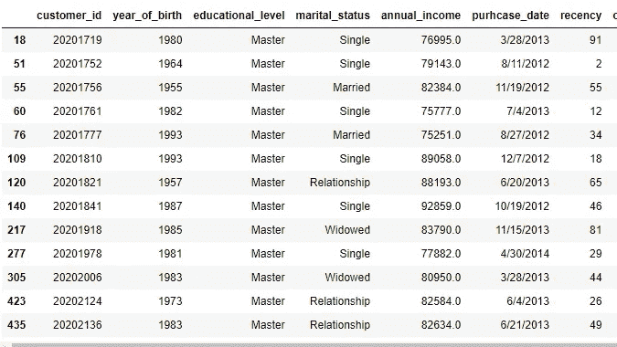

## 3.4 应用数据操作:索引、新变量、数据类型等等！

我们可以使用 Pandas 对数据集应用不同的操作，例如但不限于:
-使用。set_index()方法
-使用变量之一对数据帧进行排序。sort_values()按升序或降序排列；有关 sort_values()的更多信息，请访问[链接](https://pandas.pydata.org/docs/reference/api/pandas.DataFrame.sort_values.html)
-创建一个新变量，该变量可能是数学运算的结果，例如其他变量的和
-使用 pd.cut()方法构建变量的类别；有关 pd.cut()的更多信息，请访问[链接](https://pandas.pydata.org/docs/reference/api/pandas.cut.html)
-将变量的数据类型更改为日期时间或整数类型
-根据出生年份确定年龄
-根据购买日期创建星期日期(日历周和年)
等等；这只是我们用熊猫所能达到的成就的一瞥！

```
#set the index as customer_id
data.set_index(‘customer_id’)
```

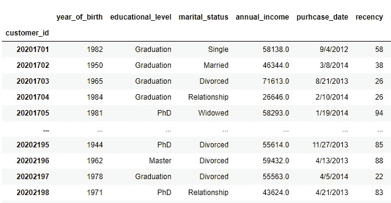

```
#sort the data by year_of_birth, ascending is default;
data.sort_values(by = ['year_of_birth '], ascending = True) # if we want it in descending we should set ascending = False
```

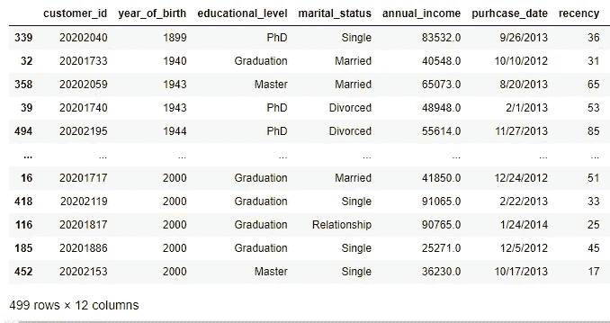

```
#create a new variable which is the sum of all purchases performed by customers
data['sum_purchases'] = data.online_purchases + data.store_purchases 
data['sum_purchases']
```

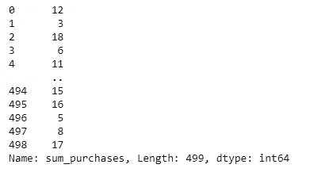

```
#create an income category (low, meduim, high) based on the income variable
income_categories = ['Low', 'Meduim', 'High'] #set the categories
bins = [0,75000,120000,600000] #set the income boundaries 
cats= pd.cut(data['annual_income'],bins, labels=income_categories) #apply the pd.cut method
data['Income_Category'] = cats #assign the categories based on income
data[['annual_income', 'Income_Category']]
```

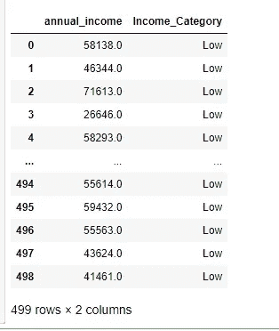

```
#we can change the datatype of purchase_date to datetime and year_birth to integer
data['purhcase_date'] = pd.to_datetime(data['purhcase_date'])
data['year_of_birth '] = data['year_of_birth '].astype(int)#find out the age of customers based on the current year
today = date.today()
year = int(today.year)
data['Age'] = year - data['year_of_birth ']
data['Age']
```


```
#extract the week_date from the purchase_date which shows the year of purchase and the calendar week
#make sure to change the purhcase_date varibale to datetime as shown above before applying the .isocalendar() method
data["week_date"] = [int(f'{i.isocalendar()[0]}{i.isocalendar()[1]}') for i in data.purhcase_date]
data["week_date
```

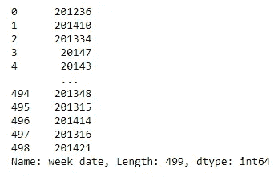

## 3.5 执行数据聚合:groupby 和 pivot_table

在我们创建了新的变量之后，我们可以进一步聚合，从类别中生成有趣的见解。每位数据科学家都使用两种主要方法来分组分析数据:

1.  **groupby()** :一种方法，包括拆分类别、应用函数和组合结果，从而可用于数学运算，如均值、求和或计数以及按组的聚合视图。有关此操作的更多信息，请访问此[链接](https://pandas.pydata.org/docs/reference/api/pandas.DataFrame.groupby.html)

2. **pivot_table()** :这是一种非常有用的技术，可以创建电子表格风格的数据透视表作为数据框架，它还允许分析师对每组中选定的变量应用数学运算。有关此 pivot_table 的更多信息，请访问此[链接](https://pandas.pydata.org/pandas-docs/stable/reference/api/pandas.pivot_table.html)

```
#apply groupby to find the mean of income, recency, number of web and store purchases by educational group
aggregate_view = pd.DataFrame(data.groupby(by='educational_level')[['annual_income', 'recency', 'store_purchases',  'online_purchases']].mean()).reset_index()
aggregate_view
```

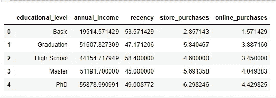

```
#apply pivot table to find the aggregated sum of purchases and mean of recency per education and marital status group
pivot_table = pd.DataFrame(pd.pivot_table(data, values=['sum_purchases', 'recency'], index=['marital_status'],
                        columns=['educational_level'], aggfunc={'recency': np.mean, 'sum_purchases': np.sum}, fill_value=0)).reset_index()
pivot_table
```

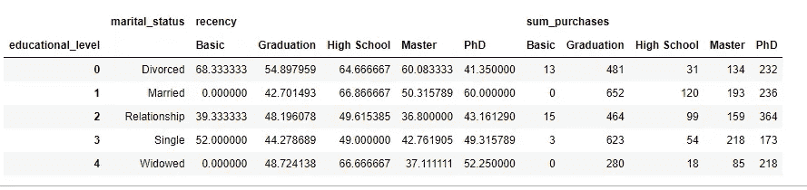

# **4。建议**

现在，在我们完成了数据清理和对数据集执行操作和聚合的过程之后，我们可以总结出一些关于我们客户群的有趣见解:

*   博士人群收入最高，线上和店铺购买次数最多；然而，高中毕业生拥有最高的最近购买次数或最近购买天数
*   普通人在网上和商店购买的数量最少
*   毕业水平的已婚人士购买总额最高

因此，对任何潜在营销活动的商业建议都应侧重于吸引和留住博士和具有毕业水平的已婚夫妇，并应提供更多产品来满足其他类别的需求和兴趣，如购买量最低的基本人群以及不经常购买的高中生。

此外，应开展进一步的工作来了解客户的行为和兴趣，例如，执行 RFM 分析或回归建模将有利于研究变量对教育或婚姻状况组购买数量的影响。

# 5.结论

最后，我希望这篇文章对您在即将到来的数据分析练习中使用 pandas 有所启发、实用和有用。下面是总结性的总结:
- Pandas 是一个建立在 Python 编程语言之上的数据分析库，
- Pandas 擅长对包含多个变量的大型数据集执行复杂操作，
- Data frame 是 Pandas 中的主要数据结构，
- loc 和 iloc 用于选择和过滤数据，
- group_by 和 pivot_table 是两个最知名的聚合方法。

敬请关注更多精彩的机器学习和数据分析分享知识内容。