# pandas Profiling——Python 中简单的探索性数据分析

> 原文：<https://towardsdatascience.com/pandas-profiling-easy-exploratory-data-analysis-in-python-65d6d0e23650>

## 使用 Pandas Profiling 库实现快速有效的 EDA


照片由 [Unsplash](https://unsplash.com?utm_source=medium&utm_medium=referral) 上的[agency followeb](https://unsplash.com/@olloweb?utm_source=medium&utm_medium=referral)拍摄

[探索性数据分析(EDA)](https://en.wikipedia.org/wiki/Exploratory_data_analysis) 是数据科学和[机器学习](https://en.wikipedia.org/wiki/Machine_learning)工作流程中重要且必不可少的部分。它允许我们从多个角度，通过统计、数据可视化和数据汇总来探索数据，从而熟悉数据。这有助于发现数据中的模式，发现异常值，并获得对我们正在处理的数据的可靠理解。

在这个简短的 Python EDA 教程中，我们将介绍一个名为 [Pandas Profiling](https://github.com/ydataai/pandas-profiling) 的优秀 Python 库的使用。这个库帮助我们用最少的代码行在数据集上实现快速和自动的 EDA。

在本文中，我们将涵盖:

1.  什么是探索性数据分析(EDA)？
2.  什么是 Python 熊猫剖析库？
3.  如何使用 Pandas Profiling 库进行探索性数据分析

在我的 YouTube 频道上也有这个教程的视频版本，可以在下面看到:

本教程中使用的笔记本可以从我的 GitHub 资源库下载，链接如下:

<https://github.com/andymcdgeo/ExploratoryDataAnalysis_YT>  

# 什么是探索性数据分析(EDA)？

探索性数据分析，简称 EDA，简单来说就是‘先看数据’。它构成了机器学习工作流程的一个关键部分，正是在这个阶段，我们开始理解我们正在处理的数据及其包含的内容。本质上，它允许我们在应用高级分析和机器学习之前理解数据。

在 EDA 过程中，我们可以开始识别数据中的模式，了解特征之间的关系，[识别数据集内可能存在的异常值](/creating-boxplots-of-well-log-data-using-matplotlib-in-python-34c3816e73f4)和[识别我们是否有缺失值](/using-the-missingno-python-library-to-identify-and-visualise-missing-data-prior-to-machine-learning-34c8c5b5f009)。一旦我们了解了数据，我们就可以检查是否需要进一步的处理，或者是否有必要清理数据。

当使用 Python 时，或者如果您正在学习 Python 培训课程，您通常会使用 [pandas](https://pandas.pydata.org) 和 [matplotlib](https://matplotlib.org) 对您的数据执行 EDA。 [Pandas](https://pandas.pydata.org) 具有包括`[df.describe()](https://pandas.pydata.org/docs/reference/api/pandas.DataFrame.describe.html)`和`[df.info()](https://pandas.pydata.org/docs/reference/api/pandas.DataFrame.info.html)`在内的多个函数，这些函数有助于汇总数据集的统计数据，而 [matplotlib](https://matplotlib.org) 具有多个图表，例如[条形图](https://matplotlib.org/stable/plot_types/basic/bar.html#sphx-glr-plot-types-basic-bar-py)、[散点图](https://matplotlib.org/stable/plot_types/basic/scatter_plot.html#sphx-glr-plot-types-basic-scatter-plot-py)和[直方图](https://matplotlib.org/stable/plot_types/stats/hist_plot.html#sphx-glr-plot-types-stats-hist-plot-py)，以使我们能够可视化我们的数据。

当处理机器学习或数据科学训练数据集时，上述方法可能是令人满意的，因为许多数据已经过清理和设计，使其更容易处理。在现实世界的数据集中，数据通常是脏的，需要清理。使用上述方法进行检查是一项耗时的任务。这就是 auto EDA 可以帮助我们在不影响质量的情况下加快这部分工作流程的地方。

# 熊猫 Profiling Python 库是什么？

[Pandas Profiling](https://github.com/ydataai/pandas-profiling) 是一个 Python 库，它允许你在我们的 Pandas 数据框架上生成一个非常详细的报告，而不需要用户太多的输入。它

[根据 PyPi 的统计，该库每月有超过 1，000，000 次下载](https://pypistats.org/packages/pandas-profiling)，这证明了它在数据科学领域是一个非常受欢迎的库。

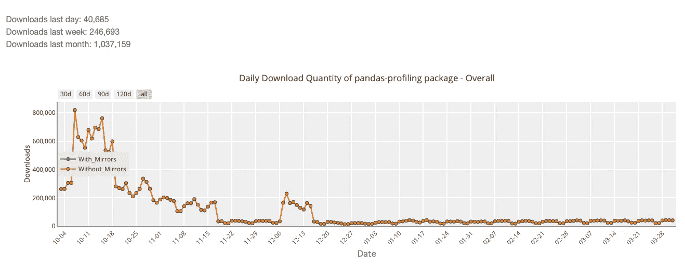

熊猫下载-根据 PyPistats 分析 python 库。图片由作者提供。

# 如何在 Python 中为 EDA 使用 Pandas Profiling

## 安装熊猫档案

要安装 Pandas Profiling，您可以使用以下命令:

如果使用画中画:

```
pip install pandas-profiling
```

如果使用 Anaconda 的 conda 包管理器:

```
conda env create -n pandas-profiling
conda activate pandas-profiling
conda install -c conda-forge pandas-profiling
```

## 资料组

我们在本教程中使用的数据集来自[澳大利亚政府的国家海洋石油管理系统(NOPIMS)](https://www.ga.gov.au/nopims) 。


澳大利亚测井数据网站。图片由作者提供。

它包含一系列由科学仪器获得的测井测量数据，用于评估和表征地下的地质和岩石物理性质。

不要担心数据的性质，因为下面描述的技术可以应用于任何数据集。

## 导入库

第一步是导入我们将要使用的库(熊猫和熊猫档案),如下所示:

```
import pandas as pd
from pandas_profiling import ProfileReport
```

## 加载数据集

接下来，我们加载我们要探索的数据。在这种情况下，我们的数据存储在一个 csv 文件中，需要使用 pd.read_csv 读入该文件，如下所示:

```
df = pd.read_csv('data/NOPIMS_Australia/Ironbank-1.csv', na_values=-999)
```

由于我们的数据包含由-999 表示的 null / missing 值，我们可以告诉 pandas 将这些值设置为[而不是数字(NaN)](https://pandas.pydata.org/docs/user_guide/missing_data.html) 。

## 运行熊猫档案

为了生成报告，我们首先创建一个名为 report 的变量，并将`ProfileReport()`赋给它。在括号内，我们传入数据帧，在本例中是`df`。

然后，我们可以调用报告并开始该过程。

```
report = ProfileReport(df)
report
```

当我们运行该单元时，报告过程将开始，并分析数据框架中的所有数据。

时间长度将取决于数据的大小，较大的数据集将需要较长的时间来完成。

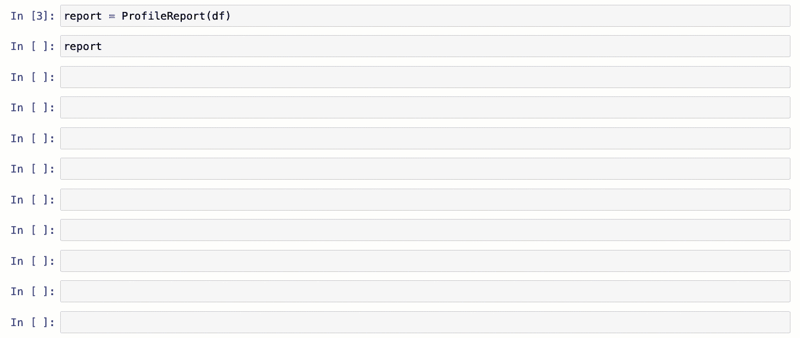

使用 Python 中的 pandas-profiling 生成报告。图片由作者提供。

# 了解熊猫概况分析结果

## 概观

概述部分包含三个选项卡:**概述、警告和再现。**

**Overview 选项卡**提供关于数据集的统计信息，包括变量数量(数据帧中的列数)、观察值数量(总行数)、有多少值与百分比一起丢失、有多少重复以及文件大小。

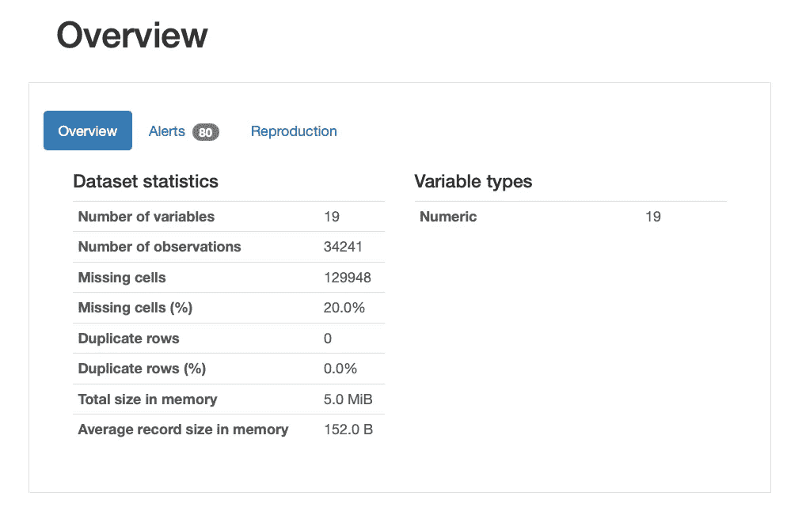

熊猫概况报告的概述部分。图片由作者提供。

**警报选项卡**用于通知您数据中每一列的任何问题，例如变量之间的相关性、数据偏斜度、数据分布。

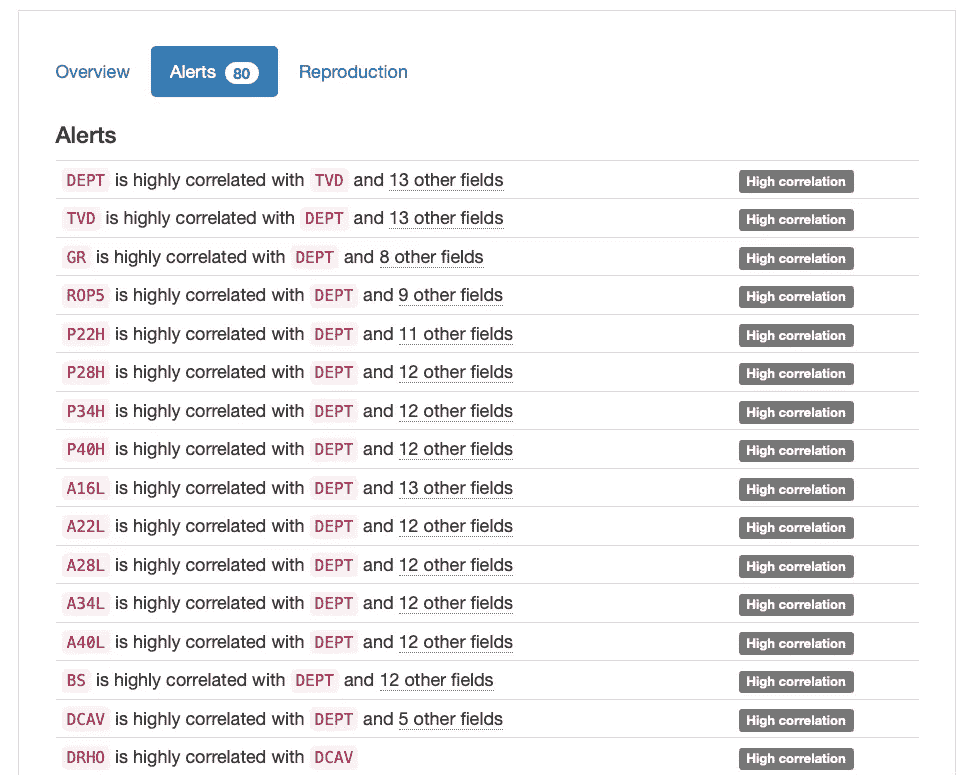

pandas-profiling 报告的警报部分。图片由作者提供。

## 变量

在报告的变量部分，我们可以查看数据帧中包含的每个列的详细统计信息。这包括有多少缺失值、数据的统计(平均值、最小值和最大值)等等。

在每个部分的右侧，我们可以看到数据分布的直方图。这给了我们一个数据偏斜度的指示，以及它的传播。

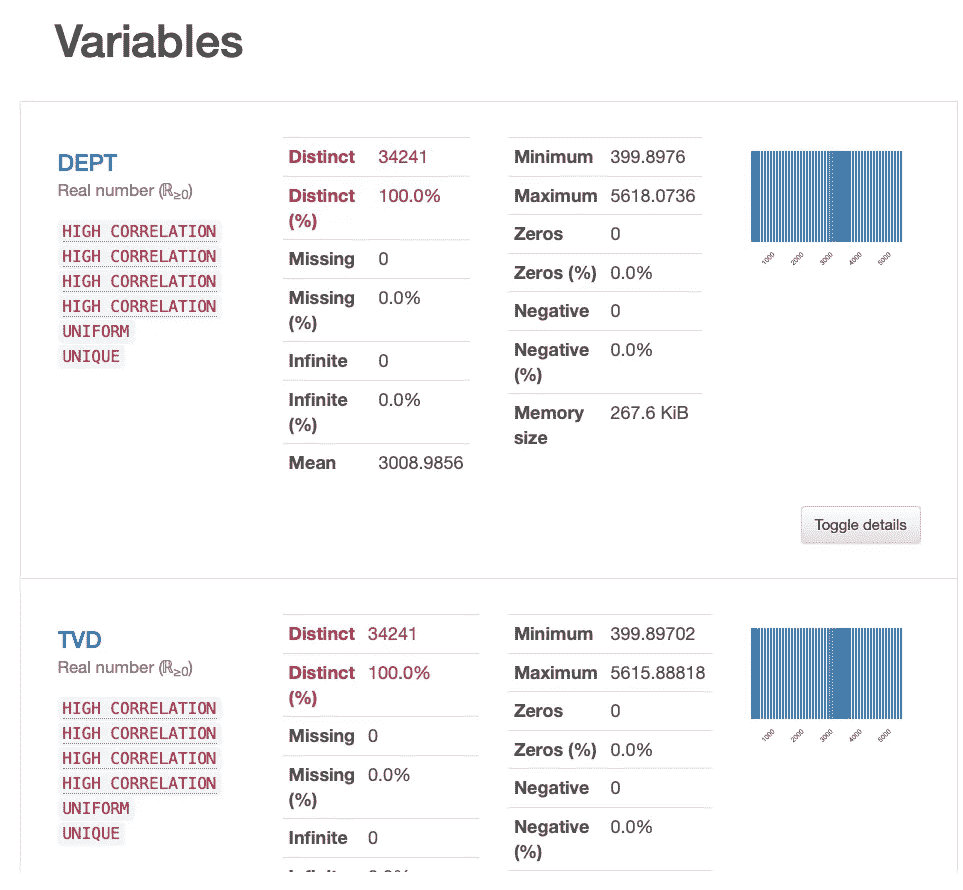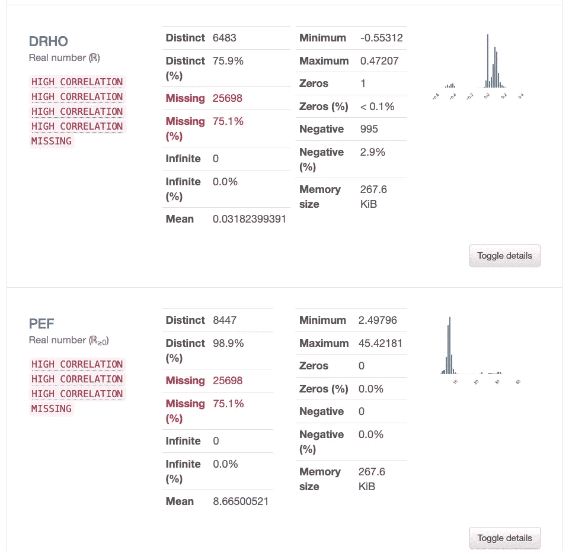

pandas-profiling 报告的变量部分。图片由作者提供。

## 相互作用

报告的交互部分允许您绘制一个变量与另一个变量的关系图，以便了解它们之间的关系。

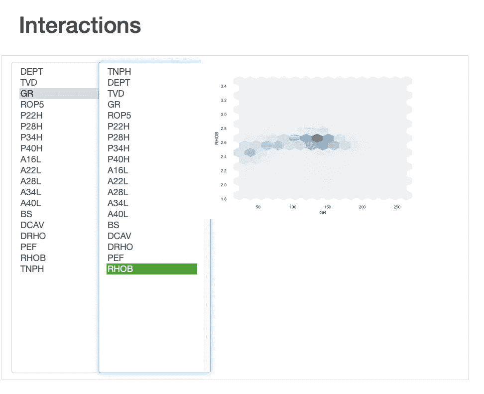

熊猫档案报告的互动部分。图片由作者提供。

## 相关

相关性部分让我们了解两个变量相互关联的程度。在 pandas_profile 报告中，我们可以查看不同的关联方法:

*   斯皮尔曼的ρ
*   皮尔逊氏 r
*   肯德尔的τ
*   Phik (φk)

如果您不确定每种方法是什么，您可以单击“切换相关性描述”按钮，它将提供每种方法含义的详细信息。

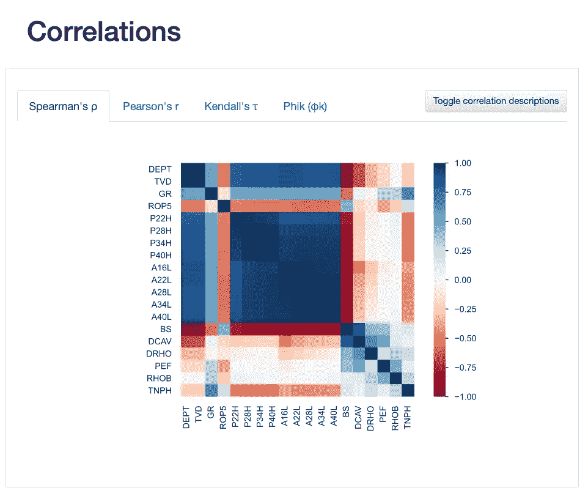

pandas-profiling 报告的相关部分显示了可用的不同方法。图片由作者提供。

## 缺少值

我们还可以很好地了解我们的数据集有多完整。这类似于[提供的功能，缺少 Python 库。](/using-the-missingno-python-library-to-identify-and-visualise-missing-data-prior-to-machine-learning-34c8c5b5f009)

我们可以使用 4 种类型的图来查看数据:

*   计数图提供了当前总值的计数。
*   矩阵图显示了数据框中缺失值的位置。
*   热图向我们展示了变量之间的空值是如何关联的。
*   树状图是一个类似树的图形，它显示了变量之间有多少空值相关。越靠近的组表示无效性的强相关性。

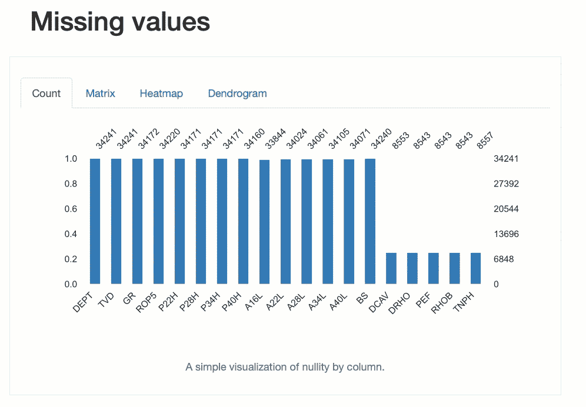

使用 pandas-profiling 报告通过各种视图识别缺失值。图片由作者提供。

## 样品

最后，示例部分允许我们查看数据集前 10 行和后 10 行的原始数字。这相当于运行`df.head(10)`和`df.tail(10)`。

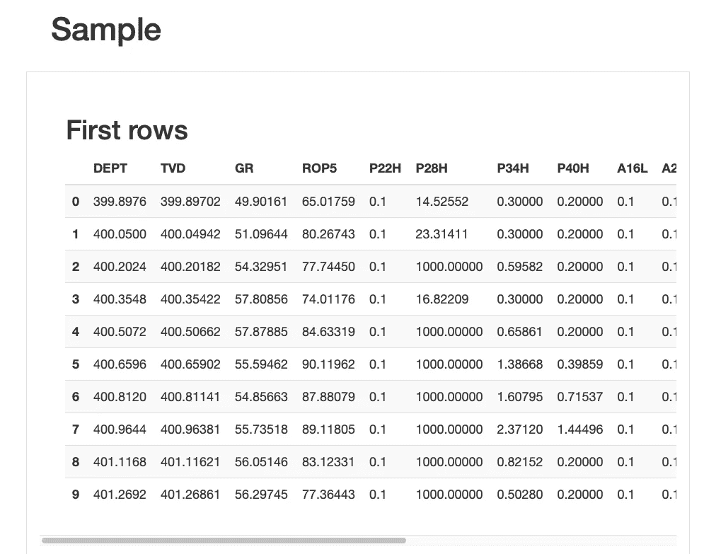

数据集的前 10 行。图片由作者提供。

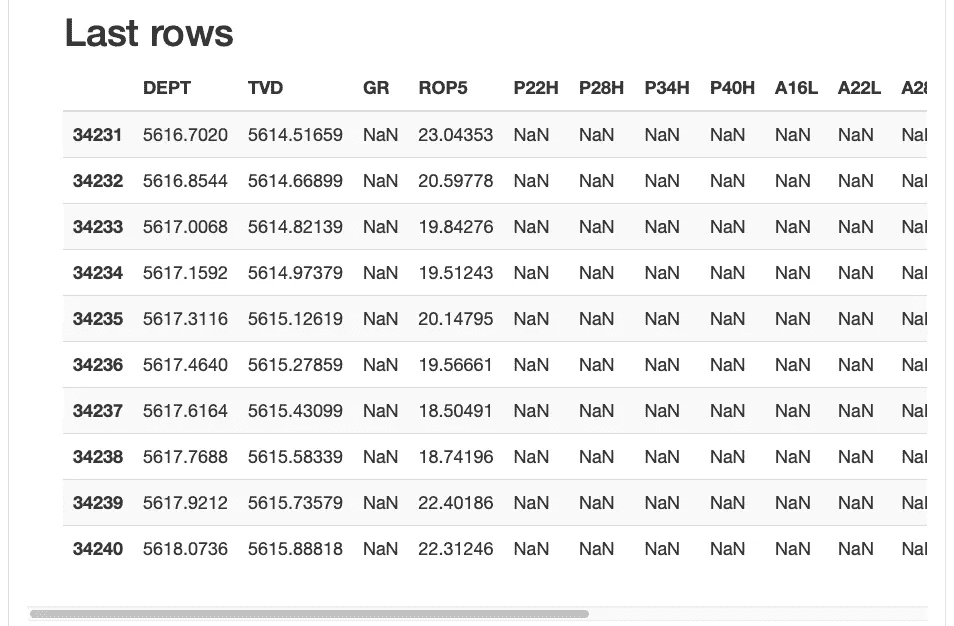

数据集的最后 10 行。图片由作者提供。

# 摘要

pandas-profiling Python 库是一个非常棒的工具，可以快速分析数据集，而无需花费大量时间记忆和编写 pandas 和 matplotlib 代码。一定要为你的下一个项目去看看。

*感谢阅读。在你走之前，你一定要订阅我的内容，把我的文章放到你的收件箱里。* [***你可以在这里做！***](https://andymcdonaldgeo.medium.com/subscribe)

其次，通过注册会员，你可以获得完整的媒介体验，并支持我自己和成千上万的其他作家。它每个月只花你 5 美元，你可以完全接触到所有令人惊叹的媒体文章，也有机会用你的写作赚钱。如果你用 [***我的链接***](https://andymcdonaldgeo.medium.com/membership)**报名，你会直接用你的一部分费用支持我，不会多花你多少钱。如果你这样做了，非常感谢你的支持！**