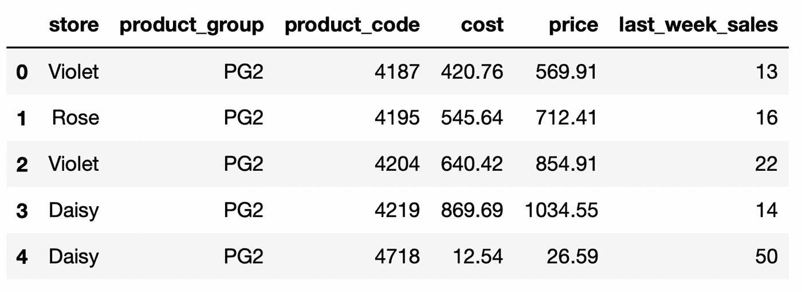
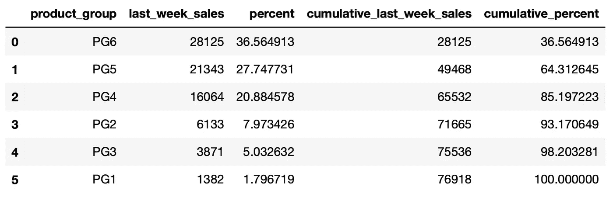
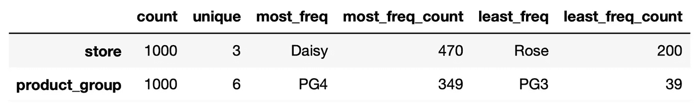
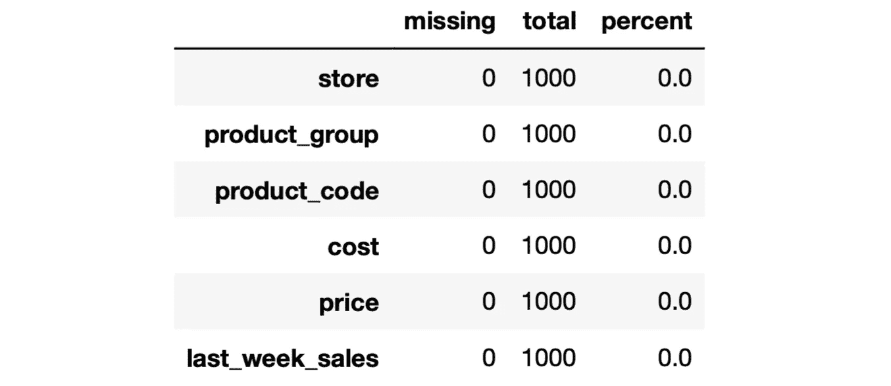
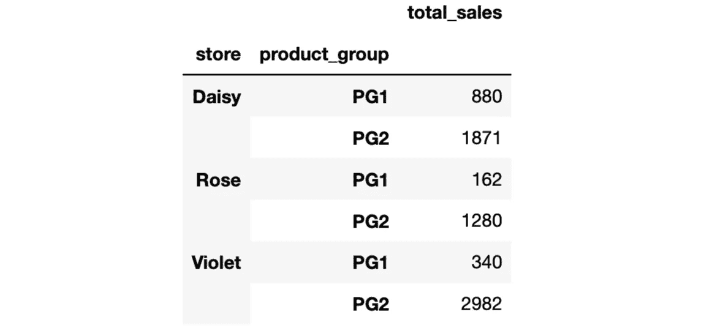
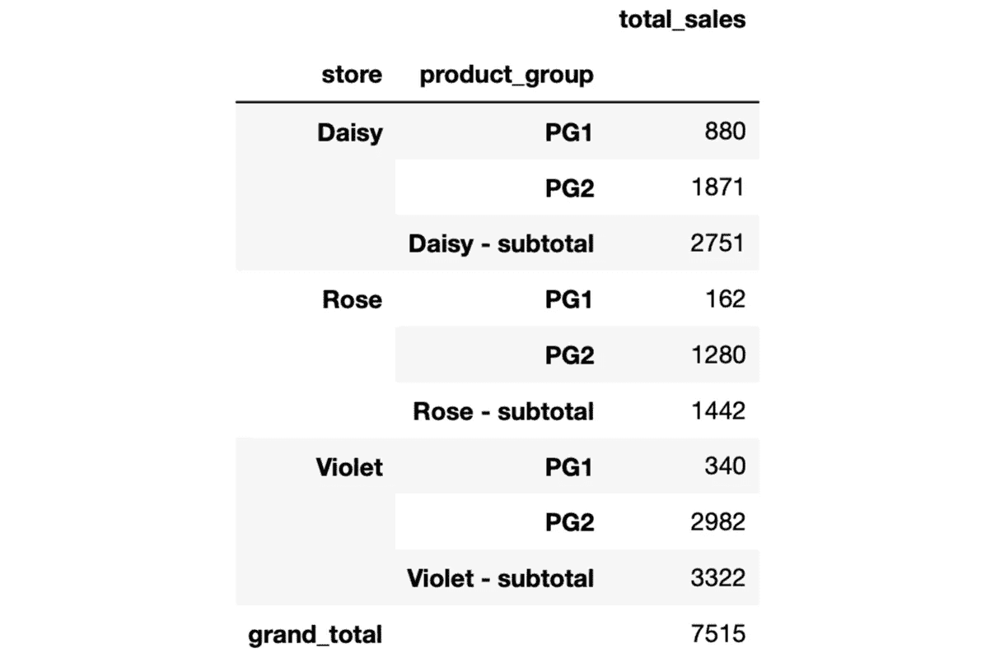
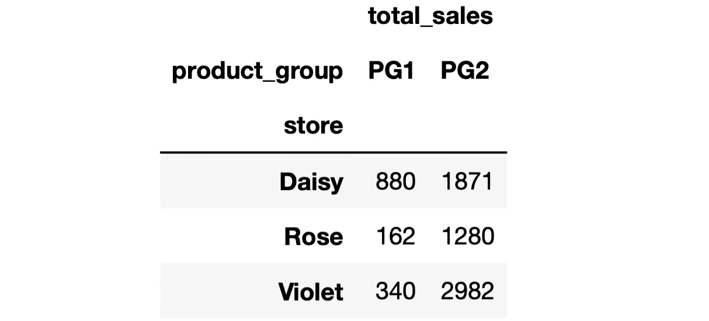
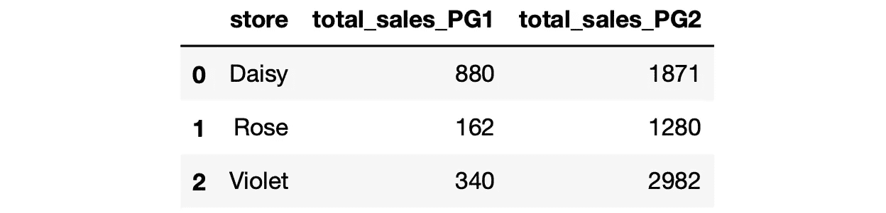

# Pandas Sidetable 简化了探索性数据分析过程

> 原文：<https://towardsdatascience.com/pandas-sidetable-simplifies-the-exploratory-data-analysis-process-417b42eebed6>

## 熊猫的实用附加产品


照片由[维达尔·诺德里-马西森](https://unsplash.com/ja/@vidarnm?utm_source=unsplash&utm_medium=referral&utm_content=creditCopyText)在 [Unsplash](https://unsplash.com/s/photos/buddy?utm_source=unsplash&utm_medium=referral&utm_content=creditCopyText) 拍摄

[Sidetable](https://github.com/chris1610/sidetable) 是由 [Chris Moffitt](https://twitter.com/chris1610) 创建的开源 pandas 实用程序库。它为 pandas 数据框架创建汇总表，这在探索性数据分析中非常有用。

sidetable 所做的也可以在熊猫身上实现，但是它简化了这个过程。您只需一行代码就可以获得数据的大致情况。

在撰写本文时，sidetable 有 5 个功能，并且正在改进中。因此，我们可以期待更多的即将到来。我们将为每个函数做一些示例，以理解它做什么以及它如何有助于有效的探索性数据分析。

您可以按如下方式安装 sidetable:

```
# terminal
$  python -m pip install -U sidetable# jupyter notebook
!pip install sidetable
```

安装后，您可以导入 sidetable 并将其用作 pandas 数据帧上的访问器。

```
import pandas as pd
import sidetable
```

我们将使用我用模拟数据创建的销售数据集。你可以从我的 GitHub 页面上的[数据集](https://github.com/SonerYldrm/datasets)库中下载。我们将在本文中使用的数据集称为商店销售数据。

```
sales = pd.read_csv(
  "sales_data_with_stores.csv",
   usecols = ["store", "product_group", "product_code", "cost",  
              "price", "last_week_sales"]
)sales.head()
```



(图片由作者提供)

# **类固醇的价值统计**

假设我们想从产品组的角度获得一个概述，并寻找以下问题的答案:

*   存在多少个产品组？
*   就每个产品组包含的产品数量而言，每个产品组的规模有多大？
*   整个投资组合的累积覆盖率是多少？

我们可以通过使用 **freq** 函数的一行代码找到所有这些问题的答案。

```
sales.stb.freq(["product_group"])
```


(图片由作者提供)

有 6 个产品组，我们可以看到每个组包含多少产品。此外，结果表具有累积值。例如，PG4、PG5 和 PG6 占我们整个产品组合的 85%。

上表基于数据帧中的行数。比方说，我们希望看到销售的分布情况。这可以通过使用 freq 函数的 value 参数轻松完成。

```
sales.stb.freq(["product_group"], value="last_week_sales")
```



(图片由作者提供)

就产品数量而言，PG3 是第三大产品组，但其销售额最高。这对我们的分析是一个有价值的见解。

我们可能希望进一步分析，并分别查看每个商店产品组的表现。我们需要做的就是在 Python 列表中编写产品组和存储列。

```
sales.stb.freq(["product_group", "store"], value="last_week_sales")
```

# 一次 6 个问题

*   有多少观察值(即行数)？
*   有多少独特的价值？
*   最常值？
*   最频繁值有多少次观察？
*   最不频繁的值？
*   最不频繁值有多少个观察值？

使用 **counts** 函数，用一行代码就可以回答所有这些问题。

默认情况下，我们获得所有列的结果。但是，这些问题通常针对分类列。因此，如果我们只需要分类列的数据，我们可以使用 exclude 参数排除数值列。

```
sales.stb.counts(exclude="number")
```



(图片由作者提供)

让我们对 store 列做一个快速的结果检查:

```
sales["store"].value_counts()**# output**
Daisy     470
Violet    330
Rose      200
Name: store, dtype: int64
```

最常见的值是 daisy，它有 470 个观察值，这就是上面的 sidetable 所示。

# 缺少值

用熊猫寻找缺失的价值观并不是一件复杂的事情。isna 和 sum 函数可以一起使用来查找每列中缺失值的数量。sidetable 增加的是丢失值的百分比。

```
sales.stb.missing()
```



(图片由作者提供)

缺失函数提供了数据帧中缺失值的快速概览。

如果只需要包含缺失值的列，请将 clip_0 参数的值设置为 True。

# 汇总值的小计

Sidetable 使得向 groupby 函数的结果添加小计变得非常简单。对于某些任务，小计可能会派上用场。让我们做有和没有小计的例子来看看区别。

```
sales_filtered = sales[sales["product_group"].isin(["PG1", "PG2"])]sales_filtered.groupby(["store", "product_group"]).agg(
    total_sales = ("last_week_sales", "sum")
)
```



不带小计(图片由作者提供)

```
sales_filtered.groupby(["store", "product_group"]).agg(
    total_sales = ("last_week_sales", "sum")
).stb.subtotal()
```



带小计(图片由作者提供)

需要注意的是，如果在 groupby 函数的输出中将分组显示为列(即，将 as_index 参数的值设置为 False)，则不会计算小计。

# 用多级列索引展平数据帧

假设给我们一个数据帧，如下所示:



(图片由作者提供)

让我们检查列名:

```
df.columns**# output**
MultiIndex([('total_sales', 'PG1'),
            ('total_sales', 'PG2')],
           names=[None, 'product_group'])
```

它是一个多索引，每个列名是一个元组。我们可以通过使用 sidetable 的**展平**功能来展平列名。

```
df.stb.flatten()
```



(图片由作者提供)

它看起来更好，更容易工作。

Sidetable 是探索性数据分析中非常实用的工具。我们在本文中所做的操作并不复杂，但是简化它们并没有坏处。Sidetable 允许用一行代码执行所有这些操作。

*你可以成为* [*媒介会员*](https://sonery.medium.com/membership) *解锁我的全部写作权限，外加其余媒介。如果你已经是了，别忘了订阅*[](https://sonery.medium.com/subscribe)**如果你想在我发表新文章时收到电子邮件。**

*感谢您的阅读。如果您有任何反馈，请告诉我。*