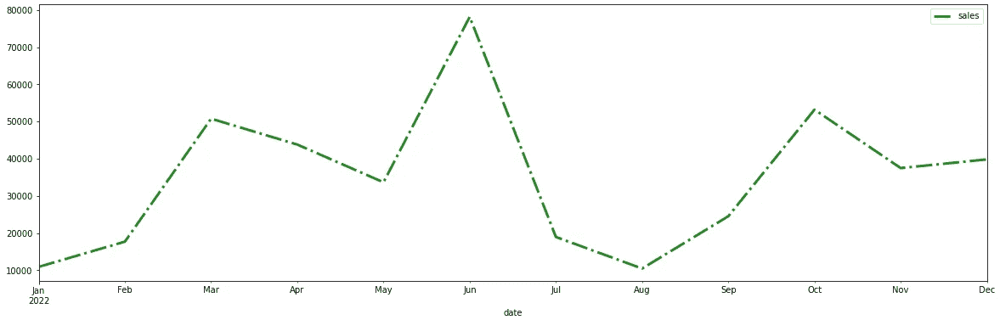
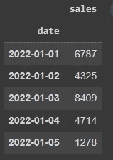
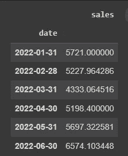
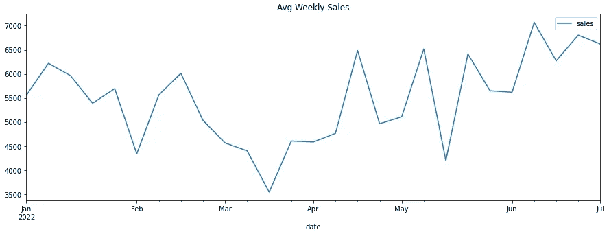
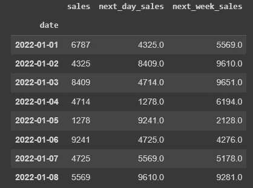
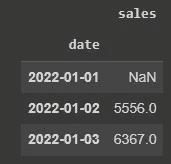

# 用于时间序列分析的熊猫把戏

> 原文：<https://towardsdatascience.com/pandas-tricks-for-time-series-analysis-726618532172>

## 用于分析熊猫时间序列的 3 个函数(带代码)


照片由[卢卡斯·布拉塞克](https://unsplash.com/@goumbik?utm_source=unsplash&utm_medium=referral&utm_content=creditCopyText)在 [Unsplash](https://unsplash.com/s/photos/time-series?utm_source=unsplash&utm_medium=referral&utm_content=creditCopyText) 上拍摄

熊猫几乎不需要介绍。对于那些刚刚开始接触数据科学领域的人来说，Pandas 代表 Panel Data Analysis，是目前 Python 中数据转换的主要库。

除了很多其他的东西，我们还可以使用这个漂亮的包来分析时间序列。可以，有很多方法可以用。在这篇文章中，我们将会看到其中的一些。

# 时间序列

让我们首先商定什么是时间序列。

> 在连续时间内获得的一个量的一系列值，它们之间通常有相等的间隔。(牛津语言)

简单地说，时间序列是指我们在一段时间内测量的东西，比如说商店的销售额。因此，我们将从 1 月、2 月、3 月开始取值，以此类推，直到 12 月。这将为我们提供一个包含月份和销售额的数据集。这是一个时间序列。



熊猫创造的时间序列。图片由作者提供。

熊猫对处理时间序列有充分的准备。下一节将展示一些有助于我们分析的代码片段。

# 使用熊猫

咱们`import numpy as np`和`import pandas as pd`吧。

我们应该学习的第一件事是如何在熊猫中创建一组日期。这在生成用于训练目的的时间序列时非常有用。

因此，如果我们使用`date_range()`，就有可能创建我们想要的任意多的日期，使用任何需要的时间间隔。

```
# Create a date range of 7 days
pd.date_range("2022-01-01", periods=7, freq='D')**[OUT]:** DatetimeIndex(['2022-01-01', '2022-01-02', '2022-01-03', '2022-01-04','2022-01-05', '2022-01-06', '2022-01-07'],               dtype='datetime64[ns]', freq='D')
```

注意，输出是一个从我们的初始日期起 7 天的列表。还有许多其他频率可用作`freq`。最常见的是表示每周的`"W”`、表示月末日期的`"M”`、表示月初的`"MS”`以及其他许多[可以在这里找到的](https://pandas.pydata.org/docs/user_guide/timeseries.html#timeseries-offset-aliases)。

知道了这一点，我们可以继续创建一个数据集，用于本帖中的练习。我们将设置一个种子，这样您就可以重现与我相同的结果，然后我们创建一个包含每日日期和销售额的数据集，并将日期设置为索引。

```
# Setting a seed for reproductionability
np.random.seed(12)# Create dataset
df = pd.DataFrame({
 'date': pd.date_range("2022-01-01", periods=180, freq='D'),
 'sales': np.random.randint(1000, 10000, size=180)}) # Set index
df = df.set_index('date')
```



数据集头。图片由作者提供。

现在，我们将继续熊猫的功能代码。请注意，时间序列的一个重要特征是将日期作为索引。当我们在前面的代码中设置索引时，我们已经满足了这个要求。

## 重新取样

第一个有趣的函数是`resample`。它所做的是接受一个数据集或一个系列(一列),并根据作为参数提供的`rule`聚集数据。这是一种按日期按功能分组的方式。

我们的数据集日期频率是每天，对吗？如果要转化为月销售额呢？

我们可以用`resample`做到这一点，但是由于数据被聚合，我们还必须添加一个函数来处理聚合的数字。我们可以`sum()`或计算`mean()`或`median()`，看月份的`max()`*等*。

```
# Resample by month end date
df.resample(rule= 'M').mean()
```

按月取平均值，并将指数设置为每月结束日期，结果如下。



按月平均。图片由作者提供。

现在让我们按周销售额来绘制汇总数据。

```
# Resample plot
df.resample('W').mean().plot(figsize=(15,5), title='Avg Weekly Sales');
```



平均每周销售额。图片由作者提供。

看起来我们的销售额在三月和四月之间有所下降，在六月中旬达到顶峰。

## 变化

Pandas 中的`shift`功能是让你在一列中上下移动数据。假设我们要将当天的销售额与前一天的销售额()以及当天的销售额与下周的销售额()进行比较。下面是如何使用`shift`完成的。

```
# Create a copy of the data
df_shift = df.copy()#Shift one day up
df_shift['next_day_sales'] = df_shift.sales.shift(-1)#Shift one week up
df_shift['next_week_sales'] = df_shift.sales.shift(-7)
```

看看我们如何拉动第二天的销售额和 7 天的销售额，将它们放在一起进行比较。



当天对次日对下周。图片由作者提供。

显然，如果需要，我们可以在这些列之间创建差异。

```
# Net gain/loss week over week
df_shift['one_week_net'] = df_shift.sales - df_shift.sales.shift(-7)
```

## 滚动平均值

下一个函数是从事股票交易的人常用的工具，即`rolling`平均值。事实上，这个功能是可以与其他功能结合使用的，不仅意味着，而且它恰好是最常见的。

这个函数创建一个窗口来聚集数据。因此，举例来说，如果我们创建 2 天的移动平均值，`rolling`将从数据集中提取连续 2 天的子集，并计算聚合结果，即最大值、中值或最常用的平均值。

```
# Calculate 2 days average with Pandas
df.rolling(2).mean()
```

在下图中，我们可以看到第一个值是一个`NaN`，因为没有足够的数据(本例中为 2 个数据点)来创建平均值。因此，对于第二个点，它获取原始数据集的前两行，并计算平均点。(6787 + 4325)/2 = 5556.



2 天移动平均线。图片由作者提供。

滚动平均非常常用于绘制数据，是趋势的一个很好的指示。子集周期越长，线越平滑。注意，100 天滚动平均线几乎是一条线，只是显示主要趋势，而 7 天平均线随着数据上下波动。

```
# Rolling plot
df.sales.plot(figsize=(25,8), legend=True, linestyle='--', color='darkgray')df.rolling(window=7).sales.mean().plot(legend=True, label='7 day average', linewidth=2)df.rolling(30).sales.mean().plot(legend=True, label='30 day average', linewidth=3)df.rolling(100).sales.mean().plot(legend=True, label='100 day average', linewidth=4);
```


实际数据(灰色)与 7、30 和 100 天平均值的比较。图片由作者提供。

# 在你走之前

我相信熊猫对我们分析任何数据都是有价值的，当然也包括时间序列。这篇文章中介绍的这三个函数可以帮助你开始时间序列分析。好好利用他们。

*   `resample`:将数据从日频率转换到其他时间频率。
*   `shift`:在列中上下移动数据，进行比较或计算。
*   `rolling`:创建滚动平均线，观察趋势。

如果你喜欢这些数据，请关注我。

[](http://gustavorsantos.medium.com/)  

如果你想成为中等会员，[这里有一个介绍链接](https://gustavorsantos.medium.com/membership)。

# 参考

熊猫日期范围:[https://pandas . pydata . org/docs/reference/API/pandas . Date _ Range . html](https://pandas.pydata.org/docs/reference/api/pandas.date_range.html)

熊猫再取样:[https://pandas.pydata.org/docs/reference/api/pandas.DataFrame.resample.html](https://pandas.pydata.org/docs/reference/api/pandas.DataFrame.resample.html)

熊猫转移:[https://pandas.pydata.org/docs/reference/api/pandas.DataFrame.shift.html](https://pandas.pydata.org/docs/reference/api/pandas.DataFrame.shift.html)

熊猫滚滚:[https://pandas.pydata.org/docs/reference/api/pandas.DataFrame.rolling.html](https://pandas.pydata.org/docs/reference/api/pandas.DataFrame.rolling.html)