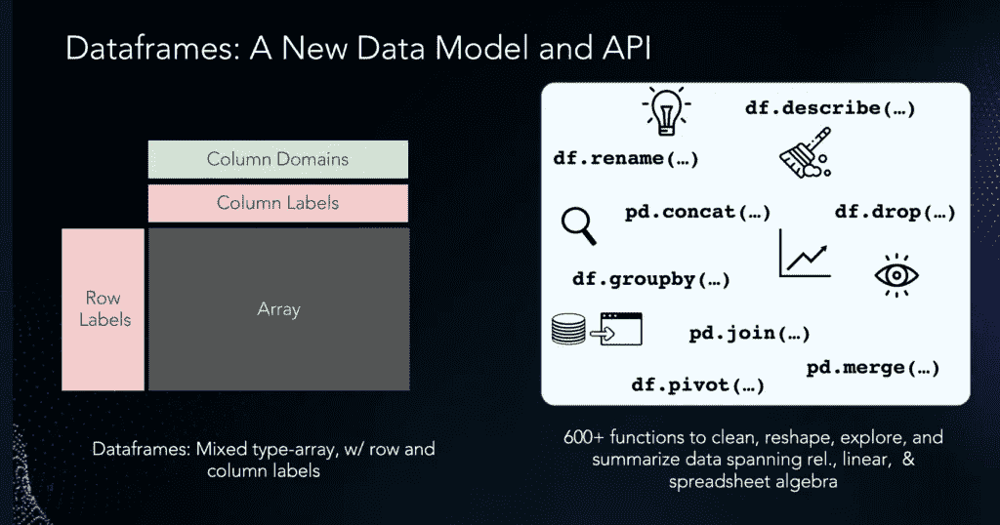
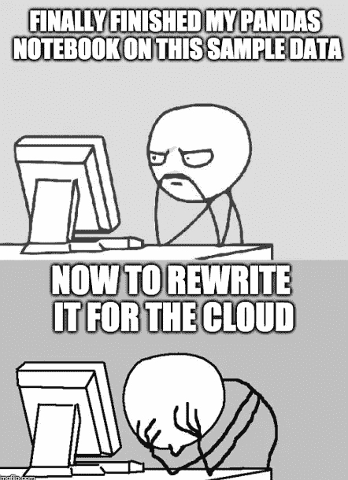
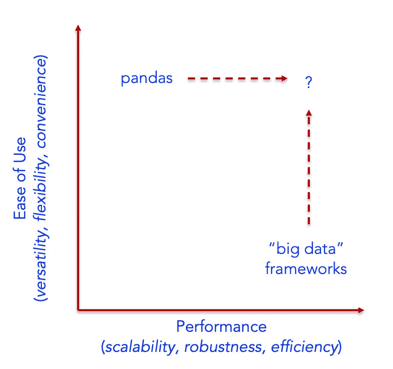

# 熊猫大战 SQL——第一部分:美食广场和米其林风格的餐厅

> 原文：<https://towardsdatascience.com/pandas-vs-sql-part-1-the-food-court-and-the-michelin-style-restaurant-6921a0786cab>

(**左**)杜尚·哈努斯卡在 [flickr 上的照片](https://www.flickr.com/photos/97304820@N00/5154522324) | ( **右**)普拉依特诺在 [openverse 上的照片](https://wordpress.org/openverse/image/d9bdcaa6-e1e0-4dbb-b524-e2c609c27051)

tldr: 这是一系列对比 Pandas 和 SQL(数据框架和数据库)的博客文章中的第一篇。事实上，数据框架和数据库都是旧思想，可以追溯到几十年前。数据库选择可伸缩性、健壮性和效率，而 Pandas 选择简洁、灵活和方便。我们能指望两个世界都好吗？是啊！

每隔几个月，就会有一条关于熊猫大战 SQL 的推文，比如 2020 年的这条:

> *我不得不给出一个结合了 Pandas 和 SQL 的代码库给那些对 Pandas 或 SQL 一无所知的学术界人士，但是(1)他们可能知道一些 R，(2)他们可能有学术界的朋友/同行知道 Pandas 或 SQL。当一个任务可以在 Pandas 或 SQL 中完成时，应该使用哪一个？*
> 
> *-高级 PowerPoint 工程师(@ ryx commar)*[*2020 年 7 月 19 日*](https://twitter.com/ryxcommar/status/1284982761921675264?ref_src=twsrc%5Etfw)

或者这个:

> *SQL 比 python/r 更受当今数据人员的欢迎，是因为它更好，还是因为人们可以使用它而无需设置开发环境，将数据从一个地方移动到另一个地方，或者做任何其他困难的“搜索另一个神秘的终端错误”的事情？*
> 
> *-本斯坦西尔(@本斯坦西尔)*[*2022 年 1 月 25 日*](https://twitter.com/bennstancil/status/1486031369327292421?ref_src=twsrc%5Etfw)

然后这个月早些时候的这个:

> *跟进问题:你什么时候从 SQL 切换到另一个 PL (Python，JS 等)。)?硬的时候还是不符合人体工程学的时候还是别的？*
> 
> *-莎拉·卡坦扎罗(@ Sarah cat 21)*[*2022 年 6 月 15 日*](https://twitter.com/sarahcat21/status/1537110080390410241?ref_src=twsrc%5Etfw)

所有这些推文本质上都问了同一个问题:**就数据工作而言，Pandas/Python 能比 SQL/数据库更好吗** — **如果能，什么时候？显然，使用熊猫的数百万数据科学家在他们首选的工具上不可能都是错的——但是很难找到一种资源以一种确定的方式回答这个问题。**

所以我们决定写一系列的博客文章来探讨这个问题，比较熊猫和 SQL/数据库。这是第一篇，我们将在未来几周发布后续文章。即使你没有阅读任何帖子，其中的要点是:**数据框架和数据库已经以某种形式存在了几十年。两者都在数据分析和数据科学领域占有重要地位！**

无论如何，说到这篇博文的主题。嗯...谁不喜欢美食类比呢？让我们开始吃吧。

首先，让我们谈谈[关系数据库](https://en.wikipedia.org/wiki/Relational_database)——一项成熟的、有几十年历史的技术，市值高达数千亿美元，由 Snowflake、Databricks、Oracle、Amazon、Microsoft 和 Google 等公司提供。我们都喜欢关系数据库。

数据库允许你用一个预定义的结构或者模式来表示直观集合中的数据，这些集合被称为[关系](https://en.wikipedia.org/wiki/Relational_model)。数据库让你使用 SQL 或“结构化查询语言”来操作关系，这种语言是 IBM 在 20 世纪 70 年代发明的，通常被称为“星系间数据峰”SQL 和关系数据库经受住了时间的考验，尽管许多人试图取代它们，包括 2000 年代中期的 noSQL 运动。数据库将比我们所有人都长寿。

一家高级餐厅。我还没去过一个用餐巾纸做天鹅的地方。也许有一天。(图片由杰伊·温宁顿在 [unsplash](https://unsplash.com/photos/N_Y88TWmGwA) 上拍摄)

事实证明，关系数据库非常像米其林星级高级餐厅。这种类型的餐馆非常正式:你需要穿衬衫或连衣裙，而不是短裤或 t 恤——就像你的数据库一样，在你操作数据之前需要一个正式的模式。菜单上没有太多的选项:它通常是一个固定的菜单，有一组精心挑选的小选项，就像您的数据库一样，它只支持 SQL 中的少量关键字(SELECT-FROM-WHERE-GROUP-BY……)。但就其作用而言，高级餐厅——就像数据库一样——是经过微调的、高效的和有效的。

或者，让我们考虑一个非常不同的野兽， [Pandas](https://pandas.pydata.org/) ，数据科学的流行数据框架库。

[Pandas](https://pandas.pydata.org/) 是一个快速、强大、灵活且易于使用的开源数据分析和操作工具。Pandas 的起源源于统计社区，在 2008 年移植到 Python 之前，该社区在 20 世纪 90 年代的 [S](https://en.wikipedia.org/wiki/S_(programming_language) 和 21 世纪的 [R](https://en.wikipedia.org/wiki/R_(programming_language) 中开发了底层数据帧抽象。**因此，数据框架已经以某种形式** — **存在了三十多年，这种形式是为了统计数据分析和数据科学** — **的目的而明确设计的！**

Pandas 在数据科学家和数据分析师中非常受欢迎，每周被下载 3000 万次。事实上，Python 现在是世界上发展最快的语言，这在很大程度上要归功于熊猫。在[各种文章](https://qz.com/1126615/the-story-of-the-most-important-tool-in-data-science/)中，它被称为数据科学中最重要或最受欢迎的工具。

那么熊猫的数据框架和数据库相比如何呢？Pandas dataframe 系统类似于数据库，但也有所不同。与数据库关系不同，在数据帧中，Pandas 允许在一列中使用混合类型的数据，并维护顺序概念。除了列标签之外，数据框架还支持行标签，这使得引用数据变得很容易。pandas 支持 [600 多种功能](https://pandas.pydata.org/docs/reference/index.html)，涵盖数据清理、准备、转换和汇总，让您可以对数据做几乎任何可以想象的事情，从关系、矩阵(线性代数)和电子表格中提取数据，涵盖数据清理、转换、准备、特征化和探索。

Dataframe 数据模型和 600 多个函数(图片由作者提供)

因此，如果关系数据库就像米其林星级餐厅，那么熊猫就非常像一个美食广场。美食街不在乎你穿什么——就像熊猫一样，它不需要你在加载数据前整理或清理数据。你可以零零碎碎地订购你喜欢的东西——就像熊猫一样，它让你可以逐步提出你的查询。你甚至可以做一些不虔诚的事情——比如混合寿司和薯条。你甚至可以在薯条上放冰淇淋。你可能会得到一些奇怪的眼神，但没有人能阻止你。从最老的人到最年轻的人，每个人都是快乐的！

典型的美食广场(由保罗·芬威克在 [openverse](https://wordpress.org/openverse/image/99bee74b-fa69-4050-9fb3-436c86e2b6fd) 上拍摄)

让我们将我们的数据库美食体验与熊猫美食广场进行对比。就方便性而言，关系数据库要求您一次订购整个 SELECT-FROM-WHERE 查询；Pandas 允许你一次下一个订单，检查它，然后如果你愿意的话可以订购更多。我们的美食数据库要求在你进门之前有一个正式的模式(如果你穿短裤，你会被踢出去的！);Pandas food court 并不在乎——在一个列中混合类型完全没问题，这在数据清理的早期阶段很方便。Pandas 也非常平等:它对行和列一视同仁，对数据和元数据一视同仁；祝你好运，从你的美食数据库里得到那种待遇！我们的美食数据库菜单上只有几样东西——你的“从哪里选择”查询；熊猫拥有一切可以想象的东西，从寿司到汉堡到冰淇淋，有数据科学家贡献的 600+开源函数。

那么坏处是什么呢？不幸的是，尽管 Pandas *API 有许多优点，但 Pandas *实现*并没有真正扩展，因为它是在没有任何正式基础的情况下以特别的方式发展的。它只支持单线程执行，所以即使在一个强大的集群上运行它也不会给你带来任何好处。由于它完全在内存中操作，并制作许多副本，因此经常会引发内存不足(OOM)错误。最后，在一个序列中没有跨多个 pandas 操作符的真正的查询优化。所以你经常发生的事情是:你对你的数据进行采样，用熊猫进行探索，然后重写你的工作流程来大规模运作。*

不幸的是，这太普通了(图片由作者提供，使用 imgflip.com)

因此，如果我们对比 Pandas 与数据库等大数据框架，这些大数据框架在性能谱上得分很高，跨越了*可扩展性*、*健壮性*和*效率*。正如我们将在随后的博客文章中探讨的那样，Pandas 在易用性方面得分很高，包括*简洁*、*灵活*和*方便*。

比较熊猫和大数据框架(图片由作者提供)

一个悬而未决的问题是我们是否能两者兼得:我们能保留 Pandas API 但改变实现以获得可伸缩性、健壮性和效率吗？有一些团队正在研究这个问题——例如，通过[将类似数据库的技术应用于熊猫](https://ponder.io/how-do-we-parallelized-600-pandas-functions-with-modin/)——包括一个开源项目 [Modin](https://github.com/modin-project/modin/) ，它旨在成为熊猫的可扩展替代者。

在我们的 Pandas vs. SQL 系列的下一篇文章(第 2 篇，共 4 篇)中，我们认为 Pandas 是更简洁的语言。更多阅读 [**此处**](https://ponder.io/pandas-vs-sql-part-2-pandas-is-more-concise/) **！**

如果你是熊猫或者 SQL 爱好者(或者两者都是！)我们希望收到您的来信。欢迎在 Twitter 上关注我们，了解更多类似的内容，并回复[我们的帖子](https://twitter.com/ponderdata/status/1541812181997481984)！

*原载于 2022 年 6 月 28 日*[*https://pounder . io*](https://ponder.io/pandas-vs-sql-food-court-michelin-style-restaurant/)*。*