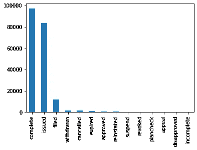

# Pandas 与 SQL —第 4 部分:Pandas 更方便

> 原文：<https://towardsdatascience.com/pandas-vs-sql-part-4-pandas-is-more-convenient-8e9744e2cd10>

gamene 在 [Openverse](https://wordpress.org/openverse/image/7943cc58-b1b0-4a80-9115-233fa61e7b5a/) 的照片(CC BY 2.0)

**TL；dr:** 在这篇文章中，我们在三个坐标轴中的第三个坐标轴上比较了 Pandas 和 SQL:便利性。我们描述了 Pandas dataframe 数据模型更便于数据科学和机器学习用例的六种方式。

在我们的 Pandas 与 SQL 之间的史诗般的战斗的第四部分中，我们说明了 Pandas 如何在数据科学和机器学习方面比 SQL 更方便。熊猫是由数据科学家为数据科学家设计的，并受益于开源数据科学社区热情反馈的数千项改进——所有这些改进都着眼于更大的实用性和易用性。所以很契合也就不足为奇了！

在我们开始之前，如果你错过了我们以前的 Pandas vs. SQL 产品，你仍然可以在这里赶上:[第一部分:美食广场和米其林风格的餐厅](https://ponder.io/pandas-vs-sql-food-court-michelin-style-restaurant/)，[第二部分:Pandas 更简洁](https://ponder.io/pandas-vs-sql-part-2-pandas-is-more-concise/)，和[第三部分:Pandas 更灵活](https://ponder.io/pandas-vs-sql-part-3-pandas-is-more-flexible/)。我们之前的帖子关注的是数据框架[数据模型](https://ponder.io/pandas-vs-sql-part-3-pandas-is-more-flexible/)和数据框架[代数](https://ponder.io/pandas-vs-sql-part-2-pandas-is-more-concise/)的比较——在这篇帖子中，我们关注的是数据框架的人类工程学:特别是，数据框架是如何使用的。

为了便于查找，下面列出了 Pandas 数据框架比关系/SQL 数据框架更方便的多种方式:

1.  在 Pandas 中，您可以逐步构建查询；在 SQL 中，您不能。
2.  在熊猫身上，操作和命名中间结果很容易；在 SQL 中更难。
3.  在熊猫身上，很容易获得对数据的快速感知；在 SQL 中，这要困难得多。
4.  Pandas 具有对可视化的本地支持；SQL 没有。
5.  熊猫让机器学习变得简单；SQL 没有。
6.  Pandas 保留顺序以帮助用户验证中间步骤的正确性——并允许用户按顺序操作；SQL 没有。

在这篇文章中，我们将使用来自 [Kaggle 的 5 天数据清理挑战](https://www.kaggle.com/code/rtatman/data-cleaning-challenge-handling-missing-values/notebook)的数据集；这是旧金山建筑许可的数据集。数据来自[旧金山政府数据门户](https://data.sfgov.org/Housing-and-Buildings/Building-Permits/i98e-djp9/data)，他们通过公共领域专用和许可 v1.0 提供数据[。](https://opendatacommons.org/licenses/pddl/1-0/)

# 1.在 Pandas 中，您可以逐步构建查询；在 SQL 中，您不能。

Pandas 和 SQL 之间的一个重要区别是，Pandas 允许用户在其他操作的基础上逐步构建更复杂的查询。同时，用户可以检查这些查询片段的中间结果——努力验证它们的正确性。和熊猫一起调试简直易如反掌！

因此，在我们的数据集中，假设我们想要关注 Geary Street 对应的许可证。我们可以如下提取数据集子集:

我们可能已经注意到的一件事是 Geary 跨越了许多社区，这里编码为`'Neighborhoods - Analysis Boundaries'`。假设我们只想检查这一列`'Neighborhoods - Analysis Boundaries'`(并删除剩余的 42 列)，我们可以简单地将子句`[['Neighborhoods - Analysis Boundaries']]`附加到前面的表达式的末尾。

这是很多行:1966 年。然后，作为我们的最后两步，假设我们想要识别 Geary 上拥有最多许可的街区。一种方法是追加一个`'sort_values'`后跟一个`'value_counts'`。

有意思，所以最高的街区是田德隆区，其次是外里士满区。请注意，虽然这一系列操作肯定可以用 SQL 来表达，但这会更加痛苦。我们不能简单地在一个 SQL 查询的末尾添加操作符:查询中有特定的位置需要我们进行修改。例如，要更改显示哪些列，我们需要在早期修改查询的`*SELECT*`部分。相反，Pandas 允许你操作性地(或命令性地)思考——一步一步地构建你的最终结果，同时检查中间结果。

# 2.在熊猫身上，操作和命名中间结果很容易；在 SQL 中更难。

Pandas 嵌入在真正的编程语言 Python 中，借用了许多熟悉的编程习惯用法来操作数据帧。特别是，我们可以将一个数据帧表达式赋给一个变量；这些变量然后可以被操作和/或分配给其他变量。

我们举一个简单的例子来说明。由于该数据集来自数据清理挑战，假设我们怀疑可能有许多空值。我们可以使用以下方法检查每列有多少个:

空值太多了！假设我想创建一个数据集的清理版本，删除包含太多 null 值的列，将阈值设置为 190000 个非 null 值。(整个数据集大约有 199000 行。)

哇——列的数量从 43 列减少到只有 13 列。正如我们在这里看到的，我们能够轻松地定义一个新的变量`'sf_permits_cleaned'`(就像我们创建之前的变量`'missing_values_count'`)，使用标准的编程变量赋值，然后对它进行操作。这种方法对程序员来说很自然。在 SQL 中，可以通过视图实现类似的效果，但是定义视图并对其进行操作不太直观，而且更麻烦。

# 3.在熊猫身上，很容易获得对数据的快速感知；在 SQL 中，这要困难得多。

Pandas 提供了快速理解数据帧的数据和元数据的方法。我们已经看到过这样的例子，当我们简单地使用变量名或者使用函数`'head/tail()'`来打印数据帧时。为了方便起见，为了适合屏幕，某些行和列用`'...'`隐藏起来，以帮助用户获得数据的高层次图像。

如果我们想要检查列及其类型的摘要，Pandas 提供的一个方便的函数是`'info()'`，它列出了数据集的列、它们的类型以及空值的数量。我们可以使用这个函数来检查我们刚刚创建的数据帧。

因此，看起来唯一仍然包含空值的列是 description 列；所有其他列都已完全填充。

另一个针对数字列的有用的 Pandas 函数是`'describe()'`，它提供了这些列的方便摘要，包括计数、平均值、标准偏差和分位数。

嗯，看起来街道号是 0。好奇！

不幸的是，SQL 没有提供类似的便利来理解数据集的形状和特征——为此，您必须编写自定义查询。对于前面的例子，这个查询的长度将与数字列的数量成比例。

# 4.Pandas 具有对可视化的本地支持；SQL 没有。

对数字表格的分析只能帮到你这么多。通常你需要的是在数据框架中理解信息的视觉方式。与需要将数据加载到单独的可视化或 BI(商业智能)工具中的 SQL 不同，Pandas 在库中提供了内置的可视化支持。例如，我可以简单地调用`'plot()'`来查看各种许可的`'Current Status'`的条形图。

看起来绝大多数许可证属于已完成、已签发和已归档类别，少数属于其他类别。

这个特性的强大之处是显而易见的:与 SQL 数据库不同，如果您想生成可视化效果，您不需要离开这个库——您可以在这里完成！如果你想“增强”你的可视化体验，有许多与熊猫紧密集成的可视化库，包括 [Matplotlib](https://matplotlib.org/) 、 [seaborn](https://seaborn.pydata.org/) 和 [altair](https://altair-viz.github.io/) 。如果你像我一样懒惰，根本不希望编写任何代码来生成可视化，那么你可以使用我们的 Pandas-native 可视化推荐库 [Lux](https://github.com/lux-org/lux) ，来自动为你生成可视化，并根据你的数据集进行调整。点击阅读更多关于力士[的信息。](https://ponder.io/using-lux-to-visualize-your-pandas-dataframes-with-zero-effort/)

# 5.熊猫让机器学习变得简单；SQL 没有。

机器学习是数据科学的关键组成部分，使用户不仅能够理解图像、视频和文本等非结构化数据，还能预测未来。由于 Pandas 与数据科学生态系统紧密集成，因此它与机器学习库(包括常见的库，如 [scikit-learn](https://scikit-learn.org/stable/) 、 [pytorch](https://pytorch.org/) 、 [numpy](https://numpy.org/) )配合良好也就不足为奇了。这里，我们将使用 [spaCy](https://spacy.io/) 库，一个相对较新的自然语言处理库，来理解数据集中的文本列。SpaCy 提供各种单词预训练模型来执行单词嵌入、命名实体识别、词性标注、分类等。要安装 spaCy，我们运行以下命令:

现在我们已经安装了它，假设我们想要了解活动的类型(例如，拆除、移除、替换等。)涉及我们数据集中的每个许可申请(即 row)。这在前面很难理解，但是隐藏在文本字段`'Description'`中。让我们使用这个包来提取这个字段中提到的动词列表。作为其中的一部分，我们首先加载 spaCy 的`'en_core_web_md'`模型，然后使用该模型提取描述的标记化中的每个动词，并将其存储在一个数组中，如下所示。

因此，正如我们在上面看到的，该模型在提取动词方面做得很好，尽管它确实漏掉了一些(例如，install)。随着[大型预训练模型](https://techcrunch.com/2022/04/28/the-emerging-types-of-language-models-and-why-they-matter/)(例如，transformer 模型)的不断增加，我希望这些模型能够更好地集成到 pandas 的日常数据处理中。

在 SQL 数据库中集成机器学习非常困难。虽然一些数据库提供了特定于机器学习的构造(例如，BigQuery ML)，但是用户在他们能够完成什么方面受到限制，并且没有细粒度的控制。另一种组装方法是使用 UDF 来进行机器学习。通常最终发生的是用户将他们的数据导出到数据库上下文之外来执行机器学习。

# 6.Pandas 保留顺序以帮助用户验证中间步骤的正确性——并允许用户按顺序操作；SQL 没有。

熊猫维持秩序。这对于调试和验证非常重要，因为我们正在构建更复杂的查询表达式。继续我的例子，在提取动词的空间之后，假设我想使用`'explode'`函数将前面数据帧中的单个动词展开成多行，每一行一个动词；我可以简单地这样做。

注意，我现在有三行对应于原来的第一行，每一行提取一个动词。这种顺序的保持使得验证该步骤的正确性变得容易。使用 SQL 数据库，这将更加困难，因为顺序没有保证，所以需要查看整个输出以了解给定行的结束位置(或者添加一个`*ORDER* *BY*`子句来强制执行特定的输出顺序)。

# 结论

在这篇文章中，我们从最终用户的角度介绍了 Pandas 比 SQL 更方便的各种方式。这包括通过保持顺序、增量合成、命名和操作以及沿途检查来正确地构建 Pandas 查询。这还包括与其他数据科学和数据分析需求的集成，包括可视化和机器学习:Pandas 不仅允许用户完全在 Pandas 中可视化和执行预测建模，还提供了将输出连接到其他流行的可视化和机器学习库和包的挂钩，特别是在 PyData 生态系统中。最终，Pandas 位于成熟的编程语言 Python 中，并继承了它的所有功能。

如果你能想到其他例子，Pandas 比 SQL 更方便，或者相反，我们很乐意听到！请随意回复我们的[推文](https://twitter.com/ponderdata/status/1560408780197638144)，并且[在 Twitter](https://twitter.com/ponderdata) 或 [LinkedIn](https://www.linkedin.com/company/ponderdata/) 上关注我们，了解更多熊猫/ Python /数据科学内容！