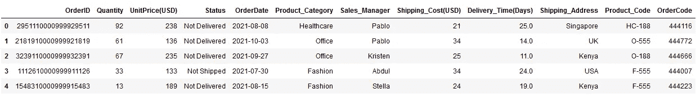
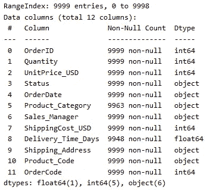
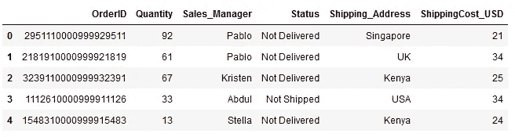
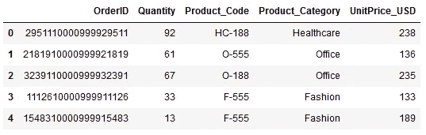
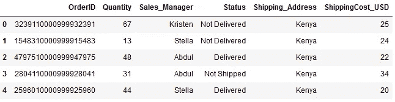
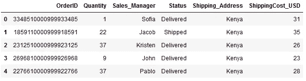
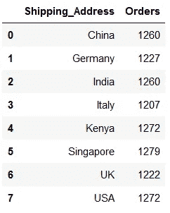
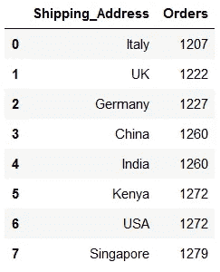
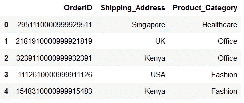

# panda sql——用 Python 运行 SQL 查询的有趣方式

> 原文：<https://towardsdatascience.com/pandasql-interesting-way-to-run-sql-queries-in-python-18a4fc36406a>

## 熊猫

## 使用 Python Pandas 中的 SQL 查询对数据进行提取、分组、排序和连接数据集！！


在 [Unsplash](https://unsplash.com?utm_source=medium&utm_medium=referral) 由[萨尔茨堡](https://unsplash.com/@freewalkingtoursalzburg?utm_source=medium&utm_medium=referral)自由行旅行团拍摄的照片

**pandas** 是一款快速、强大、灵活且易于使用的开源数据分析和操作工具，构建于 Python 编程语言之上。

这就是为什么 Pandas 是 Python 的一个广泛使用的数据分析和操作库。🏆

尽管如此，有时 **SQL** 查询看起来非常简单易懂。另外，如果你学习 SQL，用 SQL 提取、操作和分析数据似乎非常容易。对于所有这样的用户(*包括我*)， **pandasql** 绝对是一个惊艳的库。

`**pandasql**`允许您使用 SQL 语法查询 pandas 数据帧。这也不需要安装或连接任何 SQL server。💡

> 这可能是使用 Pandas 学习 SQL 的一个小小的动机和简单的开始。

我在上一个项目中使用了 *pandasql* ，它简化了整个数据提取和分析的方式让我感到惊讶。它提供了一种更熟悉的操作和清理数据的方式。

在本文中，我用几个经典的例子解释了 *pandasql* 在数据分析中的真正潜力。

要开始，我们需要做的就是用 Python 安装`pandasql`库，

```
**pip install pandasql**
```

一边用笔记本打字一边在线下的一个单元格中点击`Shift` + `Enter`。

```
**!pip install pandasql**
```

`pandasql`中的主要功能是`**sqldf**` 。因此，可以使用，

```
**from pandasql import sqldf**
```

`**sqldf**` 有两个参数，其中一个是完全可选的(*事实上我从未使用过*)。所以，重要且唯一的参数是一个 ***SQL 查询字符串*** 。

sqldf 使用它的语法`**sqldf(sql_query)**`给出一个 pandas 数据帧作为输出。我们可以使用 SQL 查询任何 pandas 数据帧，就像我们使用 SQL 从任何表中提取数据一样。

`***pandasql***`使用 [SQLite 语法](https://www.sqlite.org/lang.html)！

就是这样！！我们都准备好去探索了！🚀

为了使文章有趣并易于理解，我想使用`pandas.read_csv()`在 pandas DataFrame 中导入一个[虚拟销售数据](https://github.com/17rsuraj/data-curious/blob/master/TowardsDataScience/Dummy_Sales_Data_v1.csv)(自己创建的数据集)。

```
import pandas as pd
from pandasql import sqldfdf = pd.read_csv("Dummy_Sales_Data_v1.csv", sep=",")
df.head()
```



虚拟销售数据|作者图片

它是一个 10000 x 12 的数据集，仅包含虚拟数据，可用于所有目的的数据分析。你可以免费下载并用来练习数据分析。

为了便于访问数据，我将重命名这些列。

```
df.rename(columns={"Shipping_Cost(USD)":"ShippingCost_USD",
                   "UnitPrice(USD)":"UnitPrice_USD",
                   "Delivery_Time(Days)":"Delivery_Time_Days"},
          inplace=True)
df.info()
```



按作者更改列名|图像

现在，让我们先从简单的事情开始。

# 数据析取

从简单的例子开始，让我们从上面的数据框架`df`中提取一些数据，并制作两个小表— `df_orders`和`df_products`。

这可以是`sqldf`最简单的例子。

此任务的 SQL 查询将是，

```
SELECT OrderID, Quantity, Sales_Manager, Status, Shipping_Address, ShippingCost_USD FROM df
```

要使它成为一个字符串，必须用`“ ”`括起来。作为一个好的实践，我将把这个字符串赋给一个变量`*query*`。

```
query = "SELECT OrderID, Quantity, Sales_Manager, Status, Shipping_Address, ShippingCost_USD FROM df"
```

现在，是时候使用`sqldf`功能了！

```
df_orders = sqldf(query)
df_orders.head()
```



作者使用 sqldf | Image 提取的 df_orders

类似地，另一个数据帧`df_products`也可以使用下面的`sqldf`生成。

```
query = "SELECT OrderID,\
        Quantity, \
        Product_Code, \
        Product_Category, \
        UnitPrice_USD \
        FROM df"
df_products = sqldf(query)
df_products.head()
```



df _ 产品使用 sqldf |图片作者

用一行代码编写一个 SQL 查询可能会很繁琐和令人困惑，尤其是当我们想要查询多个列时。

由于我们将 SQL 查询作为一个*字符串*传递给`sqldf`，我们可以使用多行字符串，就像我在上面创建`df_products`表时使用的一样。

> 它使代码变得干净，易于编写、阅读和修改！

这里是 Python 中关于 ***的一行程序*** 的趋势之一。

</5-most-powerful-one-liners-you-should-know-in-python-programming-c9d49a89b7f3>  

接下来，`sqldf`也可以用于有条件地提取或选择数据。

# 基于条件选择数据

可以根据一列或多列上的条件提取数据。在`sqldf`中，这可以通过使用 WHERE 语句来实现。

例如，从`*df_orders*`中选择所有订单，其中*发货地址*为*肯尼亚*。

让我们首先编写如下的 SQL 查询，

```
SELECT * FROM df_orders WHERE Shipping_Address = 'Kenya'
```

将其转换为字符串并传递给`sqldf`函数，我们可以提取所需的数据，如下所示。

```
query = "SELECT * \
        FROM df_orders \
        WHERE Shipping_Address = 'Kenya'"
df_kenya = sqldf(query)
df_kenya.head()
```



在 SQL | Image by Author 中使用 WHERE 语句

让事情变得复杂一点，让我们试着把所有发货到*的订单，*的*数量*少于 *40* 并且*状态*为已发货或已交付。

```
query = "SELECT * \
        FROM df_orders \
        WHERE Shipping_Address = 'Kenya' \
        AND Quantity < 40 \
        AND Status IN ('Shipped', 'Delivered')"
```

让我们将这个查询字符串传递给`sqldf`以获得输出。

```
df_kenya = sqldf(query)
df_kenya.head()
```



在 WHERE 语句|作者图片中使用 AND 关键字

这表明，我们可以在`sqldf` 中使用来自 SQL 的所有关键字，例如`Status IN (‘Shipped’, ‘Delivered’)`和在 WHERE 语句中使用`AND`关键字。

故事并没有到此结束！我们还可以将数据分成不同的组，并执行计算以供进一步分析。

# 分组依据

在 Python 中，pandas `groupby`用于将数据分类，并有效地聚合数据。在 SQL 中，类似的功能由`GROUP BY`语句提供。

`GROUP BY`语句或 pandas `groupby`函数通常与`COUNT()`、`MAX()`、`MIN()`、`SUM()`、`AVG()`等聚合函数一起使用，按一列或多列对结果集进行分组

> pandasql 使我们能够使用 sql 查询在 Pandas 数据帧上应用`groupby`功能。*🏆*

例如，让我们看看有多少订单被发送到每个送货地址。从逻辑上讲，这是通过按不同的送货地址对数据进行分组，然后计算订单数量来实现的。

因此，SQL 查询是，

```
SELECT Shipping_Address, COUNT(OrderID) AS Orders FROM df_orders GROUP BY Shipping_Address
```

将该查询转换成字符串并传递给`sqldf` 函数，我们将得到如下预期结果:

```
query = "SELECT Shipping_Address, \
        COUNT(OrderID) AS Orders \
        FROM df_orders \
        GROUP BY Shipping_Address"df_group = sqldf(query)
df_group.head(10)
```



熊猫分组使用 sqldf |图片作者

现在，这个输出与熊猫组的输出略有不同。

> `sqldf`给出熊猫数据帧作为输出*🏆*而熊猫`groupby`返回*数据帧对象*作为输出。

如果是 pandas groupby，`*Shipping_Address*`列将是索引列，pandas `groupby`的输出也不会是数据帧。因此，为了进一步使用分组和聚合的数据，我们需要将`groupby`对象转换为 pandas DataFrame 并重置其索引。

下面是获得相同输出的 pandas `groupby`代码。

```
df_grouped = df_orders.groupby("Shipping_Address")
df_grouped = df_grouped["OrderID"].count()
df_grouped = pd.DataFrame(df_grouped)
df_grouped.reset_index(inplace=True)
df_grouped.rename(columns={"OrderID":"Orders"}, inplace=True)
```

显然， *pandasql* 简化了数据分组及其聚合。

此外，可以使用 SQL `**ORDER BY**`语句基于一列或多列对数据进行升序或降序排序。

让我们继续使用相同的数据分组示例，并根据订单数量对送货地址进行排序。

```
query = "SELECT Shipping_Address, \
        COUNT(OrderID) AS Orders \
        FROM df_orders \
        GROUP BY Shipping_Address \
        ORDER BY Orders"df_group = sqldf(query)
df_group
```



使用 sqldf |图片按作者排序熊猫数据帧

简单地说，只需在现有查询的末尾添加 3 个单词，我们就可以快速地按升序排列结果。

这里有一篇关于熊猫`groupby`的精彩文章。

</4-awesome-pandas-methods-to-quickly-analyze-any-dataset-65d2252af6e8>  

如果你认为这些都是很简单的查询，那么`sqldf`会给你一个惊喜。

> `sqldf`可以执行高级 SQL 查询，如连接。*🏆*

SQL 中的 JOINs 或 pandas 中的 merge 是用于根据两个或多个数据集之间的相关列来组合它们的工具。

到目前为止，在我的项目中，我使用了所有类型的使用`sqldf`的 SQL 连接，看起来超级方便。

让我们看看如何！

# 合并数据集

如果我们使用 pandas，有两个函数来组合数据集— `merge`和`concat`。并且有时会弄不清何时使用哪一个。

SQL 通过使用`JOIN`语句简化了事情。并且`sqldf`也可以处理`JOIN`语句。

例如，让我们将所有订单、送货地址和产品类别放在一起。为此，我们将使用本文开头创建的`df_orders`和`df_products`。

```
query = "SELECT T1.OrderID, \
        T1.Shipping_Address, \
        T2.Product_Category \
        FROM df_orders T1\
        INNER JOIN df_products T2\
        ON T1.OrderID = T2.OrderID"df_combined = sqldf(query)
df_combined.head()
```



使用 sqldf | Image by Author 的内部联接

这样， `df_orders`和`df_products`都连接在 *OrderID* 列上。由于是一个`INNER JOIN`， *OrderID* s，两个数据帧中都存在的将被返回。

同样，`sqldf`也可以执行*左*和*右*和`JOIN` s。

以下是理解如何在 Python pandas 中组合数据集的推荐读物。

</join-the-tables-ab7fd4fac26b>  

总结一下，

我个人经常使用`sqldf`,因为它保持代码干净、简单、易于理解和修改。因此，我展示了我们可以用它做什么。

这是关于`pandasql`最全面的指南之一，这里是一个完整的 [**笔记本**](https://github.com/17rsuraj/data-curious/blob/998616e5c2196597c24224f5e44c0bff1e5f65cc/TowardsDataScience/Examples_of_pandasql.ipynb) 以及所有代码。如果我错过了什么，请在评论中告诉我。

现在你可以通过 [***在这里报名成为中会员***](https://medium.com/@17.rsuraj/membership) 阅读我&其他作家发表的所有故事。当你这样做，我会得到你的费用的一小部分。欢迎加入我的 [***电子邮件列表***](https://medium.com/subscribe/@17.rsuraj) 也可以随时更新我的写作。

🚩不要忘记将您的 SQL 查询放在`“ ”`中，以便在将其传递给`sqldf`之前将其转换为字符串。

🚩在一行中编写代码时，你应该记住[***PEP-8***](https://www.python.org/dev/peps/pep-0008/#maximum-line-length)关于一行中最大字符数的准则，即 79 个字符。

## 感谢您的阅读！！