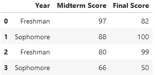
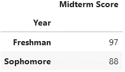
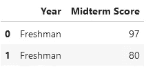
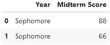
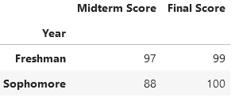
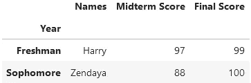

# 熊猫的分组功能是一个强大的工具，但如果你不小心，可能会误导你的观众

> 原文：<https://towardsdatascience.com/pandass-groupby-function-is-a-powerful-tool-but-can-mislead-your-audience-if-you-re-not-careful-c4491055a98e>

## 你需要明智地决定如何显示 groupby 的结果，否则你的读者可能会从你的数据中收集到错误的见解。


由[马库斯·斯皮斯克](https://unsplash.com/@markusspiske?utm_source=medium&utm_medium=referral)在 [Unsplash](https://unsplash.com?utm_source=medium&utm_medium=referral) 上拍摄

数据科学家最重要的工作之一是向他们的受众有效地传达关于复杂数据的见解。可以说，这样做包括总结数据和呈现“大画面”。换句话说，向你的观众展示一张巨大的原始数据表是没有用的。

想象一下，去参加一个关于房地产市场的讲座，并看到一个没完没了的表，其中列出了该国的每栋房子，以及附加列中给出的相关统计数据，如价格、建造年份等。这将是一场噩梦。这些数据的组织和提炼应该由数据科学家事先完成，而不是由观众按需完成。

进入 Pandas 中流行的`groupby`函数 Python 用户中流行的生成汇总数据的方法。关于`groupby`的一般用法和应用已经写了很多文章，但是今天我想探讨一个更微妙的问题。如果您不注意分组后如何显示数据，您可能会无意中误导您的观众相信一些不真实的东西。

## 快速回顾 GroupBy

在进入本文的主题之前，我将简要回顾一下`groupby`是如何工作的。从技术上讲，大多数程序员在使用这个函数时所做的事情最好称为“分组和聚集”`groupby`的工作方式是，它接受一个列来组成您的组，然后它用一些指定的函数聚集您选择的其他列。

这个句子有点复杂。让我们用一个例子来说明这一点。假设我们有下面这个名为`grades`的[数据帧](https://medium.com/age-of-awareness/whats-in-a-dataframe-f3bfed2caf10)，它包含了大学各年级学生的成绩信息:



一组假设学生的期中和期末成绩。

现在，假设我们对找出每年的最高期中分数感兴趣。下面的代码使用`groupby`来完成这项任务:

```
grades.groupby('Year')[['Midterm Score']].max()
```



上面代码的输出。

以上代码片段中的一些要点:

*   我们分组的列是`'Year'`。从编程角度来说，这意味着该列成为 DataFrame 的新索引。从概念上讲，这意味着我们接下来指定的任何统计数据都将在基于该列对值进行分组之后进行计算。
*   分组之后，我们使用`[['Midterm Score']]`选择我们想要聚合的列。我们使用双括号的原因是我们的代码返回一个数据帧而不是一个序列。
*   在这一点上，Pandas 已经定义了两个迷你数据帧，看起来像下面这样(注意你不能很容易地看到它们；它涉及到一些底层`groupby`对象的欺骗:



熊猫在引擎盖下定义的两个迷你数据框。

*   最后，`.max()`从这些值中选出最大值(即，根据聚合函数，将每个唯一组的所有值聚合成一个值)，并将它们组合回我们上面看到的分组聚合数据帧。
*   完成同样任务的更完整的语法是`grades.groupby('Year')[['Midterm Score']].agg(max)`。如果您想使用用户定义的函数，而不是内置的函数，这就是您需要使用的语法。

现在，让我们进入主题。

## 为什么如果你不小心的话，GroupBy 会误导人

您会注意到，在上面的例子中，我在通过`max`函数聚合值之前提取了期中成绩。这样做的明显原因是为了保持简单，为了便于说明，只关注一个专栏。

然而，潜在的原因是，如果不这样做，就会产生误导性的输出。让我们看一个例子。我们使用与上面相同的`grades`数据帧，但是这次运行下面的代码片段:

```
grades.groupby('Year').max()
```

这为我们提供了以下数据帧作为输出:



这一次，我们也保留了最终分数。

乍一看，这似乎很好。它似乎完成了与上面代码完全相同的事情，除了这次我们还获得了每个年级的最高最终分数。有什么问题？

退一步，以一个不了解数据处理的人的身份来看待数据框架——一个在手机上随意滚动、阅读一篇关于大学生成绩模式的文章的人。

对这样一个人来说，上面的数据似乎暗示着有一个大一新生期中得了 97 分，期末考了 99 分。然而，如果我们回头看看原始数据，情况并非如此。两个*不同的*学生获得了这些分数，而它们恰好是各自考试的最高分。

这是一个重要的观察。当你聚合多个列作为你的分组的一部分时，Pandas 会单独对待它们*。因此，新列可能相互匹配，也可能不匹配。例如，事实上有一个二年级学生分别得了 88 分和 100 分。*

*如果我们添加更多的列，这个问题会变得更加突出。下面，我们有和以前一样的数据框架，除了这个还包括学生姓名:*

**

*同样的数据，但是现在有了名字。*

*让我们在这个名为`grades_with_names`的新数据帧上运行相同的代码:*

```
*grades_with_names.groupby('Year').max()*
```

**

*输出。*

*现在，好像有一个叫赞达亚的大二学生期中考试得了 88 分，期末考试得了 100 分。事实上，有一个叫赞达亚的大二学生，但那些不是她的分数。顺便提一句，如果你想知道为什么`max`在`'Names'`栏中有效，那是因为它将字母表中后面的字母视为“更大”*

*上面的例子说明了在大多数情况下，当作为您的`groupby`的一部分进行聚合时，最好是隔离出一个特定的列。如果你选择不这样做，不管是出于什么原因，你都需要向将来可能查看你的数据的人非常清楚地表明这一点。*

## *最后的想法*

*作为数据科学家，仔细思考我们向受众传达的信息非常重要。当我们长期使用数据时，往往很容易忽略无意中误导我们的数据。我们的头脑对数据足够熟悉，可以避免欺骗。*

*然而，对我们的观众来说却不是这样。他们中的许多人将是第一次看到这些数据，我们有责任确保他们所显示的内容是准确的，并且易于解释。*

*因为`groupby`是熊猫汇总数据的主要方式之一，所以在广泛使用它之前，了解它的内部运作是合适的。当有人第一次向我解释上述问题时，它被证明对我如何考虑数据表示非常有帮助。希望对你也有帮助。*

*下次见，伙计们！*

***想擅长 Python？** [**获取独家、免费获取我简单易懂的指南点击**](https://witty-speaker-6901.ck.page/0977670a91) **。***

**请考虑使用我下面的推荐链接注册成为正式的媒体会员。你一个月就能看无限的故事，你的会员费直接支持我和其他作家。**

*<https://murtaza5152-ali.medium.com/?source=entity_driven_subscription-607fa603b7ce---------------------------------------> *