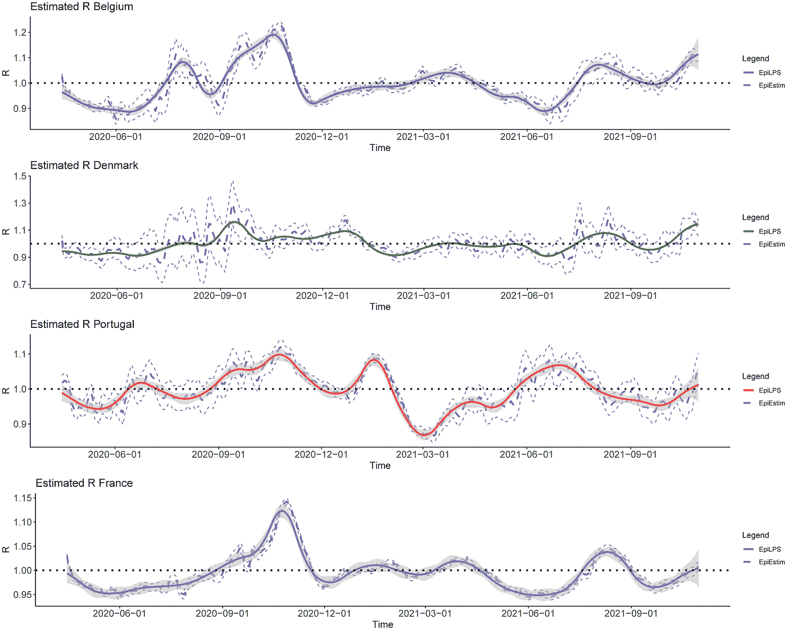
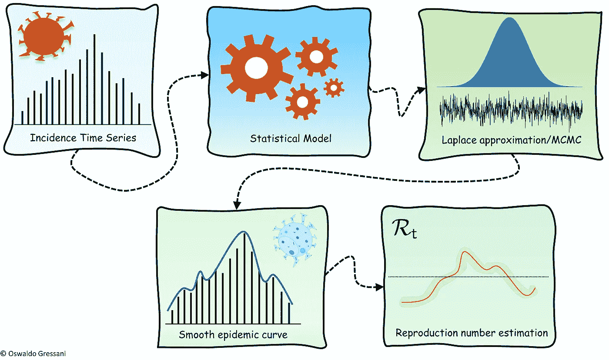
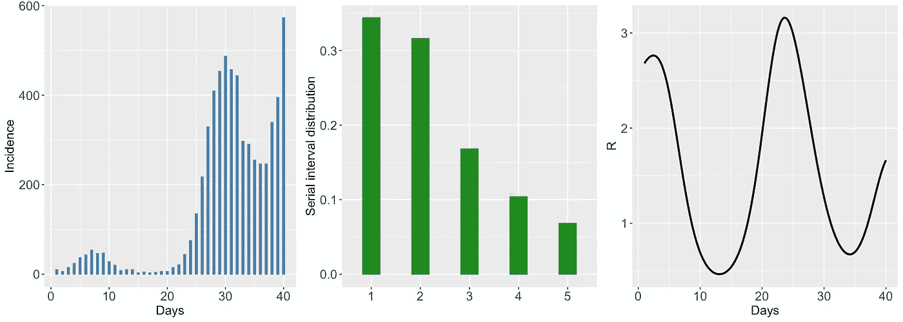
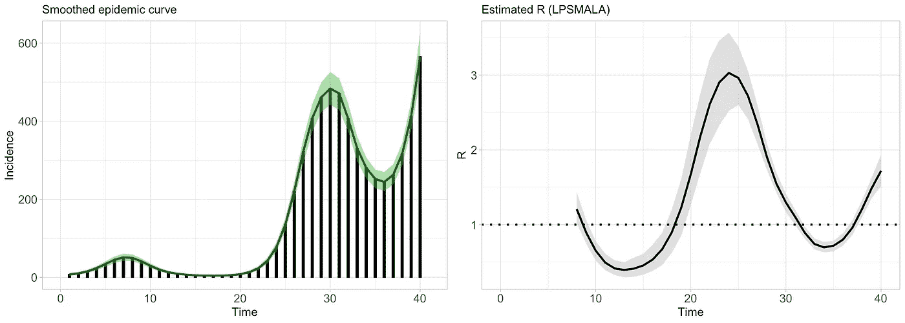
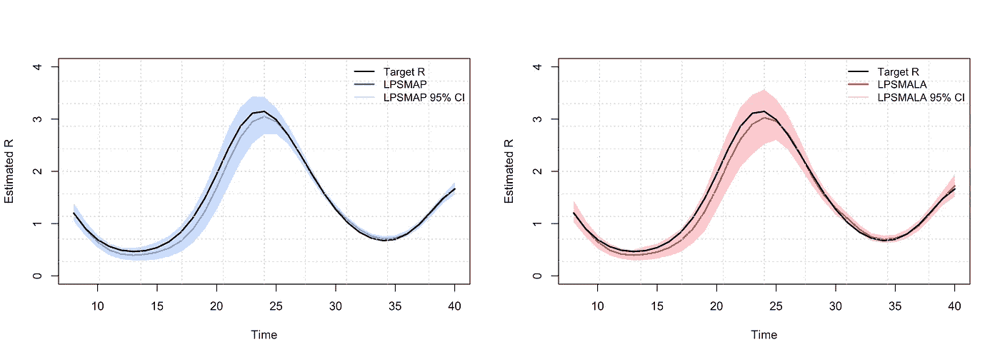
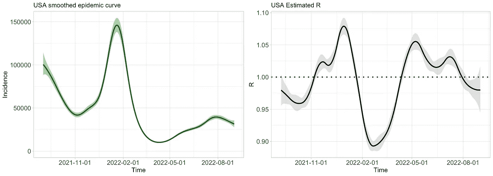

# 论文:“EpiLPS:估计时变再生数的快速灵活的贝叶斯工具”

> 原文：<https://towardsdatascience.com/paper-epilps-a-fast-and-flexible-bayesian-tool-for-estimation-of-the-time-varying-reproduction-c9280017ab64>

## 如何平滑流行病曲线并灵活估计时变再生数



作者的情节

# 介绍

我的一位同事(也是朋友)最近在 PLoS 计算生物学上发表了一篇题为“EpiLPS:一种快速灵活的估计时变繁殖数的贝叶斯工具”的研究论文。

我没有分享我没有参与的研究论文的习惯。尽管如此，我还是想为这一次破例，因为我坚信这篇论文中开发的方法值得被了解，尤其是对任何从事流行病学工作的人。

下面是这篇文章背后的动机，以及对模拟和真实数据(美国住院数据)的说明。更多信息可以在[的论文](https://journals.plos.org/ploscompbiol/article?id=10.1371/journal.pcbi.1010618)和相关的[网站](https://epilps.com/)上找到。

# 动机

epi LPS([Gressani et al . 2022](https://statsandr.com/blog/paper-epilps-a-fast-and-flexible-bayesian-tool-for-estimation-of-the-time-varying-reproduction-number/#ref-gressani2022epilps))是时变再生数 Rt 的灵活贝叶斯推断的方法论；在时间 t 时由受感染病原体产生的继发性病例的平均数量。这是一个关键的流行病学参数，可告知传染病的传播潜力，可由公共卫生当局用于评估干预措施的有效性，并为未来的控制策略提出方向。

这一指标在新型冠状病毒疫情期间广受欢迎，媒体广泛报道，因为其含义易于直观理解。简而言之，当 R < 1, the signal is encouraging as the epidemic is under control and will eventually vanish. On the contrary, a value of R > 1 意味着疾病持续传播，感染正在目睹扩张性影响。因此，拥有一个强大而可靠的工具来根据传染病数据计算繁殖数是至关重要的。

来自哈瑟尔特大学(比利时)、莱顿大学(荷兰)和伯尔尼大学(瑞士)的 EpiPose 团队的一组研究人员最近开发了一种新方法，用于根据给定序列间隔分布的发病率时间序列数据(从感染者出现症状到继发病例出现症状之间经过的时间)来估计瞬时再生数。他们将他们的方法称为 EpiLPS，用于“**Epi**demiology modeling with**L**apla cian-**P**-**S**plines”，因为拉普拉斯近似和 P 样条平滑器是形成所提出的方法的主干的关键成分。



作者图片

EpiLPS 模型假设观察到的报告病例(按报告日期或症状发作日期)受负二项分布支配。因此，与泊松模型相反，它允许考虑过度分散的特征。流行病曲线在第一步中用 P 样条(其中潜在变量的后验估计通过拉普拉斯近似计算)平滑，并且在第二步中使用更新方程模型作为再生数和通过“插入”方法估计的样条系数之间的桥梁。

作者还解释了 EpiLPS 和 EpiEstim 之间的主要区别，epi estim 是一种由[柯里等人(2013](https://statsandr.com/blog/paper-epilps-a-fast-and-flexible-bayesian-tool-for-estimation-of-the-time-varying-reproduction-number/#ref-cori2013new) )开发的用于实时估计 Rt 的成熟方法，并在不同的流行病情景下对这两种方法进行了广泛的比较。

EpiLPS 的一个有趣特性是，用户可以选择完全“无采样”路径，其中模型超参数固定在其*最大后验概率* (LPSMAP)或基于 Metropolis-adjusted Langevin 算法(LPSMALA)的完全随机路径(LPSMALA)。说到效率，拉普拉斯近似和 B 样条求值的例程已经用 C++编写，并通过 [Rcpp 包](https://www.rcpp.org/)集成到 R 中，因此底层算法可以在可忽略的时间内执行。

下面，我们提供一个简短的例子，说明如何使用 EpiLPS 例程来估计 rt。

# 入门指南

EpiLPS 包可从 CRAN 获得(参见[https://cran.r-project.org/web/packages/EpiLPS/index.html](https://cran.r-project.org/web/packages/EpiLPS/index.html)),并可通过输入以下命令从 R 控制台安装:

```
install.packages("EpiLPS")
```

然后，可以按如下方式加载该包:

```
library("EpiLPS")
```

EpiLPS 包的结构相当简单，因为它包含几个例程:

*   函数`epilps()`是拟合再现数的核心程序。
*   通过`plot.epilps()`，用户可以绘制估计的流行曲线和 Rt。
*   最后，开发了两个辅助程序`episim()`和`perfcheck()`来基本上再现相关论文的模拟结果。

# 模拟的例子

一组流行病数据可以用`episim()`程序模拟，方法是指定一个序列区间分布，并在一组可用的模式中选择真实的繁殖数曲线(这里我们选择模式 5，对应于一条相当波动的曲线)。

按照`endepi`选项中的规定，模拟疫情将持续 40 天。通过设置选项`plotsim = TRUE`，程序返回一个总结事件时间序列的图形、一个指定序列间隔分布的条形图以及真实的基本再生数曲线。

```
set.seed(1234)SI <- c(0.344, 0.316, 0.168, 0.104, 0.068)
simepidemic <- episim(
  serial_interval = SI,
  Rpattern = 5,
  plotsim = TRUE,
  verbose = TRUE,
  endepi = 40
)## Chosen scenario: 5 'Wiggly then stable Rt'.
## Incidence of cases generated from a Poisson distribution. 
## Total number of days of epidemic: 40.
```



作者的情节

如果您想了解生成的事件时间序列的概况，只需输入:

```
simepidemic$y##  [1]  10   6  15  24  37  43  54  46  47  28  20   8  10  10   3   5   3   4   6
## [20]   6  15  21  44  75 135 217 329 409 453 487 457 443 297 290 255 246 246 339
## [39] 395 573
```

## 平滑流行病曲线和估计 Rt

现在让我们使用`epilps()`例程来平滑流行病曲线并估计再生数。

我们将通过 LPSMAP(一种完全无采样的方法)和 LPSMALA(一种完全随机的方法，依赖于具有朗之万动态的 MCMC 算法)来实现这一点，其中我们指定长度为 10000 的链和大小为 4000 的老化。

```
LPSMAP_fit <- epilps(
  incidence = simepidemic$y,
  serial_interval = SI,
  tictoc = TRUE
)## Inference method chosen: LPSMAP. 
## CI for LPSMAP computed via lognormal posterior approx. of Rt.Total number of days: 40\. 
## Mean Rt discarding first 7 days: 1.327.
## Mean 95% CI of Rt discarding first 7 days: (1.164,1.527) 
## Elapsed real time (wall clock time): 0.229 seconds.LPSMALA_fit <- epilps(
  incidence = simepidemic$y, serial_interval = SI,
  method = "LPSMALA", chain_length = 10000, burn = 4000
)## Inference method chosen: LPSMALA with chain length 10000 and warmup 4000.
## MCMC acceptance rate: 56.41%. 
## Geweke z-score < 2.33 for:  32 / 33  variables. 
## Total number of days: 40\. 
## Mean Rt discarding first 7 days: 1.326.
## Mean 95% CI of Rt discarding first 7 days: (1.117,1.555). 
## Timing of routine not requested.
```

执行后，每个例程在控制台中打印用户请求的方法的简要摘要。

对于 LPSMALA，总结了链长、接受率(应该在 57%左右)等基本信息。从打印输出可以看出，模拟流行病的平均再生数约为 1.32。

比方说，我们现在可以使用`LPSMALA_fit`对象和`plot()`例程来获得平滑的流行病曲线和估计的再生数(默认情况下，可信区间为 5%的显著性水平，但这可以由用户更改)。

```
days <- seq(8, 40)#--- Smoothed epidemic curve
gridExtra::grid.arrange(
  plot(LPSMALA_fit,
    plotout = "epicurve", incibars = TRUE, themetype = "light",
    epicol = "darkgreen", cicol = rgb(0.3, 0.73, 0.3, 0.2),
    epititle = "Smoothed epidemic curve", titlesize = 13, barwidth = 0.25
  ), #--- Estimated reproduction number
  plot(LPSMALA_fit,
    plotout = "rt", theme = "light", rtcol = "black",
    titlesize = 13, Rtitle = "Estimated R (LPSMALA)"
  ),
  nrow = 1, ncol = 2
)
```



作者的情节

该图可以通过多种方式定制:

*   用户可以在`themetype`下指定主题。可用选项有`gray`(默认)、`classic`、`light`和`dark`。
*   其他选择，如是否显示发病率柱、可信区间包络的颜色、平滑流行病曲线的颜色和估计再生数也是可用的。

上图是在`[ggplot2](https://statsandr.com/blog/graphics-in-r-with-ggplot2/)` [包](https://statsandr.com/blog/graphics-in-r-with-ggplot2/)中生成的，但是还有另一种直接从`LPSMAP_fit`和`LPSMALA_fit`对象中提取信息的方法。事实上，可以提取并绘制每天的估计再现数值及其相关可信区间。

下面，我们进行练习并绘制分别用 LPSMAP 和 LPSMALA 获得的估计 Rt，并将其与真实的基本再生数曲线进行比较。合身度挺好的。

```
par(mfrow = c(1, 2))#--- LPSMAP vs target R
plot(days, sapply(days, simepidemic$Rtrue),
  type = "l", lwd = 2, ylim = c(0, 4),
  ylab = "Estimated R", xlab = "Time"
)
polygon(
  x = c(days, rev(days)), y = c(
    LPSMAP_fit$epifit$R95CI_low[8:40],
    rev(LPSMAP_fit$epifit$R95CI_up[8:40])
  ),
  col = rgb(0.23, 0.54, 1, 0.3), border = NA
)
lines(days, LPSMAP_fit$epifit$R_estim[8:40], type = "l", col = "cornflowerblue", lwd = 2)
lines(days, sapply(days, simepidemic$Rtrue), type = "l", lwd = 2)grid(nx = 10, ny = 10)
legend("topright",
  lty = c(1, 1), lwd = c(2, 2),
  col = c("black", "blue", rgb(0.23, 0.54, 1, 0.3)),
  c("Target R", "LPSMAP", "LPSMAP 95% CI"), bty = "n", cex = 0.9
)#--- LPSMALA vs target R
plot(days, sapply(days, simepidemic$Rtrue),
  type = "l", lwd = 2, ylim = c(0, 4),
  ylab = "Estimated R", xlab = "Time"
)
polygon(
  x = c(days, rev(days)), y = c(
    LPSMALA_fit$epifit$R95CI_low[8:40],
    rev(LPSMALA_fit$epifit$R95CI_up[8:40])
  ),
  col = rgb(1, 0.23, 0.31, 0.3), border = NA
)
lines(days, LPSMALA_fit$epifit$R_estim[8:40], type = "l", col = "red", lwd = 2)
lines(days, sapply(days, simepidemic$Rtrue), type = "l", lwd = 2)grid(nx = 10, ny = 10)
legend("topright",
  lty = c(1, 1), lwd = c(2, 2),
  col = c("black", "red", rgb(1, 0.23, 0.31, 0.3)),
  c("Target R", "LPSMALA", "LPSMALA 95% CI"), bty = "n", cex = 0.9
)
```



作者的情节

例如，您可以通过键入以下内容来访问上周疫情的结果:

```
# Estimated R of the last week (with LPSMAP)
round(tail(LPSMAP_fit$epifit[, 1:4], 7), 3)##    Date R_estim R95CI_low R95CI_up
## 34   34   0.708     0.663    0.756
## 35   35   0.724     0.676    0.775
## 36   36   0.809     0.755    0.868
## 37   37   0.971     0.908    1.039
## 38   38   1.205     1.135    1.279
## 39   39   1.461     1.384    1.541
## 40   40   1.671     1.557    1.794# Estimated mean number of cases of the last week (with LPSMAP)
round(tail(LPSMAP_fit$epifit[, 5:7], 7))##    mu_estim mu95CI_low mu95CI_up
## 34      284        225       357
## 35      254        202       319
## 36      248        196       312
## 37      267        211       338
## 38      319        253       404
## 39      411        325       520
## 40      552        394       774
```

# 美国住院数据

为了说明真实数据上的 EpiLPS，我们从`COVID19`包中下载了美国在 2021 年 9 月 1 日至 2022 年 9 月 1 日期间的住院数据，并应用`epilps()`例程来估计再生数。

```
install.packages("COVID19")
library("COVID19")# Get data and specify serial interval distribution
USADat <- COVID19::covid19(
  country = "US", level = 1, start = "2021-09-01",
  end = "2022-09-01", verbose = FALSE
)si <- c(0.344, 0.316, 0.168, 0.104, 0.068)inciUSA <- USADat$hosp
dateUSA <- USADat$date
```

我们使用带有 LPSMAP(默认)方法的`epilps()`例程，绘制平滑的流行病曲线和具有 95%可信区间的估计再生数。

```
epifit <- epilps(incidence = inciUSA, serial_interval = si, K = 20)## Inference method chosen: LPSMAP. 
## CI for LPSMAP computed via lognormal posterior approx. of Rt.Total number of days: 366\. 
## Mean Rt discarding first 7 days: 0.994.
## Mean 95% CI of Rt discarding first 7 days: (0.983,1.005) 
## Timing of routine not requested.gridExtra::grid.arrange(
  plot(epifit,
    dates = dateUSA, datelab = "3m",
    plotout = "epicurve", incibars = FALSE, themetype = "light",
    epicol = "darkgreen", cicol = rgb(0.3, 0.73, 0.3, 0.2),
    epititle = "USA smoothed epidemic curve", titlesize = 13
  ),
  plot(epifit,
    dates = dateUSA, datelab = "3m",
    plotout = "rt", theme = "light", rtcol = "black",
    titlesize = 13, Rtitle = "USA Estimated R"
  ),
  nrow = 1, ncol = 2
)
```



作者的情节

感谢阅读。我希望你会像我一样发现本文中开发的方法很有用。如果您碰巧在自己的研究中使用它，请随时联系我和作者。

和往常一样，如果您有与本文主题相关的问题或建议，请将其添加为评论，以便其他读者可以从讨论中受益。

# 参考

柯里，安妮，尼尔·M·费格森，克利斯朵夫·弗雷泽和西蒙·柯西梅兹。2013."一个新的框架和软件来估计流行病期间随时间变化的繁殖数."美国流行病学杂志 178(9):1505–12。

Gressani，Oswaldo，Jacco Wallinga，Christian L Althaus，Niel Hens 和 Christel Faes。2022." EpiLPS:一种快速灵活的估计时变再生数的贝叶斯工具." *PLoS 计算生物学* 18 (10): e1010618。[https://doi.org/10.1371/journal.pcbi.1010618](https://doi.org/10.1371/journal.pcbi.1010618)

# 相关文章

*   比利时的新冠肺炎:结束了吗？
*   [新冠肺炎隔离期间免费下载斯普林格书籍的套装](https://statsandr.com/blog/a-package-to-download-free-springer-books-during-covid-19-quarantine/)
*   [比利时的新冠肺炎](https://statsandr.com/blog/covid-19-in-belgium/)
*   [论文:“癌症保险的半马尔可夫模型”](https://statsandr.com/blog/paper-semi-markov-modeling-for-cancer-insurance/)
*   [新冠肺炎冠状病毒 100 大资源](https://statsandr.com/blog/top-r-resources-on-covid-19-coronavirus/)

*原载于 2022 年 10 月 19 日*[*https://statsandr.com*](https://statsandr.com/blog/paper-epilps-a-fast-and-flexible-bayesian-tool-for-estimation-of-the-time-varying-reproduction-number/)*。*