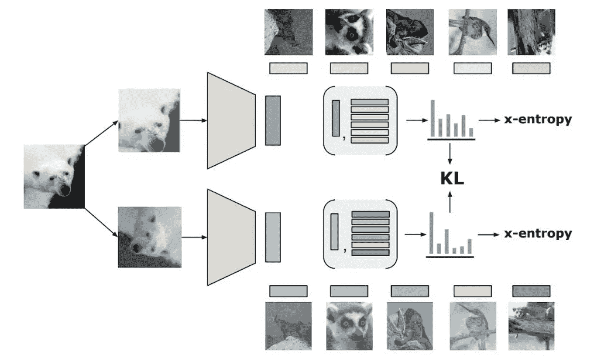
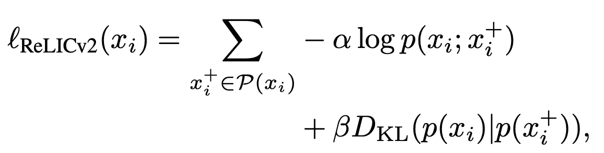
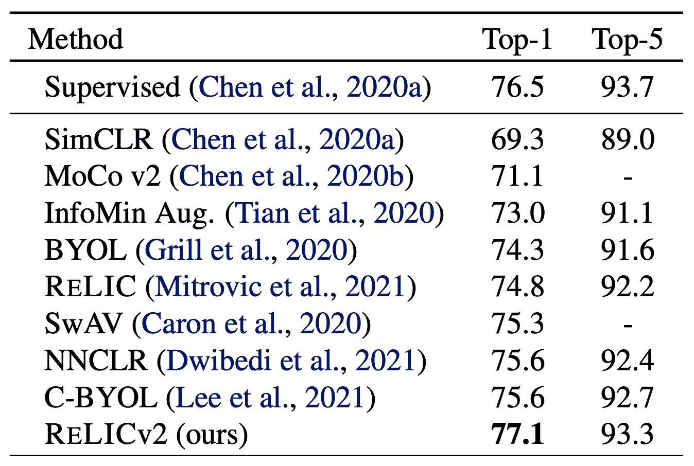
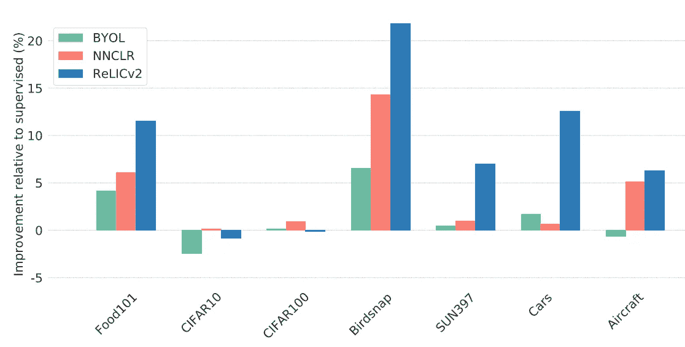
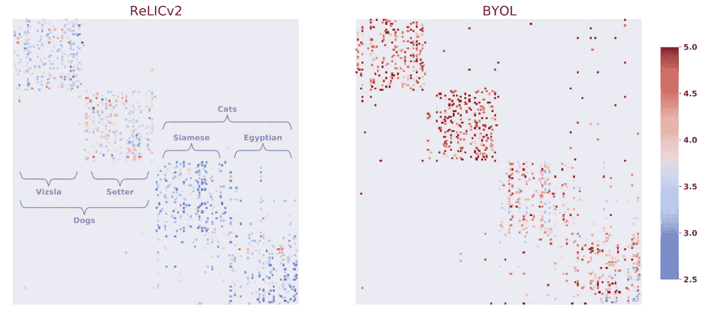

# 论文解释:推动自我监督网络的极限:我们能胜过 ImageNet 上没有标签的监督学习吗？

> 原文：<https://towardsdatascience.com/paper-explained-pushing-the-limits-of-self-supervised-resnets-can-we-outperform-supervised-2ba322dd6409>

## 探索 ReLICv2 中的新方法

在这个故事中，我们将看看最近的一篇论文，这篇论文推动了自我监督学习的发展，由 DeepMind 发表，昵称为 ReLICv2。

在他们的出版物*“推动自我监督网络的极限:我们能胜过 ImageNet 上没有标签的监督学习吗？”*、Tomasev 等人提出了对他们在 ReLIC 后面的名为*“通过不变因果机制的表征学习”*的论文中提出的技术的改进。他们方法的核心是增加了一个 Kullback-Leibler-Divergence 损失，这是用经典对比学习目标的概率公式计算出来的。不仅如此，他们还使用了一个完善的增强方案，并借鉴了其他相关出版物的成功经验。

我试图保持文章的简单，这样即使没有什么先验知识的读者也能理解。事不宜迟，我们开始吧！

遗迹训练管道的插图。来源:[【1】](https://arxiv.org/pdf/2010.07922.pdf)

# 先决条件:计算机视觉的自我监督和非监督预训练

在我们深入讨论之前，有必要快速回顾一下自我监督预培训是怎么回事。如果你一直在阅读我的其他自我监督学习的故事，或者你熟悉自我监督预培训，请随意跳过这一部分。

传统上，计算机视觉模型总是使用**监督学习**来训练。这意味着人类看着这些图像，并为它们创建了各种各样的标签，这样模型就可以学习这些标签的模式。例如，人类注释者可以为图像分配一个类标签，或者在图像中的对象周围绘制边界框。但是，任何接触过标注任务的人都知道，创建足够的训练数据集的工作量很大。

相比之下，**自我监督学习不需要任何人为创造的标签**。顾名思义，**模特学会自我监督**。在计算机视觉中，对这种自我监督进行建模的最常见方式是获取图像的不同裁剪或对其应用不同的增强，并通过模型传递修改后的输入。尽管图像包含相同的视觉信息，但看起来并不相同，**我们让模型知道这些图像仍然包含相同的视觉信息**，即相同的对象。**这导致模型学习相同对象的相似潜在表示(输出向量)。**

我们可以稍后在这个预训练的模型上应用迁移学习。通常，这些模型然后在 10%的带有标签的数据上进行训练，以执行下游任务，如对象检测和语义分割。

# 新颖的贡献和知识的结合

正如许多其他自我监督的预训练技术一样，ReLICv2 训练过程的第一步是数据扩充。在论文中，作者首先提到了以前成功的增强方案的使用。

第一个是在 SwAV 中使用的增强。与以前的工作相反，SwAV 不仅创建了输入图像的两种不同的裁剪，而且多达 6 种裁剪。这些可以制成不同的尺寸，如 224x244 和 96x96，最成功的数量是两个大作物和 6 个小作物。如果你想了解更多关于 SwAV 的增强计划，请务必[阅读我关于它的故事](https://medium.com/towards-data-science/paper-explained-unsupervised-learning-of-visual-features-by-contrasting-cluster-assignments-f9e87db3cb9b)。

前面描述的第二组扩充来自 SimCLR。这个方案现在被这个领域几乎所有的报纸所采用。通过应用随机水平翻转、颜色失真、高斯模糊和曝光来处理图像。如果你想了解更多关于 SimCLR 的信息，请务必去[看看我的文章](https://medium.com/towards-data-science/paper-explained-a-simple-framework-for-contrastive-learning-of-visual-representations-6a2a63bfa703)。

但是 ReLICv2 还使用了另一种增强技术:从图像中的对象中移除背景。为了实现这一点，他们以无人监管的方式在一些 ImageNet 数据上训练了一个**显著背景去除**模型。作者发现，当以 10%的概率应用时，这种增加是最有效的。

使用无监督 DeepUSPS 的显著背景去除增强。来源:[【2】](https://arxiv.org/pdf/2201.05119.pdf)

一旦图像被增强并且进行了多次裁剪，输出就通过编码器网络和目标网络，它们输出相同维度的特征向量。**当使用反向传播更新编码器网络时，目标网络通过类似于[MoCo 框架](/paper-explained-momentum-contrast-for-unsupervised-visual-representation-learning-ff2b0e08acfb)的动量计算**接收更新。

ReLICv2 的总体目标是学习编码器网络，以便为相同的类产生一致的输出向量。为了实现这一点，作者制定了一个新的损失函数。他们从**标准对比负对数似然**开始，其核心是一个相似性函数，将锚视图(主输入图像)与正样本(图像的增强版本)和负样本(同一批中的其他图像)进行比较。

ReLICv2 损失函数由负对数似然性以及锚视图和正视图的 Kullback-Leibler 散度组成。来源:[【2】](https://arxiv.org/pdf/2201.05119.pdf)

这种损失通过**对比目标的概率公式** : **锚图像和正面**的可能性之间的 Kullback-Leibler 差异而扩展。这种**强制网络不学习积极的靠近和消极的远离，但是在避免可能导致学习崩溃的极端聚类时，在集群之间创建更平衡的景观**。因此，这个附加损失项可以被视为类似于**调节**。这两项都有一个α和β超参数，允许对这两项损失进行单独加权。

所有这些新奇事物的加入证明是成功的。为了找出是在哪些方面，让我们更仔细地看看论文中给出的结果。

# 结果

**relic v2 试图证明的要点，正如其在论文标题中所说的，是自监督预训练方法只有在它们都为编码器网络使用相同的网络架构时才具有可比性。**对于他们的工作，他们选择使用经典的 ResNet-50。

在 ImageNet 线性评估方案下使用不同的预训练 ResNet-50 的结果。来源:[【2】](https://arxiv.org/pdf/2201.05119.pdf)

当使用相同的 ResNet-50 并在 ImageNet-1K 上训练其线性层，同时冻结所有其他权重时，ReLICv2 的输出远远超过现有方法。引入的改进甚至导致相对于原始遗物纸的性能优势。

与不同数据集上的监督预训练模型相比，准确性有所提高。来源:[【2】](https://arxiv.org/pdf/2201.05119.pdf)

当在其他数据集上比较迁移学习性能时，ReLICv2 与其他方法(如 NNCLR 和 BYOL)相比，继续表现出令人印象深刻的性能。这进一步表明 ReLICv2 是一种新型的自我监督预训练方法。对其他数据集的评估在其他论文中不常提及。

ReLICv2 和 BYOL 对习得集群的阐释。点越蓝，学习到的越接近对应的类簇。来源:[【2】](https://arxiv.org/pdf/2201.05119.pdf)

另一个生动的图形显示了 ReLICv2 学习的职业比其他框架如 BYOL 学习的职业更接近。这再次表明，与其他方法相比，该技术具有创建更细粒度集群的潜力。

# 包装它

在本文中，您已经了解了 ReLICv2，这是一种用于自我监督预训练的新方法，已经显示出有希望的实验结果。

通过结合对比学习目标的概率公式，并通过添加经过验证的增强方案，该技术已经能够将视觉中的自我监督预训练空间向前推进。

虽然我希望这个故事让你对 ReLICv2 有了一个很好的初步了解，但仍有很多东西有待发现。因此，即使你是这个领域的新手，我也会鼓励你自己阅读这些论文。你必须从某个地方开始；)

如果你对论文中介绍的方法有更多的细节感兴趣，请随时在 Twitter 上给我留言，我的账户链接在我的媒体简介上。

我希望你喜欢这篇论文的解释。如果你对这篇文章有任何意见，或者如果你看到任何错误，请随时留下评论。

**最后但同样重要的是，如果你想在高级计算机视觉领域更深入地探索，考虑成为我的追随者**。我试着每周发一篇文章，让你和其他人了解计算机视觉研究的最新进展。

参考资料:

[1]米特洛维奇、约瓦娜等人，“通过不变因果机制的表征学习”arXiv 预印本 arXiv:2010.07922 (2020)。[https://arxiv.org/pdf/2010.07922.pdf](https://arxiv.org/pdf/2010.07922.pdf)

[2] Tomasev，Nenad，等人“推动自我监督的结果网的极限:在 ImageNet 上没有标签的情况下，我们能胜过监督学习吗？." *arXiv 预印本 arXiv:2201.05119* (2022)。[https://arxiv.org/pdf/2201.05119.pdf](https://arxiv.org/pdf/2201.05119.pdf)