# 论文综述:视觉异常检测的修复重建

> 原文：<https://towardsdatascience.com/paper-review-reconstruction-by-inpainting-for-visual-anomaly-detection-70dcf3063c07>

## 用 5 分钟时间解释如何通过将带有随机图案的图像传送到自动编码器来改进异常检测

在 [Unsplash](https://unsplash.com/photos/HWbxSLvmSww) 上由 [Neven Krcmarek](https://unsplash.com/@nevenkrcmarek) 拍摄的照片

在这个故事中，我将回顾由卢布尔雅那大学介绍的**修复异常检测** (RIAD)方法【1】。本文中有两个主要概念:

*   RIAD 是一种方法，**去除图像**中的部分局部区域，并重建由受损图像开始的图像
*   RIAD 基于一个编码器-解码器网络，该网络学习区分**无异常图像**和**有缺陷图像**。

## 概述

1.  [**先决条件**](#1a16)
2.  [**MVTec 数据集**](#34fa)
3.  [**RIAD 算法**](#563c)
4.  [**结果**](#d1a1)

# **1。先决条件**

在深入解释本文之前，有一些概念需要了解。由于论文使用了自动编码器，你需要了解它是什么。查看我的文章来了解它是如何工作的。

*   **U-net**
*   **auto encoder 如何应用于异常检测？**
*   **自动编码器在异常检测中的局限性**
*   **自动编码器的重建损失**
*   **结构相似度**
*   **梯度幅度相似度**

## 优信网

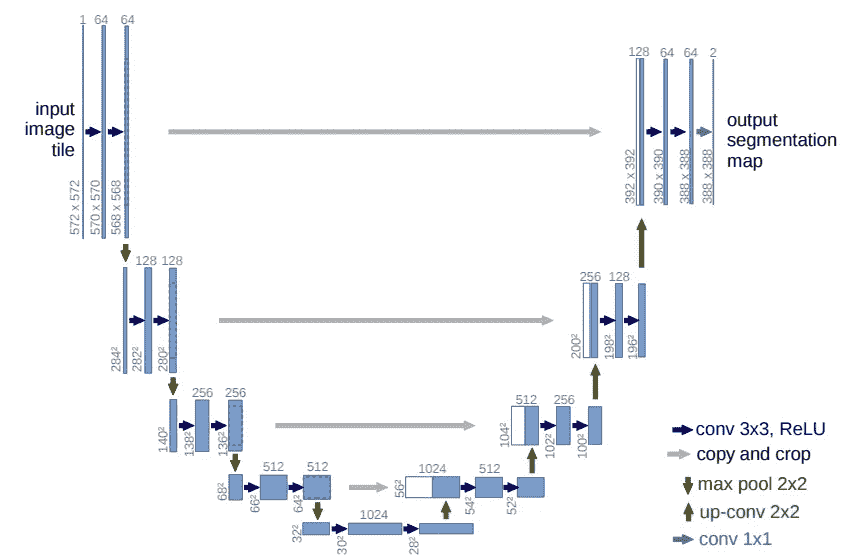

[U-net](https://arxiv.org/pdf/1505.04597.pdf) 是 Ronneberger 在 2015 年推出的卷积编解码网络[4]。它由两个网络组成:压缩数据模式的编码器和解压缩并重建原始数据的解码器。这个网络的主要特点是它的架构。在编码器架构中，每个卷积层中的特征通道数量加倍，而在解码器架构中，通道数量减半。此外，U-net 使用**跳过连接**来通过网络的不同层传输功能。这是导致精确重建的一个重要方面。

为了更好的了解细节，有一篇@ [Sik-Ho Tsang](https://medium.com/u/aff72a0c1243?source=post_page-----70dcf3063c07--------------------------------) 写的[评论](/review-u-net-biomedical-image-segmentation-d02bf06ca760)解释了 U-net 的架构。

## autoencoder 如何应用于异常检测？

*   对于银行、保险和制造业等众多领域而言，异常检测是一项至关重要的挑战。在这种情况下，自动编码器可以很好地解决这类问题，因为它们可以处理无人监督的问题。
*   **在训练期间，您只将正常数据传递给自动编码器**。这样，模型将从提供的训练数据中学习潜在的表示。我们还将假设在训练期间没有观察到的**异常数据**、**不应该被自动编码器**很好地重建，因此**与正常数据相比应该具有高重建误差**。
*   例如，可以应用自动编码器来解决欺诈检测问题。在训练期间，我们只将正常的交易传递给模型。当我们评估测试集中的模型时，大多数欺诈性交易可能具有高于正常交易的均方误差。

## 自动编码器在异常检测中的局限性

*   自动编码器倾向于学习“**身份**”**功能**
*   然后，它能够重新创建异常数据，即使它从未被训练过。

## 自动编码器的重构损耗

训练自动编码器的损失函数被命名为重建损失。最流行的重建损失是**均方误差** (MSE) 损失函数。它计算原始输入和网络输出之间的平方差的平均值。如果应用于图像，MSE 测量我们正在比较的图像的平均像素差异。MSE 越高，图像越不相似。

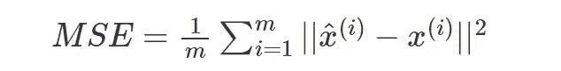

MSE 的替代方案是 **L1** **函数**，其测量输入和输出之间的**绝对差值**的和

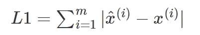

虽然这些重建损失是常用的，但它们有一些局限性。它们假设相邻像素之间的独立性，这通常是不被尊重的，并且不足以定量地测量原始样本和网络输出之间的相似性。

## 结构相似性

为了考虑局部相关性，而不是单个像素值的差异，许多论文中提出了 **SSIM** (结构相似性)损失【2】。SSIM 测量一对图像补片 p 和 q 之间的距离，其特征在于三个不同的方面:

*   **亮度**，通过计算补丁的平均值来考虑。
*   **对比度**是补丁方差的函数。
*   **结构**通过计算两个面片的协方差来考虑。

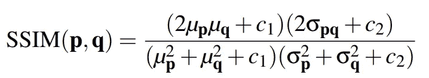

其取值范围介于-1 和 1 之间。当分数接近 1 时，这意味着两个被比较的图像是相似的，而分数为-1 表示它们非常不同。

## 梯度震级相似性

像 SSIM，梯度幅度相似性是一个补丁相似性度量。它考虑了比较图像之间的局部相似性[3]。不是比较图像像素，而是考虑两幅图像 I 和 I_{R}上的局部梯度。

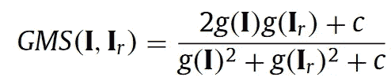

其中 g(I)是图像 I 的梯度幅值图，c 是常数以确保数值稳定性。

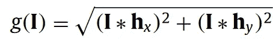

沿原始图像的 x(或水平)和 y(或垂直)方向卷积 3x3 [**Prewitt 滤波器**](https://en.wikipedia.org/wiki/Prewitt_operator) 得到原始图像的梯度幅值图。

# 2.MVTEc 广告数据集

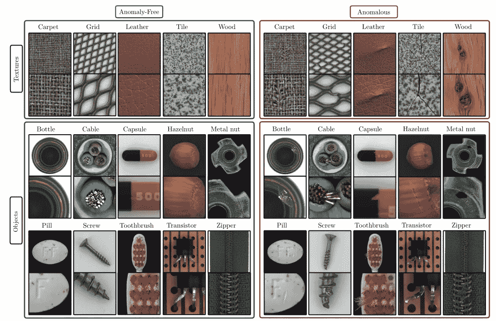

MVTEc 广告数据集[5]

MVTec AD 是一个新颖而全面的工业数据集
，由 5354 幅高分辨率图像组成，分为 15 类:5 种纹理和 10 种物体【5】。训练集仅由正常的
图像组成，而测试集包含有缺陷和无缺陷的图像。
图像分辨率在 700x700 和 1024x1024 像素之间变化

# 3.里亚德**算法**

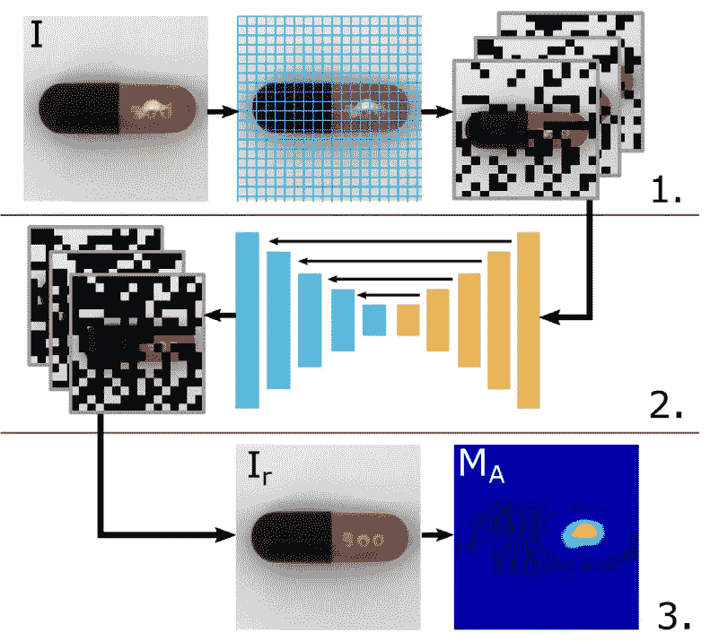

RIAD 方法概述[1]

在无异常的图像上训练自动编码器，其中随机选择的区域被设置为 0。如前所述，使用的编码器-解码器架构是 U-net。但是这些图像是如何被掩盖的呢？这些是以下步骤:

*   我们通过输入**区域大小参数 k** 从每幅图像中随机选择一组像素。
*   每个图像可以被认为是一个尺寸为高度/k *宽度/k 的**网格。**
*   我们的图像/网格被随机分成 n 个**不相交的**(或不重叠的)**集合 Si** 。
*   我们生成一个**二进制掩码**，M_{Si}，如果局部区域属于集合 Si，它包含 0，否则包含 1。
*   **最终图像是二进制掩模和原始图像**的乘积。

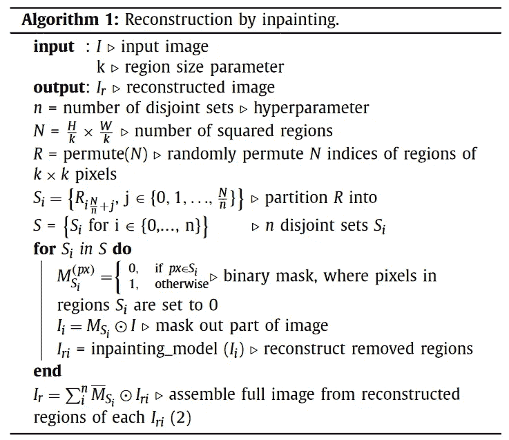

从图像中随机移除像素的算法[1]。

在 U-网的训练过程中，大小 K 是从一组 K 值中随机选取的。在本文中，他们使用 K = {2，4，8，18}作为一组区域大小。在将掩模应用于原始图像之后，通过将修补的图像提供给模型来获得重建，然后通过考虑三种类型的损失来计算总损失:

*   **MSGMS** 损失，即*几个尺度下的平均 GMS 距离:*

其中 Hl 和 Wl 分别是被比较图像的高度和宽度，Nl 是比例 l 下的像素数

*   **SSIM 损失**是所有本地 SSIM 值的*平均值:*

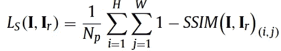

*   **逐像素 L2 损失**(或*均方误差损失)*

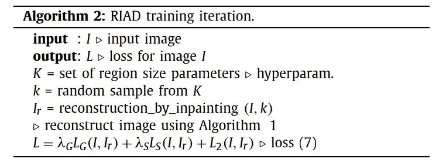

U-net 的训练[1]。

然后，我们可以获得在每个 k 值下为每个图像重建 I_{R}产生的异常图 **G_A(I，I_{R})** 的平均值。随后，我们计算图像级异常分数，其本质上是异常图平均值的最大值。

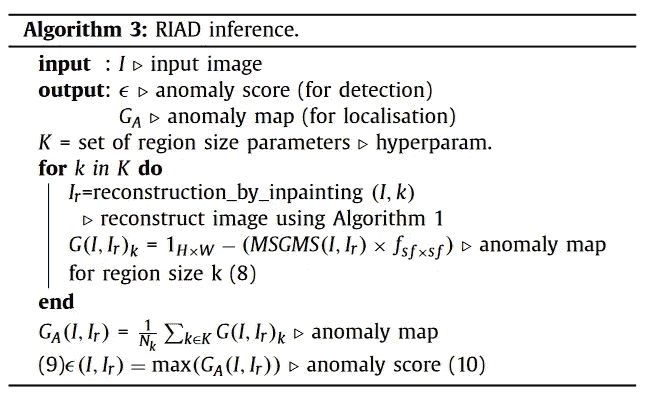

对 U-net 的评价[1]。

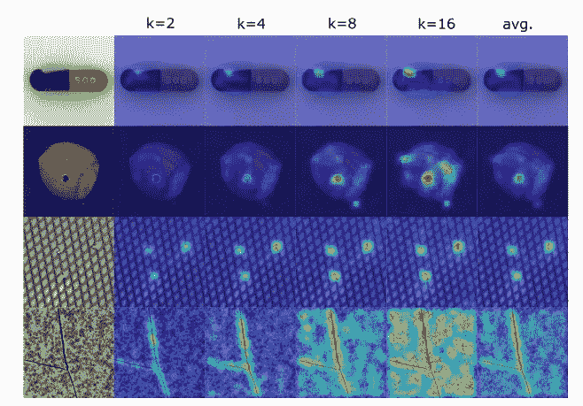

评估期间获得的异常图示例说明[1]。

比如我们假设 K = {2，4，8，16}。我们计算属于{2，4，8，16}的每个 k 值处的每个图像重建的异常图，然后，我们计算这些异常图的平均值，如最后一列所示。

# 4.结果

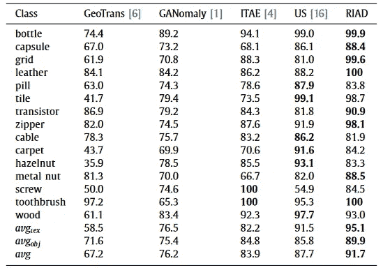

异常检测的图像水平 ROC-AUC 评分[1]。

*   与其他最先进的模型相比，RIAD 在对象类别上表现更好，如瓶子、金属螺母和牙刷，它们呈现出较高的平均 ROC-AUC，并且在一些纹理类别上也取得了不错的结果，如**网格**和**皮革**。

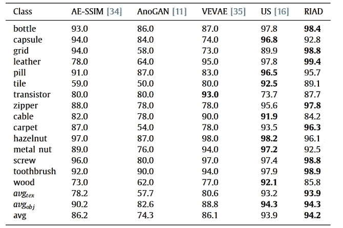

异常定位的每像素水平 ROC-AUC 得分[1]。

*   此表显示了 MVTec AD 数据集类别的异常定位结果。
*   与其他最先进的方法相比，它在异常定位方面获得了更高的总体 ROC-AUC 分数。

## 参考

[1] [视觉异常检测修复重建](https://www.sciencedirect.com/science/article/abs/pii/S0031320320305094)，Vitjan Zavrtanik，Matej Kristan，Danijel Skocaj，(2021)

[2] [通过将结构相似性应用于自动编码器来改进无监督缺陷分割](https://arxiv.org/abs/1807.02011)，保罗·博格曼，辛迪·洛，迈克尔·福瑟，大卫·萨特勒格，卡斯滕·斯泰格

[3] [图像质量评估技术显示了自动编码器生成对抗网络的改进的训练和评估](https://www.arxiv-vanity.com/papers/1708.02237/)，迈克尔·o·弗托利，吉姆·戴维斯，卡尔顿大学，(2017)

[4] [U-Net:用于生物医学图像分割的卷积网络](https://arxiv.org/pdf/1505.04597.pdf)，Olaf Ronneberger，Philipp Fischer，Thomas Brox，(2015)

[5][MVTec 异常检测数据集:用于无监督异常检测的综合真实数据集](https://link.springer.com/content/pdf/10.1007/s11263-020-01400-4.pdf)，保罗·博格曼、基利安·巴茨纳、迈克尔·福瑟(2021)

## Github 知识库

*   [https://github . com/plutoyuxie/用于视觉异常检测的修复重建](https://github.com/plutoyuxie/Reconstruction-by-inpainting-for-visual-anomaly-detection)

## 其他相关文章:

</ganomaly-paper-review-semi-supervised-anomaly-detection-via-adversarial-training-a6f7a64a265f>  

你喜欢我的文章吗？ [*成为会员*](https://eugenia-anello.medium.com/membership) *每天无限获取数据科学新帖！这是一种间接的支持我的方式，不会给你带来任何额外的费用。如果您已经是会员，* [*订阅*](https://eugenia-anello.medium.com/subscribe) *每当我发布新的数据科学和 python 指南时，您都可以收到电子邮件！*