# 论文简化:无反向传播的梯度

> 原文：<https://towardsdatascience.com/papers-simplified-gradients-without-backpropagation-96e8533943fc>

## [机器学习研究](https://medium.com/tag/machine-learning-research)

## 如何评估一个函数并一次计算其梯度的近似值


Photo by [愚木混株 cdd20](https://unsplash.com/@cdd20?utm_source=medium&utm_medium=referral) on [Unsplash](https://unsplash.com?utm_source=medium&utm_medium=referral)

在这篇文章中，我们将看看由 atlm günebaydin，Barak A. Pearlmutter，Don Syme，Frank Wood 和 Philip Torr 于 2022 年 2 月 17 日发表的一篇[最近的论文](https://arxiv.org/abs/2202.08587)——**没有反向传播的梯度**。[你可以在这里找到](https://arxiv.org/abs/2202.08587)。

这份文件仍在审查中，所以以后可能会有一些变化。尽管如此，非常简洁的核心思想应该保持不变。让我们读一下报纸的摘要:

> 使用反向传播来计算优化目标函数的梯度一直是机器学习的支柱。反向传播或反向模式微分是自动微分算法家族中的一个特例，它也包括正向模式。我们提出了一种仅基于方向导数计算梯度的方法，人们可以通过正演模式精确有效地计算方向导数。我们称这个公式为**正向梯度**，这是一个无偏的梯度估计，可以在函数的单次正向运行中进行评估，**完全消除了梯度下降**中的反向传播需求。我们在一系列问题中演示了前向梯度下降，显示出**在计算**上的大量节省，并在某些情况下使**训练速度提高两倍**。

听起来不错，对吧？现在，我会给你一些直觉，告诉你这种方法实际上是如何工作的，以及为什么会工作。我还会在途中解释一些重要的数学概念，给那些对此感到有点不安全的人。让我们开始吧。

# 先决条件

在开始我们的旅程之前，让我们回顾一些重要的事情，以便正确看待整个主题。让我们假设我们想要**优化某个目标函数 *f* ，**只是想象最小化神经网络情况下的损失函数。

f 有很多，可能有几十亿个参数，因此这个任务很难完成。尽管如此，聪明人设法发明了许多算法来解决这个问题，其中有*一阶*方法，如**梯度下降**，还有*高阶*优化算法，如**牛顿法**。

然而，由于作者关注的是前者，我们也将这样做。

## 对渐变的需求

你可能知道*通常*做梯度下降的方式。这里我指的是随机梯度下降(SGD)、RMSProp、Adam、Adamax 等算法。这些工具在 Tensorflow、PyTorch 或 scikit-learn 等软件库中都很容易找到。

所有这些不同的优化算法都依赖于一个共同的成分:目标函数*f*t5】的**梯度，表示为*∇*f*(*θ*)。上述算法之间的区别在于它们如何处理梯度。例如，最简单的算法 SGD 从一个随机的 *θ* 开始，然后用简单的更新规则*θ*←*θ-α*∇*f*(*θ*)进行更新，直到收敛，即 *θ* 或*f*(*θ*)*这里的 *α* 是学习率*。*****

**RMSProp，Adam 等人也采用了梯度，但是做了更精细的计算，这导致了更快的收敛*。考虑下面的动画，这是一个老歌，但歌蒂:***

***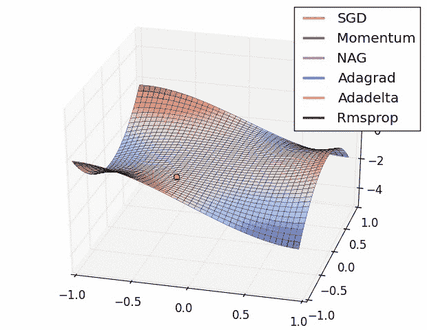***

***亚历克·拉德福德的伟大动画。***

## ***反向传播***

***现在让我们继续研究神经网络。*通常*计算梯度∇ *f* ( *θ* )的方法是使用一种叫做**反向传播**的技术，这实质上是微积分中的链式法则。别担心，我们不会谈论太久，也不会让你做冗长的计算。只看下面这个简单的例子函数: *f* ( *θ* ₁ *，θ* ₂ *，θ*₃*)=(θ*₁*+θ*₂*)**θ*₃.***

**使用反向传播计算梯度的工作方式如下:**

1.  ****前进传球:**插 *θ* 入*f，接 *f* ( *θ* ) *。****
2.  ***向后传递:**从 *f* ( *θ* )开始，计算向后的坡度。*

*让我们插入向前传球的数字 *θ =* (3，-1，2)，然后看看在我们的玩具网络中会发生什么:*

*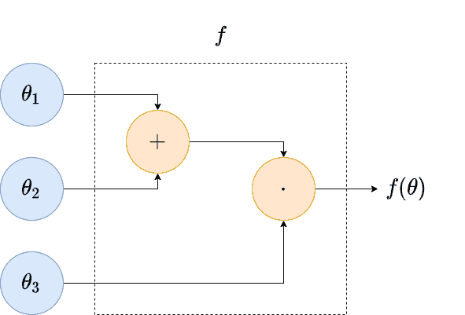*

*向前传球。我创作的动画。*

*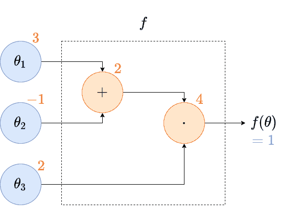*

*向后传球。我创作的动画。右边的蓝色 1 是初始渐变值。*

*向前传递从左到右计算输出 4，非常容易。然后向后传递从右到左计算所有的梯度。我们只对最后的梯度感兴趣，在我们的例子中，∇ *f* ( *θ* ) = (2，2，2)。由于直接计算得到∇*f*(*θ*)=(*θ*₃， *θ* ₃， *θ* ₁ *+ θ* ₂).，所以结果是正确的*

> ***注意:**直接计算梯度是一种奢侈，我们在处理复杂公式中的数十亿个参数时没有这种奢侈。*

> *到目前为止一切顺利，但这意味着我们必须通过网络两次。我们能否在一次正向传递中计算函数输出和梯度？*

*这篇论文的作者提出了一个简单的方法来做到这一点！但是我们仍然需要一个要素来理解他们的方法。*

## *方向导数*

*如果你以前从未和他们打过交道，这听起来可能很可怕，但让我用简单的方式解释给你听。在学校，你知道如何对一个变量求导，对吗？ ***θ* 为标量** 时的定义如下:*

*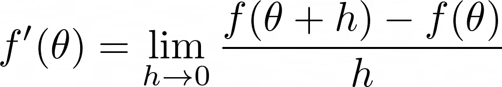*

*我创造的形象。*

*这个值*f’*(*θ*)就是图中点 *θ、*的切线的**斜率，即一个实数。***

*现在，当处理神经网络时，我们的函数 *f* 没有单个输入，而是潜在地有数十亿个输入，记得吗？因此，在这种情况下，我们必须为导数找到一个更一般的定义。当然，数学家已经帮我们找到了答案。 *f* 相对于矢量 *v* 在点 *θ* 的方向导数定义为*

*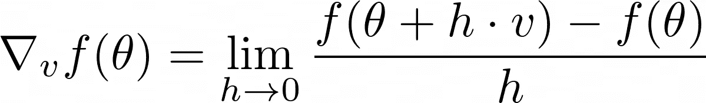*

*我创造的形象。*

*为什么我们需要一个 *v* ？在更高维度中，我们有很多选择来定义图的切线。以抛物面为例:在这个形状表面的黑点中，我们可以任意定义多条切线。*

*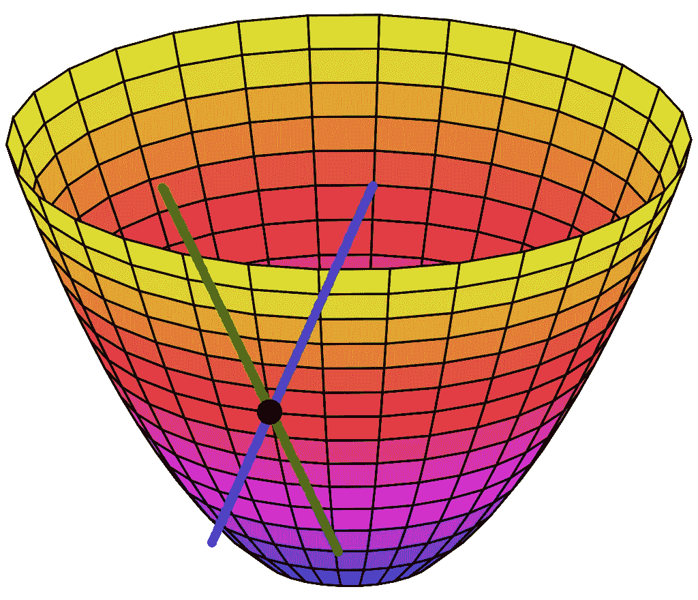*

*原图来自[维基百科](https://de.wikipedia.org/wiki/Paraboloid)。漂亮的切线是我加的。*

*如果我们选择一些 *v =* ( *v* ₁ *，v* ₂) *，*切线会指向同一个方向，只是多了一个*z*-坐标，即( *v* ₁ *，v* ₂， *s* )。这个斜坡 *s* 正好是∇ *ᵥf* ( *θ* )顺便说一下。*

*无论如何，如果你对几何不感兴趣，只要记住∇ *ᵥf* ( *θ* )也是一个标量，就像*f’*(*θ*)一样。对于每个 *v，*都是不同的数字，表示 *f* 在 *v* 方向的斜率。现在可以证明以下几点:*

*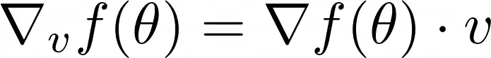*

*我创造的形象。点表示两个向量的点积。*

*这里，∇ *f* ( *θ* )是 *f* 的通常梯度。很好记，对吧？从左到右，小下标 *v* 刚好跳到旁边。快速检查一下:左边是一个标量，右边也是，因为它是两个向量的点积。*

*太好了，现在我们有一切可以理解这篇论文了！*

# *向前的梯度*

*因此，给定一个函数 *f* ，作者定义了另一个函数 *gᵥ* ，他们称之为**向前梯度**。*

> *注意:作者在他们的论文中省略了下标 v，但我发现把它放在那里很有用。它提醒我们向前的梯度依赖于一些 v。*

*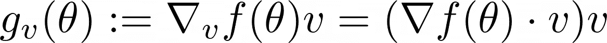*

*我创造的形象。*

*我们可以看到， *gᵥ* 取一个矢量 *θ* 再次输出另一个矢量，某种缩放版的 *v* ( **记住:***∇*ᵥf*(*θ*是标量)。**我们还需要 *θ* 和 *v* 具有相同的尺寸。****

**但这看起来比之前更复杂，它甚至引入了另一个矢量 *v* ！如何选择 *v* 让 *gᵥ* 更有用？答案很简单:将 *v* 的每个分量独立采样为标准高斯 *N* (0，1)。现在，你可能想知道为什么这是有用的，因为这只是创建了许多随机向量。作者使用一些简单易懂的数学方法展示了以下内容:**

**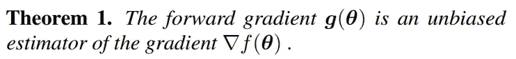**

**直接从报纸上。**

**这是对以下内容的巧妙描述:**

> **如果对大量 v 进行采样，计算相应的前向梯度，然后对这些前向梯度求平均值，最终会得到一个非常接近真实梯度的值。**

**让我们用一些简单的代码来验证这个声明。我们定义函数 *f* ( *θ* ₁ *，θ*₂)=*θ*₁+*θ*₂，我们要计算它在点 *θ =* (2，1) *的梯度。***

```
**import numpy as np

f = lambda theta: theta[:, 0]**2 + theta[:, 1]**2
theta = np.array([[2, 1]])**
```

> *****注:*** *我让函数一次取几个输入，即批量输入。***

**到目前为止，一切顺利。在我们继续之前，让我们自己计算一下梯度。我们有∇ *f* ( *θ* ₁ *，θ* ₂) = (2 *θ* ₁，2 *θ* ₂)，所以∇ *f* (2 *，1* ) = (4，2)。**

**我们也可以通过使用*规范基*计算方向导数来验证这一点，即所有向量除了一个 1 之外都是零。**

```
**h = 0.00001
v = np.array([[1, 0], [0, 1]])

(f(theta + h*v) - f(theta)) / h # approximate derivative

# Output:
# array([4.00001, 2.00001])**
```

**现在，让我们计算许多随机向量 *v* 并计算前向梯度 *gᵥ:***

```
**np.random.seed(0) # set a seed to keep it reproducible

v = np.random.randn(1_000_000, 2) # a million vectors of size 2
grad_v_f = ((f(theta + h*v) - f(theta)) / h) # ∇ᵥf(θ)
g = grad_v_f.reshape(-1, 1) * v # scale v with grad_f to compute g**
```

> ****重要提示:**我 calculate∇ᵥf*(*θ*)*的方式没那么好。它只是真实方向导数的近似，甚至在数值上是不稳定的。正如作者所说，**有一种方法可以在单次正向传递中使用正向模式自动微分**来计算∇ ᵥf *(* θ *)* 和 f *(* θ *)* ，但遗憾的是，他们没有为这种说法提供来源。**
> 
> **例如，侯赛因·阿卜杜拉赫曼指出 PyTorch 使用双数。谢谢！**

**我不会说得太详细，但是**双数**类似于复数 *a* + *bi* ，但是我们处理的不是具有属性 *i* = -1 的虚数 *i* ，而是具有属性 *ɛ* = 0 的数字 *a* + *bɛ* 和 *ɛ* 对于这些数字，我们有*f*(*a*+*bɛ*)*= f*(*a*)*+f’*(*a*)*bɛ*为*乖*函数*f*它很自然地扩展到多输入的函数，在这种情况下，我们接收(重命名变量后)*f*(*θ*+*ɛv*)*= f*(*θ*)*+ɛ*f(*θ*)*v【t100***

**在`g`中，现在存储了很多随机向量，但是根据定理，它们的平均值应该接近∇ *f* (2 *，1* ) = (4，2)。让我们看看。**

```
**g.mean(axis=0)

# Output:
# array([3.99433963, 2.00797197])**
```

**看起来不错！但是我们对数学的期望并没有减少。😎我们甚至可以想象向前的梯度 *gᵥ:***

**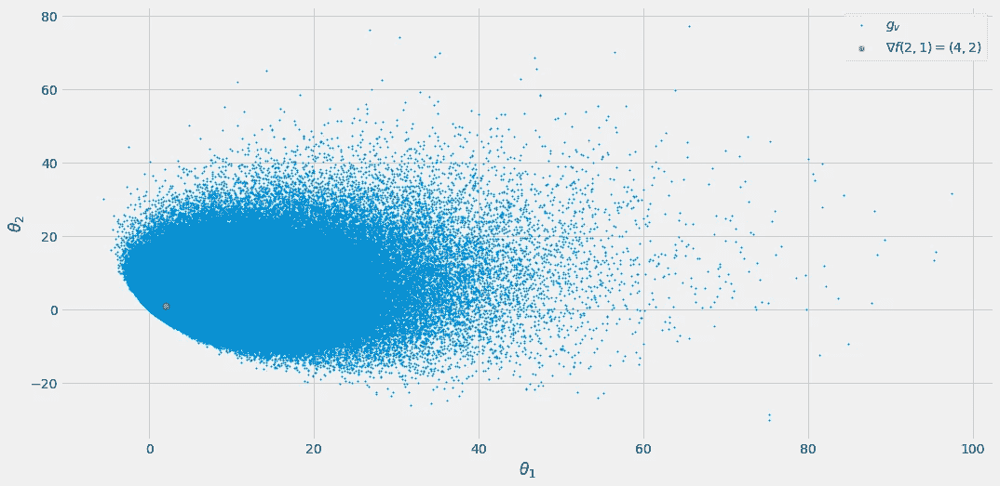**

**我创造的形象。**

**我们可以看到，围绕真实值(4，2)有相当大的差异，但正如作者进行的实验所证明的那样，该算法似乎工作得很好。但是在我们谈到它们之前，让我从纸上复制完整的算法，因为它很好，很短。**

**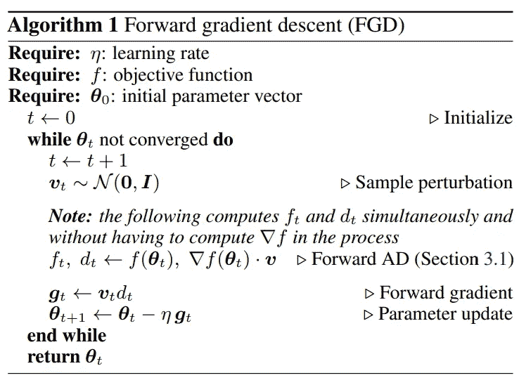**

**直接从报纸上。**

**这基本上是一个普通的梯度下降，只是用另一种方法来计算梯度。而且，正如作者提到的，这仅仅是开始:创建 Adam、RMSProp 和任何其他使用梯度的算法的前向梯度版本是很简单的。所以，请在某个时候继续关注 ***法达姆*** 算法。**

**科学界仍然需要解决的唯一有趣的事情是，前向梯度引入的噪声是否会破坏 Adam 等更高级的算法。对于 SGD 来说，它工作得相当好，所以让我们来看看实验。**

# **实验**

> ****免责声明:**我现在从报纸上复制所有图片。**

**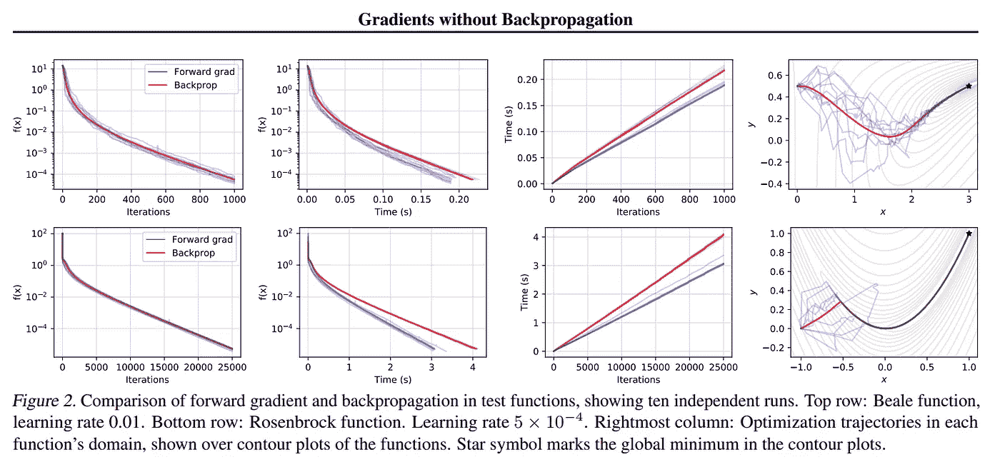****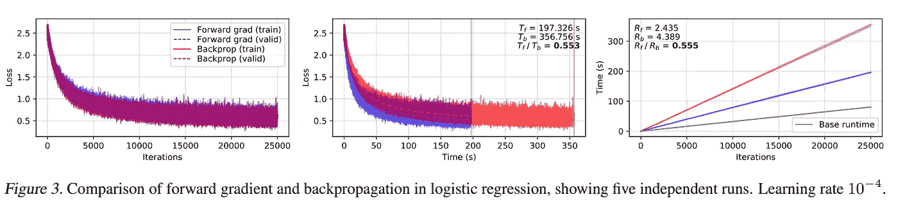****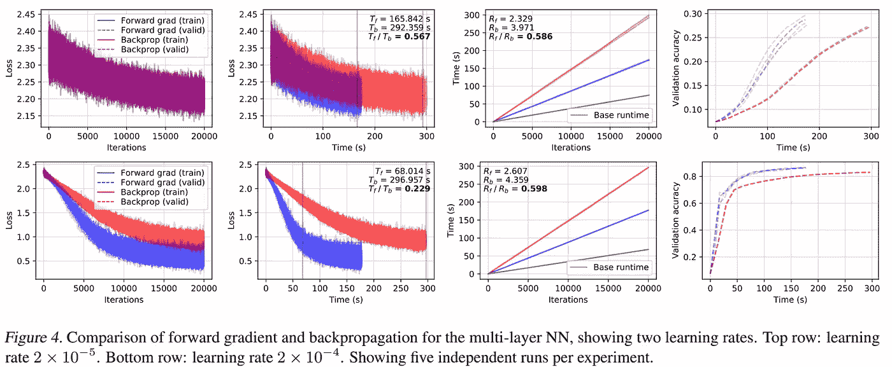****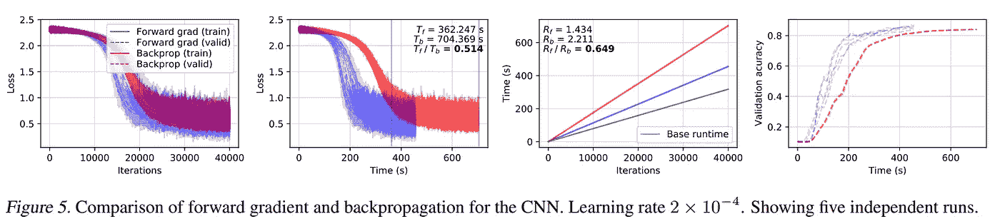**

**直接从报纸上。**

**这看起来很有希望。特别是对于更复杂的神经网络，前向梯度比反向传播用更少的时间产生相似的性能。只是要小心，因为总是有可能作者没有向我们展示他们的算法不能很好工作的情况。**

# **结论**

**在这篇文章中，我和你一起回顾了最近的论文 [**渐变无反向传播**](https://arxiv.org/abs/2202.08587) 。作者展示了如何仅使用单个正向传递而不是通过网络反向传播来进行梯度下降。这样既节省了时间，又不会增加内存消耗。**

**作者在 PyTorch 中实现了他们的方法，但是，我仍然在等待他们发表它。总的来说，我认为这是一篇写得很好的论文，有一个漂亮整洁的想法，易于理解甚至实施。**

**我希望你今天学到了新的、有趣的、有用的东西。感谢阅读！**

****作为最后一点，如果你****

1.  ****想支持我多写点机器学习和****
2.  ****无论如何都要计划获得中等订阅量，****

****为什么不通过这个环节**[](https://dr-robert-kuebler.medium.com/membership)****？这将对我帮助很大！😊******

****透明地说，给你的价格不变，但大约一半的订阅费直接归我。****

****非常感谢，如果你考虑支持我的话！****

> ****如有任何问题，请在 [LinkedIn](https://www.linkedin.com/in/dr-robert-k%C3%BCbler-983859150/) 上给我写信！****