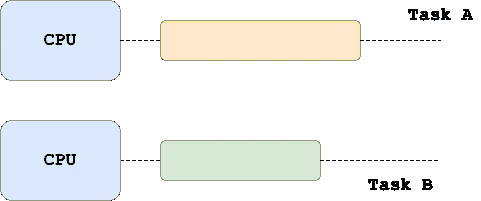

# 什么是并行计算？

> 原文：<https://towardsdatascience.com/parallel-computing-92c4f818c>

## 理解并行计算在数据工程环境中的重要性


马丁·桑切斯在 [Unsplash](https://unsplash.com/s/photos/parallel?utm_source=unsplash&utm_medium=referral&utm_content=creditCopyText) 上的照片

## 介绍

数据工程师通常必须从几个数据源中提取数据，对它们进行清理和汇总。在许多情况下，这些流程需要应用于大量数据。

在今天的文章中，我们将探讨计算和数据工程中最基本的概念之一，称为并行编程，它使现代应用程序能够在相对较短的时间内处理大量数据。

此外，我们将讨论并行编程的好处，以及它的缺点。最后，我们将探索一些能够利用现代多核系统和计算机集群来分布和并行化工作负载的包和框架。

## 什么是并行编程

并行计算是几乎所有现代数据处理工具的核心。这种框架利用了现代机器提供的处理能力和内存，可以将一个主任务分割成子任务，这些子任务可以在几台计算机上并行执行。



并行执行多个任务(或子任务)——来源:作者

请注意，并行计算甚至可以利用单台机器中的多个内核。

不要混淆并发性和并行性也很重要。这是两个不同的概念，所以如果你想更好地了解它们的主要区别，你可以阅读我最近的一篇文章，讨论多线程和多处理之间的区别。

[](/multithreading-multiprocessing-python-180d0975ab29) [## Python 中的多线程和多处理

### 深入探讨 Python 中的多线程和多处理，以及它们与并发性和

towardsdatascience.com](/multithreading-multiprocessing-python-180d0975ab29) 

## 并行编程的好处

并行编程的第一个优势与多核系统有关，它能够在执行任务时充分利用所有多核系统，从而在更短的时间内完成任务。

在大数据时代，数据集可以增长到巨大的规模，因此不可能将它们加载到一台机器上。在并行计算中，这样的数据集可以利用多台计算机，通过对它们进行分区，以分布式方式加载它们。

## 平行减速

除了明显的好处，并行计算的概念也有一些缺点。在计算机集群中分配任务会带来开销，这与节点之间的通信方式有关。

因此，相当简单的任务的分配有可能不会加速执行，事实上，它可能会触发并行的减速，这实际上会对执行时间产生负面影响。

换句话说，对于小而简单的任务，在一台机器上执行比分布在一个集群节点上更有效(也许更容易)。

在并行化任务时，我们需要考虑的另一个因素是它们是否可以实际分布在一个节点集群中。

## Python 中的并行编程

`multiprocessing`包附带了 Python 标准库，并提供了一个直观的 API，允许用户为本地和远程并发生成多个进程，这可以有效地避开全局解释器锁。你可以在我下面分享的文章中了解更多关于什么是 Python GIL 以及它的作用。

[](/python-gil-e63f18a08c65) [## 什么是 Python 全局解释器锁(GIL)？

### 理解 Python 中全局解释器锁的用途以及它如何影响多线程

towardsdatascience.com](/python-gil-e63f18a08c65) 

更具体地说，`[Pool](https://docs.python.org/3/library/multiprocessing.html#multiprocessing.pool.Pool)`对象可用于跨多个输入值并行执行所提供的函数，其方式是将输入数据分布在多个进程中，这些进程可能产生于不同的 CPU 内核上，甚至是一台机器。

例如，假设我们有一个熊猫数据帧，其中包含学生的个人信息，包括他们的年龄和年级。

```
import pandas as pd df = pd.DataFrame(
    [
        (1, 2021, 15),
        (2, 2020, 14),
        (3, 2021, 17),
        (4, 2019, 13),
        (5, 2019, 14),
        (6, 2020, 15),
        (7, 2020, 14),
        (8, 2021, 14),
        (9, 2021, 13),
        (10, 2020, 14),
        (11, 2019, 12),
        (12, 2018, 10),
        (13, 2019, 15),
        (14, 2019, 16),
    ],
    columns=['student_id', 'class_year', 'age']
)print(df)
 ***student_id  class_year  age*** *0            1        2021   15
1            2        2020   14
2            3        2021   17
3            4        2019   13
4            5        2019   14
5            6        2020   15
6            7        2020   14
7            8        2021   14
8            9        2021   13
9           10        2020   14
10          11        2019   12
11          12        2018   10
12          13        2019   15
13          14        2019   16*
```

现在，假设我们想要计算每个学年学生的平均年龄。在下面的例子中，我们利用了`multiprocessing`库，以便在本地机器上的 4 个不同内核上并行化这个计算。

```
from multiprocessing import Pooldef compute_mean_age(groupby_year):
    year, group = groupby_year
    return pd.DataFrame({'age': group['age'].mean()}, index=[year])with Pool(4) as p:
    mean_age = p.map(compute_mean_age, df.groupby('class_year'))
    df_mean_age_per_year = pd.concat(mean_age)
```

结果会是:

```
print(df_mean_age_per_year) 
 ***age*** *2018  10.00
2019  14.00
2020  14.25
2021  14.75*
```

请注意，在本例中，我们使用了一个非常小的数据集，否则会导致我们前面讨论过的并行减速效应。只有当我们的数据集非常大时，上面的方法才是有益的。对于小型数据集，下面的方法可以解决问题:

```
>>> df.groupby('class_year')['age'].mean()class_year
2018        10.00
2019        14.00
2020        14.25
2021        14.75
Name: age, dtype: float64
```

## 现代并行计算框架

随着时间的推移，出现了许多技术，这些技术能够通过利用多核系统和计算机集群来分配工作负载并并行执行多个任务。

一个这样的工具是 [**Dask**](https://dask.org/) ，它提供高级并行功能，使其他工具如`numpy`、`pandas`和`scikit-learn`能够实现规模化性能。

在前面的例子中，我们可以使用 Dask 来计算每个班级一年的平均年龄，而不是“低级”`multiprocessing`包。使用 Dask，我们可以用更干净、更直观的代码达到同样的效果，如下所示。

```
import dask.dataframe as dd dd_students = dd.from_pandas(df, npartitions=4)df_mean_age_per_year = \    
    dd_sudents.groupby('class_year').age.mean().compute()
```

如果你做过一些关于大数据的研究，你很有可能会遇到由 Apache Software Foundation 维护的 **Hadoop** 。Hadoop 是开源项目的集合，包括 **MapReduce** 和 **Hadoop 分布式文件系统** (HDFS)。简而言之，MapReduce 是用于访问存储在 HDFS 上的大数据的首批分布式编程范例之一。Hadoop 生态系统的另一个流行工具是 Hive，这是一个运行在 Hadoop 之上的层，可以使用结构化查询语言 Hive SQL 访问数据。例如，您可以使用 Hive 编写一个查询，该查询将被翻译成一个作业，该作业可以在一个计算机集群上以分布式方式执行。

最后，数据工程堆栈中的另一个流行工具是 [Apache Spark](https://spark.apache.org/) —用于大规模执行大数据和机器学习的引擎。该框架支持多种语言，包括 Scala 和 Python，可用于大规模执行 SQL 分析、数据科学和机器学习，以及批处理和流数据处理。

你可以在我最近在 Medium 上发表的一篇名为《数据工程师工具》的文章中找到更多与大数据工程相关的工具，在这篇文章中，我将更详细地介绍我今天提到的工具的用途，包括 **Apache Airflow** 和 **Apache Kafka** 。

[](/data-engineer-tools-c7e68eed28ad) [## 数据工程师的工具

### 数据工程工具箱的基础

towardsdatascience.com](/data-engineer-tools-c7e68eed28ad) 

## 最后的想法

在今天的文章中，我们讨论了数据工程中最重要的支柱之一，即并行计算。我们讨论了它的用途以及它带来的好处，尤其是在大数据时代。此外，我们还探索了如何使用 Python 内置包`multiprocessing`在 pandas 数据帧上执行并行计算，以及如何使用`dask`实现相同的行为。

最后，我们讨论了最常用的并行计算框架，每个数据工程师至少应该了解这些框架，以便能够在整个组织中设计和实施高效且可扩展的数据工作流。这样的框架包括 Hadoop 生态系统(包含众多工具，包括 MapReduce、HDFS 和 Hive)和 Apache Spark。

[**成为会员**](https://gmyrianthous.medium.com/membership) **阅读介质上的每一个故事。你的会员费直接支持我和你看的其他作家。你也可以在媒体上看到所有的故事。**

[](https://gmyrianthous.medium.com/membership) [## 通过我的推荐链接加入 Medium-Giorgos Myrianthous

### 作为一个媒体会员，你的会员费的一部分会给你阅读的作家，你可以完全接触到每一个故事…

gmyrianthous.medium.com](https://gmyrianthous.medium.com/membership) 

**相关文章你可能也喜欢**

[](/requirements-vs-setuptools-python-ae3ee66e28af) [## Python 中的 requirements.txt 与 setup.py

### 了解 Python 中 requirements.txt、setup.py 和 setup.cfg 在开发和分发时的用途…

towardsdatascience.com](/requirements-vs-setuptools-python-ae3ee66e28af) [](/star-schema-924b995a9bdf) [## 事实与维度表

### 在星型模式和数据仓库的上下文中理解事实表和维度表之间的区别

towardsdatascience.com](/star-schema-924b995a9bdf) [](https://betterprogramming.pub/kafka-cli-commands-1a135a4ae1bd) [## 用于日常编程的 15 个 Kafka CLI 命令

### 演示最常用的 Kafka 命令行界面命令的使用

better 编程. pub](https://betterprogramming.pub/kafka-cli-commands-1a135a4ae1bd)