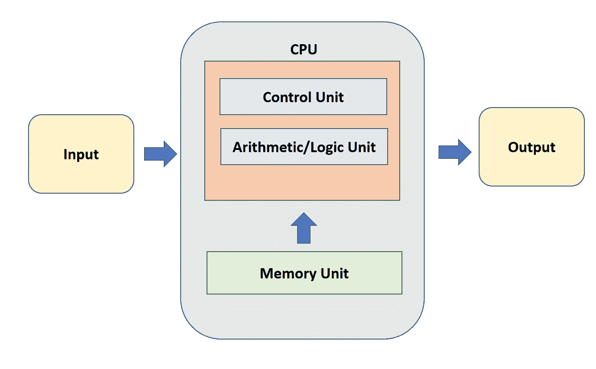
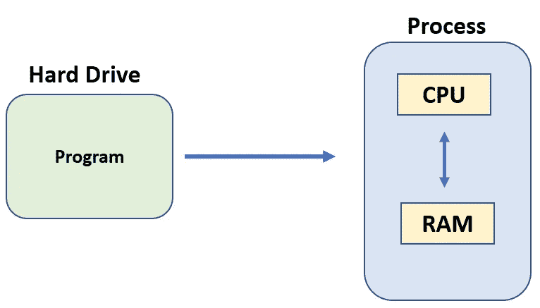
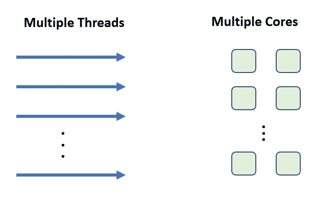

# C++中的 CUDA 并行编程(第一部分)

> 原文：<https://towardsdatascience.com/parallel-programming-with-cuda-in-c-part-1-d935e93a9e87>

照片由 [aaron boris](https://unsplash.com/es/@aaron_boris?utm_source=medium&utm_medium=referral) 在 [Unsplash](https://unsplash.com?utm_source=medium&utm_medium=referral) 拍摄

## 了解如何利用现代 GPU 的强大功能加速计算密集型应用

最常见的深度学习框架，如 [Tensorflow](https://www.tensorflow.org/) 和 [PyThorch](https://pytorch.org/) 通常依赖于内核调用，以便使用 GPU 进行并行计算，并加速神经网络的计算。允许开发人员使用 GPU 编程的最著名的接口是 [CUDA](https://it.wikipedia.org/wiki/CUDA) ，由 [NVIDIA](https://www.nvidia.com/it-it/) 创建。

并行计算需要与普通编程完全不同的观点，但是在您开始动手之前，有一些术语和概念需要学习。

## 背景

在下图中，您可以看到一个经典的设置，其中 CPU 一次处理一条指令来生成一个输出。但是我们如何同时处理多个指令呢？这就是我们将在本文中试图理解的。

作者图片

## 术语

*   **进程:**是正在执行的计算机程序的实例。一个进程在 CPU 上运行，并在 RAM 中创建一个分配。

过程(图片由作者提供)

*   **上下文:**一个进程的数据集合(内存地址，程序状态)。它允许处理器挂起或暂停一个进程的执行，并在以后重新启动它。
*   **线程**:是流程的一个组件。每个进程至少有一个被称为主线程的线程，它是程序的入口点。一个线程可以执行一些指令。在一个进程中，多个线程可以共存并共享分配给该特定进程的内存。进程之间没有内存共享。
*   **循环调度:**如果我们有一个单核处理器，进程将按照循环调度执行，执行优先级最高的第一个进程。当你从一个过程的执行切换到另一个过程时叫做**上下文切换。**

## 平行

在现代计算中，不需要上下文切换，我们可以在不同的内核上运行不同的线程(现在可以把一个内核想象成一个小处理器)，这就是我们拥有多核设备的原因！

多核(图片由作者提供)

但是请记住，几乎在每个进程中都有一些应该顺序执行的指令和一些可以同时并行计算的指令。

当您谈论并行时，您应该记住有两种类型的并行:

*   **任务级别:**相同或不同数据上的不同任务
*   **数据级别:**同一任务不同数据

此时，注意不要将并行性与并发性混淆。

*   **并发:**我们有一个处理器，它顺序执行进程，我们只是有并行的错觉，因为处理器真的很快。
*   **并行:**多个处理器的真正并行。

## CPU、GPU 和 GPGPU

图形处理单元(GPU)可以在短时间内执行复杂的操作。复杂性取决于同时执行的操作数量
，但前提是它们保持简单且基本相似。游戏行业一直是 GPU 实现的启动市场，后来 Nvidia 公司通过平台 CUDA 实现了这一市场。GPU 的恶名甚至增加了更多，特别是对于开发人员来说，他们现在能够使用几行代码运行多个计算操作。

CUDA 允许我们在图形处理单元 ( **GPGPU** )上使用并行计算进行所谓的**通用计算，即使用 GPU 进行除 3D 图形之外的更多通用计算**

我们来总结一下 CPU 和 GPU 的一些基本区别。

**图形处理器:**

*   低时钟速度
*   成千上万的核心
*   上下文切换由硬件完成(非常快)
*   如果一个线程停止，可以在线程之间切换

**CPU:**

*   高时钟速度
*   几个核心
*   上下文切换由软件完成(慢)
*   在线程之间切换并不容易

## Cuda 编程的基本步骤

在接下来的文章中，我们将编写使用并行编程的代码。然而，我们必须首先知道基于 cuda 的代码的结构是什么，有几个简单的步骤可以遵循。

*   CPU 上数据的初始化
*   将数据从 CPU 传输到 GPU
*   内核启动(GPU 上的指令)
*   将结果从 GPU 传输回 CPU
*   从 CPU 和 GPU 回收内存

在这样的环境中，我们将把**主机代码**称为将要在 CPU 上运行的代码，把**设备代码**称为将要在 og GPU 上运行的代码。

# 最后的想法

还有更多的东西要看，但我不喜欢把它们都写在一篇文章里，因为我认为这比其他任何东西都更令人困惑。

并行编程是当今一切的基础，它是我们必须加快非常长的计算时间的方式，只是更多的处理器或更多的核心一起工作，团结就是力量！

如果您有兴趣了解 GPU 如何工作，并且喜欢与硬件密切相关的编程，请继续阅读我将发表的这一系列文章。就我个人而言，我发现对 CUDA 的研究非常有趣，每一行代码都像是一个有待解决的难题。

# 结束了

*马赛洛·波利蒂*

[Linkedin](https://www.linkedin.com/in/marcello-politi/) ， [Twitter](https://twitter.com/_March08_) ， [CV](https://march-08.github.io/digital-cv/)