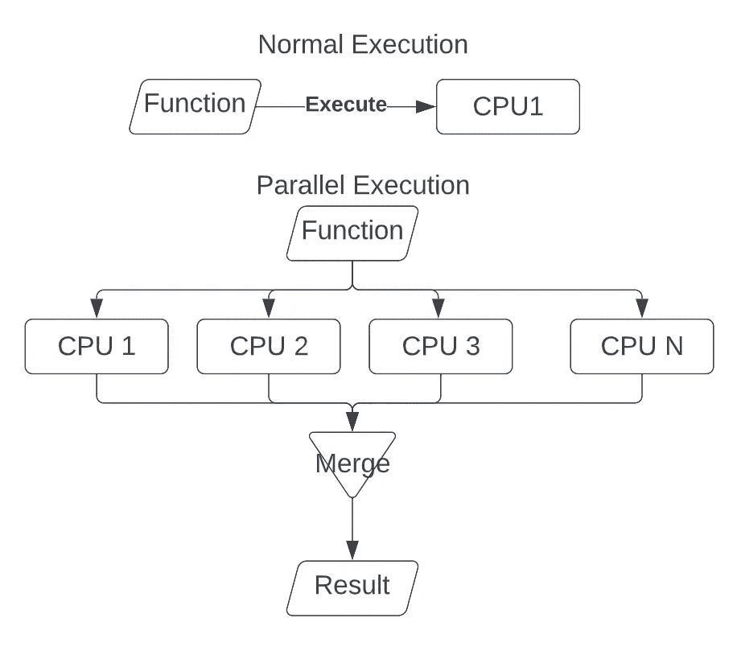
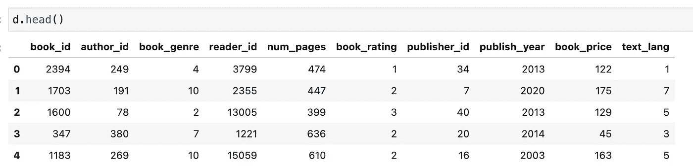
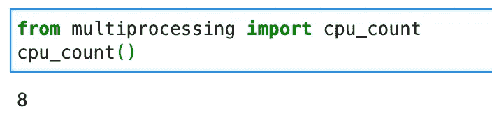

# Python 中的多处理并行化

> 原文：<https://towardsdatascience.com/parallelization-w-multiprocessing-in-python-bd2fc234f516>

## 并行运行您的数据科学任务以加快计算速度


图片由[迪帕克·劳特拉](https://unsplash.com/@deepakrautela)从 [Unsplash](https://unsplash.com/photos/jM7nOw748Ho) 拍摄

本文将直观地介绍多处理是如何工作的，以及使用它来并行运行作业的相关步骤。我将使用 pandas 和 numpy 提供示例函数来并行运行计算量大的任务，以降低时间复杂度。以下是这篇文章的提纲:

## **目录**

*   什么是多重处理？
*   并行化背后的直觉
*   数据
    -需求
    -生成数据
*   正在检查可用处理器的数量
*   并行化单参数函数
    -常规实现
    -并行实现
*   并行化多参数函数
    -常规实现
    -并行实现
*   结束语
*   资源

# 什么是多重处理？

多重处理是指一个程序在两台或多台计算机上同时执行[1]。多重处理是 Python 2.6 以上版本中安装的一个模块。这是一个支持用户在一台机器上创建和销毁多个处理器的包。这使得程序员能够编写利用机器上所有可用处理器的代码[2]。它适用于 Unix 和 Windows [2]。

> `[multiprocessing](https://docs.python.org/3/library/multiprocessing.html#module-multiprocessing)`包中的`[Pool](https://docs.python.org/3/library/multiprocessing.html#multiprocessing.pool.Pool)`函数允许程序员跨多个输入值并行执行一个函数，将输入数据分布到多个进程中(数据并行)。
> 【2】[https://docs.python.org/3/library/multiprocessing.html](https://docs.python.org/3/library/multiprocessing.html)

# 并行化背后的直觉

在数学中，如果两条或多条直线共面且不相交于任何一点，则它们是平行的。类似地，编程中的并行化指的是让一个功能同时在两个或多个进程上运行。这些进程在运行时从不相互影响。下图概述了一个函数的正常执行和一个函数在多个 CPU(处理器)上的并行执行。



正常运行一项功能与并行运行一项功能的过程。图片由作者提供。

# 数据

下面是我们将要合成的数据集，用于并行执行代码。

## 要求

运行下面的脚本需要以下依赖项和版本。

```
pandas>=1.2.4
numpy>=1.20.1
```

## 生成数据

上面脚本的结果应该会产生类似下面的输出。这些值会有所不同，因为这些值是随机生成的，但是数据的整体结构将保持不变。



合成数据集。图片由作者提供。

# 正在检查可用处理器的数量

以下命令允许您确定正在使用的计算机中可用的处理器数量:

```
from multiprocessing import cpu_count
cpu_count()
```



本教程中可用的 CPU 数量。图片由作者提供。

请注意，即使有多个处理器可用，计算机上的大多数(如果不是全部)应用程序也只使用一个处理器。如果你要并行执行一个需要大量计算能力的脚本，你的计算机基本上会瘫痪。您可能正在使用的大多数其他应用程序几乎肯定会大幅变慢。建议使用一台远程计算机(你可以通过 AWS / GCP / Azure /任何其他云平台租用)，它有足够数量的 CPU 可供使用。

# 并行化单参数函数

下面的函数将计算每个读者阅读的平均图书价格。

## 常规实施

## 并行实现

请注意，仅仅因为您可以并行化一个函数，并不意味着您总是应该这样做。在 Python pandas 中执行的上述相同函数的下面 1 行实现比普通和并行实现快得多。当你发现最有效的时间复杂度实现并不足够时，并行化你的工作。

```
gb_df = d.groupby('reader_id')['book_price'].mean().reset_index()
```

# 并行化多参数函数

下面的函数将生成与每个用户已经阅读的类型相关联的标准化的 1 热编码。

## 常规实施

## 并行实现

# 结束语

本文概述了对多重处理和并行执行程序的直觉和理解。它通过一个教程指导用户当函数有单个和多个参数时如何并行执行它们的函数。请注意，仅仅因为您可以并行运行一个函数并不意味着它总是最佳解决方案。以最有效的时间复杂度来确定脚本的执行，如果脚本仍然花费过多的时间，那么并行运行它。

要了解代码，你可以参考我的 GitHub 上与本教程相关的 Jupyter 笔记本。

如果你想转型进入数据行业，并希望得到经验丰富的导师的指导和指引，那么你可能想看看最敏锐的头脑。Sharpest Minds 是一个导师平台，导师(他们是经验丰富的实践数据科学家、机器学习工程师、研究科学家、首席技术官等。)将有助于你的发展和学习在数据领域找到一份工作。点击查看[。](https://www.sharpestminds.com/?r=vatsal-patal)

# 资源

*   [1]https://en.wikipedia.org/wiki/Multiprocessing
*   [2]https://docs.python.org/3/library/multiprocessing.html

如果你喜欢读这篇文章，你可能会发现我写的关于数据科学和机器学习的其他文章也很有趣。下面来看看吧。

[](/random-walks-with-restart-explained-77c3fe216bca)  [](/recommendation-system-matrix-factorization-svd-explained-c9a50d93e488)  [](/comprehensive-guide-to-github-for-data-scientist-d3f71bd320da)  [](/active-learning-in-machine-learning-explained-777c42bd52fa)  [](/text-similarity-w-levenshtein-distance-in-python-2f7478986e75)  [](/text-summarization-in-python-with-jaro-winkler-and-pagerank-72d693da94e8)  [](/link-prediction-recommendation-engines-with-node2vec-c97c429351a8)  [](/optimize-training-predicting-sk-learn-models-in-python-with-sparse-matrices-1612072a025d)  [](/recommendation-systems-explained-a42fc60591ed)  [](/word2vec-explained-49c52b4ccb71)  [](/bayesian-a-b-testing-explained-344a6df88c1a) [## 贝叶斯 A/B 测试解释

towardsdatascience.com](/bayesian-a-b-testing-explained-344a6df88c1a)