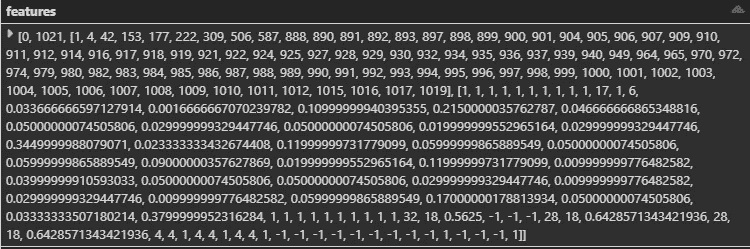
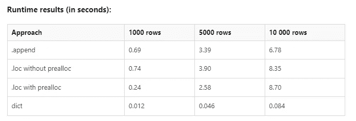
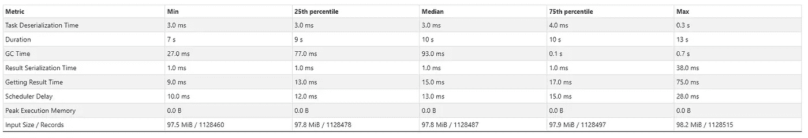
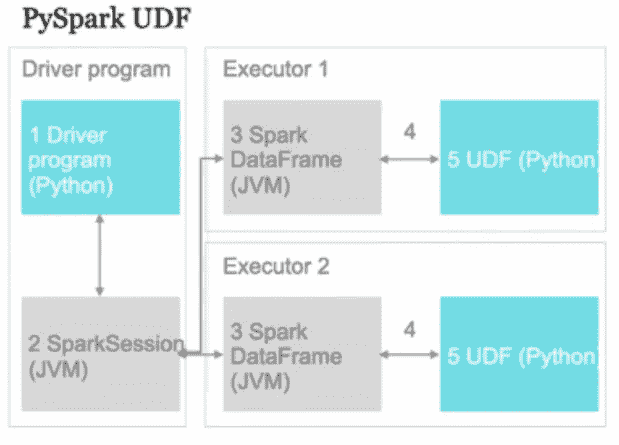

# 使用 MLlib 和 PySpark 并行处理您的大规模 SHAP 计算

> 原文：<https://towardsdatascience.com/parallelize-your-massive-shap-computations-with-mllib-and-pyspark-b00accc8667c>

## 使用 SHAP 有效解释模型的分步指南。


由 [Unsplash](https://unsplash.com?utm_source=medium&utm_medium=referral) 上的 [Pietro Jeng](https://unsplash.com/@pietrozj?utm_source=medium&utm_medium=referral) 拍摄

## **ml lib 简介**

Apache Spark 的机器学习库(MLlib)主要是为了可伸缩性和速度而设计的，它利用 Spark 运行时来处理监督学习(如分类和回归)中常见的**分布式**用例，以及非监督学习(如聚类和协作过滤)和其他情况(如降维)。在这篇文章中，我将介绍我们如何使用 SHAP 来解释梯度增强树(GBT)模型，该模型在一定程度上符合我们的数据。

## 什么是梯度增强树？

在我们理解什么是梯度增强树之前，我们需要理解增强。Boosting 是一种集成技术，其中**顺序地**组合多个弱学习者以实现整体强学习者。在梯度提升树的情况下，每个弱学习器是一个决策树，该决策树顺序地最小化由该序列中的前一个决策树生成的误差(在回归的情况下是 MSE，在分类的情况下是 log loss)。要阅读更多关于 GBTs 的细节，请参考[这篇](/gradient-boosted-decision-trees-explained-9259bd8205af)博客文章。

## 了解我们的进口

```
from pyspark.sql import SparkSession
from pyspark import SparkContext, SparkConf
from pyspark.ml.classification import GBTClassificationModel
import pyspark.sql.functions as F
from pyspark.sql.types import *
```

前两个导入用于初始化 Spark 会话。它将被用来把我们的熊猫数据帧转换成 spark 帧。第三个导入用于将我们的 GBT 模型加载到内存中，该模型将被传递给我们的 SHAP 解释器来生成解释。倒数第二个也是最后一个导入用于执行 SQL 函数和使用 SQL 类型。这些将在我们的用户定义函数(UDF)中使用，我将在后面描述。

## 将 MLlib GBT 特征向量转换为熊猫数据帧

SHAP 解释器将一个数据帧作为输入。然而，训练 MLlib GBT 模型需要数据预处理。更具体地说，我们数据中的分类变量需要使用**分类索引**或**一键编码转换成数字变量。**要了解更多关于如何训练 GBT 模特的信息，请参考[这篇](/machine-learning-with-pyspark-and-mllib-solving-a-binary-classification-problem-96396065d2aa)文章。产生的“特性”列是一个[稀疏向量](https://spark.apache.org/docs/latest/api/python/reference/api/pyspark.ml.linalg.SparseVector.html#pyspark.ml.linalg.SparseVector)(要了解更多信息，请查看[这个](https://docs.databricks.com/applications/machine-learning/train-model/mllib/index.html#advanced-apache-spark-mllib-example)示例中的“预处理数据”部分)。它看起来像下面的东西:



SparseVector 特性列描述— 1。默认索引值，2。向量长度，3。功能列的索引列表，4。位于 3 的相应索引处的数据值列表。[图片由作者提供]

上面显示的“特性”列是针对单个训练实例的。我们需要为所有的训练实例转换这个 SparseVector。一种方法是迭代处理每一行，并添加到我们的熊猫数据帧中，我们将把它提供给我们的 SHAP 解释器(哎哟！).有一种更快的方法，它利用了我们将所有数据都加载到内存中的事实(如果没有，我们可以成批地加载它，并对每个内存中的批处理执行预处理)。用 Shikhar Dua 的话说:

> 1.创建字典列表，其中每个字典对应一个输入数据行。
> 
> 2.根据此列表创建数据框。

所以，基于上面的方法，我们得到这样的东西:

```
rows_list = []
for row in spark_df.rdd.collect(): 
    dict1 = {} 
    dict1.update({k:v for k,v in zip(spark_df.cols,row.features)})
    rows_list.append(dict1) 
pandas_df = pd.DataFrame(rows_list)
```

如果说 *rdd.collect()* 看起来很吓人，其实解释起来还是挺简单的。**弹性分布式数据集(RDD)** 是基本的 Spark 数据结构，它们是和**不可变的**对象分布。RDD 中的每个数据集被进一步细分为逻辑分区，这些分区可以在 Spark 集群的不同工作节点中进行计算。因此，PySpark RDD *collect()* 所做的就是从所有工作节点检索数据到驱动节点。正如您可能猜到的，这是一个内存瓶颈，如果我们处理的数据超过了驱动程序节点的内存容量，我们需要增加 RDD 分区的数量，并通过分区索引对它们进行过滤。点击阅读如何操作[。](https://umbertogriffo.gitbook.io/apache-spark-best-practices-and-tuning/rdd/dont_collect_large_rdds)

不要相信我的执行力。看看统计数据。



向 pandas 数据帧插入行的性能分析。[来源(感谢米哈伊尔 _ 萨姆和彼得·莫滕森):[此处](https://stackoverflow.com/questions/10715965/create-a-pandas-dataframe-by-appending-one-row-at-a-time/17496530#17496530)

以下是我的一个 Databricks 笔记本计划作业运行的指标:

> 输入大小:11.9 GiB (~12.78GB)，所有任务的总时间:20 分钟，记录数:165.16K



运行上述单元的阶段执行的 125 个已完成任务的摘要度量。[图片由作者提供]

## 与 SHAP 图书馆合作

我们现在准备将预处理过的数据集传递给 SHAP 树解释器。请记住，SHAP 是一种局部特征归因方法，它将**单个**预测解释为我们模型的特征的 shapley 值的代数和。

我们使用 TreeExplainer 的原因如下:

1.  **合适:** TreeExplainer 是一个为基于树的模型(Random Forest，XGBoost，LightGBM，GBT 等)计算 SHAP 值的类。
2.  **精确**:它不是通过随机采样来模拟缺失特征，而是通过简单地忽略依赖于缺失特征的决策路径来利用树结构。因此，TreeExplainer 的输出是确定性的，不会随背景数据集而变化。
3.  **高效**:所有组合不是在每个可能的特征组合(或其子集)上迭代，而是同时通过树推送，使用更复杂的算法来跟踪每个组合的结果——将复杂度从所有可能组合的 O( **TL2ᵐ** )降低到多项式 O( **TLD** )(其中 **m** 是特征的数量， **T** 是树的数量， **L** 是最大叶子数量，

***check_additivity = False* 标志运行验证检查，以验证 SHAP 值的总和是否等于模型的输出。然而，该标志要求运行 Spark 不支持的预测，因此需要将其设置为 False，因为它无论如何都会被忽略。一旦我们得到了 SHAP 值，我们就把它从一个 Numpy 数组转换成一个 pandas dataframe，这样它就很容易解释了。**

> **需要注意的一点是，当我们将 Spark 数据帧转换为 pandas 时，数据集的顺序保持不变，但是**相反的情况不成立**。**

**以上几点将我们引向下面的代码片段:**

```
gbt = GBTClassificationModel.load('your-model-path') 
explainer = shap.TreeExplainer(gbt)
shap_values = explainer(pandas_df, check_additivity = False)
shap_pandas_df = pd.DataFrame(shap_values.values, cols = pandas_df.columns)
```

## **Pyspark UDFs 简介以及何时使用它们**

****

**PySpark UDFs 如何将单个任务分配给 worker (executor)节点[Source: [此处](https://medium.com/quantumblack/spark-udf-deep-insights-in-performance-f0a95a4d8c62#:~:text=In%20these%20circumstances%2C%20PySpark%20UDF,two%20types%20of%20PySpark%20UDFs.) ]**

**用户定义的函数是复杂的自定义函数，对数据集的特定行进行操作。当本地火花函数被认为不足以解决问题时，通常使用这些函数。Spark 函数天生比 UDF 快，因为它本身是一个 JVM 结构，其方法是通过对 Java APIs 的本地调用来实现的。然而，PySpark UDFs 是 Python 实现，需要在 Python 解释器和 JVM 之间移动数据(参考上图中的箭头 4)。这不可避免地引入了一些处理延迟。**

**如果不能容忍任何处理延迟，最好的办法是创建一个 Python 包装器，从 PySpark 本身调用 Scala UDF。这个博客展示了一个很好的例子。然而，使用 PySpark UDF 对我的用例来说已经足够了，因为它易于理解和编码。**

**下面的代码解释了在每个 worker/executor 节点上执行的 Python 函数。我们只是选取最高的 SHAP 值(绝对值，因为我们也想找到最有影响力的负面特征)并将其附加到相应的 *pos_features* 和 *neg_features* 列表，然后将这两个列表附加到返回给调用者的 *features* 列表。**

```
def shap_udf(row):
    dict = {} 
    pos_features = [] 
    neg_features = [] 
    for feature in row.columns: 
        dict[feature] = row[feature]     dict_importance = {key: value for key, value in
    sorted(dict.items(), key=lambda item: __builtin__.abs(item[1]),   
    reverse = True)}     for k,v in dict_importance.items(): 
        if __builtin__.abs(v) >= <your-threshold-shap-value>: 
             if v > 0: 
                 pos_features.append((k,v)) 
             else: 
                 neg_features.append((k,v)) 
   features = [] 
   features.append(pos_features[:5]) 
   features.append(neg_features[:5])    return features
```

**然后，我们用我们的 Python 函数名注册我们的 PySpark UDF(在我的例子中，它是 *shap_udf* )，并在 *F.udf()* 的参数中指定函数的返回类型(在 Python 和 Java 中是强制的)。在外部 ArrayType()中有两个列表，一个用于正面特性，另一个用于负面特性。因为每个单独的列表最多包含 5 个(feature-name，shap-value) StructType()对，所以它表示内部 ArrayType()。下面是代码:**

```
udf_obj = F.udf(shap_udf, ArrayType(ArrayType(StructType([ StructField(‘Feature’, StringType()), 
StructField(‘Shap_Value’, FloatType()),
]))))
```

**现在，我们只是创建一个新的 Spark 数据帧，它有一个名为‘Shap _ Importance’的列，该列为 *spark_shapdf* 数据帧的每一行调用我们的 UDF。为了区分正面和负面特性，我们在一个名为 *final_sparkdf* 的新 Spark 数据帧中创建了两列。我们最终的代码片段如下所示:**

```
new_sparkdf = spark_df.withColumn(‘Shap_Importance’, udf_obj(F.struct([spark_shapdf[x] for x in spark_shapdf.columns])))final_sparkdf = new_sparkdf.withColumn(‘Positive_Shap’, final_sparkdf.Shap_Importance[0]).withColumn(‘Negative_Shap’, new_sparkdf.Shap_Importance[1])
```

**最后，我们已经提取了每个测试实例的 GBT 模型的所有重要特性，而没有使用任何显式的 for 循环！合并后的代码可以在下面的 GitHub gist 中找到。**

**从拟合的 GBT 模型中获取最具影响力的正负 SHAP 值**

**这是我第一次尝试写一篇文章，如果有任何事实或统计上的不一致，请联系我，我将非常乐意与你一起学习！:)**

## **参考**

**[1]Soner y ldr RM，[梯度推动决策树-向数据科学解释](/gradient-boosted-decision-trees-explained-9259bd8205af) (2020)**

**[2] Susan Li，[使用 PySpark 和 MLlib 的机器学习—解决一个二元分类问题](/machine-learning-with-pyspark-and-mllib-solving-a-binary-classification-problem-96396065d2aa) (2018)，走向数据科学**

**[3] Stephen Offer，[如何用 Spark 训练 XGBoost](https://databricks.com/blog/2020/11/16/how-to-train-xgboost-with-spark.html)(2020)，数据科学与 ML**

**[4] [在数据块上使用 Apache Spark ml lib](https://docs.databricks.com/applications/machine-learning/train-model/mllib/index.html#advanced-apache-spark-mllib-example)(2021)，数据块**

**[5] Umberto Griffo，[不要收集大型 rdd](https://umbertogriffo.gitbook.io/apache-spark-best-practices-and-tuning/rdd/dont_collect_large_rdds)(2020)，Apache Spark 最佳实践和调优**

**[6]尼基莱什·努卡拉，·朱，·布拉恰利，汤姆·戈登伯格(2019)，斯帕克·—[对性能的深刻见解](https://medium.com/quantumblack/spark-udf-deep-insights-in-performance-f0a95a4d8c62#:~:text=In%20these%20circumstances%2C%20PySpark%20UDF,two%20types%20of%20PySpark%20UDFs.)，昆腾布莱克**