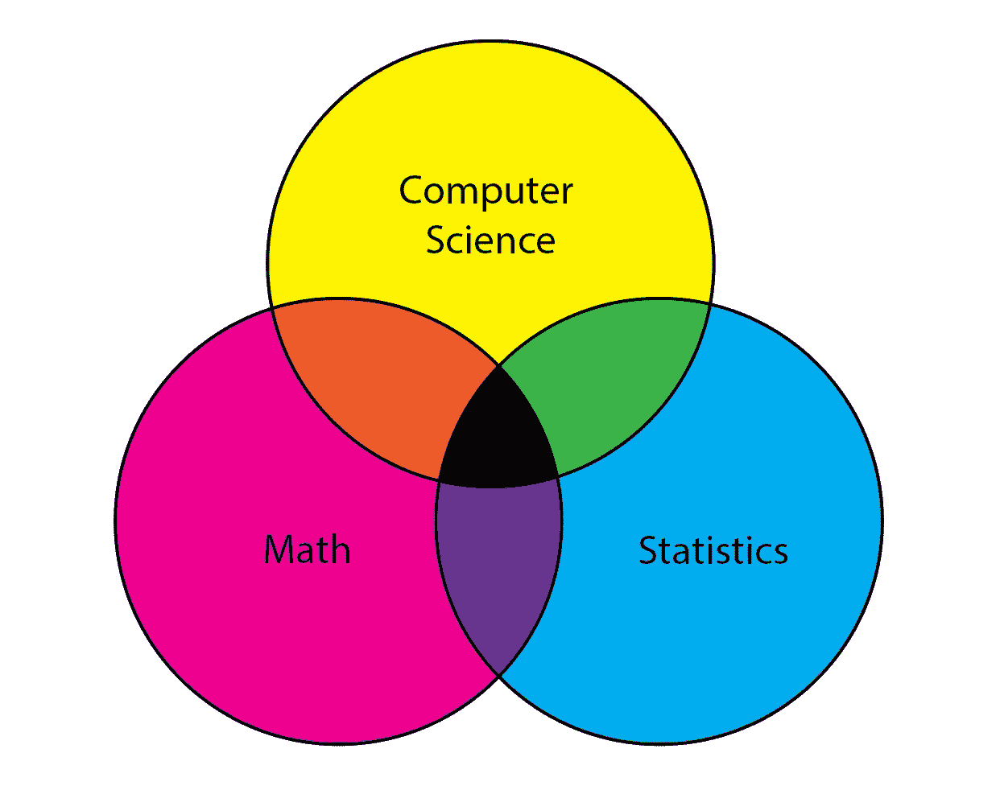
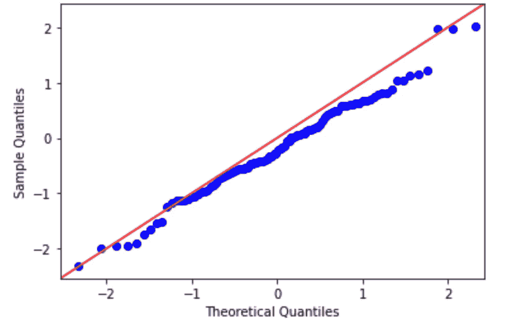
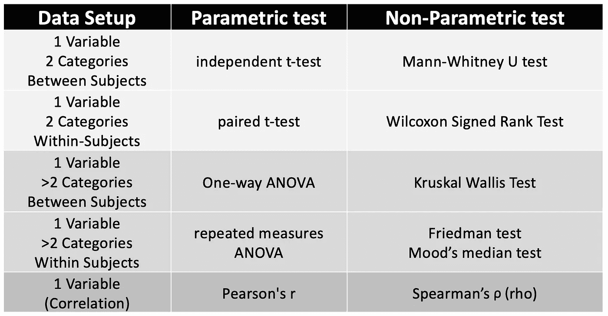

# 参数测试与非参数测试，以及何时使用它们

> 原文：<https://towardsdatascience.com/parametric-vs-non-parametric-tests-and-where-to-use-them-85130b3877dc>



作者图片

数据科学的基础包括计算机科学、统计学和数学。人们很容易被最新、最棒、最强大的算法——卷积神经网络、强化学习等——所吸引。

作为一名 ML/health 研究人员和算法开发人员，我经常使用这些技术。然而，在我作为一名电气工程师接受了大约 10 年的培训后，我在数据科学社区看到的一个普遍现象是，如果你只有一把锤子，那么一切看起来都像钉子。可以说，尽管这些令人兴奋的算法有巨大的适用性，但数据科学社区的统计基础经常被忽视。我很幸运，除了在母亲是统计学家的陪伴下成长之外，我的本科和研究生课程都是专门针对统计学的。所以这篇文章可能是分享一些基本的统计测试以及何时何地使用它们的第一篇文章！

参数检验对总体参数进行假设:

**1。正态性**——每组数据应呈正态分布

**2。独立性** —每组数据应随机独立取样

**3。无异常值** —数据中无极端异常值

**4。等方差** —每组中的数据应具有大致相等的方差

如果可能的话，我们应该使用参数测试。然而，**非参数测试**(有时也称为*无分布测试*)并不假设任何关于基础分布的事情(例如，数据来自正态(参数分布)。

我们可以使用 Q-Q(分位数-分位数)图直观地评估正态性。在这些图中，观察到的数据与正态分布的预期分位数相对应。这里可以看到一个 python 演示代码，其中创建了一个随机正态分布。如果数据正常，它会显示为一条直线。

```
import numpy as np
import statsmodels.api as statmod
import matplotlib.pyplot as plt#create dataset with 100 values that follow a normal distribution
data = np.random.normal(0,1,100)#create Q-Q plot with 45-degree line added to plot
fig = statmod.qqplot(data, line='45')
plt.show()
```



作者图片

# 检查正常性的测试

*   夏皮罗-维尔克
*   科尔莫戈罗夫-斯米尔诺夫

这两种检验的无效假设是样本是从正态(或高斯)分布中抽取的。因此，如果 p 值显著，则违反了正态性假设，并且数据必定是非正态的替代假设被接受为真。

# 选择正确的测试

处理参数和非参数测试的区间水平数据时，可以参考此表。



作者图片

# 优点和缺点

非参数测试有几个优点，包括:

*   当参数测试的假设被违反时，更多的统计能力。
*   常态假设不适用
*   小样本是可以的
*   它们可用于所有数据类型，包括顺序、标称和间隔(连续)
*   可用于含有异常值的数据

非参数测试的缺点:

*   如果假设没有被违反，不如参数测试有效

如果你喜欢这篇文章，请留下你的评论，或者如果有你想看到的附加信息，或者一篇关于这个主题的更深入的后续文章，我很乐意提供！: )

此外，如果你喜欢看到这样的文章，并希望无限制地访问我的文章和所有由 Medium 提供的文章，请考虑使用下面的我的推荐链接注册。会员费为 5 美元/月；我赚一小笔佣金，这反过来有助于推动更多的内容和文章！

[](https://medium.com/@askline1/membership) [## 通过我的推荐链接加入 Medium-Adrienne Kline

### 作为一个媒体会员，你的会员费的一部分会给你阅读的作家，你可以完全接触到每一个故事…

medium.com](https://medium.com/@askline1/membership) 

# 参考

[1] Kotz，s；等人编辑。(2006)，[统计科学百科全书](https://amzn.to/38y6UFw)，威利。
[2]林德斯特罗姆特区(2010)。[绍姆简易统计大纲](https://amzn.to/2O8E1Gy)，第二版(绍姆简易大纲)第二版。麦格劳-希尔教育公司(2003 年)。*假人统计，*第 18 版