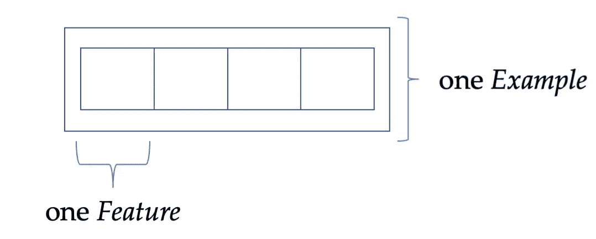

# 用 TensorFlow 解析 UrbanSound8K 数据集

> 原文：<https://towardsdatascience.com/parsing-the-urbansound8k-dataset-with-tensorflow-43192a5206e7>

# 用 TensorFlow 解析 UrbanSound8K 数据集

## 从原始音频到 TFRecord 再到填充批次

有多种方法可以将数据输入神经网络。最常用的是 Numpy 数组和 CSV/Pandas 文件。此外，TensorFlow 还提供自定义存储格式 TFRecord。它很方便，但对初学者不太友好。

理查德·霍瓦特在 [Unsplash](https://unsplash.com?utm_source=medium&utm_medium=referral) 上的照片

尽管许多数据集都是现成的，比如 MNIST 或 CIFAR，但有时您必须自己实现定制的数据集。令人欣慰的是，一旦你做了几次，把其他数据集转换成 TFRecord 格式并不困难。在这里，我们将分析 UrbanSound8K 数据集，以 TFRecord 格式存储它，最后，迭代它的样本。如果你对这种格式完全陌生，你可以在这里得到一个实际操作的回顾[，它也涵盖了我们如何解析文本和图像数据。](/a-practical-guide-to-tfrecords-584536bc786c)

## 数据集描述

[UrbanSound8K 数据集](https://urbansounddataset.weebly.com/urbansound8k.html) [1】(可在[免费获得，仅用于非商业用途](https://urbansounddataset.weebly.com)；CC BY-NC 3.0)包含 8732 个不同时长的音频文件。每个样本最多 4 秒钟，属于 10 个类别中的一个。这些文件被预先安排在十个文件夹中，并以 WAVE 格式存储。每个文件可能有不同的采样率、位深度和通道数。大约 7 GB，是一个中等大小的数据集。因此，如果你正在寻找一个更小，更容易访问的音频数据集，那么看看 ESC50。

## 下载和提取

转到[数据集的网页](https://urbansounddataset.weebly.com/urbansound8k.html)，点击底部的下载链接下载数据集。如前所述，您可以免费使用这些数据，但只能用于非商业项目——对于这篇展示数据解析和相关概念的解释性博文来说，一切都很好。

根据您的连接，下载可能需要几分钟。下载完成后，解压归档文件。你现在有两个文件夹，*音频*和*元数据*。我们只需要第一个。

在这个文件夹中，文件被预先安排在十个文件夹中，*文件夹 1* 到*文件夹 10* 。所有文件都根据以下方案命名:

{源 ID }-{标签}-{拍摄}-{切片}。声音资源文件

第一部分用来标识源文件的 ID，*标签*是类标签，*取*和*片*用来区分取自同一个原始文件的多个样本。

## 将音频数据解析为 TFRecords

事先说句话，如果这是你第一次使用 TFRecords，TensorFlow 高效数据存储的原生格式，或者你需要复习一下，看看[这款 Google Colab 笔记本](https://colab.research.google.com/drive/1xU_MJ3R8oj8YYYi-VI_WJTU3hD1OpAB7)和这里的配套描述。

我们不需要元数据文件，因为一个音频样本的标签就写在它的文件名中。因此，我们可以直接开始将数据写入 TFRecord 文件。为了做到这一点，我们首先导入一些包和几个助手函数:

然后，我们定义一个从磁盘加载音频的函数。为此，我们使用了*图书馆*图书馆。虽然有其他选择，比如 *scipy* ，但我发现它最方便。此外，我们可以通过首先在“/”上拆分文件名，然后在“-”上拆分文件名来快速提取标签。最后，我们返回音频数据、其采样率、标签和文件名:

然后，我们定义一个函数，这个函数使得提取的数据准备好被存储。这里，我们将使用前面实现的助手函数。正如我在 TFRecord 格式的介绍性实践指南中所描述的，这些函数用于将整数、浮点、字符串和字节数据准备好写入磁盘。给特性起一个合适的名字有助于我们以后提取它们。最后，我们将它们包装成一个*示例*对象，就像一个包含一些内容和属性的盒子。下图形象地展示了这一概念:

TFRecord 格式将数据存储为*示例对象，可以这么想。图片由作者提供。*

我们现在已经定义了两个核心功能:从磁盘加载音频数据，并将其解析为 TFRecord 兼容的格式。因此，我们可以实现两者相结合的方法。为此，我们创建一个 *TFRecordWriter* 对象，负责将数据写入磁盘，并遍历我们找到的所有音频文件。然后，解析每个音频文件，打包成一个*示例*对象，并写入一个 TFRecord 文件。

即使数据集相对较大，存储一个完整文件夹的单个 TFRecord 文件也有合适的大小，大约为 550 MB。对于较大的数据集，您希望使用更多的文件。对于这种情况，[文档中有一些提示](https://www.tensorflow.org/tutorials/load_data/tfrecord?hl=en)。

最后，我们实现下面的 *main* 函数来迭代所有的折叠:

为了完善我们的小脚本，我们定义了一个参数解析器。它采用开头提到的*音频*目录和输出目录的路径。如果该目录尚不存在，将创建它:

通过调用 *python /path/to/script.py* 来运行脚本

在定义了创建 TFRecord 文件的脚本之后，我们可能希望稍后读回这些文件。这就是我们现在要实现的。

## 从 TFRecords 读取音频数据

一旦做了几次，从 TFRecord 文件中获取数据实际上非常简单。我们只需颠倒存储过程。之前，我们将名为 *sr* 、 *len* 、 *y* 、*、*等特征放入盒子中。因此，我们使用相同的名称来获取数据。

唯一需要注意的是音频数据。因为它是一个数组，所以我们要对它进行整形。这就是我们存储 *len* 属性的原因。类似地，*文件名*必须被解析成一个字符串:

我们使用下面的函数来读取一个或多个 TFRecord 文件的内容。它返回一个*数据集*对象:

我们可以使用 for 循环迭代前几个元素，检查它们是否有错误。每个样本由四部分组成:实际音频数据、标签、采样速率和原始文件名称:

一个警告是不均衡的文件持续时间。常规批处理操作将会失败。所以，我们要垫批。我们可以通过以下方式做到这一点:

注意:我们将样本填充到 178017 个条目，因为最长的音频文件略超过 4 秒，我们不想截断这些数据。所有其他文件的最大输出时间为 4 秒* 44100 Hz = 176400 个样本。

就是这样！现在就看你的了。

# 摘要

在这篇文章中，我们将 UrbanSound8K 数据集解析为 TFRecord。为此，我们使用了 *librosa* python 库和几个助手函数。然后，我们迭代预定义的折叠，并分别解析每个折叠。

最后，我们提取了数据并填充了一批数据。这给了我们一个可以迭代的数据集。

## 文学

[1] J. Salamon、C. Jacoby 和 J. P. Bello，“城市声音研究的数据集和分类法**”，第 22 届 ACM 多媒体国际会议，美国奥兰多，2014 年 11 月。**