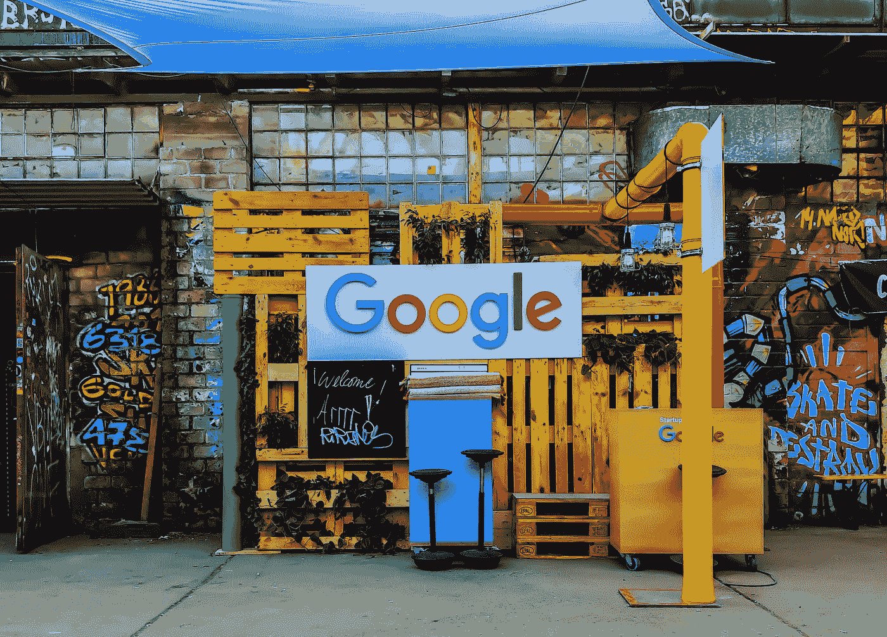
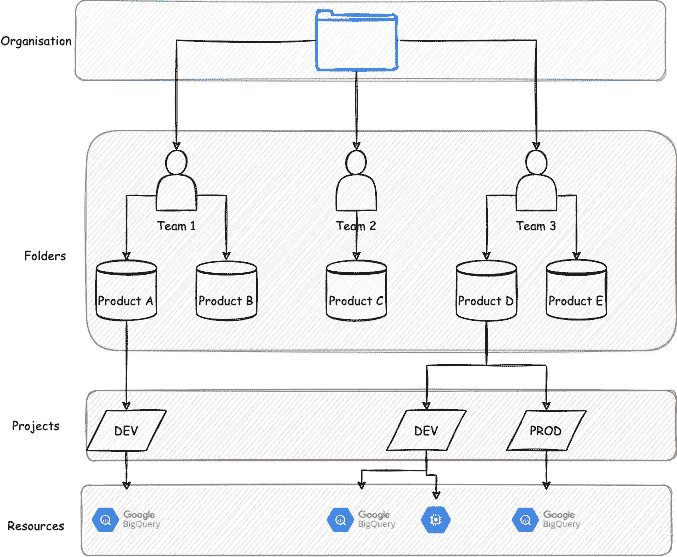

# 谷歌云平台简介

> 原文：<https://towardsdatascience.com/part-1-road-to-google-cloud-professional-data-engineer-introduction-to-the-google-cloud-7abbd3411f3a>

## 数据|工程|技术|云

## 第 1 部分——谷歌云专业数据工程师之路

拉杰什瓦尔·巴楚在 [Unsplash](https://unsplash.com?utm_source=medium&utm_medium=referral) 上的照片

目前正在准备考谷歌云专业数据工程师认证。我将在博客上记录我在这次旅程中的经历，以帮助其他感兴趣的人找到通过考试所需的信息。

这个系列将会有很多部分——我还不知道有多少。

当我浏览我在网上找到的不同课程材料和资源时，我会在这里记下笔记。这些博客帖子仅仅是我在吸收内容时对这些话题的理解，所以请不要轻信任何事情。这些帖子不应该作为你的学习材料，而应该作为帮助你组织准备的指针。

# 谷歌云平台

作为前三大云服务提供商之一，谷歌云平台(GCP)包含大量大数据和机器学习产品和服务。

GCP 的四个主要层。图片由作者提供。

## 计算实例

这些资源或服务将提供一些处理能力。这通常是指 CPU、TPU 和 RAM，比如一个虚拟机。

## 储存；储备

云和桌面计算的主要区别之一是，在云系统中，存储独立于计算。您不希望将连接到计算实例的磁盘视为您可以处理和存储多少数据的限制。

我们的首要任务是获取实例中的数据，并根据需要对其进行转换(即构建适当的管道)。

GCP 存储的一个简单例子是弹性桶存储。弹性储物有 4 种选择。

1.  ***标准*** —用于经常访问的数据
2.  ***近线*** —用于每月访问的数据
3.  ***Coldline*** —用于每季度访问的数据
4.  ***归档*** —用于数据备份

## 网络

谷歌的网络在全球 100 多个接入点(PoP)与公共互联网互联。所有请求都从最近的边缘 PoP 发送，以确保最低的延迟。

## 安全性

大多数较低层次的安全完全由 GCP 处理。这包括硬件的物理安全性、数据的完整性以及网络的完整性。

作为 GCP 用户，我们有权管理用户访问和数据保护。Cloud IAM 帮助您实施这些安全策略。

GCP 会自动加密静态存储的数据。BigQuery 表中的数据使用数据加密密钥加密。然后使用密钥加密密钥对这些密钥进行加密(这个过程称为信封加密)。

# 谷歌云平台资源层级

GCP 由四个主要部分组成:

1.  **资源**——*整个 GCP 生态系统中颗粒最大的物体。这些是我们使用的实际服务和流程，如 BigQuery、数据存储或计算实例。这些资源必须属于特定的项目。*
2.  **项目** — *这些是基层组织实体。他们允许我们创建和使用资源或服务，管理他们的账单，并控制他们的权限。他们合乎逻辑地组织所有 GCP 资源。可以创建、销毁项目，也可以从意外删除中恢复项目。*
3.  **文件夹** — *项目的集合。要有文件夹，我们必须有一个组织。*
4.  **组织** — *整个 GCP 层级的根节点。它允许我们设置适用于在我们企业内创建的所有项目和文件夹的策略。我们还可以通过这个级别的策略来微调访问控制(企业范围的)。*

谷歌云平台资源层级概述。图片作者。

# 进一步阅读清单

*   [GCP 服务备忘单(带描述)](https://googlecloudcheatsheet.withgoogle.com/)
*   [谷歌云博客](https://cloud.google.com/blog/)

你喜欢这篇文章吗？如果是，请考虑订阅我的电子邮件列表，以便在我发布新内容时得到通知。

<https://david-farrugia.medium.com/subscribe>  

另外，考虑成为 Medium 的会员，支持我和你喜欢的其他作家。每月 5 美元，你就可以无限制地阅读 Medium 上的每一篇文章。

<https://david-farrugia.medium.com/membership>  

想给我买杯咖啡吗？

<https://paypal.me/itsdavidfarrugia?country.x=MT&locale.x=en_US>  

# 想联系吗？

我很想听听你对这个话题的想法，或者其他什么。如果你想和我联系，请发电子邮件到 davidfarrugia53@gmail.com。

[Linkedin](https://www.linkedin.com/in/david-farrugia/)——[Twitter](https://twitter.com/davidfarrugia53)