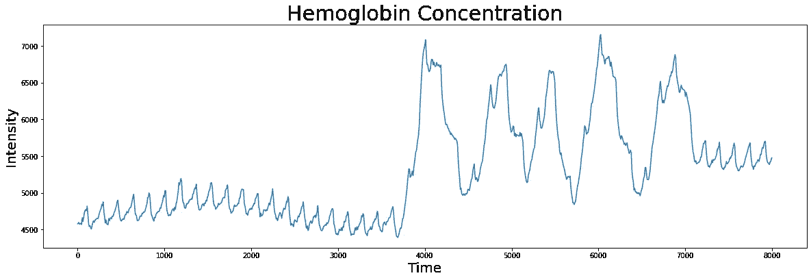
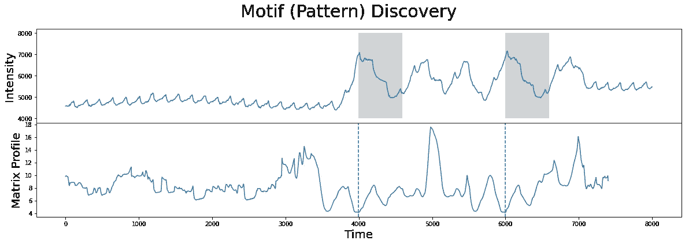
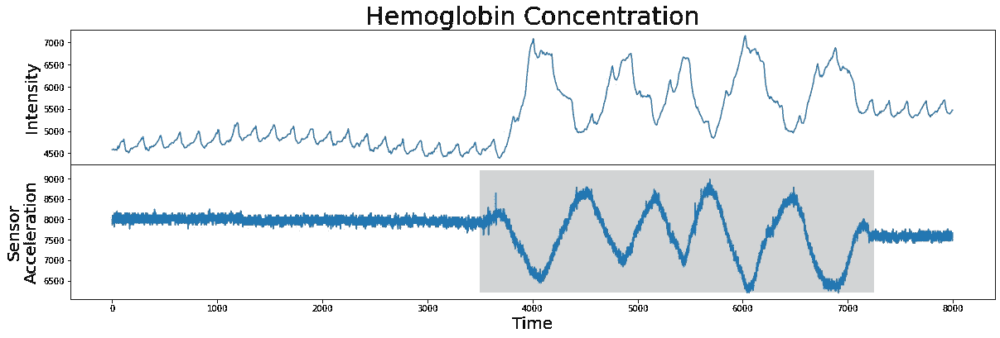
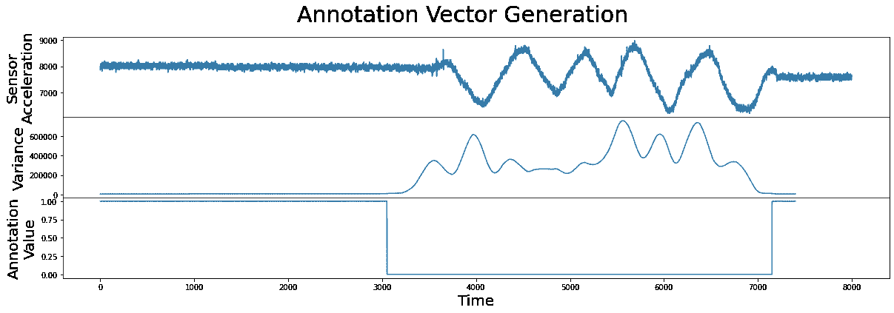
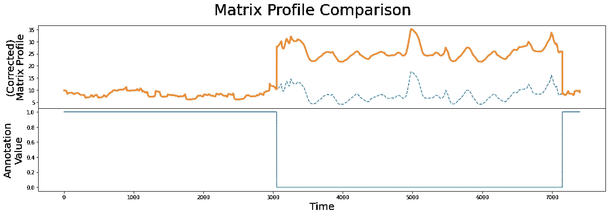
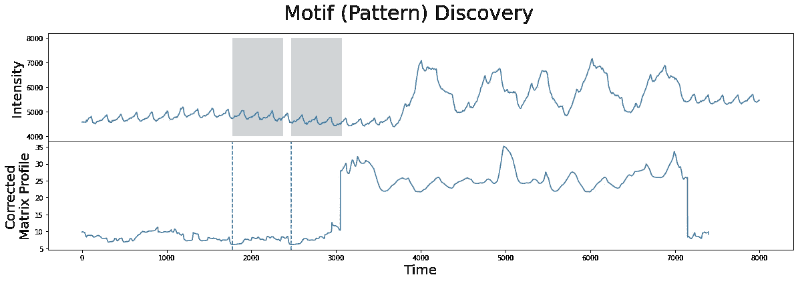
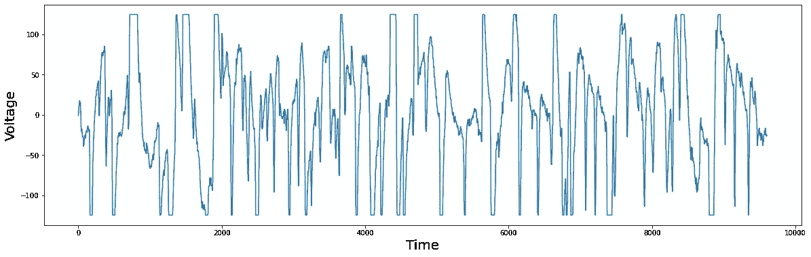
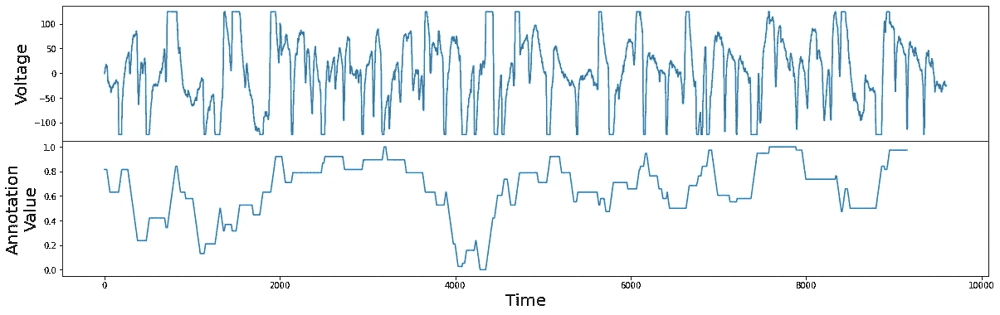
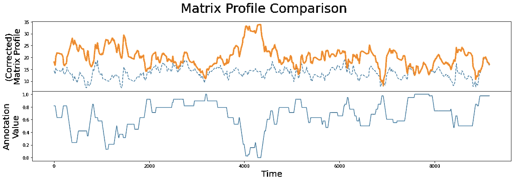
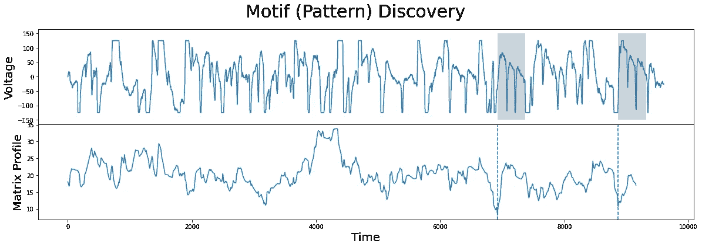

# 第 11 部分:用户引导的主题搜索

> 原文：<https://towardsdatascience.com/part-11-user-guided-motif-search-d3d317caf9ea>

## 带有 STUMPY 的注释向量


(图片由[凯利·西克玛](https://unsplash.com/@kellysikkema)提供)

# 整体大于部分之和


(图片由作者提供)

[STUMPY 是一个强大且可扩展的 Python 库，用于现代时间序列分析](https://github.com/TDAmeritrade/stumpy)，在其核心，有效地计算出一种叫做*矩阵轮廓*的东西。这个多部分系列的目标是解释什么是 matrix profile，以及如何开始利用 [STUMPY](https://stumpy.readthedocs.io/en/latest/) 完成所有现代时间序列数据挖掘任务！

*注:这些教程最初出现在* [*STUMPY 文档*](https://stumpy.readthedocs.io/en/latest/tutorials.html) *中。*

第 1 部分:[矩阵轮廓图](/the-matrix-profile-e4a679269692)
第 2 部分: [STUMPY 基础知识](/stumpy-basics-21844a2d2d92)
第 3 部分:[时间序列链](/part-3-time-series-chains-da281450abbf)
第 4 部分:[语义分割](/part-4-semantic-segmentation-b42c3792833d)
第 5 部分:[用 STUMPY 快速近似矩阵轮廓图](/part-5-fast-approximate-matrix-profiles-with-scrump-c6d9c984c560)
第 6 部分:[用于流式时间序列数据的矩阵轮廓图](/matrix-profiles-for-streaming-time-series-data-f877ff6f9eef)
第 7 部分:[用 STUMPY 快速模式搜索](/part-7-fast-pattern-searching-with-stumpy-2baf610a8de1) 10: [发现多维时间序列模体](/part-10-discovering-multidimensional-time-series-motifs-45da53b594bb)
第 11 部分:[用户引导的模体搜索](/part-11-user-guided-motif-search-d3d317caf9ea)
第 12 部分:[机器学习的矩阵轮廓](/part-12-matrix-profiles-for-machine-learning-2dfd98d7ff3f)

# 以用户引导的方式搜索主题

本教程总结了 [Matrix Profile V](https://www.cs.ucr.edu/~eamonn/guided-motif-KDD17-new-format-10-pages-v005.pdf) 论文的发现，并复制了一些已展示的案例研究。

如 [STUMPY 基础](https://stumpy.readthedocs.io/en/latest/Tutorial_STUMPY_Basics.html)教程中所述，时间序列主题是一个时间序列中近似重复的子序列。虽然模体发现的概念对许多领域至关重要，但模体发现的过程在现实世界中通常不像我们希望的那样清晰，并且在模体发现的大多数实际应用中，我们发现一些模体比其他模体更令人满意。例如，考虑一下[亚马逊客户评论数据集](https://www.kaggle.com/bittlingmayer/amazonreviews)，它包含了来自亚马逊网站的几百万条客户评论。如果我们要结合所有的文字评论来揭示平台上最常用的单词，不出所料，我们会发现单词“Amazon”在列表的顶部，可能紧随其后的是其他一些更常用的单词，如“the”、“and”和“is”。虽然这个结果是显而易见的，但肯定是没有用的。为了产生更有见地的结果，我们需要过滤结果，排除不太理想的或"[停用词](https://en.wikipedia.org/wiki/Stop_word)，为更理想的结果让路。

当涉及到时间序列基序发现时，我们可以使用如上所述的类似方法。虽然我们不能“过滤”时间序列，但我们可以支持或“引导”识别更有趣的主题，惩罚不太有趣的主题。本教程将简要介绍**注释向量**，并探讨它们在**引导的基序搜索**中的作用。

# 什么是注释向量？

注释向量包含 0.0 和 1.0 之间(包括 0.0 和 1.0)的实数值，可用于区分时间序列中的重要/不重要子序列(0 表示不需要的子序列，1 表示需要的子序列)。时间序列的注释向量可以与矩阵分布图结合，形成**校正矩阵分布图**，我们可以用它来识别所需的基序。可以使用以下公式获得校正的矩阵分布:

> CMP[I]= MP[I]+(1 AV[I])×max(MP)

其中 CMP 是校正的矩阵分布，MP 是原始未改变的矩阵分布，AV 是注释向量，max(MP)是原始矩阵分布的最大值。本质上，该公式通过将不期望的距离移向最大可允许的矩阵分布值 max(MP)来转换原始矩阵分布，从而消除/削弱那些作为潜在基序的相应子序列。

# 入门指南

让我们导入加载、分析和绘制数据所需的包。

```
**%matplotlib** inline**import** numpy **as** np
**import** pandas **as** pd
**import** matplotlib.pyplot **as** plt
**from** matplotlib.patches **import** Rectangle
**import** stumpyplt**.**style**.**use**(**'https://raw.githubusercontent.com/TDAmeritrade/stumpy/main/docs/stumpy.mplstyle'**)**
```

# 血红蛋白浓度数据集

考虑由加州大学洛杉矶分校医学中心制作的 [fNIRS 脑成像数据集](https://zenodo.org/record/5045218/files/hemoglobin.csv?download=1)。 **fNIRS** ，或**功能近红外光谱**，是一种光学成像技术，用于测量整个大脑的血红蛋白浓度。

```
df **=** pd**.**read_csv**(**'https://zenodo.org/record/5045218/files/hemoglobin.csv?download=1'**)**
df **=** df**[6000:14000]**
df **=** df**.**reset_index**(**drop**=True)**
df**.**head**()** Hemoglobin Concentration   Sensor Acceleration
0                    4578.0                7861.0
1                    4579.0                8008.0
2                    4580.0                7959.0
3                    4581.0                7959.0
4                    4582.0                7959.0
```

数据集包含两列:血红蛋白浓度和传感器加速度数据，后者我们将在后面讨论。我们可以先将血红蛋白浓度时间序列可视化。

```
plt**.**plot**(**df**[**'Hemoglobin Concentration'**])**
plt**.**xlabel**(**'Time'**,** fontsize**=**"20"**)**
plt**.**ylabel**(**'Intensity'**,** fontsize**=**"20"**)**
plt**.**title**(**'Hemoglobin Concentration'**,** fontsize**=**"30"**)**
plt**.**show**()**
```



(图片由作者提供)

我们可以使用`stumpy.stump`函数计算该时间序列的矩阵轮廓，并确定其最近邻的索引位置:

```
m **=** **600**
mp **=** stumpy**.**stump**(**df**[**'Hemoglobin Concentration'**],** m**)**
motif_idx **=** np**.**argmin**(**mp**[:,** **0])**
nn_idx **=** mp**[**motif_idx**,** **1]**
```

现在我们知道了基序/最近邻对的索引位置，我们可以将它们一起可视化:

```
fig**,** axs **=** plt**.**subplots**(2,** sharex**=True,** gridspec_kw**={**'hspace'**:** **0})**
plt**.**suptitle**(**'Motif (Pattern) Discovery'**,** fontsize**=**'30'**)**axs**[0].**plot**(**df**[**'Hemoglobin Concentration'**])**
axs**[0].**set_ylabel**(**'Intensity'**,** fontsize**=**'20'**)**
rect **=** Rectangle**((**motif_idx**,** **4000),** m**,** **4000,** facecolor**=**'lightgrey'**)**
axs**[0].**add_patch**(**rect**)**
rect **=** Rectangle**((**nn_idx**,** **4000),** m**,** **4000,** facecolor**=**'lightgrey'**)**
axs**[0].**add_patch**(**rect**)**
axs**[1].**set_xlabel**(**'Time'**,** fontsize **=**'20'**)**
axs**[1].**set_ylabel**(**'Matrix Profile'**,** fontsize**=**'20'**)**
axs**[1].**axvline**(**x**=**motif_idx**,** linestyle**=**"dashed"**)**
axs**[1].**axvline**(**x**=**nn_idx**,** linestyle**=**"dashed"**)**
axs**[1].**plot**(**mp**[:,** **0])**
plt**.**show**()**plt**.**show**()**
```



(图片由作者提供)

没有进一步的上下文，结果看起来就像我们想要的一样。识别的两个子序列(灰色)实际上是最接近的匹配。

然而，事实证明，上面确定的基序/最近邻对属于时间序列中没有医学意义的一段。大脑成像传感器在这段时间内采集到的只是由测试对象的身体运动引起的红外辐射的变化，而不是由大脑的血红蛋白浓度引起的。这可以通过可视化伴随的传感器加速度数据来验证，该数据揭示了 4000 和 7000 时间点之间的快速移动:

```
fig**,** axs **=** plt**.**subplots**(2,** sharex**=True,** gridspec_kw**={**'hspace'**:** **0})**axs**[0].**plot**(**df**[**'Hemoglobin Concentration'**])**
axs**[0].**set_ylabel**(**'Intensity'**,** fontsize**=**"20"**)**
axs**[0].**set_title**(**'Hemoglobin Concentration'**,** fontsize**=**"30"**)**axs**[1].**plot**(**df**[**'Sensor Acceleration'**])**
axs**[1].**set_ylabel**(**"Sensor\nAcceleration"**,** fontsize**=**"20"**)**
axs**[1].**set_xlabel**(**"Time"**,** fontsize**=**"20"**)**
rect **=** Rectangle**((3500,** **6200),** **3750,** **3000,** facecolor**=**'lightgrey'**)**
axs**[1].**add_patch**(**rect**)**plt**.**show**()**
```



(图片由作者提供)

那么，给定这些数据，我们如何排除这个不可取的高方差区间(灰色)？换句话说，我们如何从这个传感器加速度数据中产生一个注释向量，以便保留期望的区域并移除不期望的区域？

我们可以通过简单地计算传感器加速度数据中的滑动方差来实现这一点:

```
variance **=** (
    pd**.**Series**(**df**[**'Sensor Acceleration'**])
      .**rolling**(**m**)
      .**var**()
      .**dropna**()
      .**values
)
```

然后找到具有异常高的局部方差(即，由于测试对象的物理运动)的间隔，并且在那些区域中将我们的注释向量设置为零。类似地，如果局部方差小于比如说`10000`，那么这表示可靠的区域，因此我们在注释向量中将其注释为值 1.0:

```
annotation_vector **=** **(**variance **<** **10000).**astype**(**np**.**float64**)**
```

请注意，注释向量和矩阵轮廓应该具有完全相同的长度。接下来，让我们结合这些信息，看看它是什么样子的:

```
fig**,** axs **=** plt**.**subplots**(3,** sharex**=True,** gridspec_kw**={**'hspace'**:** **0})**
plt**.**suptitle**(**"Annotation Vector Generation"**,** fontsize**=**"30"**)**axs**[0].**plot**(**df**[**"Sensor Acceleration"**])**
axs**[0].**set_ylabel**(**"Sensor\nAcceleration"**,** fontsize**=**"20"**)**
axs**[1].**plot**(**variance**)**
axs**[1].**set_ylabel**(**"Variance"**,** fontsize**=**"20"**)**
axs**[2].**plot**(**annotation_vector**)**
axs**[2].**set_ylabel**(**"Annotation\nValue"**,** fontsize**=**"20"**)**
axs**[2].**set_xlabel**(**'Time'**,** fontsize**=**"20"**)**plt**.**show**()**
```



(图片由作者提供)

太好了！现在我们有了一个注释向量，可以用来排除物理运动的区域，并且可以使用前面介绍的公式来计算校正后的矩阵轮廓:

```
corrected_mp **=** mp**[:,** **0]** **+** **((1** **-** annotation_vector**)** ***** np**.**max**(**mp**[:,** **0]))**
```

我们可以绘制校正后的矩阵分布图，以查看注释向量如何改变原始矩阵分布图:

```
fig**,** axs **=** plt**.**subplots**(2,** sharex**=True,** gridspec_kw**={**'hspace'**:** **0})**
plt**.**suptitle**(**'Matrix Profile Comparison'**,** fontsize**=**"30"**)**axs**[0].**plot**(**mp**[:,** **0],** linestyle**=**'--'**)**
axs**[0].**plot**(**corrected_mp**,** color**=**'C1'**,** linewidth**=3)**
axs**[0].**set_ylabel**(**"(Corrected)\nMatrix Profile"**,** fontsize**=**"20"**)**axs**[1].**plot**(**annotation_vector**)**
axs**[1].**set_xlabel**(**"Time"**,** fontsize**=**"20"**)**
axs**[1].**set_ylabel**(**"Annotation\nValue"**,** fontsize**=**"20"**)**plt**.**show**()**
```



(图片由作者提供)

正如我们所看到的，校正后的矩阵轮廓(橙色线)在身体运动区域周围升高。由于惩罚区域(蓝色实线)，原始未改变的矩阵轮廓(虚线)中的最低点不再处于测试对象物理移动的区间中。现在，我们可以用这个校正后的矩阵分布图代替我们原来的矩阵分布图来定位我们的顶部基元，就像我们以前做的那样:

```
motif_idx **=** np**.**argmin**(**corrected_mp**)**
nn_idx **=** mp**[**motif_idx**,** **1]**
```

并绘制结果:

```
fig**,** axs **=** plt**.**subplots**(2,** sharex**=True,** gridspec_kw**={**'hspace'**:** **0})**
plt**.**suptitle**(**'Motif (Pattern) Discovery'**,** fontsize**=**'30'**)**axs**[0].**plot**(**df**[**'Hemoglobin Concentration'**])**
axs**[0].**set_ylabel**(**'Intensity'**,** fontsize**=**'20'**)**
rect **=** Rectangle**((**motif_idx**,** **4000),** m**,** **4000,** facecolor**=**'lightgrey'**)**
axs**[0].**add_patch**(**rect**)**
rect **=** Rectangle**((**nn_idx**,** **4000),** m**,** **4000,** facecolor**=**'lightgrey'**)**
axs**[0].**add_patch**(**rect**)**
axs**[1].**set_xlabel**(**'Time'**,** fontsize **=**'20'**)**
axs**[1].**set_ylabel**(**'Corrected\nMatrix Profile'**,** fontsize**=**'20'**)**
axs**[1].**axvline**(**x**=**motif_idx**,** linestyle**=**"dashed"**)**
axs**[1].**axvline**(**x**=**nn_idx**,** linestyle**=**"dashed"**)**
axs**[1].**plot**(**corrected_mp**)**
plt**.**show**()**plt**.**show**()**
```



(图片由作者提供)

正如我们所看到的，基序/最近邻对(灰色)已经向左移动到对应于更理想数据的小峰附近，因此，我们已经成功地从基序搜索中排除了物理移动区域！

在上面的例子中，我们产生了一个注释向量，它完全忽略了我们不需要的区域。然而，有时我们可能不想从基序搜索中完全去除一个区域，而仅仅是“阻止/削弱”它。下一个例子探索了这种情况。

# 眼电图数据集

考虑包含左眼电势数据的 [EOG 数据集](https://zenodo.org/record/5045252/files/eog.csv?download=1)，以 50 Hz 采样。 **EOG** ，或**眼电描记术**，是一种用于测量人眼前后之间存在的电位的技术。我们可以下载并可视化数据，以更好地了解其趋势:

```
df **=** pd**.**read_csv**(**'https://zenodo.org/record/5045252/files/eog.csv?download=1'**)**
df**.**head**()** Electric Potential
0              –0.980
1               2.941
2               2.941
3               2.941
4               2.941 plt**.**plot**(**df**[**'Electric Potential'**])**
plt**.**xlabel**(**'Time'**,** fontsize**=**"20"**)**
plt**.**ylabel**(**'Voltage'**,** fontsize**=**"20"**)**plt**.**show**()**
```



(图片由作者提供)

你应该注意到图中的一些点有平的顶部或底部。从医学上讲，这并不能反映现实。平坦的顶部和底部只是剪切区域，因为测量值超出了浮点数的测量范围。尽管如此，我们可以盲目地计算矩阵轮廓并定位最佳基序:

```
m **=** **450**
mp **=** stumpy**.**stump**(**df**[**'Electric Potential'**],** m**)**
motif_idx **=** np**.**argmin**(**mp**[:,** **0])**
nn_idx **=** mp**[**motif_idx**,** **1]**
```

并将结果可视化:

```
fig**,** axs **=** plt**.**subplots**(2,** sharex**=True,** gridspec_kw**={**'hspace'**:** **0})**
plt**.**suptitle**(**'Motif (Pattern) Discovery'**,** fontsize**=**'30'**)**axs**[0].**plot**(**df**[**'Electric Potential'**])**
axs**[0].**set_ylabel**(**'Voltage'**,** fontsize**=**'20'**)**
rect **=** Rectangle**((**motif_idx**,** **-150),** m**,** **300,** facecolor**=**'lightgrey'**)**
axs**[0].**add_patch**(**rect**)**
rect **=** Rectangle**((**nn_idx**,** **-150),** m**,** **300,** facecolor**=**'lightgrey'**)**
axs**[0].**add_patch**(**rect**)**
axs**[1].**set_xlabel**(**'Time'**,** fontsize **=**'20'**)**
axs**[1].**set_ylabel**(**'Matrix Profile'**,** fontsize**=**'20'**)**
axs**[1].**axvline**(**x**=**motif_idx**,** linestyle**=**"dashed"**)**
axs**[1].**axvline**(**x**=**nn_idx**,** linestyle**=**"dashed"**)**
axs**[1].**plot**(**mp**[:,** **0])**
plt**.**show**()**plt**.**show**()**
```


(图片由作者提供)

不出所料，基序/最近邻对包含时间序列中最大的平顶。这是有意义的，因为两个平顶之间的距离很小。

当然，因为平坦的顶部或底部是电位的实际值不清楚的区域，我们想使这成为一个不太理想的主题。但之前的血红蛋白示例与当前示例的不同之处在于，我们不想完全忽略这些削波区域。相反，我们只想稍微惩罚他们。我们通过构造一个实值的注释向量来实现这一点，这与前面的例子相反，在前面的例子中，注释向量只限于 0 或 1。因此，对于每个子序列，我们计算等于全局最小值或最大值的值的数量。计数越高，我们为该子序列设置的注释向量值就越低，反之亦然:

```
global_min **=** df**[**"Electric Potential"**].**min**()**
global_max **=** df**[**"Electric Potential"**].**max**()**
count_minmax **=** **lambda** x**:** np**.**count_nonzero**(**x **==** global_max**)** **+** np**.**count_nonzero**(**x **==** global_min**)**
annotation_vector **=** df**[**"Electric Potential"**].**rolling**(**m**).**apply**(**count_minmax**).**dropna**().**values
annotation_vector **=** **1** **-** **(**annotation_vector **-** np**.**min**(**annotation_vector**))** **/** np**.**max**(**annotation_vector**)**fig**,** axs **=** plt**.**subplots**(2,** sharex**=True,** gridspec_kw**={**'hspace'**:** **0})**
axs**[0].**plot**(**df**[**"Electric Potential"**])**
axs**[0].**set_ylabel**(**"Voltage"**,** fontsize**=**"20"**)**
axs**[1].**plot**(**annotation_vector**)**
axs**[1].**set_ylabel**(**"Annotation\nValue"**,** fontsize**=**"20"**)**
axs**[1].**set_xlabel**(**'Time'**,** fontsize**=**"20"**)**
plt**.**show**()**
```



(图片由作者提供)

现在我们有了一个注释向量，它在包含平顶或平底的子序列中较低，在没有平顶或平底的子序列中较高。与为血红蛋白浓度示例生成的注释向量相比，该注释向量可以取 0 到 1 之间的任何实数值。我们现在可以像以前一样继续，并使用该注释向量来生成校正的矩阵轮廓:

```
corrected_mp **=** mp**[:,** **0]** **+** **((1** **-** annotation_vector**)** ***** np**.**max**(**mp**[:,** **0]))**fig**,** axs **=** plt**.**subplots**(2,** sharex**=True,** gridspec_kw**={**'hspace'**:** **0})**
plt**.**suptitle**(**'Matrix Profile Comparison'**,** fontsize**=**"30"**)**axs**[0].**plot**(**mp**[:,** **0],** linestyle**=**'--'**)**
axs**[0].**plot**(**corrected_mp**,** color**=**'C1'**,** linewidth**=3)**
axs**[0].**set_ylabel**(**"(Corrected)\nMatrix Profile"**,** fontsize**=**"20"**)**axs**[1].**plot**(**annotation_vector**)**
axs**[1].**set_xlabel**(**"Time"**,** fontsize**=**"20"**)**
axs**[1].**set_ylabel**(**"Annotation\nValue"**,** fontsize**=**"20"**)**plt**.**show**()**
```



(图片由作者提供)

当我们比较原始未改变的矩阵分布(虚线)和校正的矩阵分布(橙色线)时，我们清楚地看到具有最低矩阵分布值的子序列已经改变。现在，我们准备使用校正后的矩阵轮廓再次计算最佳基元:

```
motif_idx **=** np**.**argmin**(**corrected_mp**)**
nn_idx **=** mp**[**motif_idx**,** **1]**fig**,** axs **=** plt**.**subplots**(2,** sharex**=True,** gridspec_kw**={**'hspace'**:** **0})**
plt**.**suptitle**(**'Motif (Pattern) Discovery'**,** fontsize**=**'30'**)**axs**[0].**plot**(**df**[**'Electric Potential'**])**
axs**[0].**set_ylabel**(**'Voltage'**,** fontsize**=**'20'**)**
rect **=** Rectangle**((**motif_idx**,** **-150),** m**,** **300,** facecolor**=**'lightgrey'**)**
axs**[0].**add_patch**(**rect**)**
rect **=** Rectangle**((**nn_idx**,** **-150),** m**,** **300,** facecolor**=**'lightgrey'**)**
axs**[0].**add_patch**(**rect**)**
axs**[1].**set_xlabel**(**'Time'**,** fontsize **=**'20'**)**
axs**[1].**set_ylabel**(**'Matrix Profile'**,** fontsize**=**'20'**)**
axs**[1].**axvline**(**x**=**motif_idx**,** linestyle**=**"dashed"**)**
axs**[1].**axvline**(**x**=**nn_idx**,** linestyle**=**"dashed"**)**
axs**[1].**plot**(**corrected_mp**)**
plt**.**show**()**plt**.**show**()**
```



(图片由作者提供)

正如我们所见，新的图案(灰色)不再位于平顶或平底区域，我们再次成功引导我们的图案搜索找到更有趣的图案。

# 摘要

就是这样！现在，您已经学习了使用注释向量进行引导式模体搜索的基础知识，现在您可以利用这种简单的方法并在自己的项目中使用它。编码快乐！

# 资源

[矩阵简介 I](https://www.cs.ucr.edu/~eamonn/PID4481997_extend_Matrix%20Profile_I.pdf)
[矮胖基础知识](https://stumpy.readthedocs.io/en/latest/Tutorial_STUMPY_Basics.html)
[矩阵简介 V](https://www.cs.ucr.edu/~eamonn/guided-motif-KDD17-new-format-10-pages-v005.pdf)

## ← [第十部分:发现多维时间序列主题](/part-10-discovering-multidimensional-time-series-motifs-45da53b594bb) | [第十二部分机器学习的矩阵轮廓](/part-12-matrix-profiles-for-machine-learning-2dfd98d7ff3f) →