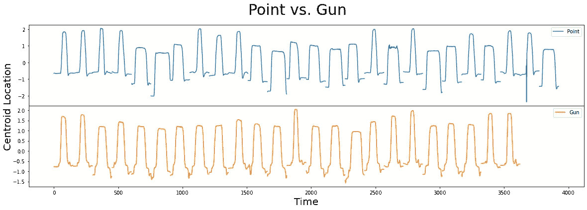
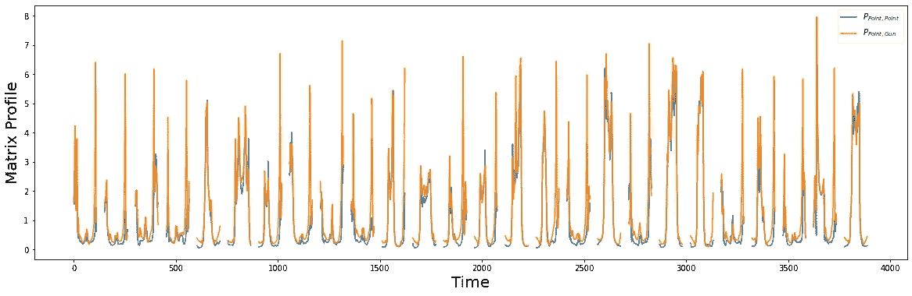
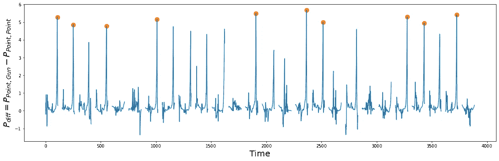
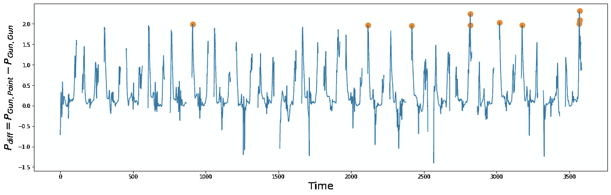
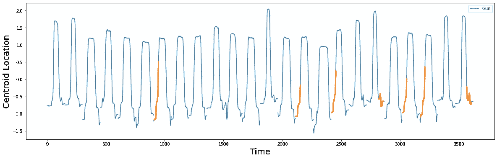

# 第 12 部分:机器学习的矩阵轮廓

> 原文：<https://towardsdatascience.com/part-12-matrix-profiles-for-machine-learning-2dfd98d7ff3f>

## 在 STUMPY 发现 Shapelet


(图片由 [Jason Leung](https://unsplash.com/@ninjason) 提供)

# 整体大于部分之和


(图片由作者提供)

[STUMPY 是一个强大且可扩展的 Python 库，用于现代时间序列分析](https://github.com/TDAmeritrade/stumpy)，在其核心，有效地计算出一种叫做*矩阵轮廓*的东西。这个多部分系列的目标是解释什么是 matrix profile，以及如何开始利用 [STUMPY](https://stumpy.readthedocs.io/en/latest/) 完成所有现代时间序列数据挖掘任务！

*注:这些教程最初出现在* [*STUMPY 文档*](https://stumpy.readthedocs.io/en/latest/tutorials.html) *中。*

第 1 部分:[矩阵轮廓图](/the-matrix-profile-e4a679269692)
第 2 部分: [STUMPY 基础知识](/stumpy-basics-21844a2d2d92)
第 3 部分:[时间序列链](/part-3-time-series-chains-da281450abbf)
第 4 部分:[语义分割](/part-4-semantic-segmentation-b42c3792833d)
第 5 部分:[用 STUMPY 快速近似矩阵轮廓图](/part-5-fast-approximate-matrix-profiles-with-scrump-c6d9c984c560)
第 6 部分:[用于流式时间序列数据的矩阵轮廓图](/matrix-profiles-for-streaming-time-series-data-f877ff6f9eef)
第 7 部分:[用 STUMPY 快速模式搜索](/part-7-fast-pattern-searching-with-stumpy-2baf610a8de1) 10: [发现多维时间序列模体](/part-10-discovering-multidimensional-time-series-motifs-45da53b594bb)
第 11 部分:[用户引导的模体搜索](/part-11-user-guided-motif-search-d3d317caf9ea)
第 12 部分:[机器学习的矩阵轮廓](/part-12-matrix-profiles-for-machine-learning-2dfd98d7ff3f)

# Shapelet 发现

本教程探讨了来自研究论文的“Shapelet Discovery”案例研究:[时间序列数据挖掘的瑞士军刀:你可以用矩阵概要和十行代码做的十件有用的事情】](https://www.cs.ucr.edu/~eamonn/Top_Ten_Things_Matrix_Profile.pdf)(见 3.7 节)。此外，您可能想要参考[矩阵概要 I](https://www.cs.ucr.edu/~eamonn/PID4481997_extend_Matrix%20Profile_I.pdf) 和[时间序列 Shapelets:一种新的数据挖掘原语](https://www.cs.ucr.edu/~eamonn/shaplet.pdf)论文以获得更多信息和其他相关示例。

# 什么是 Shapelet？

非正式地，时间序列“shapelets”是时间序列子序列，在某种意义上，它最大限度地代表了一个类。例如，想象一下，如果您有一个时间序列来跟踪您家中大型电器五年来每秒钟的耗电量。每次你运行干衣机、洗碗机或空调时，你的电表都会记录消耗的电力，只需查看时间序列，你就可以将电力消耗“特征”(即形状、持续时间、最大能源使用量等)与每台设备关联起来。这些模式可能显而易见，也可能很微妙，正是它们独特的“成形”时序子序列让您能够区分每个电器类别。因此，这些所谓的 shapelet 可用于对包含 shape let 出现的未标记时间序列进行分类。如果这听起来有点行话，不要担心，因为通过下面的例子，一切都会变得更清楚。

最近的研究(见上文)表明，矩阵配置文件可以用来有效地识别特定类的 shape let，因此，在本教程中，我们将建立在我们的矩阵配置文件知识之上，并演示如何使用 STUMPY 轻松地发现有趣的 shape let，只需几行额外的代码。

# 入门指南

让我们导入加载、分析和绘制数据所需的包，然后构建简单的决策树模型。

```
**%**matplotlib inline**import** stumpy
**import** pandas **as** pd
**import** numpy **as** np
**import** matplotlib.pyplot **as** plt
**from** sklearn **import** tree
**from** sklearn **import** metricsplt.style.use('https://raw.githubusercontent.com/TDAmeritrade/stumpy/main/docs/stumpy.mplstyle')
```

# 加载枪口数据集

该数据集是一个运动捕捉时间序列，用于跟踪演员右手的运动，包含两个类:

> `1\. Gun`
> 
> `2\. Point`

在`Gun`类中，演员从臀部安装的枪套中取出一把实体枪，将枪对准目标大约一秒钟，然后将枪放回枪套，并将手放松到身体两侧。在`Point`类中，演员将枪放在身体两侧，相反，他们将食指指向目标(即没有枪)大约一秒钟，然后将手放回身体两侧。对于这两个类，演员的右手质心被跟踪，以代表其运动。

下面，我们将检索原始数据，将它们分成`gun_df`和`point_df`，然后，对于每个相应的类，将所有单独的样本连接成一个长时间序列。此外，我们通过在每个样本后附加一个`NaN`值，为每个样本建立一个清晰的边界(即样本开始和结束的地方)。这有助于确保所有矩阵分布计算不会返回跨越多个样本的人为子序列:

```
train_df **=** pd.read_csv("https://zenodo.org/record/4281349/files/gun_point_train_data.csv?download=1")gun_df **=** train_df[train_df['0'] **==** 0].iloc[:, 1:].reset_index(drop**=True**)gun_df **=** (gun_df.assign(NaN**=**np.nan)
                .stack(dropna**=False**)
                .to_frame()
                .reset_index(drop**=True**)
                .rename({0: "Centroid Location"}, axis**=**'columns')
)point_df **=** train_df[train_df['0'] **==** 1].iloc[:, 1:].reset_index(drop**=True**)point_df **=** (point_df.assign(NaN**=**np.nan)
                   .stack(dropna**=False**)
                   .to_frame()
                   .reset_index(drop**=True**)
                   .rename({0: "Centroid Location"}, axis**=**'columns')
)
```

# 可视化枪口数据集

接下来，让我们绘制我们的数据，并想象没有枪时和有枪时的运动差异:

```
fig, axs **=** plt.subplots(2, sharex**=True**, gridspec_kw**=**{'hspace': 0})
plt.suptitle('Point vs. Gun', fontsize**=**'30')
plt.xlabel('Time', fontsize **=**'20')
fig.text(0.09, 0.5, 'Centroid Location', va**=**'center', rotation**=**'vertical', fontsize**=**'20')axs[0].plot(point_df, label**=**"Point")
axs[0].legend()
axs[1].plot(gun_df, color**=**"C1", label**=**"Gun")
axs[1].legend()
plt.show()
```



(图片由作者提供)

在这个数据集中，您将看到`Point`和`Gun`分别有 26 个和 24 个样本。这两个类都包含窄/宽样本和垂直移动的质心位置，这使得区分它们具有挑战性。您是否能够识别出`Point`和`Gun`之间的任何细微差异(即 shapelets ),从而帮助您区分这两个类别？

事实证明，矩阵轮廓可能有助于我们自动识别潜在的形状！

# 使用矩阵轮廓查找候选 Shapelets

回想一下我们的[寻找跨两个时间序列的保守模式教程](https://stumpy.readthedocs.io/en/latest/Tutorial_AB_Joins.html)，从单个时间序列𝑇𝐴计算的矩阵分布图𝑃𝐴𝐴被称为“自连接”,它允许你识别𝑇𝐴.内的保守子序列然而，通过两个不同的时间序列(𝑇𝐴和𝑇𝐵)计算的矩阵分布图(𝑃𝐴𝐵)通常被称为“AB-join”。本质上，AB-join 将𝑇𝐴的所有子序列与𝑇𝐵的所有子序列进行比较，以确定𝑇𝐴的任何子序列是否也能在𝑇𝐵.找到换句话说，产生的矩阵轮廓，𝑃𝐴𝐵，用它在𝑇𝐵.的最佳匹配子序列来注释在𝑇𝐴的每个子序列相比之下，如果我们交换时间序列并计算𝑃𝐵𝐴(即“BA-join”)，那么这会用𝑇𝐴.的最近邻子序列来注释𝑇𝐵的每个子序列

根据 [Matrix Profile I](https://www.cs.ucr.edu/~eamonn/PID4481997_extend_Matrix%20Profile_I.pdf) 论文的 h 部分，声称我们可以利用 Matrix Profile 来试探性地“建议”候选 shape let，并且主要直觉是，如果在`Gun`类中存在区别性图案，而在`Point`类中不存在区别性图案(反之亦然)，那么我们将期望在它们相应的𝑃(𝑃𝑜𝑖𝑛𝑡,𝑃𝑜𝑖𝑛t)- 𝑃(𝑃𝑜𝑖𝑛𝑡,𝐺𝑢𝑛(或𝑃(𝐺𝑢𝑛,𝐺𝑢n)- 𝑃(𝐺𝑢𝑛,𝑃𝑜𝑖𝑛t)矩阵 Profile 中看到一个或多个“凸起”，并且高度上的任何显著差异可能是良好候选 shape let 的强有力指示。

因此，首先，让我们计算矩阵轮廓，𝑃(𝑃𝑜𝑖𝑛𝑡,𝑃𝑜𝑖𝑛t(自连接)和𝑃(𝑃𝑜𝑖𝑛𝑡,𝐺𝑢n(a B-连接)，并且，为了简单起见，我们使用子序列长度`m = 38`，这是为该数据集报告的最佳 shapelet [的长度:](https://www.cs.ucr.edu/~eamonn/shaplet.pdf)

```
m **=** 38P_Point_Point **=** stumpy.stump(point_df["Centroid Location"], m)[:, 0].astype(float)P_Point_Gun **=** stumpy.stump(
    point_df["Centroid Location"], 
    m, 
    gun_df["Centroid Location"], 
    ignore_trivial**=False** )[:, 0].astype(float)
```

由于我们的时间序列中有一些`np.nan`值，矩阵配置文件的输出将包含几个`np.inf`值。因此，我们将通过将其转换为`np.nan`来手动调整:

```
P_Point_Point[P_Point_Point **==** np.inf] **=** np.nan
P_Point_Gun[P_Point_Gun **==** np.inf] **=** np.nan
```

现在我们将它们一个叠一个地绘制出来:

```
plt.plot(P_Point_Point, label**=**"$P_{Point,Point}$")
plt.plot(P_Point_Gun, color**=**"C1", label**=**"$P_{Point,Gun}$")
plt.xlabel("Time", fontsize**=**"20")
plt.ylabel("Matrix Profile", fontsize**=**"20")
plt.legend()
plt.show()
```



(图片由作者提供)

接下来，我们可以通过绘制𝑃(𝑃𝑜𝑖𝑛𝑡,𝑃𝑜𝑖𝑛t 和𝑃(𝑃𝑜𝑖𝑛𝑡,𝐺𝑢n).之间的差异来突出两个矩阵图之间的主要偏差直觉上，𝑃(𝑃𝑜𝑖𝑛𝑡,𝑃𝑜𝑖𝑛t)将比𝑃(𝑃𝑜𝑖𝑛𝑡,𝐺𝑢n)小，因为我们期望同一类中的子序列比不同类中的子序列更相似:

```
P_diff **=** P_Point_Gun **-** P_Point_Point
idx **=** np.argpartition(np.nan_to_num(P_diff), **-**10)[**-**10:]  *# get the top 10 peak locations in P_diff* plt.suptitle("", fontsize**=**"30")
plt.xlabel("Time", fontsize**=**"20")
plt.ylabel("$P_{diff} = P_{Point,Gun} - P_{Point, Point}$", fontsize**=**"20")
plt.plot(idx, P_diff[idx], color**=**"C1", marker**=**"o", linewidth**=**0, markersize**=**10)
plt.plot(P_diff)
plt.show()
```



(图片由作者提供)

𝑃_𝑑𝑖𝑓𝑓(橙色圆圈)中的峰值是良好 shapelet 候选者的指标，因为它们暗示了在它们自己的类(即，𝑃(𝑃𝑜𝑖𝑛𝑡,𝑃𝑜𝑖𝑛t 自连接)中非常保守的模式，但是也与它们在另一类(即，𝑃(𝑃𝑜𝑖𝑛𝑡,𝐺𝑢n a B-连接)中最接近的匹配非常不同。有了这些知识，让我们提取发现的 shapelets，然后绘制它们:

```
point_shapelets **=** []
**for** i **in** idx:
    shapelet **=** point_df.iloc[i : i **+** m, 0]
    point_shapelets.append(shapelet)plt.xlabel("Time", fontsize**=**"20")
plt.ylabel('Centroid Location', fontsize**=**'20')
plt.plot(point_df, label**=**"Point")**for** i, shapelet **in** zip(idx, point_shapelets):
    plt.plot(range(i, i **+** m), shapelet, color**=**"C1", linewidth**=**3.0)plt.legend()
plt.show()
```


(图片由作者提供)

基于这些候选形状(橙色)，似乎这两个类别之间的主要区别因素在于演员的手如何将(假想的)枪放回枪套，然后在演员身边放松。根据原作者的说法,`Point`类“有一个‘下降’,演员将手放在身体两侧，这是惯性使她的手有点太远，她被迫纠正这一点——作者将这一现象称为“过度”。

# 构建一个简单的分类器

现在我们已经确定了 10 个候选 shape let，让我们基于这些 shape let 构建 10 个独立的决策树模型，看看它们能在多大程度上帮助我们区分`Point`类和`Gun`类。幸运的是，这个数据集包括一个训练集(如上)和一个独立的测试集，我们可以用它们来评估我们的模型的准确性:

```
test_df **=** df **=** pd.read_csv("https://zenodo.org/record/4281349/files/gun_point_test_data.csv?download=1")*# Get the train and test targets* y_train **=** train_df.iloc[:, 0]
y_test **=** test_df.iloc[:, 0]
```

现在，对于我们的分类任务，需要评估每个 shapelets 的预测能力。因此，我们首先计算 shapelet 和每个时间序列或样本中的每个子序列之间的距离轮廓(成对欧几里德距离)。然后，保持最小值，以了解是否在时间序列中找到了 shapelet 的紧密匹配。`stumpy.mass`功能非常适合这项任务:

```
**def** distance_to_shapelet(data, shapelet):
    """
    Compute the minimum distance beteen each data sample
    and a shapelet of interest
    """
    data **=** np.asarray(data)
    X **=** np.empty(len(data))
    **for** i **in** range(len(data)):
        D **=** stumpy.mass(shapelet, data[i])
        X[i] **=** D.min() **return** X.reshape(**-**1, 1)clf **=** tree.DecisionTreeClassifier()
**for** i, shapelet **in** enumerate(point_shapelets):
    X_train **=** distance_to_shapelet(train_df.iloc[:, 1:], shapelet)
    X_test **=** distance_to_shapelet(test_df.iloc[:, 1:], shapelet)
    clf.fit(X_train, y_train)
    y_pred **=** clf.predict(X_test.reshape(**-**1, 1))
    print(f"Accuracy for shapelet {i} = {round(metrics.accuracy_score(y_test, y_pred), 3)}")Accuracy for shapelet 0 = 0.867
Accuracy for shapelet 1 = 0.833
Accuracy for shapelet 2 = 0.807
Accuracy for shapelet 3 = 0.833
Accuracy for shapelet 4 = 0.933
Accuracy for shapelet 5 = 0.873
Accuracy for shapelet 6 = 0.873
Accuracy for shapelet 7 = 0.833
Accuracy for shapelet 8 = 0.86
Accuracy for shapelet 9 = 0.913
```

正如我们所看到的，所有的 Shapelet 都提供了一些合理的预测能力，有助于区分`Point`和`Gun`类，但 Shapelet 4 返回了 93.3%的最佳准确度，该结果准确地再现了[发布的结果](https://www.cs.ucr.edu/~eamonn/Top_Ten_Things_Matrix_Profile.pdf)。太好了！

# 附加部分—第二类的 Shapelets

作为额外的一点，我们还将从`Gun`时间序列中提取 shapelets，看看它们是否能为我们的模型增加任何额外的预测能力。该过程与我们在上面解释过的过程相同，只是我们关注的是从`gun_df`派生的 shapelets，所以我们在这里不打算进行过多的描述:

```
m **=** 38P_Gun_Gun **=** stumpy.stump(gun_df["Centroid Location"], m)[:, 0].astype(float)
P_Gun_Point **=** stumpy.stump(gun_df["Centroid Location"], m, point_df["Centroid Location"], ignore_trivial**=False**)[:, 0].astype(float)P_Gun_Gun[P_Gun_Gun **==** np.inf] **=** np.nan
P_Gun_Point[P_Gun_Point **==** np.inf] **=** np.nan
P_diff **=** P_Gun_Point **-** P_Gun_Gun
idx **=** np.argpartition(np.nan_to_num(P_diff), **-**10)[**-**10:]  *# get the top 10 peak locations in P_diff* plt.suptitle("", fontsize**=**"30")
plt.xlabel("Time", fontsize**=**"20")
plt.ylabel("$P_{diff} = P_{Gun, Point} - P_{Gun, Gun}$", fontsize**=**"20")
plt.plot(idx, P_diff[idx], color**=**"C1", marker**=**"o", linewidth**=**0, markersize**=**10)
plt.plot(P_diff)
plt.show()
```



(图片由作者提供)

```
gun_shapelets **=** []**for** i **in** idx:
    shapelet **=** gun_df.iloc[i : i **+** m, 0]
    gun_shapelets.append(shapelet)
plt.xlabel("Time", fontsize**=**"20")
plt.ylabel('Centroid Location', fontsize**=**'20')
plt.plot(gun_df, label**=**"Gun")**for** i, shapelet **in** zip(idx, gun_shapelets):
    plt.plot(range(i, i **+** m), shapelet, color**=**"C1", linewidth**=**3.0)plt.legend()
plt.show()
```



(图片由作者提供)

请注意，当存在物理枪时，在`Gun`绘制动作开始时发现的 shapelets 不像`Point`样本那样平滑。同样，给`Gun`重新装上枪套似乎也需要一点微调。

最后，我们构建我们的模型，但是这一次，我们结合了来自`Gun`shape let 和`Point`shape let 的距离特征:

```
clf **=** tree.DecisionTreeClassifier()
**for** i, (gun_shapelet, point_shapelet) **in** numerate(zip(gun_shapelets, point_shapelets)):
    X_train_gun **=** distance_to_shapelet(train_df.iloc[:, 1:], gun_shapelet)
    X_train_point **=** distance_to_shapelet(train_df.iloc[:, 1:], point_shapelet)
    X_train **=** np.concatenate((X_train_gun, X_train_point), axis**=**1)
    X_test_gun **=** distance_to_shapelet(test_df.iloc[:, 1:], gun_shapelet)
    X_test_point **=** distance_to_shapelet(test_df.iloc[:, 1:], point_shapelet)
    X_test **=** np.concatenate((X_test_gun, X_test_point), axis**=**1)
    clf.fit(X_train, y_train)
    y_pred **=** clf.predict(X_test)
    print(f"Accuracy for shapelet {i} = {round(metrics.accuracy_score(y_test, y_pred), 3)}")Accuracy for shapelet 0 = 0.913
Accuracy for shapelet 1 = 0.853
Accuracy for shapelet 2 = 0.813
Accuracy for shapelet 3 = 0.953
Accuracy for shapelet 4 = 0.933
Accuracy for shapelet 5 = 0.94
Accuracy for shapelet 6 = 0.873
Accuracy for shapelet 7 = 0.867
Accuracy for shapelet 8 = 0.867
Accuracy for shapelet 9 = 0.913
```

我们可以看到，如果我们包括来自`Gun`类 Shapelet 和`Point`类 shape let 的距离，分类器达到 95.3%的准确度(Shapelet 3)！显然，添加与第二类的距离也为模型提供了额外的有用信息。这是一个很好的结果，因为它将结果提高了大约 2%。同样，令人印象深刻的是，所有这些信息都可以通过利用矩阵配置文件“免费”提取。

# 摘要

就是这样！您刚刚学习了如何利用矩阵配置文件来查找 shapelets，并使用它们来构建机器学习分类器。

# 参考

[时间序列数据挖掘的瑞士军刀:矩阵概要和十行代码可以做的十件有用的事情](https://www.cs.ucr.edu/~eamonn/Top_Ten_Things_Matrix_Profile.pdf)(参见第 3.7 节)
[时间序列 Shapelets:数据挖掘的新原语](https://www.cs.ucr.edu/~eamonn/shaplet.pdf)
[STUMPY 文档](https://stumpy.readthedocs.io/en/latest/)
[STUMPY 矩阵概要 Github 代码库](https://github.com/TDAmeritrade/stumpy)

## ← [第 11 部分:用户导向的主题搜索](https://medium.com/p/d3d317caf9ea#92dc-ad9c13147b05) |第 13 部分即将推出→