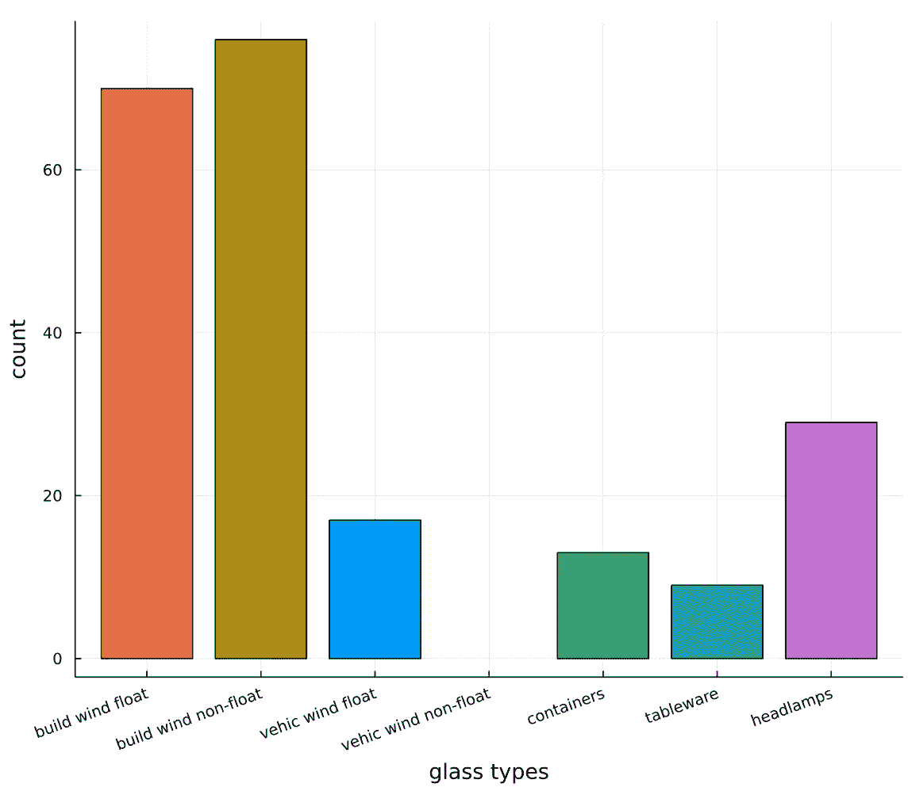
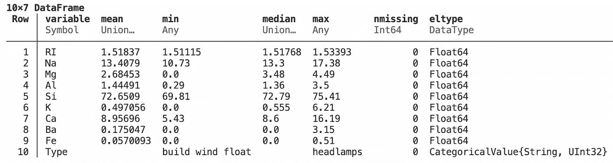
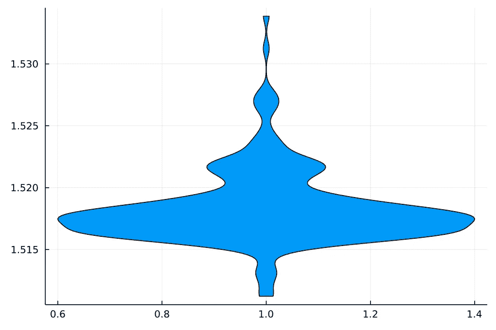
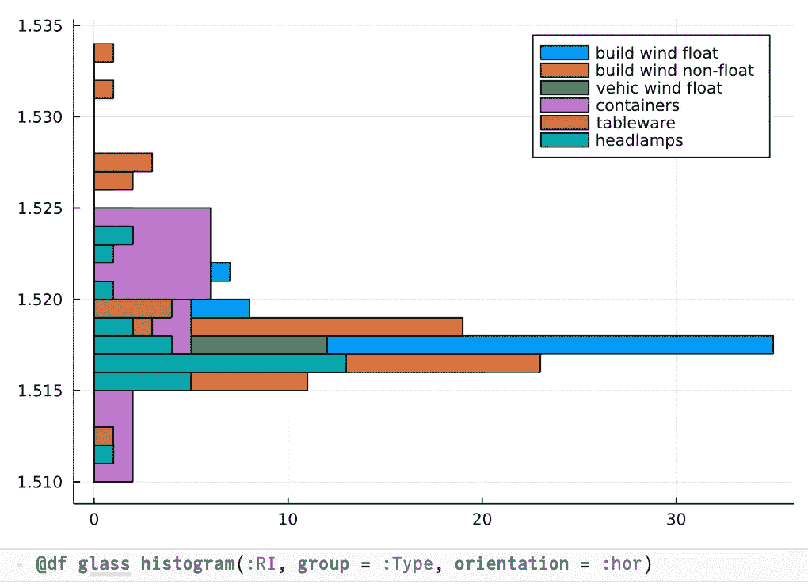
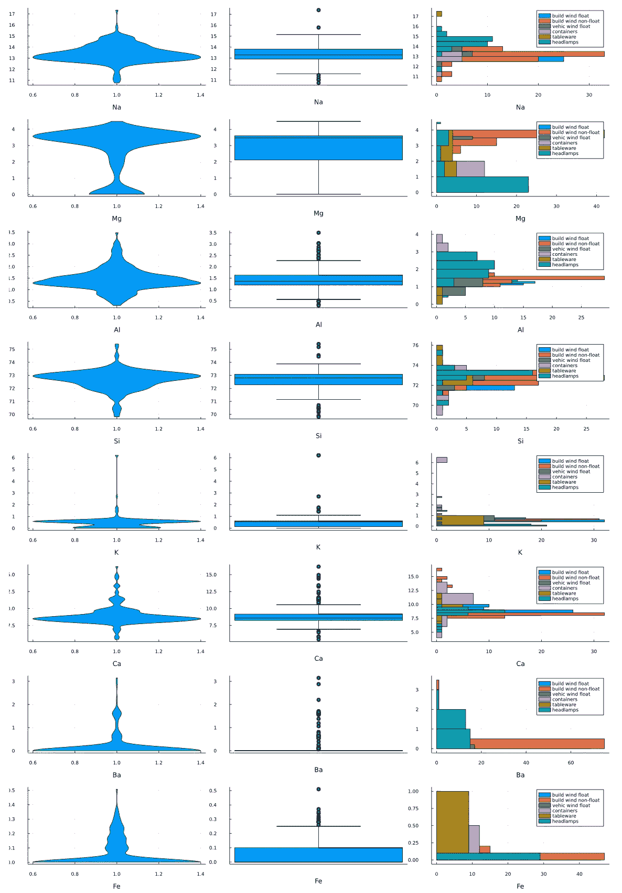
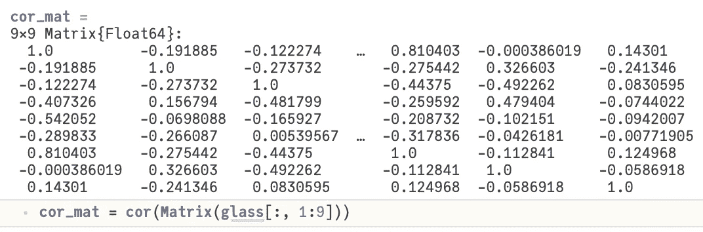
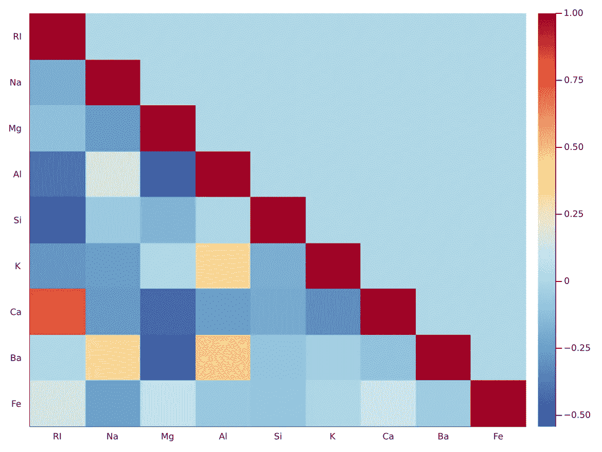
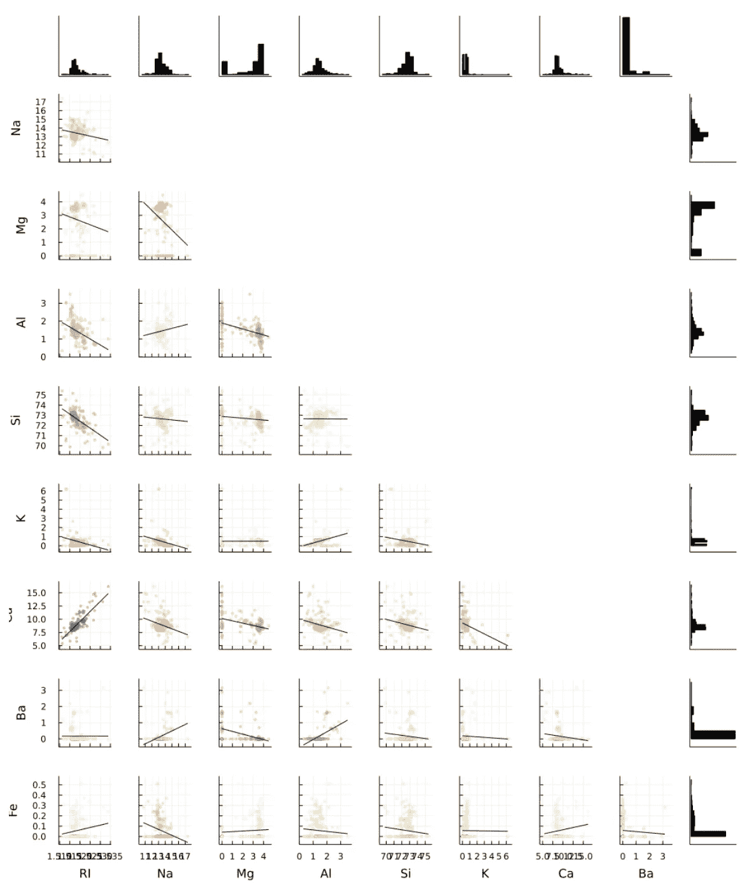

# 分析玻璃数据集—第 1 部分

> 原文：<https://towardsdatascience.com/part-i-analyzing-the-glass-dataset-c556788a496f>

## 使用 Julia 及其生态系统的机器学习

## Julia 很快，可以像解释语言一样使用，具有高度的可组合性，但不是面向对象的。它有一个快速增长的生态系统，可以帮助典型的 ML 工作流程的所有方面。


罗宾·范·德·普洛格在 Unsplash 上拍摄的照片

# 教程概述

这是教程的第一部分，展示了 Julia 的特定语言特性和它的生态系统中的各种高质量的包是如何在一个典型的 ML 工作流中方便地结合使用的。

*   第一部分"*分析玻璃数据集"*集中于如何使用`ScientificTypes`、`DataFrames`、`StatsBase`和`StatsPlots`等软件包对数据进行预处理、分析和可视化。
*   第二部分"*使用决策树"*关注 ML 工作流的核心:如何选择模型，以及如何使用它进行训练、预测和评估。这部分主要靠包`MLJ`(=**M**achine**L**in**J**ulia*)*收入。
*   第三部分“*如果事情还没有‘准备好使用’*”解释了如果可用的包没有提供您需要的所有功能，那么用几行代码创建您自己的解决方案是多么容易。

# 介绍

每一个 ML 工作流都从分析和预处理用于训练模型的数据开始。这些最初的步骤包括理解数据来自的应用领域内的数据、检查数据质量和识别其统计属性(使用可视化和统计测量)。

在本教程中，我们将使用“玻璃”数据集。这是一个用于教育目的的数据集。它带有 [Weka](https://www.cs.waikato.ac.nz/ml/weka/index.html) 工具包，可以从不同的网站下载(例如[这里](https://storm.cis.fordham.edu/~gweiss/data-mining/datasets.html))。该数据集的特征包含关于不同玻璃变体的信息(如用于其生产的材料和光学特征)，目标变量是产生的玻璃变体(见下文摘录)。

“玻璃”数据集中的几行

数据以一种叫做 [ARFF(属性-关系文件格式)](https://waikato.github.io/weka-wiki/formats_and_processing/arff_stable/)的文件格式出现；Weka 工具包使用的一种格式。因此，我们需要一个 Julia 包，它具有读取这种格式的功能:`ARFFFiles.jl`。因为我们想将数据转换成一个`DataFrame`以供进一步使用，所以也需要包`DataFrames.jl`。`ScientificTypes.jl`用特定于 ML 的特性扩充了标准的 Julia 类型，最后但同样重要的是，我们需要`Downloads.jl`包来实现从网站下载数据的功能。

因此，使用这些包、从上述网站下载数据、从磁盘读取数据并将其转换为`DataFrame`(并使用`ScientificTypes`)的代码如下所示:

加载“玻璃”数据集并创建“数据框架”

# 数据集的第一个概述

为了对数据集有一个初步的了解，我们从中获取一些基本信息:

*   `sz = size(glass)`给出了尺寸:`(214, 10)`，即它有 214 行 10 列。
*   通过`col_names = names(glass)`，我们得到了`DataFrame`的列名:

```
10-element Vector{String}: 
“RI”, “Na”, “Mg”, “Al”, “Si”, “K”, “Ca”, “Ba”, “Fe”, “Type”
```

*   而`schema(glass)`(来自`ScientificTypes`)给出了所有列的数据类型。`types`是 Julia 数据类型，而`scitypes`是由`ScientificTypes`引入的抽象层次。这里我们可以看到所有的特征都是`Continuous`，目标变量是一个标称值(有七个不同的条目)。

```
schema(glass) -->
┌───────┬───────────────┬──────────────────────────────────┐
│ names │ scitypes      │ types                            │
├───────┼───────────────┼──────────────────────────────────┤
│ RI    │ Continuous    │ Float64                          │
│ Na    │ Continuous    │ Float64                          │
│ Mg    │ Continuous    │ Float64                          │
│ Al    │ Continuous    │ Float64                          │
│ Si    │ Continuous    │ Float64                          │
│ K     │ Continuous    │ Float64                          │
│ Ca    │ Continuous    │ Float64                          │
│ Ba    │ Continuous    │ Float64                          │
│ Fe    │ Continuous    │ Float64                          │
│ Type  │ Multiclass{7} │ CategoricalValue{String, UInt32} │
└───────┴───────────────┴──────────────────────────────────┘
```

# 目标变量

现在让我们仔细看看目标变量的特征。`glass_types = unique(glass.Type)`给出了来自`Type`列的唯一值列表:

```
6-element Vector{String}:
 “build wind float”
 “vehic wind float”
 “tableware”
 “build wind non-float”
 “headlamps”
 “containers”
```

因此，我们假设数据集中有 6 种不同的玻璃类型。但这只是事实的一部分。使用`ScientificTypes`中的`levels(glass.Type)`显示实际上有 7 种不同的玻璃类型:

```
7-element Vector{String}:
 “build wind float”
 “build wind non-float”
 “vehic wind float”
 “vehic wind non-float”
 “containers”
 “tableware”
 “headlamps”
```

其中只有 6 个出现在玻璃数据集中(计数> 0)。类型*‘车辆风非浮动’*不出现。关于它的存在的知识被储存在 ARFF 档案中，并被`ScientificTypes`建立的类型系统保留下来。在这个例子中，我们可以看到使用这种类型系统的附加价值，而不是仅仅依赖语言的本机类型系统(在这个例子中，这可能会欺骗我们)。

在下一步中，对`countmap`(来自`StatsBase`)的调用告诉我们，这些类型在目标变量中出现的频率。因此，我们对它们的分布有了一些了解:用于建筑物窗户的玻璃变体是最常见的类型，其次是用于前照灯的玻璃类型:

```
type_count = countmap(glass.Type) -->Dict{CategoricalArrays.CategoricalValue{String, UInt32}, Int64} with 6 entries:
 “vehic wind float” => 17
 “tableware” => 9
 “build wind non-float” => 76
 “build wind float” => 70
 “headlamps” => 29
 “containers” => 13
```

一个图表当然比一系列数字更能提供信息。因此，让我们使用`Plots`包中的条形图来可视化它:

```
bar(type_count, group = glass_types, legend = false,
 xlabel = “glass types”, xrotation = 20,
 ylabel = “count”)
```



不同玻璃类型的出现频率[图片由作者提供]

这里我们也注意到，来自`ScientifcTypes` 的额外信息已经被使用，因此显示*“车辆风非浮动”*的计数为零。

# 详细的功能

现在来看特征变量:第一个特征 *RI* 是所谓的[折射率](https://en.wikipedia.org/wiki/Refractive_index)，这是一种光学特性，它告诉我们光穿过材料的速度。其他特征给出了不同元素的百分比，如钠(=拉丁文 **Na** trium)、镁( **Mg** 或**Al**umi um)，这些元素被用于生产玻璃。

## 价值观是否合理？

我们先从技术角度检查一下这些特性的值是否合理。从`DataFrames`到`describe`的调用给了我们一个关于数据集中值的范围的印象:



通过“描述(玻璃)”获得的统计特征

*   *RI* 在 1.5 左右略有变化。从上面提到的维基百科页面，我们了解到不同种类玻璃的典型 RI 值在 1.49 … 1.69 之间。因此,“glass”数据集中的 *RI* 值似乎相当合理。
*   其他特征是百分比。也就是说，它们必须在 0 … 100 的范围内，这适用于我们的数据。
*   硅是玻璃中最重要的成分(这里> 70%)，其次是钠和钙。

我们可以对百分比再做一次质量检查。每种玻璃成分的总和应为 100%。我们使用来自`DataFrames`的`transform`函数，并在每一行中添加特性 *Na* … *Fe* 的所有值。结果存储在一个名为`sumpct`的新列中:

```
glass_wsum = transform(glass, 
                  Between(:Na, :Fe) => ByRow(+) => :sumpct)
```

查看这一新列并使用`StatsBase`中的`maximum`和`minimum`函数，可以发现大多数行的总和并不完全是 100%,但是它们在该值附近有很小的变化。这可以用测量和舍入误差来解释。所以对我们来说没问题。

```
maximum(glass_wsum.sumpct), minimum(glass_wsum.sumpct) --->(100.09999999999998, 99.02)
```

## 统计和可视化

由于所有特征属性都是`Continuous`类型，因此可以计算一些统计数据，并绘制它们的分布图，以获得更多的洞察力。

**峰度&偏斜度**

为了初步了解实值变量的分布，计算两个度量值[](https://en.wikipedia.org/wiki/Kurtosis)*和 [*偏斜度*](https://en.wikipedia.org/wiki/Skewness) 。*

*   *偏斜度是对分布的对称性(或者说不对称性)的一种度量。负值表示它的左尾巴更长(相当平)，质量集中在右边。我们称之为*左偏*或左尾分布。另一方面，正值表示*右偏*分布。*
*   *峰度是对分布“尾部”的一种度量。它显示了尾巴向左或向右伸出的距离。正态分布的峰度为 3。因此，通常将其他分布的峰度与该值进行比较，并计算出所谓的*过度峰度*。它表示所考虑的分布的峰度超过正态分布的峰度多少。这也是我们从`StatsBase`包的`kurtosis`函数中得到的值。*

*以下表达式为“glass”数据集的所有要素创建了这些测量值的列表:*

```
*[(atr, skewness(glass[:, atr]), kurtosis(glass[:, atr])) 
    for atr in col_names[1:end-1]]*
```

*像这样的表达在 Julia 中被称为“理解”。这是一个数组，它的初始值是通过迭代计算的。`for atr in col_names[1:end-1]`遍历`glass`的列名(从第一个到倒数第二个)。对于每个列名(`atr`)，它创建一个包含三个元素的元组:列名`atr`本身以及该列的偏度(`skewness(glass[:, atr])`)和峰度(`kurtosis(glass[:, atr])`)，从而创建以下输出:*

```
*9-element Vector{Tuple{String, Float64, Float64}}:
 (“RI”, 1.6140150456617635, 4.7893542254570605)
 (“Na”, 0.4509917200116131, 2.953476583500219)
 (“Mg”, -1.1444648495986702, -0.42870155798810883)
 (“Al”, 0.9009178781425262, 1.9848317746238253)
 (“Si”, -0.7253172664513224, 2.8711045971453464)
 (“K”, 6.505635834012889, 53.392326556204665)
 (“Ca”, 2.0326773755262484, 6.498967959876067)
 (“Ba”, 3.392430889440864, 12.222071204852575)
 (“Fe”, 1.7420067617989456, 2.5723175586721645)*
```

*从这些图中我们已经可以看出，例如， *K* 和 *Ba* 的分布是非对称和长尾的。但是在大多数情况下，如果我们将分布可视化，我们会得到更多的见解。*

***功能*RI****

*先说特征 *RI* 。violin plot 可以使用`StatsPlots`包中的`violin`函数创建，它很好地展示了它的分布情况。`violin(glass.RI, legend = false)`产生以下情节:*

**

*特征 RI 的分布[图片由作者提供]*

*直方图的条形根据目标值着色，还显示了特征值和最终玻璃类型之间的关系。为此，我们可以使用`histogram`函数(同样来自`StatsPlots`；参见图表下方的 Julia 代码):*

**

*RI 值直方图，按玻璃类型分组[图片由作者提供]*

***特色*娜*……*菲****

*我们可以对剩下的特征 *Na* … *Fe* 做同样的处理。描绘分布的小提琴图的一个很好的替代方案是*箱线图*。有时小提琴图给人更多的洞察力，有时箱线图。所以我们最好两者都创造出来。如果我们并排绘制每个特征的所有三种图表类型，我们可以很容易地对它们进行比较，从而得到以下图表网格:*

**

*小提琴图、箱线图和直方图的特征 Na…Fe[图片由作者提供]*

*用于生成该绘图网格的 Julia 代码如下所示:*

*前三行具有相似的结构:每一行创建一个图表数组(首先是小提琴，然后是箱线图，最后是直方图)。同样，我们使用“理解”来达到这个目的:我们从 2 到 9 进行迭代，因为我们想要一个图来表示`glass`数据帧的第 2 到 9 列。对于这些列中的每一列，我们用适当的参数创建各自的图表(与我们在上面对特征 *RI* 所做的方式相同)(每个图表获得例如特征名称作为其`xlabel`)。*

*`plot`功能(绘制整个网格；第 7 行)将一个子情节数组作为其参数，并根据`layout`参数将它们排列在一个网格中(这里是一个 8 x 3 的网格)。因此，我们必须应用以下步骤(第 5 行中的代码)创建一个适当的数组，该数组以正确的顺序包含子情节(即，对于每个素材，一个小提琴情节、一个箱线图和直方图):*

*   *`hcat`将三个数组`violins`、`boxes`和`histos`连接起来，从而创建一个 8 x 3 的绘图矩阵(每种类型的图表对应一列)*
*   *由于 Julia 矩阵是按列优先的顺序处理的，我们用`permutedims`切换维度，创建一个 3×8 矩阵(因此 *Na* 的三个图表在第一列，而 *Mg* 的图表在第二列，依此类推)*
*   *最后，我们必须使用`vec`将矩阵“展平”成一个数组(根据`plot`的需要)。*

***相关性***

*在处理数字属性时，知道它们是否相关以及相关程度如何总是很重要的，因为有些模型不太适合强相关的属性。*

*除此之外，两个属性之间的强相关性表明其中一个可能是多余的，因为它没有携带太多的附加信息。这些知识可用于减少特征的数量，从而使训练和评估模型的计算更加可行。*

**相关矩阵**

*函数`cor`(来自`StatsPlots)`)以矩阵的形式给出我们想要的信息，该矩阵具有每对特征的相关性(所谓的*相关性矩阵*):*

**

*像往常一样，可视化使数字更容易理解。在这种情况下，热图是合适的图表类型(我们使用来自`StatsPlots`的`heatmap` 创建)。由于相关矩阵是对称的，可视化它的下半部分就足够了(可以使用`LowerTriangular`从`LinearAlgebra`包中提取；见图表下方的 Julia 代码)。用于热图的色标`:tol_sunset`来自`ColorSchemes`包。*

**

*相关矩阵热图[图片由作者提供]*

```
*heatmap(LowerTriangular(cor_mat), yflip = true,
 seriescolor = :tol_sunset,
 xticks = (1:9, col_names[1:9]),
 yticks = (1:9, col_names[1:9]))*
```

*从热图(和关联矩阵)中可以看出，不同玻璃属性之间最强的正关联是:*

*   *Ca/RI → 0.810403*
*   *钡铝比→ 0.479404*
*   *钡/钠→ 0.326603*
*   *钾/铝→ 0.325958*

*…当我们看数字时，只有前两个是真正“强”的。*

*可以观察到明显的负相关性:*

*   *Si/RI = -0.542052*
*   *钡/镁= -0.492262*
*   *铝/镁= -0.481798*
*   *钙/镁= -0.443750*

**相关图和角图**

*下面的图更详细地展示了不同属性对之间的相关性:*

*   **关联图*在下半部分显示了散点图(每个散点图都有相应的 SD 线),在上半部分显示了热图。散点图以蓝色显示正相关，以红色显示负相关，以黄色显示中性相关。*
*   **角图*(此处为紧凑形式)显示了与图表下半部分的*相关图*相同的散点图。此外，它在顶部和右侧空白处显示每个属性的直方图。*

**

*“玻璃”特征的相关图[图片由作者提供]*

**

*“玻璃”特征的角图[图片由作者提供]*

*这些图都是用一行 Julia 代码使用`StatsPlots`中的函数创建的，如下所示:*

```
*[@df](http://twitter.com/df) glass corrplot(cols(1:9))
[@df](http://twitter.com/df) glass cornerplot(cols(1:9), compact = true)*
```

# *结论*

*上面的例子展示了如何仅仅使用几行代码来执行典型 ML 工作流的重要步骤。本教程的第二部分将继续这一旅程，重点关注训练、预测和评估等步骤。*

*不同 Julia 包的功能如何容易地组合，以及它们如何很好地一起工作，变得很清楚，即使它们是独立开发的。本教程的第三部分将解释这种可组合性的内部工作原理。敬请关注！*

*当然，这些例子只能触及表面。有关更多信息，请参见下面给出的资源。*

# *进一步的信息*

*   *在[Julia for Data Analysis and Beyond](https://www.youtube.com/user/PyDataTV)中，Stefan Karpinski(Julia 的创建者之一)解释了 Julia 的主要优势及其设计背后的基本原理。为什么朱丽亚在[？—*Tim Holy 对 Julia*](https://youtu.be/x4oi0IKf52w) 中编程的特性和优势进行了高度描述，您将获得同一主题的更深入的论述。*
*   *Bogumil Kaminski 教授在 JuliaCon 2021 上就数据帧进行了全面的[指导。他是这个包的主要作者。](https://www.youtube.com/watch?v=tJf24gfcSto)*
*   *Plots.jl 包的文档和教程可以在[这里](https://docs.juliaplots.org/stable/)找到。有几个[附加包，比如 StatsPlots.jl](https://docs.juliaplots.org/stable/ecosystem/#ecosystem) 。*