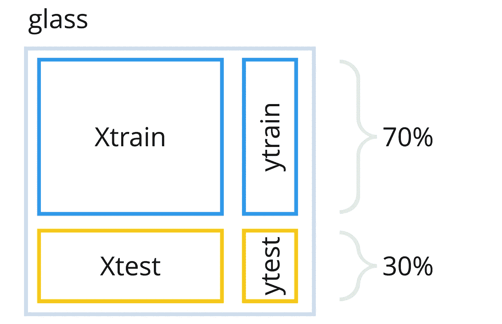
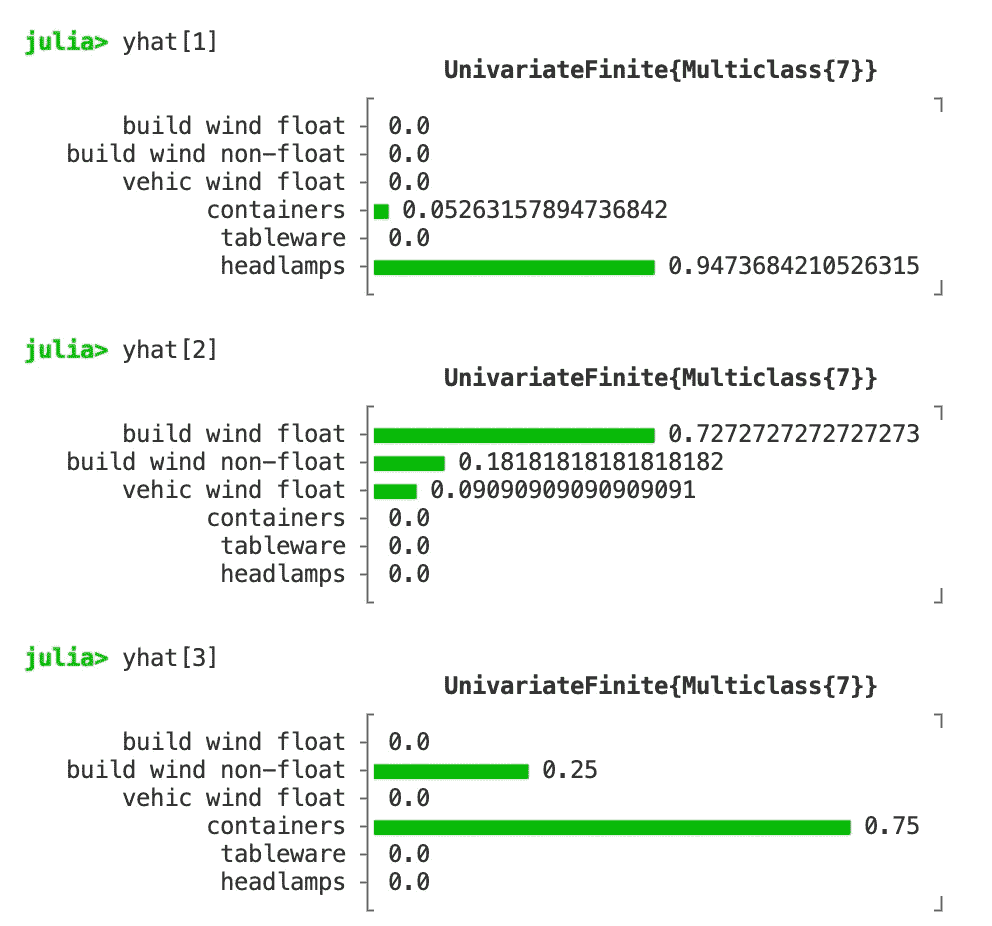

# 使用决策树—第 2 部分

> 原文：<https://towardsdatascience.com/part-ii-using-a-decision-tree-ddffa4004e47>

## 使用 Julia 及其生态系统的机器学习

## MLJ 是 Julia 中机器学习的元包。它的第一个版本在 2019 年才发布。因此，它的创造者可以在该领域现有软件包十多年经验的基础上再接再厉。


照片由[简·侯伯](https://unsplash.com/@jan_huber?utm_source=unsplash&utm_medium=referral&utm_content=creditCopyText)在 [Unsplash](https://unsplash.com/s/photos/tree?utm_source=unsplash&utm_medium=referral&utm_content=creditCopyText) 上拍摄

# 教程概述

这是本教程的第二部分，它展示了 Julia 的特定语言特性和来自其生态系统的各种高质量的包是如何在一个典型的 ML 工作流中轻松组合使用的。

*   [第一部分](/part-i-analyzing-the-glass-dataset-c556788a496f)“*分析玻璃数据集”*集中讲述如何使用`ScientificTypes`、`DataFrames`、`StatsBase`和`StatsPlots`等软件包对数据进行预处理、分析和可视化。
*   第二部分"*使用决策树"*关注 ML 工作流的核心:如何选择模型，以及如何使用它进行训练、预测和评估。这部分主要靠包`MLJ`(=**M**achine**L**in**J**ulia*)*收入。
*   第三部分“*如果事情还没有‘准备好使用’*”解释了如果可用的包没有提供您需要的所有功能，那么用几行代码创建您自己的解决方案是多么容易。

# 介绍

在本教程的第二部分中，机器学习算法将应用于“玻璃”数据集，我们在第一部分中对其进行了分析。

## MLJ——朱莉娅的机器学习

为此，我们使用`[MLJ](https://alan-turing-institute.github.io/MLJ.jl/dev/)`封装。它是一个所谓的元包，为选择、调整、评估、组合和比较大量的 ML 模型提供了一个通用的接口和通用的实用机制。在撰写本文时，它提供了 186 种型号。

MLJ 是伦敦图灵研究所与奥克兰大学以及其他科学和工业伙伴合作的一个项目。始于 2019 年。

## 接下来的步骤

使用 ML 算法通常包括以下步骤:

*   准备数据，以便获得用于培训和测试的适当结构。
*   选择适合给定数据并产生所需结果(例如分类或聚类)的适当模型。
*   用训练数据集训练选择的模型。
*   使用测试数据集评估所训练的模型。

我们将在下一节中应用这个(基本的)ML 工作流。这里我们假设我们的数据集存在于第一部分创建的`glass`数据框中。

# ML 工作流程

## 准备数据

几乎所有的 ML 模型都期望训练数据集是表格形式的。所以我们在第一部分中使用的`DataFrame`数据类型是一个很好的起点。

在我们的例子中，我们有一个所谓的分类问题:我们希望模型在给定一组值时预测正确的玻璃类型(即我们的特征 *RI* 和*Na*…*Ba*；独立属性)。将使用独立属性的数据以及每种情况下产生的相应玻璃类型来训练模型。这就是所谓的监督学习。

对于这种训练，我们需要表格形式的独立属性数据和单独列表中的结果类型(在列`Type`)。函数`unpack`完成这项工作。它将`glass`中的`DataFrame`拆分为这两个组件(`XGlass`和`yGlass`)。除此之外，它还使用一个随机数发生器对行进行洗牌，该随机数发生器用“种子”`rng = 123`进行初始化。

用`scitype`检查结果数据结构的科学类型，我们可以看到，我们确实得到了一个*向量*和一个*表*:

```
scitype(yGlass) --> AbstractVector{Multiclass{7}}scitype(XGlass) --> Table{AbstractVector{Continuous}}
```

## 选择模型

现在我们必须选择一个合适的模型。`models`函数给出了 MLJ 提供的所有型号的列表。目前这个列表中有 186 个型号，这可能有点让人不知所措。

```
all_models = models() -->186-element Vector{ ... }:
 (name = ABODDetector, package_name = OutlierDetectionNeighbors, … )
 (name = ABODDetector, package_name = OutlierDetectionPython, … )
 (name = AEDetector, package_name = OutlierDetectionNetworks, … )
 (name = ARDRegressor, package_name = ScikitLearn, … )
 (name = AdaBoostClassifier, package_name = ScikitLearn, … )
 (name = AdaBoostRegressor, package_name = ScikitLearn, … )
 (name = AdaBoostStumpClassifier, package_name = DecisionTree, … )
 (name = AffinityPropagation, package_name = ScikitLearn, … )
 (name = AgglomerativeClustering, package_name = ScikitLearn, … )
 (name = BM25Transformer, package_name = MLJText, … )
 (name = BaggingClassifier, package_name = ScikitLearn, … )
 (name = BaggingRegressor, package_name = ScikitLearn, … )
 (name = BayesianLDA, package_name = MultivariateStats, … )
 (name = BayesianLDA, package_name = ScikitLearn, … )
 ⋮
 (name = Standardizer, package_name = MLJModels, … )
 (name = SubspaceLDA, package_name = MultivariateStats, … )
 (name = TSVDTransformer, package_name = TSVD, … )
 (name = TfidfTransformer, package_name = MLJText, … )
 (name = TheilSenRegressor, package_name = ScikitLearn, … )
 (name = UnivariateBoxCoxTransformer, package_name = MLJModels, … )
 (name = UnivariateDiscretizer, package_name = MLJModels, … )
 (name = UnivariateFillImputer, package_name = MLJModels, … )
 (name = UnivariateStandardizer, package_name = MLJModels, … )
 (name = UnivariateTimeTypeToContinuous, package_name = MLJModels,…)
 (name = XGBoostClassifier, package_name = XGBoost, … )
 (name = XGBoostCount, package_name = XGBoost, … )
 (name = XGBoostRegressor, package_name = XGBoost, … )
```

因此，我们应该缩小列表范围:首先，我们希望看到哪些模型基本上与数据集的数据类型“兼容”。我们所有的特征都有*连续的数值*值，并且产生的类(玻璃类型)是一个*名义*值。

将`matching(XGlass, yGlass)`与`models`配合使用，可过滤出符合该要求的型号。这将数量大大减少到 47:

```
compatible_models = models(matching(XGlass, yGlass)) -->47-element Vector{ … }:
 (name = AdaBoostClassifier, package_name = ScikitLearn, … )
 (name = AdaBoostStumpClassifier, package_name = DecisionTree, … )
 (name = BaggingClassifier, package_name = ScikitLearn, … )
 (name = BayesianLDA, package_name = MultivariateStats, … )
 (name = BayesianLDA, package_name = ScikitLearn, … )
 (name = BayesianQDA, package_name = ScikitLearn, … )
 (name = BayesianSubspaceLDA, package_name = MultivariateStats, … )
 (name = ConstantClassifier, package_name = MLJModels, … )
 (name = DecisionTreeClassifier, package_name = BetaML, … )
 (name = DecisionTreeClassifier, package_name = DecisionTree, … )
 (name = DeterministicConstantClassifier, package_name =MLJModels,…)
 (name = DummyClassifier, package_name = ScikitLearn, … )
 (name = EvoTreeClassifier, package_name = EvoTrees, … )
 (name = ExtraTreesClassifier, package_name = ScikitLearn, … )
 ⋮
 (name = ProbabilisticSGDClassifier, package_name = ScikitLearn, … )
 (name = RandomForestClassifier, package_name = BetaML, … )
 (name = RandomForestClassifier, package_name = DecisionTree, … )
 (name = RandomForestClassifier, package_name = ScikitLearn, … )
 (name = RidgeCVClassifier, package_name = ScikitLearn, … )
 (name = RidgeClassifier, package_name = ScikitLearn, … )
 (name = SGDClassifier, package_name = ScikitLearn, … )
 (name = SVC, package_name = LIBSVM, … )
 (name = SVMClassifier, package_name = ScikitLearn, … )
 (name = SVMLinearClassifier, package_name = ScikitLearn, … )
 (name = SVMNuClassifier, package_name = ScikitLearn, … )
 (name = SubspaceLDA, package_name = MultivariateStats, … )
 (name = XGBoostClassifier, package_name = XGBoost, … )
```

除了这个相当技术性的“兼容性”,我们对我们的模型还有一些其他的期望:对于本教程，我们想要一个具有高度可解释性的模型，也就是说，当对一些数据进行分类时，应该很容易理解它是如何工作的。理想情况下，它应该在纯 Julia 中实现，因为这是一个关于 Julia 和 ML 的教程。

*决策树*分类器具有高度的可解释性。所以让我们看看，我们是否能在这个列表中找到一些在 Julia 中实现的。

MLJ 的所有模型都提供了全面的元信息(如下例所示)。例如，`docstring`包含一个简短的文本描述，`is_pure_julia`告诉我们，如果它是用纯 Julia 实现的(或者只是其他一些用 Julia 包装的编程语言)，最后每个模型都有一个`name`。我们可以使用这个元信息来过滤我们的兼容模型列表(使用 Julia 的`filter`-函数，它接受一个任意的匿名函数作为过滤表达式):

```
filter(
    m -> m.is_pure_julia && 
         contains(m.docstring * m.name, “DecisionTree”),
    compatible_models
)4-element Vector{ ... }:
 (name = AdaBoostStumpClassifier, package_name = DecisionTree, … )
 (name = DecisionTreeClassifier, package_name = BetaML, … )
 (name = DecisionTreeClassifier, package_name = DecisionTree, … )
 (name = RandomForestClassifier, package_name = DecisionTree, … )
```

所以我们可以把名单缩减到四个候选人。第一项和第四项是高级决策树模型。但是我们更喜欢‘经典’的，为了本教程的目的，它很容易理解。这就是我们关注第二和第三位候选人的原因。这些模型的`docstring`包含一个到 GitHub 库的 URL，在那里我们也可以找到相关的文档:第二个是 [BetaML 包](https://github.com/sylvaticus/BetaML.jl)的一部分，第三个可以在[决策树包](https://github.com/bensadeghi/DecisionTree.jl)中找到。

两者都实现了著名的 [CART 算法](https://en.wikipedia.org/wiki/Decision_tree_learning)并且非常相似，但是仔细看看文档，后一个似乎更成熟并且提供了更多的功能。所以我们选择这个。

这里作为一个例子，对于那些感兴趣的人，3 号候选者的所有元数据的完整列表。这种描述适用于 MLJ 的每一款车型:

## 使用决策树分类器

使用`@load`宏可以在 MLJ 加载模型。它返回一个类型定义(我们在这里称之为`MyDecisionTree`)。

```
MyDecisionTree = [@load](http://twitter.com/load) DecisionTreeClassifier pkg = ”DecisionTree” 
```

在下一步中，我们创建一个这种类型的实例`dc`。该实例包含所有参数及其默认值。因此，我们可以看到，例如，默认情况下树的深度不受限制(`max_depth = -1`)，并且在创建后不会被修剪(`post_prune = false`)。

```
dc = MyDecisionTree() -->DecisionTreeClassifier(
 max_depth = -1,
 min_samples_leaf = 1,
 min_samples_split = 2,
 min_purity_increase = 0.0,
 n_subfeatures = 0,
 post_prune = false,
 merge_purity_threshold = 1.0,
 pdf_smoothing = 0.0,
 display_depth = 5,
 rng = Random._GLOBAL_RNG())
```

**训练模特**

我们现在拥有训练模型的一切。首先，我们使用简单的维持策略将数据分成*训练数据集*和*测试数据集*(在本例中是 70:30 分割)。也就是说，我们将 30%的数据放在一边用于测试，仅将 70%用于训练。

`partition`完成这项工作，并在应用拆分之前使用随机数生成器(我们将其种子初始化为`rng = 123`)来打乱行。由于我们已经将数据垂直拆分为`XGlass`和`yGlass`，这些组件将分别拆分为`Xtrain` / `Xtest`和`ytrain` / `ytest`。我们通过设置`multi = true`来通知`partition`这个特殊情况。

```
(Xtrain, Xtest), (ytrain, ytest) = 
 partition((XGlass, yGlass), 0.7, multi = true, rng = 123)
```

因此`Xtrain, ytrain`现在包含 70%的“玻璃”数据集，而`Xtest, ytest`包含剩余的 30%。下图显示了我们如何将数据集分成上述四个部分:



横向和纵向分割的玻璃数据集[图片由作者提供]

接下来，我们应用以下步骤进行培训和测试:

*   首先，使用所谓的*机器*将模型和训练数据连接起来。
*   然后通过调用机器上的`fit!`进行培训。
*   之后，经过训练的机器可用于对新数据进行预测(使用`predict`)。

为了简单起见，我们预先将生成的决策树的深度限制为 3。

```
dc.max_depth = 3
dc_mach = machine(dc, Xtrain, ytrain)
fit!(dc_mach)
```

**预测和评估**

所以让我们看看这个模型在测试数据集`Xtest`(使用 MLJs `predict` -function): `yhat = predict(dc_mach, Xtest)`上的预测有多好。

`yhat`现在包含了我们的模型对测试数据集`Xtest`的预测。`yhat`的前三个元素如下:



“yhat”的前三个元素[作者图片]

也许`yhat`中的预测看起来不像你所期望的:`yhat`不是一个预测玻璃类型的列表，而是一个*分布列表*陈述了每种可能玻璃类型的预测概率。这源于选择的模型(a `DecisionTreeClassifier`)是一个*概率模型*(从它的元信息可以看出:`prediction_type = :probabilistic`)。MLJ 所有的概率模型都预测分布(使用`Distributions.jl`)。

但是只需调用`predict_mode`(而不是`predict`)就可以很容易地获得预测类的列表(每个分布中概率最高的类):

```
yhat_classes = predict_mode(dc_mach, Xtest) -->64-element CategoricalArrays.CategoricalArray{String,1,UInt32}:
 “headlamps”
 “build wind float”
 “containers”
 “build wind float”
 “vehic wind float”
 “build wind non-float”
 “build wind non-float”
 “build wind float”
 “headlamps”
 ⋮
 “build wind non-float”
 “build wind float”
 “headlamps”
 “build wind non-float”
 “containers”
 “build wind float”
 “build wind float”
 “build wind float”
```

在此基础上，我们可以通过比较`ytest`(来自测试集的*正确*类)和`yhat_classes`(来自我们的分类器的*预测*类)来检查有多少类被正确预测。

注意，我们要比较这两个数组的*元素*(不是数组本身)。这可以在 Julia 中使用所谓的*广播*机制来实现，该机制通过在所应用的函数前面使用一个点来表示(在这种情况下，使用`==`进行相等比较)。所以`ytest .== yhat_classes`进行元素间的比较，得到一个布尔值列表。最后，`count`计算列表中`true`值的数量。

```
correct_classes = count(ytest .== yhat_classes) --> 44accuracy = correct_classes / length(ytest) --> 0.6875
```

使用计数的结果，我们可以看到，在测试集中的 64 个实例中，有 44 个被正确预测。这个比率是 68.75%。

**打印决策树**

现在，如果我们能看到由我们的`DecisionTreeClassifier`构建的决策树是什么样子，那就太好了。然后，我们可以检查哪些属性已经用于分支，以及在哪个阈值发生了分支。

幸运的是，有一个用于此目的的内置函数。`report`是一个通用函数，可在经过训练的机器上调用，并传递(取决于使用的型号)关于经过训练的机器的所有相关信息。在决策树的情况下，这个“相关信息”是一个`TreePrinter`对象，可以使用`print_tree()`调用。

```
report(dc_mach).print_tree() -->Feature 3, Threshold 2.745
L-> Feature 2, Threshold 13.77
    L-> Feature 4, Threshold 1.38
        L-> 2 : 6/7
        R-> 5 : 9/12
    R-> Feature 8, Threshold 0.2
        L-> 6 : 8/10
        R-> 7 : 18/19
R-> Feature 4, Threshold 1.42
    L-> Feature 1, Threshold 1.51707
        L-> 3 : 5/11
        R-> 1 : 40/55
    R-> Feature 3, Threshold 3.42
        L-> 2 : 5/10
        R-> 2 : 23/26
```

因此，我们可以看到，例如，树根处的第一个分支使用 3 号特征(即 *Mg* =镁)在阈值 2.745 处进行第一次分割。也就是说，*Mg*-值≤ 2.745 的所有实例将使用左侧子分支中的规则进一步分类，而*Mg*-值>为 2.745 的实例进入右侧分支。

上面`print_tree()`的输出给出了决策树的样子...但是说实话，它有点基础:它只是 ASCII 文本，节点只显示属性号，而不是用于分支的属性名。此外，树叶不显示类名，在这一点上得到预测。如果有一个包含更多信息的图形化描述不是很好吗？

由于没有现成的函数可用于此目的，我们不得不考虑如何使用 Julia 生态系统中的其他方法来实现这一目的。这就是我们将在本教程的第三部分中做的事情…所以请跟我走这条路:-)。

# 结论

上面的例子显示了如何使用 MLJ 中的综合元数据来选择合适的模型，以及如何使用通用界面来应用 ML 工作流的典型步骤。该接口对于所有提供的型号都是相同的。这大大减少了学习曲线以及使用各种模型时出现应用程序错误的可能性。

在本教程中，只能介绍 MLJs 功能的一小部分。除了这个相当简单的摘录之外，该软件包还在以下方面提供了大量的功能:

*   ***评估*** :有大量的度量标准可用于评估模型。在此过程中，可以应用各种保留和交叉验证策略以及用户定义的采样策略。
*   *:提供多种超参数(半)自动调谐策略(可添加用户自定义策略)。*
*   ****构图模型*** : MLJ 提供不同变化的模型构图。
    *管道*可用于链接(从而自动化)ML 工作流的不同处理步骤。
    *同类组合*允许相同类型(但内部工作不同)的模型组合，例如减少过度拟合的影响。
    *模型堆叠* 是从不同类型的模型中创建新模型的方法。使用这些合成机制创建的所有新模型都是“一等公民”。也就是说，它们可以以与基本型号相同的方式使用。*

*科学类型的优势(它是 MLJ 的一个组成部分)已经在教程的第一部分中展示了。*

*与 Python 不同，在 Python 中，每个性能关键的代码都必须用 C 语言编写，在这里，我们可以为整个 ML 栈应用一种语言(即 Julia)。除了降低复杂性和维护工作量之外，这种方法还有其他优点:*

*   *超参数可以使用梯度下降算法(反过来使用基于一种语言环境的自动区分)进行调整。*
*   *可以使用高性能硬件架构(GPU、并行计算),而无需进行重大代码重构。*

# *进一步的信息*

*   *艾伦图灵研究所的 MLJ [项目主页](https://www.turing.ac.uk/research/research-projects/machine-learning-julia)。*
*   *MLJ 的文档以及大量的介绍材料可以在[这里](https://alan-turing-institute.github.io/MLJ.jl/dev/)找到。*
*   *Anthony Blaom 基于 Jupyter 和 Pluto 笔记本创建了一系列互动教程(最近在我的帮助下),涵盖了 MLJ 的所有重要方面。它们源自他在 2020 年 Julia con[举办的](https://juliacon.org/2020/)[工作坊](https://www.youtube.com/watch?v=qSWbCn170HU&t=27s)。*