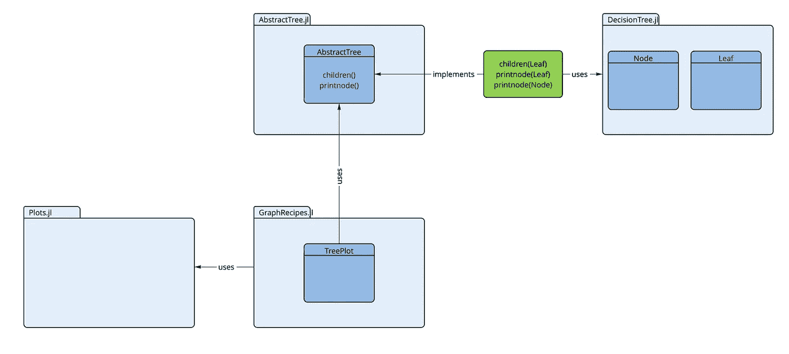
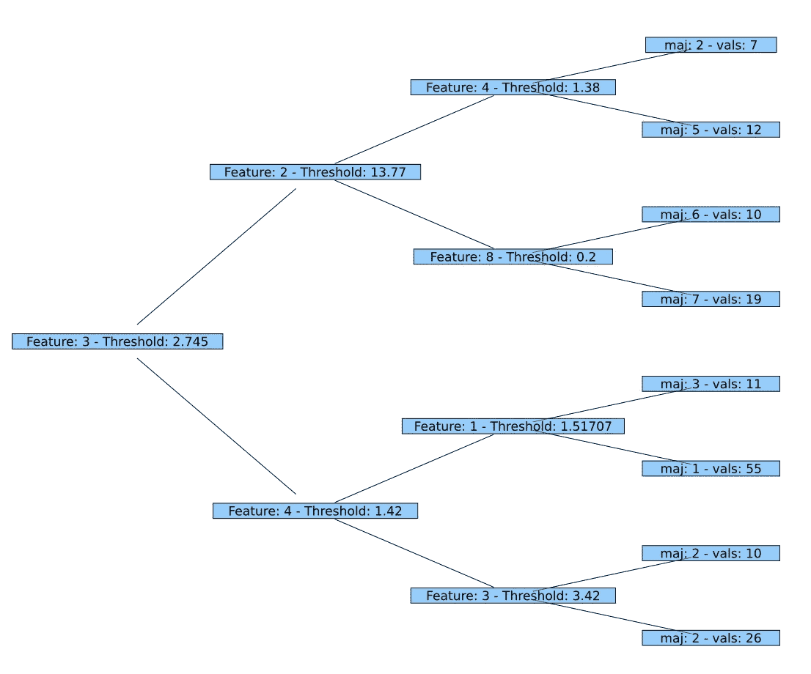
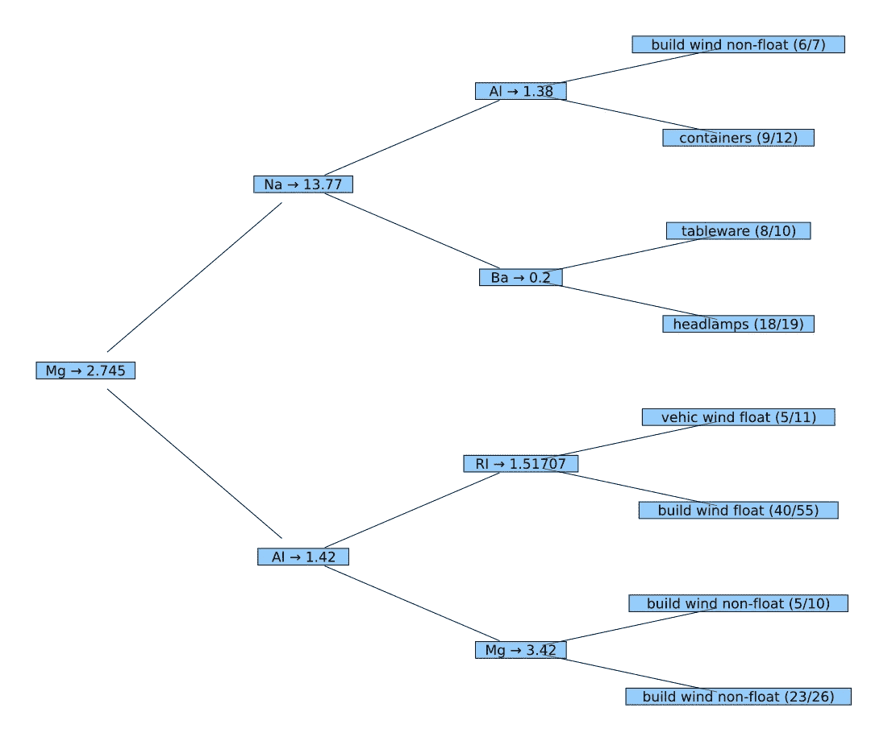

# 如果事情还没有“准备好使用”——第 3 部分

> 原文：<https://towardsdatascience.com/part-iii-if-things-are-not-ready-to-use-59d2db378bec>

## 使用 JULIA 及其生态系统的机器学习

## 朱莉娅有很高的可组合性。只需几行代码，就可以在现有软件包的基础上构建新的功能。


照片由[在](https://unsplash.com/@ourlifeinpixels?utm_source=unsplash&utm_medium=referral&utm_content=creditCopyText) [Unsplash](https://unsplash.com/?utm_source=unsplash&utm_medium=referral&utm_content=creditCopyText) 上以像素表示我们的生活

# 教程概述

这是本教程的第三部分，它展示了 Julia 的特定语言特性和来自其生态系统的各种高质量的包是如何在一个典型的 ML 工作流中轻松组合使用的。

*   [第一部分](/part-i-analyzing-the-glass-dataset-c556788a496f)“*分析玻璃数据集”*集中讲述如何使用`ScientificTypes`、`DataFrames`、`StatsBase`和`StatsPlots`等软件包对数据进行预处理、分析和可视化。
*   [第二部分](/part-ii-using-a-decision-tree-ddffa4004e47)“*使用决策树”*关注 ML 工作流的核心:如何选择模型，以及如何使用它进行训练、预测和评估。这部分主要靠包`MLJ`(=**M**achine**L**in**J**ulia*)*收入。
*   第三部分"*如果事情还没有“准备好使用”"*解释了如果可用的软件包没有提供您需要的所有功能，那么用几行代码创建您自己的解决方案是多么容易。

# 介绍

在本教程的第二部分中，我们创建了一个决策树，并使用`print_tree()`打印了以下表示:

```
Feature 3, Threshold 2.745
L-> Feature 2, Threshold 13.77
    L-> Feature 4, Threshold 1.38
        L-> 2 : 6/7
        R-> 5 : 9/12
    R-> Feature 8, Threshold 0.2
        L-> 6 : 8/10
        R-> 7 : 18/19
R-> Feature 4, Threshold 1.42
    L-> Feature 1, Threshold 1.51707
        L-> 3 : 5/11
        R-> 1 : 40/55
    R-> Feature 3, Threshold 3.42
        L-> 2 : 5/10
        R-> 2 : 23/26
```

它描述了树的基本特征，但有点简陋:它只是 ASCII 文本，节点只显示属性号，而不是用于分支的属性名。此外，树叶不显示类名，在这一点上得到预测。

因此，最好有一个包含所有附加信息的图形表示。由于没有现成的函数可用于此目的，我们必须为自己创建一个。这就是本教程第三部分的内容。

# 积木

我们自己实现这个需要什么？好吧，下面的成分肯定是主要的组成部分:

1.  决策树本身(数据结构)
2.  有关该数据结构外观的信息(内部)
3.  一个能够绘制树木的图形包

…当然，还有一个想法，关于如何将这些东西粘在一起:-)

## 1.决策树

MLJ 函数`fitted_params()`为每台经过训练的机器提供训练产生的所有参数。当然，这很大程度上取决于所使用的模型。在决策树分类器的情况下，这些参数之一仅仅是树本身:

```
fp = fitted_params(dc_mach)
typeof(fp.tree)     → DecisionTree.Node{Float64, UInt32}
```

## 2.关于数据结构的信息

为了得到一些关于决策树内部结构的信息，我们不得不看看 GitHub 上的`DecisionTree.jl` [包](https://github.com/bensadeghi/DecisionTree.jl/blob/468720922bc18bda751bf937b03cac3d26247bbd/src/DecisionTree.jl)的源代码。

在这里我们可以找到`Leaf`和`Node`的如下定义:

从“DecisionTree.jl”中摘录源代码

这告诉我们，树结构由`Node`组成，它存储用于在该节点分支的特征号(`featid`)和发生分支的阈值(`featval`)。此外，每个节点都有一个`left`和一个`right`子树，子树又是一个`Node`或`Leaf`(如果到达了树的底部)。

`Leaf` s 知道到达该叶子时将被预测的多数类(`majority`)以及已经被分类到该叶子中的所有目标值(`values`)的列表。

## 3.图形包

Julia 图形包`[Plots.jl](https://github.com/JuliaPlots/Plots.jl)`本身并不能绘制树木。但是有一个叫做`[GraphRecipes.jl](https://github.com/JuliaPlots/GraphRecipes.jl)`的‘助手’包，里面包含了几个所谓的绘图配方。这些规范描述了如何使用`Plots`(或另一个理解这些配方的图形包)绘制不同的图形结构。在其他食谱中，有一种是针对[树](https://docs.juliaplots.org/stable/graphrecipes/examples/#AbstractTrees-Trees)(叫做`TreePlot`)的。

`GraphRecipes`也作为要绘制的结构和执行绘制的图形包之间的抽象层。

# 将这一切结合在一起

## 基本概念

现在我们已经确定了主要的构件，剩下的问题是我们如何将这些东西组合在一起，以获得想要的结果。主要问题是:绘图配方`TreePlot`怎么知道，我们的决策树详细是什么样子的，以便`TreePlot`绘图？两个包(`DecisionTree.jl`和`GraphRecipes.jl`)都是独立开发的。他们对彼此一无所知。

`TreePlot`的文档告诉我们，它需要一个`AbstractTree`类型的结构(来自包`[AbstractTree.jl](https://github.com/JuliaCollections/AbstractTrees.jl)`)。但是来自`DecisionTree.jl`包的决策树不符合这种类型。我们现在被困住了吗？

如果我们使用一种“普通的”面向对象语言，我们会陷入困境。在这种情况下，我们也许可以尝试定义一个继承自`Node`和`AbstractTree`的新类。但是，只有在语言支持多重继承的情况下，这种方法才有效。如果没有，我们可以尝试定义一个继承自`AbstractTree`的新类，并在其中包装`Node`和`Leaf`结构。所有这些可能需要相当多的工作，并且似乎不是一个优雅的解决方案。

幸运的是，我们使用朱莉娅。这里我们只需要(重新)定义决策树上`AbstractTree`的几个函数，这使得*看起来像*和`AbstractTree`。`TreePlot`配方只期望从我们的决策树得到一个特定的*行为*(它真的不关心这个数据结构的类型):它希望树有

*   当应用于树`t`(或树的一个节点)时，返回其子树列表的函数`children(t)`
*   以及将节点`node`的表示打印到输出流`io`的函数`printnode(io::IO, node)`。

下图显示了所有这些组件以及它们之间的关系:



基本结构[图片由作者提供]

我们只需要创建绿色部分(蓝色部分已经存在)。这就是我们所需要的。那么决策树符合一个`AbstractTree`(就`TreePlot`而言)。所以让我们开始吧:

## 第一个简单的实现

这可以通过下面几行代码来完成:

当我们使用`DecisionTree`和`AbstractTree`包中的一些类型和函数定义时，我们必须声明它们的用法(用`import`或`using`)。

`children`的实现是一个简单的单行函数，它只返回左边和右边的子树。

为了打印，我们必须区分节点和叶子，因为节点的输出看起来不同于叶子的输出。在大多数编程语言中，我们需要一个实现来检查要打印的节点/叶子的类型，并在这种情况下使用一个`if ... then ... else`-语句。朱丽亚却不是这样！在这里，我们可以使用它的多重分派功能，实现两个版本的`printnode`:一个用于`Node` s，另一个用于`Leaf` s。

这里，我们为`printnode`选择了一个非常简单的实现作为第一步。`Node`的版本打印的信息与我们之前使用的内置`print_tree()`相同(特征的 ID 和阈值)。`Leaf`的变体甚至更简单:它打印预测类的 ID 和叶子中考虑的值的数量。

`AbstractTree.jl`包还有一个函数`print_tree`,它使用我们上面实现的两个函数来输出基于文本的树。让我们使用`AbstractTree.print_tree`来测试我们的第一个实现:

```
AbstractTrees.print_tree(fp.tree) -->Feature: 3 — Threshold: 2.745
├─ Feature: 2 — Threshold: 13.77
│ ├─ Feature: 4 — Threshold: 1.38
│ │ ├─ maj: 2 — vals: 7
│ │ └─ maj: 5 — vals: 12
│ └─ Feature: 8 — Threshold: 0.2
│   ├─ maj: 6 — vals: 10
│   └─ maj: 7 — vals: 19
└─ Feature: 4 — Threshold: 1.42
  ├─ Feature: 1 — Threshold: 1.51707
  │ ├─ maj: 3 — vals: 11
  │ └─ maj: 1 — vals: 55
  └─ Feature: 3 — Threshold: 3.42
    ├─ maj: 2 — vals: 10
    └─ maj: 2 — vals: 26
```

看起来很好，所有值都与上面决策树的第一个打印结果相对应。所以实现看起来完美无缺！

现在使用`Plots`和`GraphRecipes`的图形表示:因为我们已经实现了必要的功能，我们可以使用`TreePlot`调用`plot`(应用 Buchheim 树布局算法)。就是这样！

```
using GraphRecipesplot(TreePlot(fp.tree), 
        method = :buchheim, nodeshape = :rect,
        root = :left, curves = false)
```



决策树的图形描述[图片由作者提供]

## 微调输出

在下一步中，我们想要一个树，在它的节点上显示 feature*name*，在它的叶子上显示预测类的*name*(而不是之前使用的 id)。可惜 a `DecisionTree`根本不知道这个信息。也就是说，我们必须以某种方式添加这些信息，以便它们可以被上一节中应用的机制所使用。

这个想法是在使用`children`遍历决策树时添加这个信息，这样`printnode`就可以访问它。那是我们唯一需要这些信息的地方。没有必要以任何方式改变决策树结构。

因此，`children`不会直接从`DecisionTree`返回`Node`和`Leaf`结构，而是返回带有附加信息的丰富结构。这些富集结构定义如下:

这些新的`struct`中的属性`info`可能包含我们想要在打印的树上显示的任何信息。`dt_node`和`dt_leaf`只是我们之前已经使用过的决策树元素。

为了在每次调用`children`时创建这些丰富的结构，我们定义了一个具有两个实现的函数`wrap_element()`:一个创建`NamedNode`，另一个创建`NamedLeaf`。这是我们依赖于 Julia 的多重调度机制的另一种情况。根据第二个参数的类型(a `Node`或 a `Leaf`)，将选择正确的方法。

这使得我们新的`children`函数的实现非常容易:只需两次调用`wrap_element()`，在这里我们添加属性名和类名作为参数(作为`NamedTuple`；朱莉娅标准类型在这里派上用场)。

`printnode`的实现现在接收一个`NamedNode`或者一个`NamedLeaf`，并且可以使用这些元素中的信息进行打印:

变量`matches`(在`printnode`的第二个实现中)包含已经被正确分类到这个叶子上的实例(在`values`中这个叶子上的所有实例中)。因此可以显示正确分类的实例与所有实例的比率(`match_count`与`val_count`)。

为了绘制决策树，我们最后为决策树的根创建一个`NamedNode`。然后我们再次使用`plot`和`TreePlot`配方来获得想要的结果。

```
nn = NamedNode(
        (atr = names(XGlass), cls = levels(yGlass)), 
        fp.tree)plot(TreePlot(nn), 
        method = :buchheim, nodeshape = :rect,
        root = :left, curves = false)
```



决策树的丰富变体[图片由作者提供]

# 结论

上面的例子展示了用几行代码就可以组合几个不相关的 Julia 包，从而创建新的有用的功能。

尤其是第二个例子(“*微调* …”)，当然在(内存)效率和模块化/重用方面有一些优化的潜力。但是这也可以通过稍微多一点的努力来完成。

# 进一步的信息

在 GitHub 上(在:[Roland-KA/juliaformtutorial](https://github.com/roland-KA/JuliaForMLTutorial))我提供了本教程所有三个部分的 Pluto 笔记本，并附有完整的代码示例。所以每个人都被邀请亲自尝试一下。