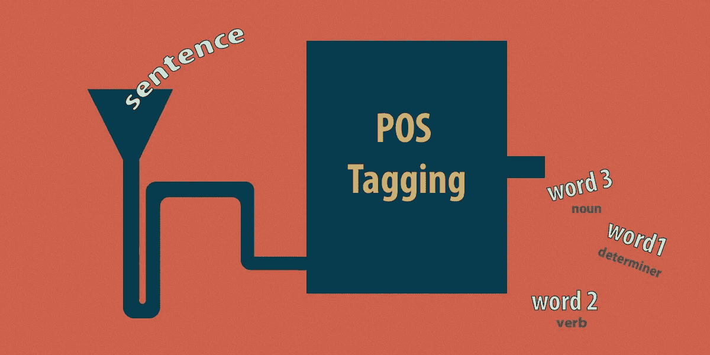
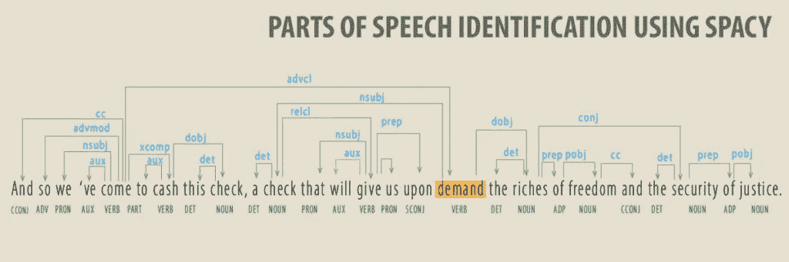
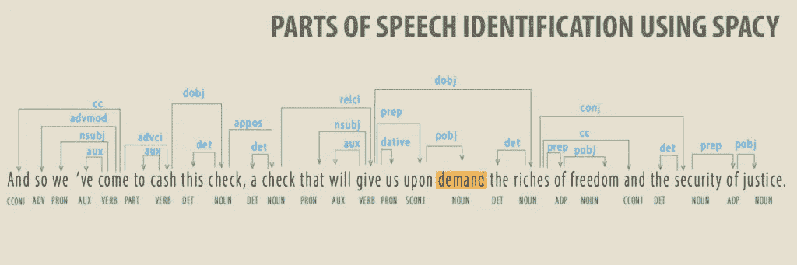

# 自然语言处理中的词性标注

> 原文：<https://towardsdatascience.com/part-of-speech-pos-tagging-in-nlp-e067a1c5e06c>

## 如何为 NLP 选择模型



作者图片

所有语言的基础是单词。单词根据它们在句子中的功能被分为词类。重要的是要认识到，一个单词属于多个词类并不罕见，这取决于该单词的使用方式。理解这种基本的分类需要大量的训练。

在自然语言处理(NLP)中，有一个类似的任务叫做**词性标注**，目的是将句子中的每个单词标注到正确的**词性**(词性)。词性标注是一项消歧任务。一个单词可以有多个词性标签；目标是在给定当前上下文的情况下找到正确的标签**。例如, *left* 在用作“他*离开*房间”时可以是动词，在用作“*离开*房间”时可以是名词。**

词性标注是自然语言处理中的一个基本问题。有许多基于 POS 标签的 NLP 任务。大多数好的词性标注者报告的准确率都在 97%以上。然而，一些学者[认为](https://nlp.stanford.edu/pubs/CICLing2011-manning-tagging.pdf)每个令牌的准确性不是估计 POS 引擎准确性的最佳方式。在他们看来，在句子层面，准确率远低于声称的 97%。

# 使用空间的词性标注

SpaCy 提供了四种英语词性标注模型-

*   '核心网'
*   en_core_web_md '
*   en_core_web_lg '
*   en_core_web_trf '

我的合作伙伴[玛姆塔·查克拉沃蒂](https://www.behance.net/abridged_story)创造了[一个可视化效果](https://sauravc.online/?p=614)来识别马丁·路德·金著名的“我有一个梦想”每一段的位置演讲。

她用的是 SpaCy 的‘en _ core _ web _ LG’语言模型。

语言模型的质量取决于两个构件——模型架构和训练数据。

' en_core_web_lg '的代码不是公开的，所以我们无法确认模型架构。然而，我们知道 SpaCy 已经在来源于 notes 5.0 版、 [ClearNLP 成分到依赖转换](https://github.com/clir/clearnlp-guidelines/blob/master/md/components/dependency_conversion.md)和 [Wordnet 3.0](https://wordnet.princeton.edu/) 的数据上训练了这个语言模型，并报告了这个模型的 POS [准确率为 97%。](https://spacy.io/models/en#en_core_web_lg-accuracy)

SpaCy 的' [en_core_web_trf](https://spacy.io/models/en#en_core_web_trf) '模型基于变压器架构。Transformer 是最新的 NLP 技术之一，它已经变得非常流行，因为这些模型显示了对上一代语言模型的重大改进。SpaCy 的“en_core_web_trf”报告的准确率为 98%。

“en_core_web_sm”和“en_core_web_md”是轻型型号。他们的准确性不如另外两个。

# “en_core_web_lg”和“en_core_web_trf”结果比较

让我们参考 MLK 的演讲。它有 23 个段落和 84 个句子。下面的代码将语音存储为数据帧，并输出“lg”和“trf”模型的 POS 标签之间的差异。

```
import spacy
texts = speech['Para_txt'].to_list()
nlp_trf = spacy.load('en_core_web_trf')
nlp_lg = spacy.load('en_core_web_lg')
pos_trf = [(tok.text, tok.pos_) for t in texts for tok in nlp_trf(t)]
pos_lg = [(tok.text, tok.pos_) for t in texts for tok in nlp_lg(t)]
assert len(pos_lg) == len(pos_trf)
diff = [(a, b, d) for ((a, b), (c, d)) in zip(pos_lg, pos_trf) if b != d]
print(diff)
-------------------------------------------------------------------[('Negro', 'ADJ', 'PROPN'),
 ('crippled', 'ADJ', 'VERB'),
 ('material', 'NOUN', 'ADJ'),
 ('â\x80\x94', 'ADJ', 'PUNCT'),
 ('Negro', 'PROPN', 'ADJ'),
 ('bank', 'PROPN', 'NOUN'),
 ('justice', 'PROPN', 'NOUN'),
 ('demand', 'VERB', 'NOUN'),
 ('invigorating', 'ADJ', 'VERB'),
 ('Those', 'DET', 'PRON'),
 ('content', 'NOUN', 'ADJ'),
 ('until', 'ADP', 'SCONJ'), ...
]
```

有 45 个单词在两个模型之间被标记为不同。在上表中，我只展示了前几个例子。在上述所有差异中，突出的差异(“需求”)最为突出。虽然模型混淆名词和形容词是常见的，但是模型混淆动词和名词是不常见的。动词表示动作，因此很容易与名词区分开来。

> 因此，我们来兑现这张支票，这张支票将在我们要求时给予我们自由的财富和正义的保障。
> 
> -马丁·路德·金

在上面的句子中,' demand '一词用作名词。Riches 是动词 give 的宾语。因此基于变压器的“trf”模型是准确的。当我们使用这两种模型检查 SpaCy 中的依赖图时，这变得更加清楚。



# 结论——这重要吗

这个帖子不是关于变形金刚的；你可以在[这篇伟大的文章](https://jalammar.github.io/illustrated-transformer/)中阅读变形金刚的介绍。这篇文章的目的是展示我们做出的选择是如何改变我们的 NLP 结果的。

NLP 任务逐步建立在上游任务的基础上。我们将 POS 标签用于其他任务，例如实体检测。POS 标签中的一个小错误会完全改变这些下游任务的结果。在 MLK 演讲的例子中，根据我们将单词 *demand* 视为名词还是动词，这个句子呈现出完全不同的含义。

模型的质量只是我们决策的一个参数。在为我们的应用选择模型之前，我们还需要考虑成本、延迟和其他工程因素。基于 Transformer 的模型比上一代模型需要更多的计算资源。因此,“trf”模型很可能比“lg”模型贵很多个数量级。直到时间变压器模型变得像旧模型一样便宜，旧模型仍将在许多 NLP 应用中使用。

我也写在 [sauravc.online](https://sauravc.online/)